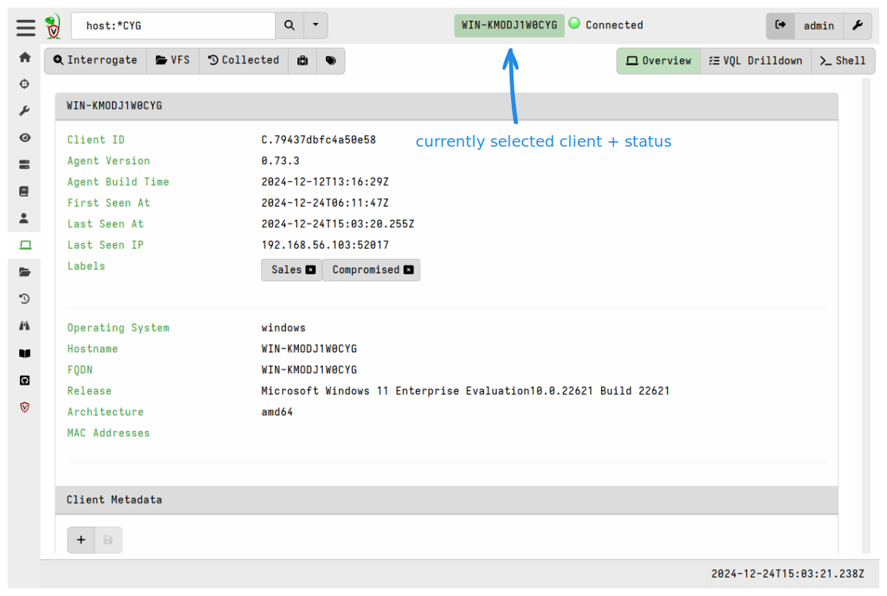

To work with a specific client, search for it using the search bar at the top of
the Admin GUI.

Click the <i class="fas fa-search"></i> button to see all clients or choose a
preset search from the dropdown.

Or search using freeform text (simple wildcards are supported) or a structured
[search expression](#search-syntax).

## Search syntax

The search bar allows for freeform text searches but you can also perform
searches using defined search operators and terms. The search bar provides
autocompletion to guide your choices.

The following search operators are available:

- `all` : show all clients
- `label`: search clients by label
- `host`: search for hostnames
- `ip`: search based on last known IP address
- `mac`: search based on recorded MAC addresses
- `recent`: show clients your user has recently interacted with

In addition, if you have configured indexing of selected
[client metadata]() fields then those field
names will also be available as search operators.

The following search terms are recognized:

- `none`: currently only supported with the `label` operator and used to return
  unlabelled clients.

Search patterns can utlize the wildcard symbol `*` anywhere in the pattern. The
wildcard can occur more than once in a pattern. If specified on it's own `*` is
equivalent to the search operator `all`.

{}

More complex searches can be done in a notebook using VQL.

The GUI's search function uses a client info index. This provides performant
searches even when the server has many thousands of clients. The client info
index can also be queried via VQL using the
[clients()]()
plugin which has a `search` argument that accepts the same search syntax as
the GUI's search bar, for example
`SELECT client_id FROM clients(search="label:none")`.

However VQL also allows you to search client info fields that aren't indexed and
apply more refined filtering using VQL constructs such as `WHERE` clauses.

{}

{}

The search index is rebuilt periodically to avoid inconsistencies. By default
this occurs every 5 minutes. The frequency of this process can be configured in
the server configuration file using the key `defaults.reindex_period_seconds`.

{}

## Search results

The results from the search are shown as a paged table.

The table contains seven columns:

1. Client **selection checkboxes**. You can select one or more (or all) clients
   from the search results and then perform bulk operations on them. Once any
   clients are selected the **Label Clients**, **Delete Clients**, and **Kill
   Clients** buttons will become available in the toolbar above the client list.

2. The **online status** of the host is shown as a color icon.
   - A green dot indicates that the host is currently connected to the server.
   - A flashing warning triangle icon indicates the host is not currently
   connected but was connected between 15 minutes and 24 hours ago.
   - A solid warning triangle indicates that the host has not been seen for more
     than 24 hours.

   Clicking on the online status column header toggles the
   search between all clients and only those that are currently online.

3. The **Client ID** of the host. All clients have a unique ID starting with `C.`.

   The client ID is a unique identifier, unlike hostnames or other endpoint
   identifiers which have no quarantee of uniqueness and which may change over
   time. The client ID is derived from the client's cryptographic key and is
   stored on the endpoint in the client writeback file. Clicking on the client
   id will take you to the client's information screen and switch all client
   views to the selected client. The client indicator at the top-center of the
   screen shows you which client you are currently working with.

4. The **Hostname** reported by the client.

5. The **Fully Qualified Domain Name** (FQDN) reported by the client.

6. The **Operating System version** (OS Version) reported by the client.

7. Any **Labels** applied to the host. Clicking on a label removes the
   label from this host. [Labels]() exist on
   the server only and are used for organizing clients, targeting hunts and
   other client management functions.

Once you view a particular client, it will be automatically added to your
Most Recently Used (MRU) list. The **Recent Hosts** search preset will show you
the clients on this list.

## Selecting a client

Clicking on any **Client ID** in the search results will take you to the
client's **Overview** page and switch all client views to the currently selected
client.

The client indicator at the top-center of the screen shows you which client you
are currently working with.

Velociraptor maintains some basic information about the host, such as its
hostname, labels, last seen IP, and last seen time. This is shown in the
**Overview** page. Velociraptor gathers this information from the endpoint upon
first enrollment and periodically thereafter through a process that we refer to
as [Interrogation]().

You can manually refresh this information at any time by clicking the
**Interrogate** button, which schedules collection of the `Generic.Client.Info`
artifact from the endpoint.

Each client can have associated arbitrary metadata. You can use this metadata in
VQL via Notebooks and server artifacts. Client metadata is explained in more
detail [here]().

{}

You can quarantine a host from this screen using the **Quarantine Host**
(<i class="fas fa-suitcase-medical"></i>) button. Quarantining a host will
reconfigure the hosts's network stack to only allow it to communicate with the
Velociraptor server. This allows you to continue investigating the host remotely
while preventing the host from making other network connections.

Quarantining is implemented using an event monitoring query which means it
persists across client reboots. A quarantined client will gain the label
`Quarantine` so you can easily search for all quarantined hosts using the label
search feature above.

Removing the quarantine label from a host will immediately unquarantine the
host. Read further how to automatically apply and remove labels based on various
events - this allows you to automatically quarantine a host too!

{}

### VQL drilldown

The **VQL Drilldown** page shows more information about the client, including
telemetry of the client's footprint on the endpoint and more information about
the endpoint.

### Collections

The **Collected** button on the Overview page will take you to the client's
Collections page where you can schedule new Artifact collections for that
client, or view the status and results of previously run collections.

