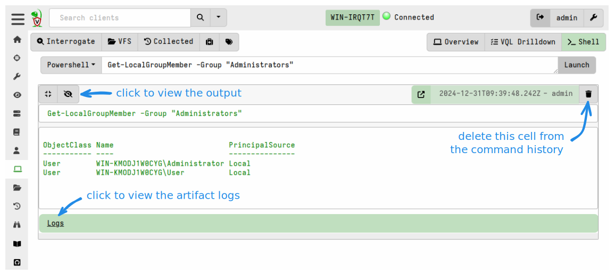
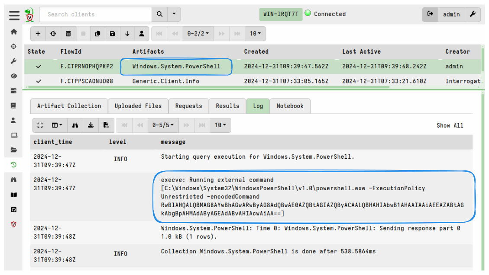

### Remote shell commands

Velociraptor's collects data from endpoints using
[Artifacts]()
which are logical containers for curated VQL queries. In fact all VQL queries
run on clients must be delivered to the client as artifacts.

The advantage of using artifacts is that they are generally better tested and
more repeatable than just typing arbitrary Powershell or Bash commands in the
GUI - remember, a single typo can ruin your day!

However, sometimes we wish to run arbitrary commands on the endpoint during a
dynamic incident response operation. The Velociraptor GUI provides a facility
for doing this on the **Shell** page, which allows running arbitrary shell
commands on the endpoint using `Powershell`/`Cmd`/`Bash` or adhoc `VQL`.

As stated above, all queries are delivered to clients in the form of artifacts.
In the same way that [VFS viewer]() actions are
"translated" into artifacts which the client can run, the Shell commands are
also delivered via artifacts in the background. After running Shell commands you
can navigate to the client's Collections page and see the artifacts that were
used to deliver the commands. But the Shell page in the GUI hides this
background activity for our convenience and creates the impression that the
commands are running interactively in realtime on the client.

{}

Only Velociraptor users with the administrator role are allowed to run
arbitrary shell commands on remote endpoints. Users with other roles have to be
explicitly granted the `EXECVE` permission to allow them to do so too.

Nevertheless, in some environments it may be unacceptable to allow running of
arbitrary shells or other executables. You can prevent clients from running
executables (including shells and therefore shell commands) via the config
setting `Client.prevent_execve`. However this significantly limits your DFIR
efficacy because many artifacts depend on being able to launch external
programs.

{}