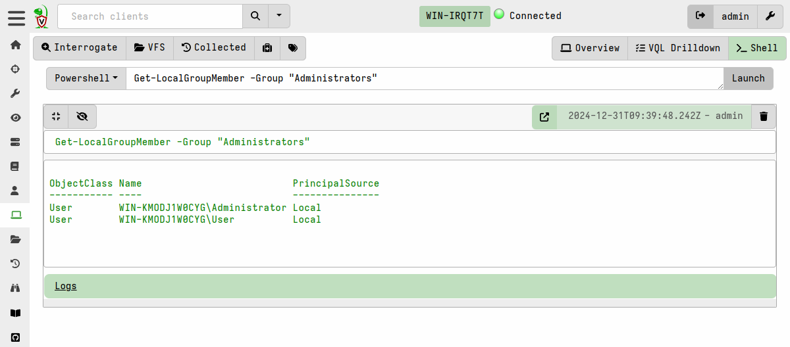

### Remote shell commands

Usually Velociraptor encourages users to collect `Artifacts` which are
curated VQL queries. However, sometimes it is necessary to run
arbitrary commands on the endpoint in a dynamic incident response
operation.

The advantage of collecting artifacts is that they are generally better tested and controlled than just typing arbitrary Powershell or Bash commands in the GUI - remember, a single typo can ruin your day!

We recommend that arbitrary shell commands only be used as a last
resort and instead shell commands be run with the VQL `execve()`
plugin within the context of an artifact.

Velociraptor allows running arbitrary shell commands on the endpoint
using `Powershell`/`Cmd`/`Bash` or adhoc `VQL`.

{}

Only Velociraptor users with the administrator role are allowed to run
arbitrary shell commands on remote endpoints!

{}

You can prevent clients from running arbitrary shell commands
by setting `Client.prevent_execve` to true. This limits your DFIR
efficacy because many artifacts depend on being able to launch
external programs.
