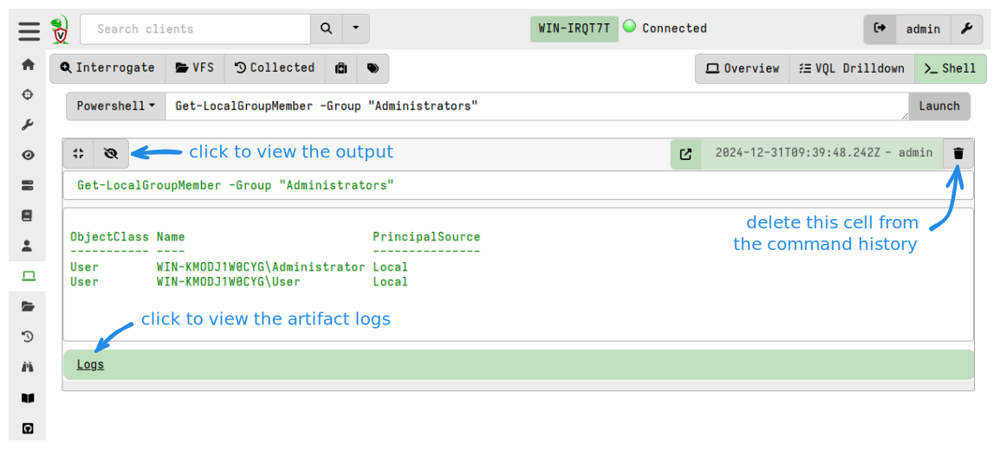
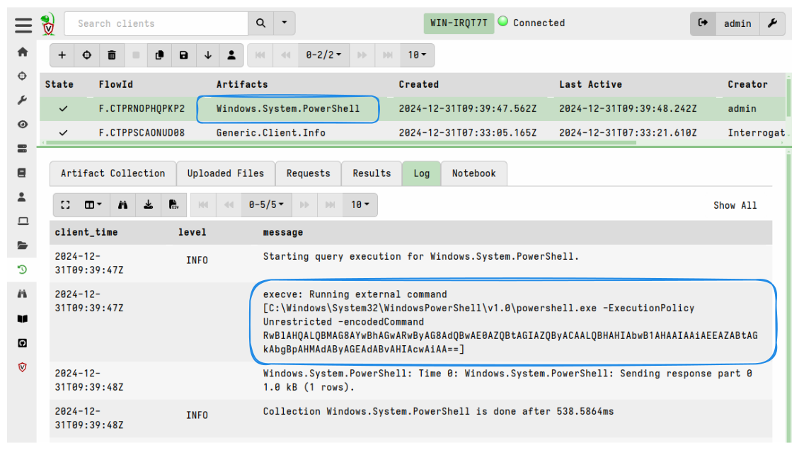

Velociraptor collects data from endpoints using
[artifacts](/docs/artifacts/) which are logical containers for curated
VQL queries. In fact all VQL queries that run on clients must be
delivered to the client in the form of artifacts.

The benefit of using artifacts is that they are generally better
designed, tested, and more repeatable than just typing arbitrary
Powershell or Bash commands in the GUI. Remember, a single typo in a
shell command can ruin your day!

However, sometimes you might want to run ad hoc commands on a single
endpoint during a dynamic incident response operation. The
Velociraptor GUI provides a facility for doing this on the **Shell**
page for a selected client. This allows running arbitrary shell
commands on the endpoint using `Powershell`/`Cmd`/`Bash` or adhoc
`VQL`.

As stated above, all queries are delivered to clients in the form of
artifacts. In the same way that the [VFS viewer](/docs/clients/vfs/)
actions are "translated" and then delivered to the client via
artifacts, which the client then runs, the Shell commands are also
delivered via artifacts in the background.

{}

It's important to understand that the GUI tries to present the
experience in a way that resembles a remote shell. But what's really
happening is:
1. the shell command is being passed as an artifact parameter to a
   built-in artifact.
2. the client then retrieves and runs the artifact.
3. the artifact uses the `execve` plugin to launch the relevant
   shell with the specified command.
4. the client then returns the output of the command as collection
   results.

There is NO remote access capability built into the client.

Velociraptor, by design, does not provide any direct access to
clients. The clients only _retrieve_ instructions from the server, and
these instructions must be packaged in the form of artifacts.
Scheduling an artifact collection against any client is an auditable
event on the server.

So while in the GUI it may superficially look like a remote shell
session (for reasons of convenience and familiarity) it absolutely is
not one. This is also why the GUI's Shell feature does not provide
interactive shell sessions - it just allows you to collect the result
of a shell command.

{}

{}

Only Velociraptor users with the `administrator` role are allowed to
run arbitrary executables, including shells, on remote endpoints.
Users with other roles have to be explicitly granted the `EXECVE`
permission to allow them to do so too.

Nevertheless, in some environments it may be unacceptable to allow
running of arbitrary shells or other executables _by anyone_. You can
prevent clients from running executables (including shells and
therefore shell commands) via the config setting
`Client.prevent_execve`. However this significantly limits your DFIR
efficacy because many artifacts actually depend on being able to
launch external programs.

{}

After running Shell commands you can navigate to the client's
Collections page and see the artifacts that were used to deliver the
commands. But the Shell page in the GUI hides this background activity
for our convenience and creates the impression that the commands are
running interactively in realtime on the client.

