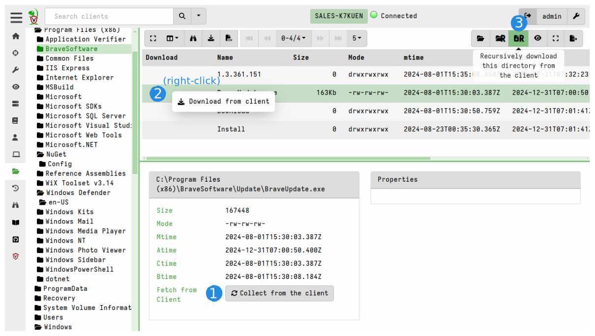

Velociraptor provides an interface to interact with the client's filesystem
which we call the Virtual File System or VFS. The VFS GUI is a convenient tool
to interactively inspect the client's filesystem and fetch files if necessary.

Although it may look somewhat like a live view of the client's filesystem, the
VFS is actually a server-side cache of the file and directory listings that are
run the endpoint via Velociraptor artifacts. As you navigate and perform actions
in the VFS view, the server is scheduling artifacts to run on the client in the
background. All VFS actions either read data from the cache or result in
artifacts being run on the endpoint.

After using the VFS view you can go to the client's Collections page and see all
the VFS artifact collections which correspond to the actions that you took in
the VFS view.

The VFS consists of a tree view in the left pane and a file listing in
the top right pane. The tree view allows us to navigate through the
filesystem, starting at the top level. Remember that the GUI is simply
viewing data that was previously collected from the client. When
clicking on a directory in the tree view that has not been synced from
the client yet, the top right pane shows the message `No data
available. Refresh directory from client by clicking above.`.

Clicking on the refresh directory button <i class="fas
fa-folder-open"></i> will initiate a directory listing operation on
the client, and providing the client is currently connected, will
refresh the VFS view. Similarly the recursive refresh directory button
will recursively refresh the directory listing from the current
directory down.

Clicking on any of the files in the directory listing, will show their
properties in the bottom right pane. In particular, listing the
directory only populates file metadata, such as timestamps - it does
not fetch the file data. In the **Stats** tab (bottom right pane) we can
initiate a download operation from the endpoint by clicking the
<i class="fas fa-sync"></i> **Collect from the client** button.

If you need to download many files, it might be easier to hide the
Stats pane (bottom right pane) by clicking the **Stats Toggle**  button
<i class="fas fa-expand"></i> and initiating the download by right-clicking
the cell in the `Download` column of the listing. Alternatively you can click
the Recursive Download button to download all files in the current directory
and subdirectories.

Once a file is fetched from the endpoint it is stored on the server and we may
view it's contents in the VFS viewer. Downloaded files are marked by a floppy
disk icon <i class="fas fa-save"></i>. You can download the collected file from
the server to your computer by clicking the download icon
<i class="fas fa-download"></i> which is next to "Last collected" in the Stats
pane.

### Exporting VFS files

While it is possible to download collected files from the VFS `Stats`
pane this is inefficient for many files. Instead you can click the
`Prepare Download` button to prepare an export Zip file of various
files from the VFS.

This will begin a server side collection that packages the downloaded
files specified into a new collection which may then be exported.

Remember that the VFS is fluid - each time we refresh new listing or
downloads from the client, the VFS view will change. Performing an
export of the VFS freezes in time the state of the VFS at the time of
the collection. You can then go back to review the files at that time.

{}

Sometimes files in the VFS will contain malware or other unwanted
software. Often the investigator's local workstation will have AV or
other security products that might quarantine the produced ZIP
file. In this case it is helpful to compress the export with a
password.

See the Knowledge Base article [How do I enable password protected VFS
downloads?]() for
reference on setting the password for export.

{}

### Recursively operating on files

Previously we saw how we can list one directory or fetch one file from
the endpoint. In many cases it would be convenient to fetch or
download entire directories from the endpoint. Clicking on the
recursively sync directory button begins a recursive directory listing.

{}

Syncing large directories and downloading many files from the endpoint
can take a long time and transfer large amount of data. By default
resource limits are enforced that limit the operation to 10 minutes
and transferring 1Gb of data. If you accidentally initiated a download
of a very large directory you can click the button again to cancel the
operation.

{}

### Previewing a file after download.

Once a file is fetched from the endpoint it is stored on the
server. You can examine the file in the GUI by clicking on the
preview button (although the preview button already shows the first few
characters from the file which helps for quickly eyeballing the file
type) which will open the **Inspect File** screen.

The Inspect File screen provides both a hex viewer and a plain text viewer with
some useful features:

* `Text View`: View a text only version of the data (this removes non printable
  characters from the binary data and shows only ASCII strings).
* `Goto Offset`: allows to skip to arbitrary offsets in the file
* `Search`: allows to search the file using `Regex`, `String` or
  `Hex String` modes.

### VFS accessors

The top level directory in the VFS tree view represents the
`accessor`. An accessor is simply a dedicated code used to fetch
filesystem information from the endpoint.

The `file` accessor simply uses the OS's APIs to list files or
directories and fetch data. The `ntfs` accessor uses Velociraptor's
built-in NTFS parser to be able to access hidden NTFS files and
Alternate Data Streams (ADS).

Similarly the `registry` accessor provides file-like access to the registry.

### Interactively investigating an endpoint

Although the VFS presents a familiar interface, it is not ideal for
quickly finding the files and registry keys we are usually interested
in. One would need to know exactly which files are of interest and
then click over multiple directories searching for these files.

To automate collection it is better to write special purpose `VQL
Artifacts` to identity the information of interest.

The [Artifacts]() section explores what Velociraptor
artifacts are and how we collect them.