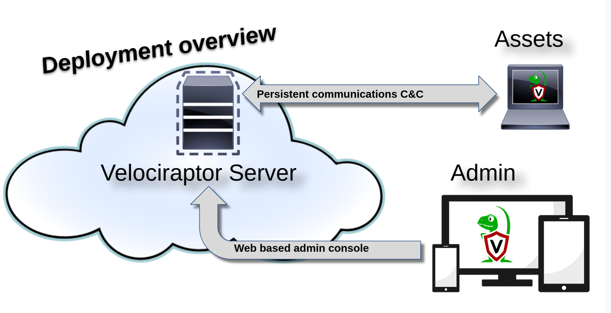
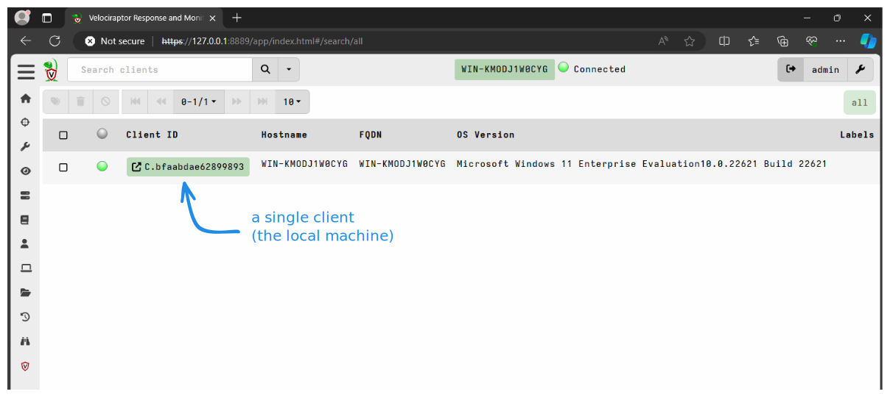

Velociraptor offers many deployment options that allow us to operate in all
kinds of environments.

There really is no single "right" way to use Velociraptor, so in this section
we'll describe the commonly used (and therefore recommended) deployment modes.
We'll guide you through the main decisions that you'll need to make, and point
you to additional resources for less commonly used features and options.

If you just want to get a simple deployment up and running then please see our
[Quickstart Guide]().

If you're really in a hurry you can start a self-contained
[Instant Velociraptor](#instant-velociraptor)
on your local machine which will allow you to experiment and get a feel for how
Velociraptor works.

{}

These deployment steps apply to open source Velociraptor only. Read the
[InsightIDR documentation](https://docs.rapid7.com/insightidr/velociraptor-integration)
to learn more about how Velociraptor is deployed with the Rapid7 Insight Platform.

{}

## Typical Deployment



We use the following terminology for Velociraptor's main components:

1. A **Client** is an instance of Velociraptor running on the endpoint, that is
   it's our endpoint "agent".
2. The **Frontend** is the server component that communicates with the client.
3. The **GUI** is the web application server that provides the administrative
   interface.
4. The **API** is our gRPC-based API server.

Each deployment relies on a unique **configuration file**, which include
information such as connection URLs, DNS names, and unique cryptographic keys.
Since key material is unique to each deployment, one Velociraptor deployment
cannot connect with another deployment.

The **Velociraptor Server** is typically deployed on a cloud VM and runs a
number of components as separate threads. The server provides an Admin UI - a Web
application that can be used to control Velociraptor and orchestrate hunts and
collections from the endpoints.

The endpoints themselves run the **Velociraptor Client**, typically installed as
a service. Velociraptor Clients maintain a persistent connection with the
server. This allows the client to execute tasks issued by the server in
near-realtime. Many other solutions rely on periodic polling between endpoint
and the server leading to latency between issuing a new task and receiving the
results - not so with Velociraptor!

Velociraptor does not use any external database - all data is stored within
the server’s filesystem in regular files and directories. This makes backups and
data lifecycle management a breeze. You do not need any additional
infrastructure such as databases or cloud storage services. Due to it's
file-oriented design, Velociraptor is compatible with distributed file systems
such as Amazon EFS, Google Filestore or generic NFS.

A typical deployment includes the following steps:

1. Plan your deployment and generate a configuration file for the server which
   includes the main configuration options.
2. Create a server installation package that includes the generated
   configuration file.
3. Set up a VM or a physical server to host the server component.
4. Install the server package. Once installed you will be able to access the
   Admin GUI and front end.
5. Create client installation packages for your target operating systems (for
   example, MSI for windows).
6. Deploy the client installation packages using your preferred deployment
   solution.


## Deployment Platforms

Velociraptor only has one binary per operating system + architecture
combination. We do not have separate client binaries and server binaries. The
binary can act as a server, a client or a number of utility programs depending
on the command line parameters passed to it.

While this technically allows you to run the server or the client on any
platform that we have a binary for,
_please note that the server is only fully supported on Linux_.
This is mainly due to performance considerations inherent in other platforms
such as Windows. However for non-production deployments - for example
evaluation, development or testing - it might be convenient for you to run the
server on a different platform, and you may decide to do so, but please keep in
mind that for production deployments the server should run on Linux. Issues with
other platforms will receive limited support.

Binaries for the the most common platforms and architectures are available on
our [Downloads]() page.

## Deployment Milestones

At a high level, deploying Velociraptor consists of 3 tasks: setting up a
server, deploying clients, and granting user access to the server's web UI.

**Task 1: Deploy a Server**
- [Choose the deployment options]() that
  work best for you and install your server.

**Task 2: Authorize Users**
- Grant users access to the Velociraptor server's web UI

**Task 3: Deploy Clients**
- [Deploy clients]() on your endpoints
  using one or possibly a combination of the following methods:
  - Run clients interactively
  - Install the client as a service using a custom installer package
  - Agentless Deployment
  - Create and run "offline collectors" (which are essentially out-of-band clients)


## Other ways to use Velociraptor

While deploying Velociraptor in client-server mode, as described above, is the
recommended deployment model and typical of most deployments, Velociraptor's
extensive capabilities can also be used in innovative and unconventional ways -
even ones we haven't thought of yet!

There isn't a single prescribed way to use Velociraptor. We would love to hear
about your creative ideas and unusual use cases so we can continue to make
Velociraptor better for everyone.

The following are some other (less conventional) ways that you can use
Velociraptor.

### "Instant Velociraptor"

If you want to instantly start a Velociraptor instance for evaluation, learning,
experimentation, testing, or any another reason, you can run "Instant
Velociraptor". This is a fully functional, self-contained Velociraptor system on
to your local machine. In this mode of operation you'll get the server plus a
single client running within the same process on your machine. All the necessary
configuration is taken care of automatically. With a single command you can be
ready to dive right into the fun stuff!

To do this, download the Velociraptor executable for your
platform from the [Downloads page](/downloads/) and run the `gui` CLI command.


{}
```shell
./velociraptor gui
```
{}
{}
```shell
velociraptor.exe gui
```
{}
{}
```shell
./velociraptor gui
```
{}


Since this mode is not intended to be a production server, it is fine to run
this on any platform. The client capabilities do vary per platform, but the
server component is identical across platforms. This mode is especially
useful for testing and artifact development because it allows you to run VQL
directly on the target operating system via
[Velociraptor notebooks]().

In this mode:

* The server only listens on the local loopback interface.
* The client connects to the server over the loopback.
* A data store directory is set to the user’s temp folder, unless specified
  otherwise (see note below).
* A single administrator user is created with the username `admin` and password
  `password`.
* The default web browser is launched with those credentials to connect to the GUI.



{}

By default the `gui` command uses the temp folder as it's data store (by default
a subfolder named `gui_datastore`). The `gui` command also automatically creates
new server and client configuration files in this datastore folder. This allows
you to re-run the `gui` command and get the same working environment with
persistent data.

However some operating systems clean out the temp folder periodically or during
a system reboot, in which case your environment and data will NOT persist (i.e.
it will be lost). To avoid this you can specify a different data store directory
using the `--datastore` flag and point it to a location where your data will be
persisted. If at any time you want to start with a fresh instance you can either
delete the old datastore folder or point it to a new folder using the
`--datastore` flag.

{}


### Command line investigation tool

We can run any VQL query or any Velociraptor artifacts from the CLI and
optionally write the results to local files. Using this capability it's possible
to use Velociraptor as a command line DFIR "Swiss Army Knife" or build it into
forensic data processing pipelines.

Most CLI-based forensics tools perform a specific, limited set of functions.
However with Velociraptor's CLI you have full access to VQL and all the
functions and plugins that Velociraptor provides. So this capability can be used
to inspect a live system or analyze acquired file-based forensic artifacts, for
example Sqlite databases or event logs.

The CLI provides the following commands which support this mode of operation:

**The query command**

The `query` command accepts any VQL query and runs it against the local system.
The results can optionally be written to file in a variety of formats.

Example:

```
velociraptor.exe query "SELECT * FROM pslist()" --format jsonl --output pslist.json
```


**The artifacts command**

The `artifacts collect` command runs any [Velociraptor artifact]()
which can contain one or more packaged VQL queries.

You can use `artifacts list` to list the available artifacts, and
`artifacts show` to view the contents of a specific artifact.

```txt
  artifacts
    list [<flags>] [<regex>]
    show <name>
    collect [<flags>] <artifact_name>...
```

All the built-in Velociraptor artifacts are available within the binary.

Custom artifacts can be used too by pointing the binary to a folder containing
these artifacts using the `--definitions` flag.

As with the `query` command, the results can optionally be written to file in a
variety of formats.

Examples:

```txt
velociraptor.exe artifacts list ".*Audit.*"
Server.Audit.Logs
Windows.System.AuditPolicy
```

```txt
velociraptor.exe artifacts show "Windows.System.AuditPolicy"
name: Windows.System.AuditPolicy

description: |
   Artifact using auditpol to retrieve the logging settings
   defined in the Windows Audit Policy.

   Use this artifact to determine what Windows event logs are audited
   and if there are any discrepancies across the environment.

type: CLIENT
...
```

```txt
velociraptor.exe artifacts collect "Windows.System.AuditPolicy" --format json --output auditpol.json
```


### "Instant Velociraptor" as a local investigation tool

While [Instant Velociraptor]() is normally
used for testing or demonstrations, it can actually be used as a standalone
GUI-based forensic tool.

The `gui` command starts the server and a single client within a single process.
This client is no different from one that's separately deployed, and can be used
to interrogate the local system as you would do for any remote client.

{}

Obviously this idea is not suitable for all investigation scenarios as the
server component will need to write data to it's datastore. Also, using a web
browser on the target machine and any other activity risks polluting the
forensic data. If these risks are acceptable to you, you may still want to
minimize them by:
- locating the datastore on an external drive using the `--datastore` flag.
- changing the writeback and tempdir locations in the client config to also be
  on an external drive.

{}

### "Instant Velociraptor" as an desktop environment for analysts

[Instant Velociraptor]() can also be used
as a standalone graphical forensic desktop environment, for acquired forensic
artifacts.

[Velociraptor notebooks]() have access to the
local filesystem, and can therefore read any files within it and work with the
extracted data.

In addition to forensic artifacts you can also read the most common text-based
file formats, for example json or csv, and then work with that data in the
notebook interface. In this way Velociraptor notebooks can function very
similarly to [Jupyter notebooks](https://docs.jupyter.org/en/latest/) with the
[Python Pandas](https://pandas.pydata.org/docs/user_guide/10min.html) library,
which were indeed a significant inspiration for Velociraptor notebooks.
In this mode of operation, the client component may not be needed and you can
disable it by adding the `--no-client` flag to the `gui` command.

However the client component may be useful if you want to use
[remapping]() which will allow
you to inspect and analyze disk image files using Velociraptor's dead disk
feature. The `gui` command creates the client config file in the datastore
folder, to which you can add the remapping config, if needed.

### Standalone offline collectors

[Offline collectors]()
are usually created with the expectation that the data will be imported into a
Velociraptor server, but this doesn't have to be the case. You may just be
interested in extracting the data and working with it elsewhere using other
tools. In that case the only reason for having a Velociraptor server is to
create the offline collector, and you can use an
[Instant Velociraptor]() for that purpose.

It's important to note that Velociraptor offline collectors have all the
capabilities of a normal Velociraptor client. _They are not limited to doing
file acquisition!_ You can run any Velociraptor artifact, including custom ones,
and the results are written to jsonl formatted files (and/or CSV format, if
you prefer) which can be read by most data processing tools.

As a variation on this idea, you can import the offline collection archives back
into the standalone (i.e. non-networked) Instant Velociraptor, and work with
them the same as you would with data collected from network-connected clients.
That is, an Instant Velociraptor deployment using only offline collectors
amounts to a sneakernet Velociraptor deployment!

<!-- ### Sneakernet Velociraptor server

### Ephemeral clients -->

## What's next?

{}
