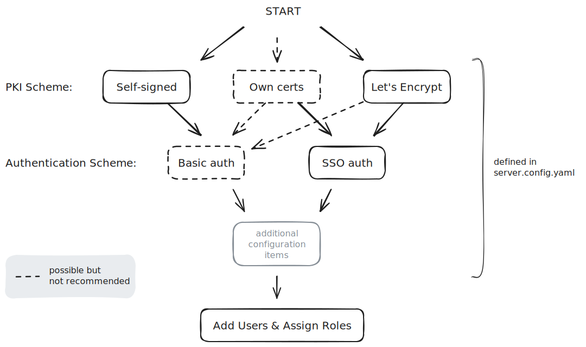

Velociraptor offers many deployment options that allow us to operate in all
kinds of environments.

There really is no single "right" way to use Velociraptor, so in this section
we'll describe the commonly used (and therefore recommended) deployment modes.
We'll guide you through the main decisions that you'll need to make, and point
you to additional resources for less commonly used features and options.

If you just want to get a simple deployment up and running then please see our
[Quickstart Guide]().

If you're really in a hurry you can start a self-contained
[Instant Velociraptor](#instant-velociraptor)
on your local machine which will allow you to experiment and get a feel for how
Velociraptor works.

{}

These deployment steps apply to open source Velociraptor only. Read the
[InsightIDR documentation](https://docs.rapid7.com/insightidr/velociraptor-integration)
to learn more about how Velociraptor is deployed with the Rapid7 Insight Platform.

{}


Below is a typical Velociraptor deployment


We use the following terminology for Velociraptor's main components:

1. A **client** is an instance of Velociraptor running on the endpoint, that is
   it's our endpoint "agent".
2. The **frontend** is the server component that communicates with the client.
3. The **GUI** is the web application server that provides the administrative
   interface.
4. The **API** is our gRPC-based API server.

## Deployment Platforms

_Velociraptor only has one binary per operating system + architecture combination._

Velociraptor does not have separate client binaries and server binaries. The
binary can act as a server, a client or a number of utility programs depending on
the command line parameters passed to it.

While this technically allows you to run the server or the client on any
platform that we have a binary for,
_please note that the server is only fully supported on Linux_
due to performance considerations inherent in other platforms such as Windows.
However for non-production deployments (e.g. development or testing) it
might be convenient for you to run the server or client on whatever platform you
prefer. Just keep in mind that for production deployments we strongly recommend
that the server should run on Linux and that issues with other platforms will
not be supported.

In particular we do not support Windows-based servers at scale, although you can
install the server on Windows for a demo or for a small number of endpoints.


## Deployment Milestones

At a high level, your Velociraptor deployment will consist of 3 tasks: setting up a server, deploying clients, and granting user access to the console.


| Milestone | Description |
|:---:|---|
| Task 1: Deploy a Server | Choose the deployment method that works best for you: <ul><li>Self-Signed SSL - recommended for on-premises environments</li><li>Cloud Deployment - recommended for easy deployments</li><li>Instant Velociraptor - recommended if you want to install Velociraptor as a self-contained client and server on your local machine for testing purposes</li></ul> |
| Task 2: Deploy Clients  | Deploy clients on your endpoints using one of the recommended methods:<ul><li>Run clients interactively</li><li>Install using Custom MSI</li><li> Install the Client as a Service</li><li>Agentless Deployment</li></ul>                                                                                                                                             |
| Task 3: Authorize Users | Grant user access to the Velociraptor console.

## Typical Deployment

Each deployment relies on unique configuration files, which include information such as connection URLs, DNS names, and unique cryptographic keys. Since key material is unique to each deployment, one Velociraptor deployment cannot connect with another deployment.

The **Velociraptor Server** is typically deployed on a cloud VM and runs a number of components as separate threads. The GUI serves the Admin UI - a Web application that can be used to control Velociraptor and orchestrate hunts and collections from the endpoints.
The endpoints themselves run the Velociraptor Client as a service. The client is simply the Velociraptor instance running on the endpoint.
Velociraptor Clients maintain a persistent connection with the server. This allows the server to issue a task to the clients as soon as it is scheduled by the user.  (Many other solutions rely on periodic polling between endpoint and the server leading to latency between issuing a new task and receiving the results - not so with Velociraptor).


Velociraptor does not use an external datastore - all data is stored within the server’s filesystem in regular files and directories, making backups and data lifecycle management a breeze. You do not need any additional infrastructure such as databases or cloud services. Velociraptor is compatible with distributed file systems such as Amazon EFS, Google Filestore or generic NFS.

**A typical deployment includes the following steps:**
1. Generate a configuration file for the server and clients.
2. Create a server package that includes the generated configuration file.
3. Set up a cloud VM for the server (If deploying in the cloud) or create a new physical server.
4. Install the server package on the VM. Once installed you will be able to access the  Admin GUI and front end.
5. Create client packages for target operating systems (for example, MSI for windows).



## Instant Velociraptor

If you want to instantly start a Velociraptor instance for evaluation, learning,
experimentation, testing, or any another reason, you can run "Instant
Velociraptor". This is a fully functional, self-contained Velociraptor system on
to your local machine. In this mode of operation you'll get the server and a
single client running within the same process on your machine. All the necessary
configuration is taken care of automatically. With a single command you can be
ready to dive right in to the fun stuff!

To do this, download the Velociraptor executable for your
platform from the [Downloads page](/downloads/) and run the `gui` CLI command.


{}
```shell
./velociraptor gui
```
{}
{}
```shell
velociraptor.exe gui
```
{}
{}
```shell
./velociraptor gui
```
{}


Note that, unlike a production-ready server, it is fine to run this on any
supported platform. The client capabilities do vary per platform, but the server
component is identical across platforms. For testing and artifact development
this mode is especially useful because it gives you direct access to run VQL on
the target operating system via [notebooks]().

* The server only listens on the local loopback interface.
* The client connects to the server over the loopback.
* A data store directory is set to the user’s temp folder.
* A single administrator user is created with username `admin` and `password`.
* The default web browser is launched with those credentials to connect to the GUI.

{}

By default the `gui` command uses the temp folder as it's data store (by default
a subfolder named `gui_datastore`). The `gui` command also automatically creates
new server and client configuration files in this datastore folder. This allows
you to re-run the `gui` command and get the same working environment with
persistent data.

However some operating systems clean out the temp folder periodically or during
a system reboot, in which case your environment and data will NOT persist (i.e.
it will be lost). To avoid this you can specify a different data store directory
using the `--datastore` flag and point it to a location where your data will be
persisted. If at any time you want to start with a fresh instance you can either
delete the old datastore folder or point it to a new folder using the
`--datastore` flag.

{}

## Other ways to use Velociraptor

As mentioned above, there is not only one prescribed way to use Velociraptor,
although deploying it in client-server mode is the primary way of deploying it
and typical of most realworld deployments. However Velociraptor's extensive
capabilities can also be used in innovative and unconventional ways - even ones
we haven't thought of yet! We would love to hear about your creative ideas and
unusual use cases so we can continue to make Velociraptor better for everyone!

Here are some other - unconventional - ways that you could deploy Velociraptor.

### Command line investigation tool

We can run VQL queries or artifacts from the CLI and write the results to local
files.

All the built-in Velociraptor [artifacts]() are available in the binary.

Commands:
  artifacts
    list [<flags>] [<regex>]
    show <name>
    collect [<flags>] <artifact_name>...

Custom artifacts can be used too by pointing the binary to a folder using the
`--definitions` CLI flag.

All the parsing plugins and functions are available in VQL queries, so this can
even be used to inspect or analyze acquired forensic file artifacts, for example
Sqlite databases or event logs.

Example:

```
```

Using this capability it's possible to use Velociraptor as a command-line Swiss
Army Knife or build it into forensic data processing pipelines.

### Instant Velociraptor as a desktop analysis tool

While [Instant Velociraptor]() is normally
used for testing or demonstrations, it can actually be used as a standalone
forensic environment for a single computer.

### Standalone offline collector

[Offline collectors]() are created with the expectation that the data will be
imported into a Velociraptor server, but this doesn't have to be the case. You
may just be interested in extracting the data and working with it elsewhere
using other tools.

### Querying data and extracting files from disk images.


