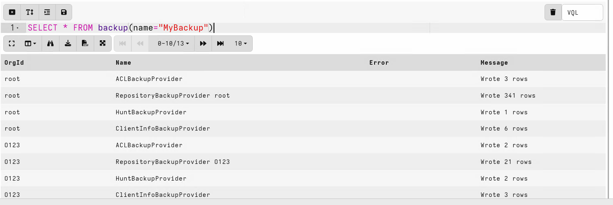
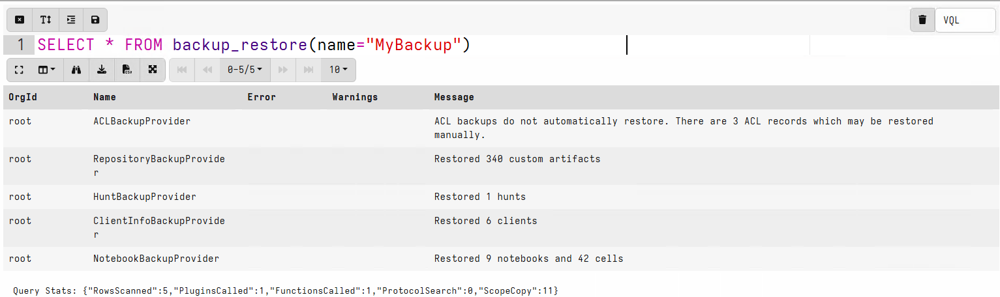
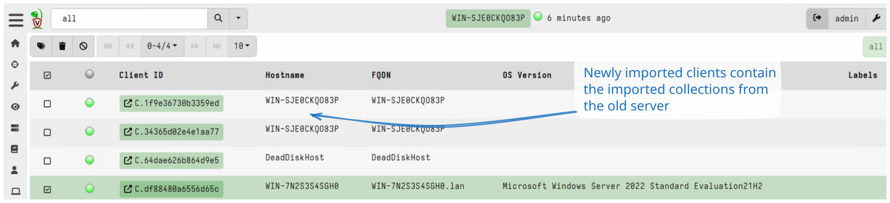

Velociraptor does not provide a true High Availability (HA)
configuration option. There is no built-in way to run multiple active
servers that can take over automatically if one fails. Running several
servers is possible through the
[multi-frontend](/docs/deployment/server/multifrontend/) deployment
model, but that is for horizontal scaling rather than high
availability. Instead, disaster recovery relies on backups and
restores, which involve some downtime while a replacement server is
brought up.

For most deployments this is not a problem. Velociraptor is typically
used for digital forensics and incident response, where a short outage
is acceptable. When the server is unavailable, clients simply buffer
their collected data locally and upload it once the server comes back,
so no data is lost.

This page discusses the different mechanisms and approaches used for
backup and disaster recovery. By thinking carefully about what you
want to get out of a backup solution, what data you want to protect,
and how quickly you want it restored, you can make a more informed
decision about which strategy works best for your deployment.

The right approach depends on exactly what data you choose to back up
and what the restoration end goal is. The Velociraptor datastore can
grow very large, with most of the disk usage consisting of data that
can be recollected from clients if necessary. In some deployments
backing up this data might be considered unnecessary, and so a restore
would amount to restoring the server's operational state and then
recollecting the data from endpoints. If backing up the entire
datastore is justified in your deployment scenario - or even going as
far as periodically backing up the entire server - then restores can
be more comprehensive (while also potentially taking considerably
longer).

## Simplest option: Re-deploy server

What if the Velociraptor server is suddenly completely gone? How can
it be recovered?

The most difficult part of a Velociraptor deployment is the client
deployment. This usually involves pushing packages to endpoints, such
as an MSI or Debian/RPM packages. The process usually involves change
management, approvals etc. These processes take time and so it is
undesirable to have to re-deploy clients.

The client ID is actually a property of the clients themselves. The
Velociraptor Client ID is derived from the client's cryptographic key
and so it is not managed by the server at all - instead it is stored
on the clients in their writeback file. Additionally, client
registration (or `enrollment` in Velociraptor terminology), is done
automatically the first time the client is seen by the server.

So if the Velociraptor server is suddenly gone, the server package can
be redeployed onto a new server and everything should work again:

1. Provision a new server VM or physical machine

2. Install the same server Debian package (which contains the same key
   material and configuration files).

3. Update DNS records to point to the new server IP. The clients will
   use these DNS records to find the new server.

4. After a short time, all clients will re-enroll and the system will
   become functional again.

{}

For a successful recovery the following are required:

1. A backup of the server Debian/RPM package last used to upgrade the
   server (this will contain the server configuration file).

2. A backup of the server configuration file _if it was updated since
   the last package upgrade_.

3. A DNS record for the public interface of the server - this allows
   the server to be redeployed to a new IP address easily.

{}

## Backing up the server configuration

The single most important thing to back up in any Velociraptor
deployment is the server configuration file (`server.config.yaml`).
Without it you cannot bring a replacement server online that your
already-deployed clients will talk to.

Because client IDs and their keys are stored on each client rather than
on the server, clients can re-enroll with any server they find at their
configured DNS name (see [Re-deploy server](#simplest-option-re-deploy-server)).
So as long as you have a copy of `server.config.yaml`, you can stand up
a new server with it and existing clients will connect back without
being redeployed.

The installer package itself is therefore a form of minimal backup.
When you build a server package with `velociraptor deb` or
`velociraptor rpm`, that package embeds the `server.config.yaml` used
to build it and installs it to `/etc/velociraptor/server.config.yaml`.
Keeping a copy of the package you last used to install or upgrade the
server gives you a recoverable configuration even if you lose
everything else.

Daily backups do not include `server.config.yaml`, so keep your own
copy of it somewhere safe - ideally under version control and offline,
since it contains your CA keys and other secrets.

## Daily server backups

While deploying a new server gets the system operational again, it is
not enough:

1. Custom artifacts are not restored
2. Existing hunts are not recovered
3. All collected data from clients are lost
4. Labels on existing clients are lost
5. User accounts and ACLs are lost
6. Multi-tenanted orgs are lost

To address some of these issues, Velociraptor creates a backup package
daily by default. If you need more frequent backups, you can configure
the backup interval in your server config using the
[defaults.backup_period_seconds](/docs/deployment/references/#defaults.backup_period_seconds)
setting.

You can also force Velociraptor to create a backup package using the
VQL [backup()](/vql_reference/server/backup/) function, but if you do
not then you can still find the scheduled (daily by default) packages
in the backup directory `<filestore>/backups/`. Note that the backup
package in the root org will contain all other orgs' backups as well.

```vql
SELECT * FROM backup(name="MyBackup")
```



The backup package contains data from various
`Providers`. Each provider is responsible for saving some aspect of
the server's configuration. To keep the size down, providers do not
save bulky items like collected data, rather only metadata is stored
about the server.

For example, the hunts are saved, but not the list of clients that
have already provided results to the hunt (since the associated
collection data is not backed up). This means that when restoring the
backup on a new server, clients will participate in existing hunts
again.

The current backup providers are:

- `ACLBackupProvider`
- `ClientInfoBackupProvider`
- `HuntBackupProvider`
- `NotebookBackupProvider`
- `RepositoryBackupProvider`

The `RepositoryBackupProvider` saves custom artifacts, so any
artifacts you have created or uploaded are restored along with the
rest of the server state. Built-in artifacts do not need to be backed
up as they ship with Velociraptor itself.

Client labels are also saved as part of the client information, so
they are restored along with the rest of the server state.

### Restoring a daily backup

To restore the backup, you must copy the backup file into the backups
directory on the new server (create the directory if it does not
exist). Then run `backup_restore()`, referring to the backup by name
without the `.zip` extension:

```vql
SELECT * FROM backup_restore(name="MyBackup")
```



To find the most recent backup, list the backups directory and take
the latest entry:

```vql
SELECT Name FROM glob(globs="/backups/*", accessor="fs")
ORDER BY Name DESC LIMIT 1
```

No service restart is required after restoring a backup.

{}

Restoring a backup restores the server state to what it was when the
backup was taken. What this means depends on whether you restore onto
an existing server or onto a newly built one.

When restoring onto a **new (rebuilt) server**, the backup only
contains data that existed when it was created. Anything created since
then - such as new clients, hunts, or notebooks - will not be present
on the restored server.

When restoring onto an **existing server** using `backup_restore()`,
the restore generally only adds objects from the backup rather than
deleting current ones. Hunts, notebooks, and custom artifacts that
exist on the server but not in the backup are left in place. The main
exception is client information: restoring replaces the entire client
store with only what is in the backup, so clients registered since the
backup was taken are removed.

{}

{}

Daily backups contain server state, but not the server configuration
file itself. Keep a copy of your server config separately so you can
fully recover a deployment.

{}

Backups always include the data from all Providers, but when restoring
you can choose a subset that you want to restore using the
[backup_restore()](/vql_reference/server/backup_restore/)
`providers` parameter. Because the root org's backup contains every
other org's backup, you can also use the `prefix` parameter to restore
only a specific org's data from the combined file.

Note that ACL records are not automatically restored for security
reasons. However you can restore them from the backup data in a
Velociraptor notebook, after carefully reviewing the data. For
example, this VQL would restore the users and ACLs for a specific org:

```vql
SELECT *
FROM foreach(
  row={
    SELECT *
    FROM parse_jsonl(
      filename="/tmp/extracted_backups/orgs/O123/acls.json")
  },
  query={
    SELECT
    user_create(
      user=Principal.name,
      orgs=Principal.orgs[0].id,
      roles=Policy.roles),
    user_grant(
      user=Principal.name,
      orgs=Principal.orgs[0].id,
      policy=Policy)
    FROM scope()
  })
```

## Backing up collected data

The data collected from endpoints is typically much larger and can
take a while to back up. Deciding if you need that data backed up
depends on how you use Velociraptor.

Since Velociraptor is typically used to respond to incidents, the data
collected is typically only useful for a short time. Velociraptor can
capture a snapshot of the state of endpoints, but this data may not be
relevant months or weeks later since the state of the endpoints evolve
over time.

In some situations it is desirable to preserve the data collected from
the endpoint:

1. To preserve evidence of compromise. This is needed to
   support further actions, such as disclosure or legal procedures.

2. As provenance or audit of the actions taken, what was found and
   justifications of further actions.


In these use cases it is important to ensure that the data is readable
outside of Velociraptor itself. For example sharing collections as
generic Zip files containing CSV or JSON files is preferable to files
that can only be viewed in Velociraptor.

Therefore, **Data Export** capability is needed from
Velociraptor. This is generated using the
[create_flow_download()](/vql_reference/server/create_flow_download/)
and
[create_hunt_download()](/vql_reference/server/create_hunt_download/)
plugins. Those plugins are the equivalent of the **Download Results**
option in the Velociraptor GUI.

- An export ZIP of a hunt contains all the data collected for that
  hunt by each client that participated.

- An export ZIP of a collection contains all the files collected by
  the specific client.

For example, to archive all hunts you could use a query like:

```vql
SELECT create_hunt_download(hunt_id=hunt_id, wait=TRUE)
FROM hunts()
```

The VQL function `create_hunt_download()` will return the filestore
path you can use to read the file (with the `fs` accessor).

You can also upload those files to, for example, an S3 bucket:

```vql
SELECT upload_s3(secret="S3Token",
                 accessor="fs",
                 file=create_hunt_download(
                     hunt_id=hunt_id, wait=TRUE))
FROM hunts()
```

This approach is fairly selective as you can add and remove
interesting collections from certain hunts using the GUI - so in a
real investigation the hunts can serve as a staging container for
interesting collections.

To export specific collections, use the
`create_flow_download()` function. For example to export all
collections on the server completed in the past week:

```vql
LET OneWeek <= 7 * 24 * 60 * 60
LET DestDir <= "/tmp/exports/"

SELECT client_id,
       session_id,
       LastActiveTime,
       copy(filename=Export,
            accessor="fs",
            dest=DestDir + Export.Base) AS Export
FROM foreach(row={
  SELECT * FROM clients()
}, query={
  SELECT *, timestamp(epoch=active_time) AS LastActiveTime,
         create_flow_download(client_id=client_id,
                            flow_id=session_id,
                            wait=TRUE) AS Export
  FROM flows(client_id=client_id)
  WHERE LastActiveTime > now() - OneWeek
})
```

This query:

1. Iterates over all clients
2. For each client, iterate over all flows
3. If the flow is more recent than 1 week, generate a flow download.
4. Copy the flow download into a destination directory, preserving the
   base name generated by the system (which contains the client id and
   flow id). Note that the "fs" accessor is needed to read the
   download file generated.

### Importing the collections into the new server

To import the collections into the new server, they need to be read
from the shared directory.

```vql
LET DestDir <= "/tmp/imports/"

SELECT OSPath, import_collection(filename=OSPath)
FROM glob(globs="*.zip", root=DestDir)
```




## Complete backup of the datastore

One of the reasons Velociraptor is easy to deploy and manage is
because everything in Velociraptor is simply a file. There is no need
for complicated backend dependencies like databases - all you need to
provide is a directory to store files on.

This makes it easy to back the files up using regular backup
solutions. It is perfectly safe to run incremental backups on the
datastore and restore it at any time. Velociraptor does not use file
locking so there is no problem with a backup software reading all
files inside the data store directory.

It is possible to back up the datastore directory using `rsync`, a
network filesystem, or other solutions to keep a hot spare server on
standby. Then fail over is simply a matter of switching the DNS or
load balancer to the other server.

Note that this is a disaster recovery approach rather than true high
availability: the standby server is not active, so switching over
requires manual intervention and there is some downtime while clients
reconnect. It is a more complete backup solution, but it has some
caveats:

1. The internal Velociraptor files are now compressed so you would
   typically need Velociraptor to be able to read the data.
2. This type of backup solution is indiscriminate - all data is backed
   up regardless of how relevant it is. Storage costs can accumulate
   rapidly.

For ephemeral installations, where collected data is immediately
exported to other systems (for example using the Elastic or Splunk
connectors), backups may not be necessary at all. A new deployment can
be set up in minutes and the system can be quickly recovered.

For most elaborate deployments, more thought can be given to backups,
collection exports for preservation, and maybe even a complete
backup/hot standby architecture.
