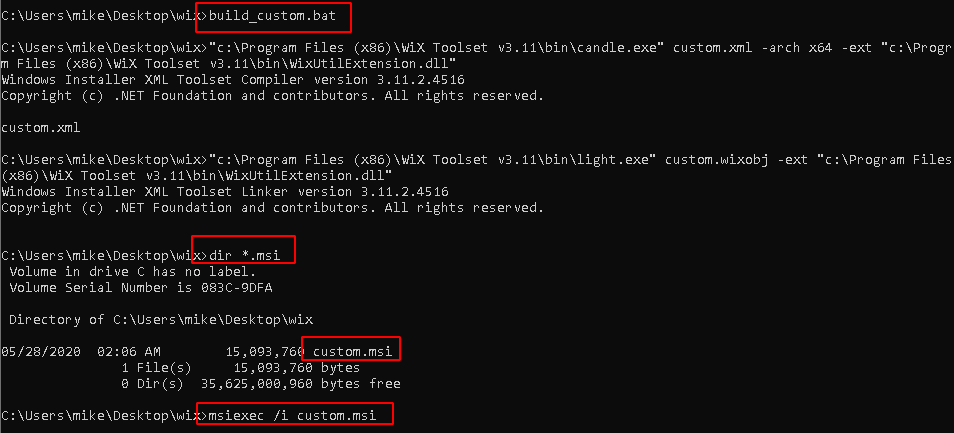
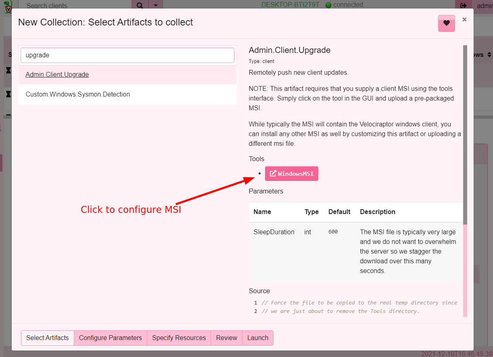
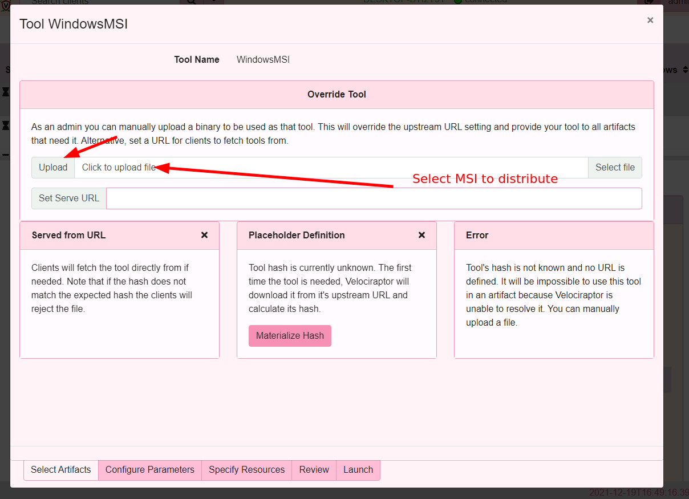

Velociraptor endpoint agents are called `clients`. Clients connect to
the server and wait for instructions, which mostly consist of VQL
statements, then run any VQL queries and return the result to the
server.

There are several ways to run clients, depending on your
needs. Ultimately however, the same Velociraptor binary is run with
the client configuration file generated in the previous setup steps,
providing it with the key material and configuration.

This page summarizes the recommended ways to run the clients and
discusses the pros and cons of each approach.

Note that all Velociraptor binaries (for a particular operating
system) are the same. There is no distinction between the client
binaries and server binaries. Therefore you can run the server or the
client on each supported platform. It's simply command line options
telling the binary to behave as a server or client.

## Running clients interactively

This method is most suitable for testing your deployment. In a command
shell, simply run the client using the client configuration.

```shell
$ velociraptor --config client.config.yaml client -v
```

The first time the client connects it will `enroll`. The enrolment
process requires the client to reveal basic information about itself
to the server.

Note that this type of interactive execution will work effectively the
same way for all versions of the client (Windows, Linux, or Mac). In
the sections that follow, we show options for more scalable and/or
permanent use.

## Installing an MSI

An MSI is a standard Windows installer package. The advantages are
that most enterprise system administration tools are used to deploying
software in MSI packages. Therefore you can use SCCM or Group Policy
to add the MSI to the assigned software group.

For more information, see [How to use Group Policy to remotely install
software in Windows Server 2008 and in Windows Server
2003](https://support.microsoft.com/en-us/help/816102/how-to-use-group-policy-to-remotely-install-software-in-windows-server)

### Official release MSI

The recommended way to install Velociraptor as a client on Windows is
via the release MSI on the [Github
releases](https://github.com/Velocidex/velociraptor/releases) page.

Since the Velociraptor client requires a unique configuration file to
identify the location of the server, we can't package the
configuration file in the official release. Therefore, the official
MSI does not include a valid configuration file.  You will need to
modify the MSI to pack your configuration file (that was generated
earlier) into it.

The easiest way to configure the MSI package is via the
`Server.Utils.CreateMSI` server artifact. After gaining access to the
Velociraptor web GUI, simply switch the relevant Organization, then
select `Server Artifacts` from the sidebar. Then add a new collection,
search for `Server.Utils.CreateMSI` and click launch. The produced MSI
will be available in the `Uploaded Files` tab.

The official release installs the Velociraptor executable into
`C:\Program Files\Velociraptor\` then creates a new Windows service
that points to this executable and starts automatically at boot
time. If an existing Velociraptor service is already installed, it
will be overwritten.

{}

Modifying the MSI file will invalidate its digital signature. While
the packaged Velociraptor binary inside the MSI is officially signed
by the Velociraptor Team, we highly recommend the MSI also be signed
by a valid code signing certificate.

{}

{}

If your windows environment use winget command line tool (or
`Romanitho/Winget-AutoUpdate` for user toasts) for unattended 3rd party
app auto updates on windows.  This can lead to failed downgrade
message issues (as at 5 Feb 2024) or when the winget version numbers
are fixed unexpected upgrade toasts and server client version
mismatches

We strongly recommend getting your admins to pin the Velociraptor
version in winget and deny list upgrading Velociraptor - for
Winget-autoupdate if your environment uses them - please see
https://learn.microsoft.com/en-us/windows/package-manager/winget/pinning
/ https://github.com/Romanitho/Winget-AutoUpdate (search for
blacklist) for more information.

{}

### Installing using custom MSI package

If you wish to customize the MSI from scratch (e.g. change name of
service, install locations etc). You will need to use the Wix
Framework to build a new MSI.

Velociraptor already includes a Wix Framework configuration files that
create a proper custom MSI with embedded configuration. You can also
customize this Wix file to specify a different service name,
destination location etc.

To do so, follow the instructions
[here](https://github.com/Velocidex/velociraptor/tree/master/docs/wix)

To summarize the process, you will need to:

1. Download the Velociraptor repository to a Windows host. Specifically,
   you need to copy the appropriate custom XML file and build batch file
   from the `docs/wix` directory into a new working directory on your host.


2. Update the custom XML for your installation. The README file from
   `docs/wix` steps you through the typical settings to customize.


3. Install the [Wix application](http://wixtoolset.org/releases/) on your
   Windows host.

4. Add your custom client.config.xml file and the appropriate Velociraptor
   executable to a subdirectory of your build directory called `output`.


5. Execute the build batch file to create the new MSI file.



## Installing the client as a service

### Windows

When installing using an MSI, simply run

```shell
msiexec /i velociraptor_custom.msi
```

To install the binary, create the service and start it.

It is also possible to tell the executable to install itself as a
Windows service instead of using an MSI. This option is not
recommended because it does not use a proper package manager, and
therefore Velociraptor can not be easily uninstalled or upgraded.

Nevertheless this approach is possible to do via the Group Policy
scheduled tasks procedure outlined below. Simply run the following
command:

```shell
# velociraptor.exe --config client.config.yaml service install
```

This will copy the binary to the location specified in the
configuration file under `Client.windows_installer`. You can also
change the name of the binary and the service name if you wish.

{}

Although Velociraptor supports installing the service directly as
described above, this is not actually the recommended method. We
recommend using the MSI as described above instead.

One common problem with installing the service in this way, is the
difficulty in uninstalling without the MSI infrastructure being able
to clean up old files.

{}

### Mac

The `service install` directive can be used to install Velociraptor on
Mac client. The following command installs binary & config to /usr/local/sbin.
Persistence is via launchd (check with `ps -eaf | grep velo` and
`sudo launchctl list | grep velo`)

```shell
# velociraptor --config client.config.yaml service install
```

The service can be uninstalled with the following command:

```shell
# /usr/local/sbin/velociraptor service remove --config=/usr/local/sbin/velociraptor.config.yaml
```

Confirm with `ps -eaf | grep velo` and `sudo launchctl list | grep velo`.

### Linux

There are many different kinds of Linux system with various
distributions and vintage. Most binaries compiled for Linux link to
the system's `Glibc` library. This means that the binary will fail to
run on older Linux systems with older `Glibc` versions. You will see
an error similar to `Version GLIBC_2.14 Not Found` when trying to run
the Linux binary.

The Velociraptor team ships a `Linux MUSL` binary. This binary is
linked against a static version of the `MUSL` library allowing to run
without any dependencies on the running OS. We find this binary is
much more reliable and seems to work perfectly well so we recommend
the below be used with the MUSL build in all cases.

The dpkg (Debian) or rpm (Red Hat/CentOS/Fedora) tools can be used to
install Velociraptor on Linux clients after creating an appropriate
package.

#### Debian Package

Create a Debian package with embedded configuration file.
```shell
# velociraptor-vx.x.x-linux-amd64 --config client.config.yaml debian client
```

Install the package
```shell
# sudo dpkg -i velociraptor_x.x.x_client.deb
```

Remove the package
```shell
# sudo apt-get remove velociraptor-client
```

#### Red Hat Package

Create (Most OS variants with systemctl)
```shell
# velociraptor-vx.x.x-linux-amd64 --config client.config.yaml rpm client
```

Very old Linux systems typically do not use the modern `systemd` and
instead use the `SYSV` initialization method. You will need to build a
slightly different RPM for these (with different initialization scripts).

Create (OS variants without systemctl and old GLIBC i.e. CentOS6)
```shell
# velociraptor-vx.x.x-linux-amd64-musl --config client.config.yaml rpm client --use_sysv
```

Install the package
```shell
# sudo rpm -i velociraptor_x.x.x_client.rpm
```

Remove the package
```shell
# rpm -qa | grep -i velociraptor
# sudo rpm -e velociraptor-x.x.x.X86_64
```

## Agentless deployment

There has been a lot of interest in "agentless hunting" especially
using PowerShell.

There are many reasons why agentless hunting is appealing - there are
already a ton of endpoint agents and yet another one may not be
welcome. Sometimes we need to deploy endpoint agents as part of a DFIR
engagement and we may not want to permanently install yet another
agent on endpoints.

In the agentless deployment scenario, we simply run the binary from a
network share using Group Policy settings. The downside to this
approach is that the endpoint needs to be on the domain network to
receive the Group Policy update (and have the network share
accessible) before it can run Velociraptor.

When we run in agentless mode, we are typically interested in
collecting a bunch of artifacts via hunts and then exiting - the agent
will not restart after a reboot. So this method is suitable for quick
hunts on corporate (non roaming) assets.

<!--
See this [blog post](/blog/html/2019/03/02/agentless_hunting_with_velociraptor.html) for details of how to deploy Velociraptor in agentless mode.
-->

#### Create a network share

The first step is to create a network share with the Velociraptor
binary and its configuration file. We will run the binary from the
share in this example, but for more reliability you may want to copy
the binary into e.g. a temp folder on the end point in case the system
becomes disconnected from the domain. For quick hunts though, it
should be fine.

We create a directory on the server. Note that in the below example,
we're creating on a Domain Controller, but we strongly recommend using
another location on real deployments.


In this example we created a directory called `C:\Users\Deployment`
and ensured that it's read-only. We shared the directory as the name
`Deployment`.

We now place the Velociraptor executable and client config file in
that directory and verify that it can run the binary from the network
share. The binary should be accessible via
`\\DC\Deployment\velociraptor.exe`:


#### Create the Group Policy object

Next we create the Group Policy object, which forces all domain
connected machines to run the Velociraptor client. We use the Group
Policy Management Console:


Select the OU or the entire domain and click "Create New GPO":


Now right click the GPO object and select "Edit":


We will create a new scheduled task. Rather than schedule it at a
particular time, we will select to run it immediately. This will force
the command to run as soon as the endpoint updates its Group Policy
settings, because we don't want to wait for the next reboot of the
endpoint.


Next we give the task a name and a description. In order to allow
Velociraptor to access raw devices (e.g. to collect memory or NTFS
artifacts) we can specify that the client will run at
`NT_AUTHORITY\SYSTEM` privileges and run without any user being logged
on.

It's also worth ticking the "hidden" checkbox here to prevent a
console box from appearing.


Next click the Actions tab and add a new action. This is where we
launch the Velociraptor client. The program will simply be launched
from the share (i.e. `\\DC\Deployment\velociraptor.exe`) and we give
it the arguments allowing it to read the provided configuration file
(i.e. `--config \\DC\Deployment\client.config.yaml client -v`).


In the "Setting" tab we can control how long we want the client to
run. For a quick hunt, this may be an hour or two depending on the
network size and hunt scope. For a more comprehensive DFIR collection,
be prepared to wait several hours or even days while user machines are
naturally disconnected and reconnected from the network. The GPO will
ensure the client is killed after the allotted time.


Once the GPO is installed it becomes active for all domain
machines. You can now schedule any hunts you wish using the
Velociraptor GUI. When a domain machine refreshes its Group Policy, it
will run the client, which will enrol and immediately participate in
any outstanding hunts - thus collecting and delivering its artifacts
to the server.

After the allotted time has passed, the client will shut down without
having installed anything on the endpoint.

You can force a Group Policy update by running the `gpupdate`
program. Now you can verify that Velociraptor is running:


{}

In our experience GPO deployments are not very reliable - we often
find the Velociraptor client will be launched multiple times on the
endpoint. It is highly recommended that you use the `--mutant` flag to
specify a mutant preventing the client from starting multiple times.

```
velociraptor.exe --config ... client -v --mutant ArandomString
```

{}


## Client upgrades

The client's identity is derived from the client's cryptographic
certificate which is stored in the `writeback` location on the
endpoint (For example by default `C:\Program Files\Velociraptor\velociraptor.writeback.yaml`).

We generally try to preserve this file between updates in order to
ensure clients do not change their client id. The default provided
`Wix` script ensures the file remains (even if the package is
uninstalled completely) in order to ensure a consistent client id for
the host.

Generally it is sufficient to repackage the latest client binary in a
new MSI, after downloading it from the [GitHub Release
Page](https://github.com/Velocidex/velociraptor/releases). Installing
the new MSI is simply a matter of using standard software management
tools.

{}

It is possible to remotely upgrade the client by pushing the new MSI
to the endpoint and installing it. This is handled by the
`Admin.Client.Upgrade` artifact. To use it, simply collect the
artifact from the endpoint and click the tool setup screen.



In the tools setup screen select the MSI to push from your browser and
upload it to the server.



Note that when installing the MSI using Velociraptor, the Velociraptor
process will be killed part way through collecting the artifact, so it
would appear to never complete it (in the GUI the flow looks
hung). This is OK and part of the upgrade process.

{}

To verify that clients are upgraded we recommend running the
`Generic.Client.Info` hunt periodically. This hunt will refresh the
server's datastore of client details (including reporting the client's
version).
