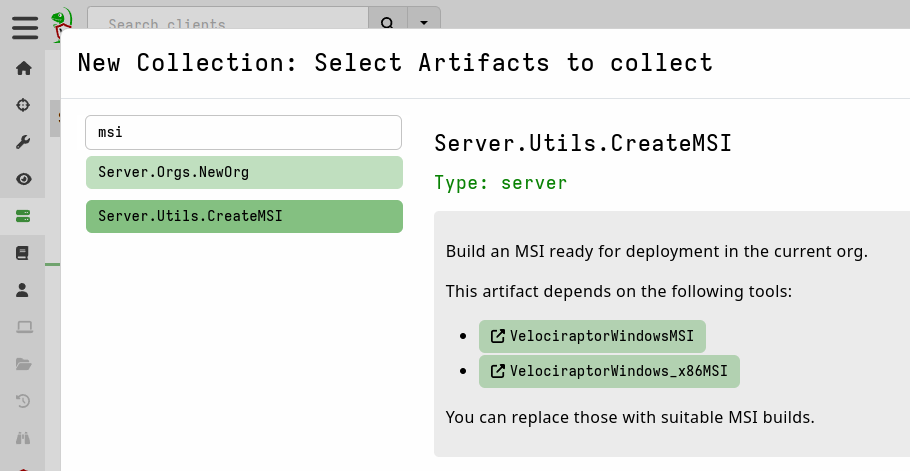
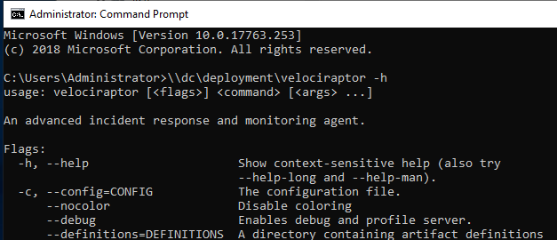

We refer to Velociraptor endpoint agents as "clients".

Clients connect to the server and wait for instructions, which mostly consist of
VQL queries. They then run the VQL queries assigned to them by the server and
return the results to the server.

There are several ways to run clients, depending on your needs. Ultimately
however this amounts to running the Velociraptor binary and providing it with a
client configuration file. The configuration file provides the client with
cryptographic material and settings. We saw how to generate the client
configuration file in
[this previous section](/docs/deployment/self-signed/#generate-the-configuration-file).

On this page we explain how to run, and optionally install, clients on the most
common platforms. There is no single "correct" way to deploy and use
Velociraptor so here we also try to highlight the pros and cons of the most
common approaches.

{}

**Velociraptor only has one binary per operating system and architecture.**

We don't have separate client binaries and server binaries. The command line
options tell the binary whether to behave as a server or as a client. Therefore
you can run the server or the client on any platform that we have a binary for.

_Please note however that the server is only fully supported on Linux_ due to
performance considerations inherent in other platforms such as Windows. But if
you are learning or just playing around then it might be convenient for you to
run the server or client on whatever platform you prefer. Just keep in mind
that for production deployments we strongly recommend that the server should run
on Linux and that issues with other platforms will not be supported.

{}

## Running clients interactively

This method is most suitable for testing prior to deployment, for learning, or
for troubleshooting.

The most simple way to run the client is by executing it in a terminal and
providing it with the client configuration.


{}
```shell
./velociraptor --config client.config.yaml client -v
```
{}
{}
```shell
velociraptor.exe --config client.config.yaml client -v
```
{}
{}
```shell
./velociraptor --config client.config.yaml client -v
```
{}


The command line flag `-v` (verbose) is added so that the client prints it's log
to the terminal. It's not needed but it's very useful if you want to see what
the client is doing, especially if you are troubleshooting issues such as
network connectivity.


The first time the client connects to the server it will **enroll**. The
enrollment process requires the client to reveal basic information about itself
to the server.

Note that this type of interactive execution will work effectively the same way
for all versions of the client (Windows, Linux, or Mac). In the sections that
follow, we show options for more scalable and/or permanent use.

When installed as a service, the Velociraptor client runs with elevated
privileges. But when running it manually you may choose to run it as a normal
user. The choice depends on what data sources you intend to access. For example,
to access operating system protected files usually requires elevated privileges.

In some circumstances you may want to automate this deployment method. That is,
you may want to run hunts across many endpoints without permanently installing
clients. Any remote management tool that can run executables on the endpoints
can be used, but in Active Directory environments it is common to use Group
Policy to accomplish this goal. We explain how to set up such a deployment in
the section [Agentless deployment](#agentless-deployment).

## Installing the client as a service

### Windows

The recommended way to install Velociraptor as a client on Windows is via the
release MSI which you can find on our [Downloads](/downloads/) page. Previous
releases can be found on the [Releases page at Github](https://github.com/Velocidex/velociraptor/releases).

An MSI is a standard Windows installer package. The benefit of using this
installer format is that most enterprise system administration tools are capable
of deploying MSI packages. For example, you can use SCCM or Group Policy to
deploy the MSI to a target organizational unit.

For more information, see
[Use Group Policy to remotely install software](https://learn.microsoft.com/en-us/troubleshoot/windows-server/group-policy/use-group-policy-to-install-software).

There are two approaches to generating the MSI package:

1. Repacking the official release MSI to include your client configuration.
   - using the GUI
   - using the command line
2. Building your own MSI from scratch using 3rd-party tools.

The first approach makes use of our official release MSI and inserts your client
configuration into the file without changing anything else. None of the MSI
settings are changed when using this method. It is most suitable for users who
just want to get up and running quickly. Since it is so commonly done we have
provided a built-in server artifact which allows this to be done via the
Velociraptor web GUI. However it can also be done on the command line using our
CLI, similar to how we create installer packages for Linux and macOS. The CLI
option makes it possible to automate the process using external tools or CI
pipelines.

The second option is suitable for users who require advanced customization of
the MSI package. This is done to change _how the MSI install works_. Things like
installation path, file name, service name, service startup options, icons, etc.
can be changed if needed. Most deployments don't need this kind of customization
but some do.

#### Repacking the official release MSI

Since the Velociraptor client requires *your* unique configuration file to
identify the location of *your* server, we can't package the configuration file
in the official release. Therefore, the official MSI does not include a valid
configuration file. You will need to modify the release MSI to include your
client configuration file, which you
[generated earlier](/docs/deployment/self-signed/#generate-the-configuration-file),
and this is done through a process we call "repacking".

The official release installs the Velociraptor executable into
`C:\Program Files\Velociraptor\`. It then creates a new Windows service that
points to this executable. The service starts automatically at boot time (with
a random delay). If an existing Velociraptor service is already installed, it
will be upgraded and the client configuration file will be overwritten.

**Option 1: Using the Velociraptor GUI**

The easiest way to repack the MSI package so that it includes your client config
file is by using the
[`Server.Utils.CreateMSI`](/artifact_references/pages/server.utils.createmsi/)
server artifact.

1. In the Velociraptor web GUI, simply switch to the relevant Organization, then
   select `Server Artifacts` from the sidebar on the left side of the page.


2. Add a new collection: search for `Server.Utils.CreateMSI`, select it, and
   then click "Launch".



3. It will take a moment to download the latest release MSI files (64bit and
   32-bit) and the repack them with your client config file.

4. The repacked MSI will then be available in the `Uploaded Files` tab of the
   artifact collection.


**Option 2: Using the command line**

{}

In this section we'd like to draw your attention to the fact that repacking the
Windows MSI package can be done on _any_ platform. It does not have to be done
on Windows.

Also note that in the commands below we have omitted version numbers from the
file names to make the commands more concise, however it is useful to include
the version number and architecture tags in your output file names so that you
know exactly what they are.

{}

To repack the MSI with a custom config on the command line we use the `config`
command, and the `repack` subcommand, with the `--msi` flag.

In all cases we need to tell Velociraptor which MSI we want to repack (usually
it's the [official release MSI](/downloads/): either 64-bit or 32-bit) and what
the output file should be named.

 {}
```shell
./velociraptor config repack --msi velociraptor-windows.msi client.config.yaml velociraptor-windows-repacked.msi
```
{}
{}
```shell
velociraptor.exe config repack --msi velociraptor-windows.msi client.config.yaml velociraptor-windows-repacked.msi
```
{}
{}
```shell
./velociraptor config repack --msi velociraptor-windows.msi client.config.yaml velociraptor-windows-repacked.msi
```
{}


If you are using Velociraptor [organizations](/docs/deployment/orgs/) ("orgs")
then you can obtain the client configuration file for each org from the Home
page in the GUI. Ensure that you are in the `root` org so that the configs for
all orgs are accessible.


{}

While the Velociraptor binary inside the MSI is officially signed by Rapid7 LLC
and is unaffected by the MSI repacking process, we recommend that the MSI also
be signed by a valid code signing certificate after repacking.

{}

{}

If your Windows environment use winget command line tool (or
"Romanitho/Winget-AutoUpdate" for user toasts) for unattended 3rd party
app auto updates on Windows, this can lead to failed downgrade
messages and issues (as at 5 Feb 2024). When the winget version numbers
are fixed this can result in unexpected upgrade toasts and server-client version
mismatches.

We strongly recommend getting your admins to pin the Velociraptor version in
winget and also deny-list any upgrades of Velociraptor via Winget-autoupdate if
your environment uses it. Please see https://learn.microsoft.com/en-us/windows/package-manager/winget/pinning
/ https://github.com/Romanitho/Winget-AutoUpdate (search for "blacklist") for
more information.

{}

#### Building a custom MSI package from scratch

If you wish to make advanced customizations to the MSI (for example, change the
name of the service, change install locations, etc.) then you will need to use
the [WiX Toolset](https://wixtoolset.org/) or similar packaging tool which can
build a new MSI from scratch. We recommend WiX and describe it's use here
because it is free and widely used. However there are other tools, mostly
commercially licensed, which you may decide to use instead, especially if your
organization already has such tools.

The Velociraptor repository on GitHub already includes a WiX Toolset
configuration file that creates a functioning MSI with an included client
configuration. You can further customize this WiX configuration to specify a
different service name, destination location, etc.

More detailed instructions are provided
[here](https://github.com/Velocidex/velociraptor/tree/master/docs/wix).

To summarize the process, you will need to perform the following steps:

1. Download or clone the Velociraptor repository to a Windows host.
   Specifically, you may want to copy the
   [docs/wix](https://github.com/Velocidex/velociraptor/tree/master/docs/wix)
   directory into a new working directory on your host. This folder contains the
   necessary WiX configuration (XML) files and other support files that make it
   possible to build your custom MSI directly in this folder. After creating
   your MSI build you may want to keep this build folder and use it for creating
   future builds when new Velociraptor versions are released.


2. Update the custom XML for your installation. The README file at
   [docs/wix](https://github.com/Velocidex/velociraptor/tree/master/docs/wix)
   walks you through the settings that are most commonly customized.


3. Install the [WiX Toolset](http://wixtoolset.org/releases/) on your
   Windows host.

4. Add your custom `client.config.xml` file and the appropriate Velociraptor
   executable to a subdirectory of your build directory called `output`. If you
   have downloaded the executable from our website or GitHub then the file name
   will contain the version and platform information. Ensure that the executable
  in the `output` folder is named `velociraptor.exe`.


5. Execute the build batch file to create the new MSI file.


#### MSI install

To install the MSI from the command line (which requires elevated privileges) simply
run:

```shell
msiexec /i velociraptor_custom.msi
```

This will install the binary and client configuration file in the
`C:\Program Files\Velociraptor\`
folder, create the service, and start it.

The Velociraptor service runs using the Local System account. Startup of the
service is Automatic with a delayed start.

One way to automate such a deployment by using Active Directory Group Policy.
The procedure [outlined below](#agentless-deployment) can easily be adapted to
run the command `msiexec /i \\DC\Deployment\velociraptor_custom.msi` instead of
running the exe, or you can use Package distribution procedure described here:
[Use Group Policy to remotely install software](https://learn.microsoft.com/en-us/troubleshoot/windows-server/group-policy/use-group-policy-to-install-software).

#### Exe install

The Velociraptor executable is also capable of installing itself as a Windows
service without needing an MSI.

Although Velociraptor supports installing the service directly this is not the
recommended method. We recommend using the MSI as described above.

{}

This installation method is not recommended because it does not use a proper
package manager, and that may complicate uninstalls or upgrades that you will
probably want to do in future.

A known problem with installing the service in this way is that it cannot
uninstall completely cleanly since MSI infrastructure would usually be relied on
to perform post-removal tasks such as cleaning up old files.

Nevertheless this approach is possible if the situation requires it. You may
choose to automate such a deployment by using the Group Policy scheduled tasks
procedure [outlined below](#agentless-deployment).

{}

The following command, which requires elevated privileges, will install the
client as a service:

```shell
velociraptor.exe service install --config client.config.yaml -v
```

This will install the binary and client configuration file in the
`C:\Program Files\Velociraptor\`
folder, create the service, and start it.

The binary location is specified in the configuration file under the setting
`Client.windows_installer`. You can also change the name of the binary and the
service name if you wish.

The Velociraptor service runs using the `Local System` account. Startup of the
service is Automatic with a delayed start.

After installation you can check the service status with the command

```shell
sc query velociraptor
```

### macOS

Apple's requirements and processes for software packaging are complex. Therefore
we don't provide installer packages (.pkg or .dmg) or packaging capabilities for
macOS. Our binary does have the capability to install itself under macOS though,
and this is described below. We do provide Apple Developer code-signed binaries
for all official releases.

If your organization has the necessary toolsets, skills and other resources for
creating macOS installation packages then you may choose to do so. The
Velociraptor client is a single binary, with no package or library dependencies,
plus a configuration file which is probably the simplest kind of package that
any packaging expert will ever have to deal with.

For smaller deployments we provide a self-installing capability in the
Velociraptor binary. The `service install` directive can be used to install
Velociraptor so that it persists through reboots and starts automatically. The
following command installs the binary and the config to `/usr/local/sbin`.
Persistence and service control is accomplished via launchd.

First you need to mark the binary as executable.

```shell
chmod +x velociraptor
```

The following command, run with root privileges, will install the Velociraptor
client as a service.

```shell
sudo ./velociraptor service install --config client.config.yaml -v
```

{}

Depending on your version of macOS you may be prevented from running the
executable and you will instead see a warning similar to this.


Click "OK" or "Cancel" and then from System Preferences, open "Security &
Privacy" and from the General tab, click "Allow Anyway".


If you downloaded the file from the internet or another network location then
you may also need to remove the quarantine attribute from the file to suppress
further warning prompts.

```shell
xattr -d com.apple.quarantine velociraptor
```
{}

The client binary will be installed into the path specified in the
`Client.DarwinInstaller.InstallPath` key of the client config, and defaults to
`/usr/local/sbin/velociraptor`.

The client config will be written to `/usr/local/sbin/velociraptor.config.yaml`.

The client service will be named according to the name set in the
`Client.DarwinInstaller.ServiceName` key of the client config, and defaults to
`com.velocidex.velociraptor`.

In addition, for macOS versions >10.14 the client also requires "Full Disk
Access" in order to work correctly. Full Disk Access is part of Apple's security
framework for macOS, and this feature enables an application to access all files
on the system.


After installation you can check the service's status with:
- `ps -eaf | grep velo` or
- `sudo launchctl print system/com/velocidex.velociraptor` or
- Navigate to `Applications > Utilities > Activity Monitor` and search for
  Process Name `velociraptor`.

Organizations that use macOS at scale usually have their own packaging and
deployment processes worked out using their preferred toolset.
[Jamf](https://www.jamf.com/) or
[Microsoft Intune](https://learn.microsoft.com/en-us/mem/intune/fundamentals/deployment-guide-platform-macos)
are commonly used mobile device management (MDM) solutions, but we can't
provide specific advice or step-by-step instructions for these tools.

Some of the additional considerations and complexities with deployments in macOS
environments are described in
[this presentation](/presentations/2022_velocon/#mac-response--the-good-the-bad-and-the-ugly).

### Linux

There are many variations of Linux in the wild. Many distributions and releases,
both new and very old. As DFIR practitioners we have to deal with whatever
systems are put in front of us. Upgrading operating systems is usually not an
option.

Most binaries compiled for Linux, including our standard Linux binary, link to a
specific minimum version of the Glibc library. This version is dictated by the
compiler, which links the binary to the version present on the system on which
it is compiled. We obviously prefer to compile our binaries on modern systems,
so this means that the standard binary will only work on modern systems
(generally ones from the past few years) and will fail to run on older Linux
systems that have older Glibc versions. You will see an error similar to
_"Version GLIBC_2.xx Not Found"_ when trying to run the standard binary on such
systems. Typically the version of Glibc cannot be upgraded without upgrading
the entire operating system.

If your environment has only relatively modern Linux systems then this shouldn't
be a problem for you. However to address this problem for environments where old
Linux systems are an unavoidable fact, we also release a Linux
[MUSL](https://musl.libc.org/about.html) binary. This binary is linked against a
static version of the MUSL library which allows Velociraptor to run with zero
dependencies on the running OS. We find this binary to be completely reliable
and no issues have been reported with it, so we recommend the MUSL build in all
cases. The MUSL releases have `_musl` at the end of the file name.

The `dpkg` (Ubuntu/Debian/Mint) or `rpm` (Red Hat/CentOS/Fedora/SUSE) package
management tools are used to install Velociraptor on Linux clients after
creating an appropriate package.

Both types of installer packages use the same service settings and file
locations. That is, the binary and client configuration files for Linux will be
in the same locations regardless of whether you installed using an `rpm` or a
`deb` package.

Our `deb` and `rpm` installers support both `systemd` and `SysVinit`, and will
detect and use the appropriate one. We do not provide installer support for
other init systems such as Upstart, init.d or OpenRC. If you need to create
installer packages for platforms that use other init systems then you will have
to do it manually. However you can probably re-use most of the service
configuration information that we use for `systemd` and `SysVinit`, which is
available in our GitHub repo.

After installation the binary will be located at

- `/usr/local/bin/velociraptor_client`

and the client configuration file will be at

- `/etc/velociraptor/client.config.yaml`.

The Velociraptor service is named `velociraptor_client.service` and runs using
the `root` account. Startup of the service is automatic.


#### Debian Package

{}

In this section we'd like to draw your attention to the fact that creation of
Linux installation packages can be done on _any_ platform. It does not have to
be done on Linux.

Also note that in the commands below we have omitted version numbers from the
file names to make the commands more concise, however it is useful to include
the version number and architecture tags in your output file names so that you
know exactly what they are.

{}

1. **Create a deb installation package with an embedded client configuration file.**

 {}
```shell
./velociraptor debian client --config client.config.yaml
```
{}
{}
```shell
velociraptor.exe debian client --config client.config.yaml --binary velociraptor-linux-musl
```

Since the Windows binary is being used here to do the packaging work, we also
need to tell it where to find the Linux binary.

{}
{}
```shell
./velociraptor debian client --config client.config.yaml --binary velociraptor-linux-musl
```

Since the macOS binary is being used here to do the packaging work, we also
need to tell it where to find the Linux binary.

{}


If the output file name is not specified (using the `--output` flag) then it
will be auto-generated and include the version number and architecture.

2. **Install the package.**

```shell
sudo dpkg -i velociraptor_client_amd64.deb
```

After installation you can check the service status with the command:

- `systemctl status velociraptor_client` - on systems using systemd
- `service velociraptor_client status` - on systems using SysVinit


#### Red Hat Package

1. **Create a RPM installation package with an embedded client configuration file.**

 {}
```shell
./velociraptor rpm client --config client.config.yaml
```
{}
{}
```shell
velociraptor.exe rpm client --config client.config.yaml --binary velociraptor-linux-musl
```

Since the Windows binary is being used here to do the packaging work, we also
need to tell it where to find the Linux binary.

{}
{}
```shell
./velociraptor rpm client --config client.config.yaml --binary velociraptor-linux-musl
```

Since the macOS binary is being used here to do the packaging work, we also
need to tell it where to find the Linux binary.

{}


If the output file name is not specified (using the `--output` flag) then it
will be auto-generated and include the version number and architecture.


2. **Install the package.**

```shell
sudo rpm -i velociraptor_client_amd64.rpm
```

After installation you can check the service status with the command:

- `systemctl status velociraptor_client` - on systems using systemd
- `service velociraptor_client status` - on systems using SysVinit


### Other platforms and architectures

In our official releases we also provide binaries for FreeBSD.

Velociraptor is written in Golang, so it is technically possible for you to
build it on any platform supported by Go. However Go has officially
[ended support for Windows 7](https://github.com/golang/go/issues/57003) with
the Go 1.20 release. This means that Windows XP, Windows server 2003, and
Windows 7/Vista can no longer be built using a supported version of Go. We may
make occasional (depending on demand for it) builds for Windows 7 using an old
unsupported version of Go, but these will not be supported and may not be the
latest version. Please see [our Support Policy](/docs/overview/support/).

We also distribute 32-bit binaries for Windows but not for Linux. If you need
32-bit Linux builds you will need to build from source. You can do this easily
by forking the project on GitHub, enabling GitHub Actions in your fork and
editing the "Linux Build All Arches" pipeline.

## Agentless deployment

There has been a lot of interest in "agentless hunting" using Velociraptor,
especially since many people come from backgrounds where PowerShell is used for
this purpose.

There are many reasons why agentless hunting is appealing. These are the ones we
hear most often:

* There are already a ton of endpoint agents and yet another one may not be
  welcome.
* Sometimes we need to deploy endpoint agents as part of a DFIR engagement and
  we may not want to permanently install yet another agent on endpoints.

In the agentless deployment scenario, we simply run the binary from a network
share using Group Policy settings. The downside to this approach is that the
endpoint needs to be on the domain network to receive the Group Policy update
(and have the network share accessible) before it can run Velociraptor.

When we run in agentless mode, we are typically interested in collecting a bunch
of artifacts via hunts and then exiting - the agent will not restart after a
reboot. So this method is suitable for quick hunts on corporate (non roaming)
assets.

<!--
See this [blog post](/blog/html/2019/03/02/agentless_hunting_with_velociraptor.html) for details of how to deploy Velociraptor in agentless mode.
-->

#### Create a network share

The first step is to create a network share with the Velociraptor binary and its
configuration file. We will run the binary from the share in this example, but
for more reliability you may want to copy the binary into e.g. a temp folder on
the end point in case the system becomes disconnected from the domain. For quick
hunts though, it should be fine.

We create a directory on the server. Note that in the below example, we're
creating on a Domain Controller, but we strongly recommend using another
location on real deployments.


In this example we created a directory called `C:\Users\Deployment` and ensured
that it's read-only. We shared the directory as the name `Deployment`.

We now place the Velociraptor executable and client config file in that
directory and verify that it can run the binary from the network share. The
binary should be accessible via `\\DC\Deployment\velociraptor.exe`:



#### Create the Group Policy object

Next we create the Group Policy object, which forces all domain connected
machines to run the Velociraptor client. We use the Group Policy Management
Console:


Select the OU or the entire domain and click "Create New GPO":


Now right click the GPO object and select "Edit":


We will create a new scheduled task. Rather than schedule it at a particular
time, we will select to run it immediately. This will force the command to run
as soon as the endpoint updates its Group Policy settings, because we don't want
to wait for the next reboot of the endpoint.


Next we give the task a name and a description. In order to allow Velociraptor
to access raw devices (e.g. to collect memory or NTFS artifacts) we can specify
that the client will run at `NT_AUTHORITY\SYSTEM` privileges and run without any
user being logged on.

It's also worth ticking the "hidden" checkbox here to prevent a console box from
appearing.


Next click the Actions tab and add a new action. This is where we launch the
Velociraptor client. The program will simply be launched from the share (i.e.
`\\DC\Deployment\velociraptor.exe`) and we give it the arguments allowing it to
read the provided configuration file
(i.e. `--config \\DC\Deployment\client.config.yaml client -v`).


In the "Setting" tab we can control how long we want the client to run. For a
quick hunt, this may be an hour or two depending on the network size and hunt
scope. For a more comprehensive DFIR collection, be prepared to wait several
hours or even days while user machines are naturally disconnected and
reconnected from the network. The GPO will ensure the client is killed after the
allotted time.


Once the GPO is installed it becomes active for all domain machines. You can now
schedule any hunts you wish using the Velociraptor GUI. When a domain machine
refreshes its Group Policy, it will run the client, which will enroll and
immediately participate in any outstanding hunts - thus collecting and
delivering its artifacts to the server.

After the allotted time has passed, the client will shut down without having
installed anything on the endpoint.

You can force a Group Policy update by running the `gpupdate` program. Now you
can verify that Velociraptor is running:


{}

In our experience GPO deployments are not very reliable - we often find the
Velociraptor client will be launched multiple times on the endpoint. It is
highly recommended that you use the `--mutant` flag to specify a mutant
preventing the client from starting multiple times.

```shell
velociraptor.exe --config ... client -v --mutant ArandomString
```

{}


## Client upgrades

The client's identity is derived from the client's cryptographic certificate
which is stored in the `writeback` location on the endpoint (For example by
default `C:\Program Files\Velociraptor\velociraptor.writeback.yaml`).

We generally try to preserve this file between updates in order to ensure
clients do not change their client id. The default provided WiX script ensures
the file remains (even if the package is uninstalled completely) in order to
ensure a consistent client id for the host.

Generally it is sufficient to repackage the latest client binary in a new MSI,
after downloading it from the
[GitHub Release Page](https://github.com/Velocidex/velociraptor/releases).
Installing the new MSI is simply a matter of using standard software management
tools.

{}

It is possible to remotely upgrade the client by pushing a new MSI to the
endpoint and installing it. This is handled by the `Admin.Client.Upgrade`
artifact. To use it, simply collect the artifact from the endpoint and click the
tool setup screen.


In the tools setup screen select the MSI from your local machine and upload it
to the server.


Note that when installing the MSI using Velociraptor, the Velociraptor process
will be killed part way through collecting the artifact, so it would appear to
never complete it (in the GUI the flow looks hung). This is OK and part of the
upgrade process.

{}

To verify that clients are upgraded we recommend running the
`Generic.Client.Info` hunt periodically. This hunt will refresh the server's
datastore of client details (including reporting the client's version).
