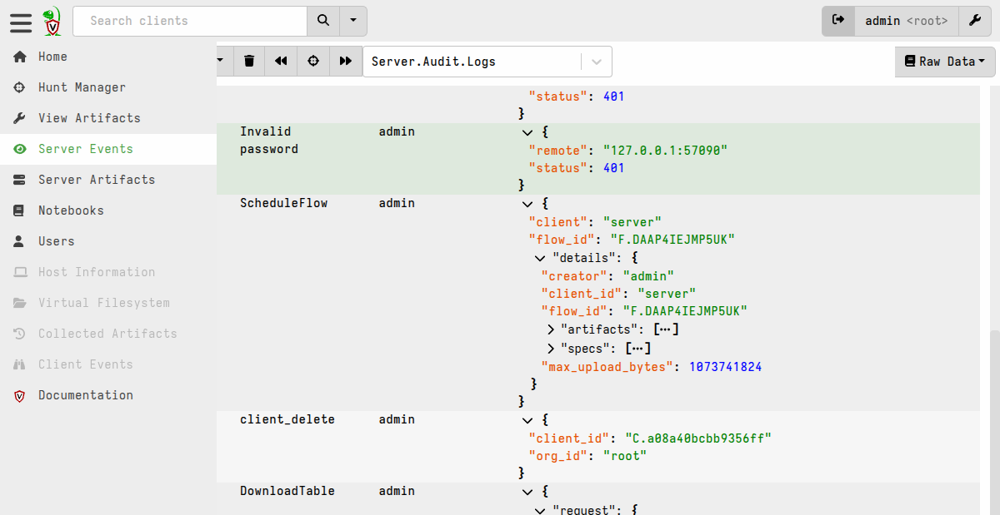

Velociraptor can log server operational events to local files, forward
them to a remote syslog server, or both. On a production system you
should enable at least one of these so you have a historical record of
what the server was doing.

Logging is distinct from [Prometheus/Grafana performance
monitoring](/docs/deployment/resources/#setting-up-monitoring).
Monitoring tracks performance metrics like CPU and memory usage.
Logging captures discrete operational events, for example which
clients connected, what hunts ran, which users authenticated, and any
errors the server encountered.

{}

If your deployment sends logs to a central syslog server (for example
rsyslog, Graylog, or a SIEM), you can search and alert on Velociraptor
operational events alongside logs from other infrastructure. This is
the recommended approach for production systems.

{}

## File-based logging

File-based logging writes log files to a directory on the server. Each
log level (debug, info, error) gets its own rotating log file.

### Configuration

Add a `Logging` block to your `server.config.yaml`:

```yaml
Logging:
  output_directory: /mnt/data/logs
  separate_logs_per_component: true
```

The key settings are:

| Setting | Description | Default |
|---------|-------------|---------|
| `output_directory` | Directory for log files. If empty or this key is missing, no files are written. | *(empty)* |
| `separate_logs_per_component` | Give each Velociraptor logging component its own log file. | `false` |

When `output_directory` is empty, Velociraptor does not write any log
files. This is the default. It applies either when the
`output_directory` key is omitted from the config entirely, and when
it is present but set to an empty value (for example
`output_directory: ""`).


### File naming

Log files are written into the output directory. The file name
includes the component and log level.

With `separate_logs_per_component: true` (recommended), each component
gets its own set of files:

```
/mnt/data/logs/
    VelociraptorFrontend_debug.log
    VelociraptorFrontend_info.log
    VelociraptorFrontend_error.log
    VelociraptorAudit_info.log
    VelociraptorAPI_info.log
    ...
```

With `separate_logs_per_component: false`, all components write to
the same files:

```
/mnt/data/logs/
    Velociraptor_debug.log
    Velociraptor_info.log
    Velociraptor_error.log
```

{}

In a distributed deployment with
[minion frontends](/docs/deployment/server/multifrontend/),
each minion writes its logs to a subdirectory named after the node.
This ensures that minions do not overwrite each other's or the
master's logs.

{}

When a log file rotates, the old file gets a timestamp suffix added
(for example `VelociraptorAudit_info.log.202608311200`) and a symlink
points to the current active file.


### Log rotation and retention

Each log level rotates independently. The defaults are:

- **Rotation:** every 7 days (`604800` seconds)
- **Max age:** 1 year (`31536000` seconds)

You can override these per level. For example, to rotate debug logs
daily but keep error logs for two years:

```yaml
Logging:
  output_directory: /mnt/data/logs
  debug:
    rotation_time: 86400      # 1 day
    max_age: 2592000          # 30 days
  error:
    rotation_time: 604800     # 7 days
    max_age: 63072000         # 2 years
```

To disable a log level entirely (for example, to stop writing debug
logs to disk while still forwarding info and error to syslog):

```yaml
Logging:
  output_directory: /mnt/data/logs
  debug:
    disabled: true
```

When a level is disabled, no log file is written for that level.


## Syslog forwarding

Velociraptor can forward log messages to a remote syslog server. This
is useful for centralizing logs from multiple servers or feeding them
into a SIEM.

### Configuration

```yaml
Logging:
  separate_logs_per_component: true
  remote_syslog_server: syslog.example.com:514
  remote_syslog_protocol: udp
  remote_syslog_components:
    - VelociraptorAudit
```

| Setting | Description | Default |
|---------|-------------|---------|
| `remote_syslog_server` | Address of the syslog server (`host:port`). Port defaults to `514` if omitted. | *(empty — disabled)* |
| `remote_syslog_protocol` | Transport protocol: `udp`, `tcp`, or `tls`. | `udp` |
| `remote_syslog_components` | Which components to forward. | `["VelociraptorAudit"]` |

If `remote_syslog_server` is empty, syslog forwarding is disabled
regardless of other settings. As with `output_directory`, this applies
both when the `remote_syslog_server` key is omitted entirely and when
it is present but set to an empty value (`remote_syslog_server: ""`).

{}

How syslog forwarding works depends on `separate_logs_per_component`:

- With `separate_logs_per_component: true`, each component logs
  separately, so every component you list in
  `remote_syslog_components` is forwarded on its own.
- With `separate_logs_per_component: false` (the default), all
  components are logged together as a single `Velociraptor` stream. In
  this mode, listing a specific component such as `VelociraptorAudit`
  has no effect; only `Velociraptor` is forwarded. If your list does
  not include `Velociraptor`, then nothing is forwarded at all.

The simplest way to make syslog forwarding work is to set
`separate_logs_per_component: true` and list the components you want
to forward. If you prefer to keep all components in a single log
stream, leave it at the default and list `Velociraptor` instead; this
forwards everything.

See [Forwarding specific components](#forwarding-specific-components)
for details on the available logging components.

{}


### What gets forwarded

Syslog forwarding sends messages at the following log levels:

- Panic
- Fatal
- Error
- Warn
- Info

**Debug-level messages are not forwarded to syslog.** This is
by design; debug messages tend to be high-volume and are not useful
for operational monitoring.

Velociraptor sends each message using traditional syslog text format
(RFC 3164-style): the receiving syslog server prepends its own
standard header — for example rsyslog adds a priority, timestamp, and
hostname — followed by the raw message body.

The message body itself is a **JSON object** containing the log level,
timestamp, and the original log message:

```json
{"level":"info","msg":"Frontend is ready to handle client TLS requests at https://127.0.0.1:8000/","time":"2026-08-31T13:23:23Z"}
```

These fields are **not** parsed into individual syslog fields or RFC
5424 structured data — they are embedded together in the JSON body of
the `msg` portion of each syslog line. If you ingest these logs into a
SIEM, we recommend configuring JSON parsing on the receiving side so
that `level`, `time`, and `msg` become queryable fields.

{}
UDP is the simplest option but offers no delivery guarantee. If the
syslog server is unreachable or the network drops packets, messages
are lost silently and Velociraptor continues to run normally.

With `tcp` or `tls`, Velociraptor establishes a connection to the
syslog server at startup. If it cannot connect, **the server fails to
start**. Ensure your syslog server is reachable before enabling TCP or
TLS forwarding.

If you specify `tls`, the syslog connection is encrypted. You may need
to configure your syslog server with appropriate certificates.
{}


### Forwarding specific components

The default value of `remote_syslog_components` is
`["VelociraptorAudit"]`, so audit events are forwarded by default when
syslog forwarding is enabled with `separate_logs_per_component: true`.
This captures user and service actions like logins, artifact
modifications, and hunt operations, the most important events for
security monitoring.

To forward additional components, list them explicitly:

```yaml
Logging:
  separate_logs_per_component: true
  remote_syslog_server: syslog.example.com:514
  remote_syslog_components:
    - VelociraptorAudit
    - VelociraptorFrontend
    - VelociraptorAPI
```

See [Log components](#log-components) for the full list.


## Log components

Velociraptor separates log messages by component. Each component
represents a different part of the server.

| Component | What it logs |
|-----------|-------------|
| `Velociraptor` | Generic messages, startup/shutdown, and tool operations. This is the fallback component. |
| `VelociraptorFrontend` | Client connections, communications, and data reception. |
| `VelociraptorClient` | Client-side operational messages (when running as a client). |
| `VelociraptorGUI` | Web interface and GUI-related events. |
| `VelociraptorAPI` | API server operations. |
| `VelociraptorAudit` | User and service actions: logins, artifact changes, hunt creation, access control changes. |

When `separate_logs_per_component` is `true`, each component writes
to its own file. This makes it easier to find messages from a specific
part of the system. When `false`, all components write to the same file. This is useful
for seeing the full picture in one place but harder to filter.


## Audit logging

The `VelociraptorAudit` component captures security-relevant actions:
who did what and when. This includes:

- User logins and logouts
- Artifact creation, modification, and deletion
- Hunt creation, modification, and deletion
- Access control changes
- Server configuration changes

Audit events are written at the **Info** level, so they appear in the
`_info.log` file (or in syslog forwarding).

Audit events are also stored in the `Server.Audit.Logs` event-monitoring
artifact, which you can view and query from the GUI. This is a separate
mechanism from the `Logging`-configured file logs and syslog forwarding.

On Windows servers, audit events are also written to the Windows
Event Log.

While this page covers **configuration-defined logging** (that is,
logging defined in the server config file). Some categories of server
events are also available via
[server monitoring](/docs/server_automation/server_monitoring/)
and artifacts can be created to send such events to any destination
supported by VQL functions and plugins (including but not limited to
syslog). Since configuration-based logging requires server filesystem
access, which Velociraptor GUI users typically don't have, it is
considered more resistant to tampering and therefore preferable
especially for audit logging.




## Configuration examples

###### Example: File logging only

A minimal setup that writes all log levels to disk:

```yaml
Logging:
  output_directory: /var/log/velociraptor
  separate_logs_per_component: true
```

###### Example: Syslog only

Forward audit events to a remote syslog server without writing log
files:

```yaml
Logging:
  separate_logs_per_component: true
  remote_syslog_server: syslog.example.com:514
  remote_syslog_protocol: tcp
  remote_syslog_components:
    - VelociraptorAudit
```

###### Example: Both file and syslog

Write all logs to disk and forward audit events to syslog:

```yaml
Logging:
  output_directory: /var/log/velociraptor
  separate_logs_per_component: true
  remote_syslog_server: syslog.example.com:514
  remote_syslog_protocol: tcp
  remote_syslog_components:
    - VelociraptorAudit
```

###### Example: Custom retention

Write logs with aggressive rotation for debug logs and long retention
for errors:

```yaml
Logging:
  output_directory: /var/log/velociraptor
  separate_logs_per_component: true
  debug:
    rotation_time: 86400       # Rotate daily
    max_age: 604800            # Keep for 7 days
  info:
    rotation_time: 604800      # Rotate weekly
    max_age: 2592000           # Keep for 30 days
  error:
    rotation_time: 604800      # Rotate weekly
    max_age: 63072000          # Keep for 2 years
```
