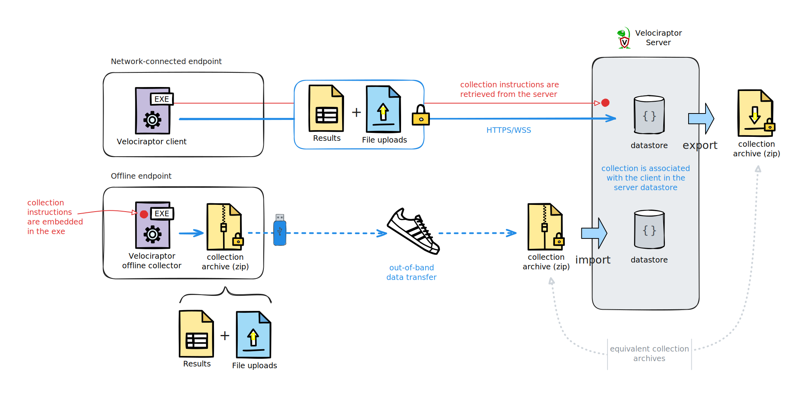
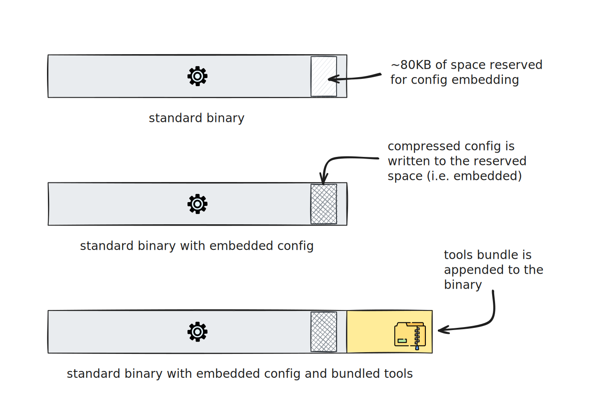

In this section we look at a less conventional method of collecting data from
endpoints. One of Velocraptor's many strengths is its ability to deal with the
variety of challenging environments that realworld DFIR throws our way.

## How do offline collections work?

At it's core, the Velociraptor is just a VQL engine! We give it VQL to run, in
the form of [artifacts](), and it gives us back
data (which may or may not
[include files]()).
Normally the Velociraptor server gives the client the VQL to run, the client
runs ("collects") it, and the server receives the results from the client. Note
that the collection step occurs independently of the server, with the server
only being involved before and after the collection.

So for situations where the a server can't be deployed or can't be reached from
the endpoints, we essentially need a special type of client that can do it's
collection work without receiving it's instructions from the server, and without
needing to send the results directly back to the server. We need an independent
Velociraptor binary that acts like a client in terms of running (pre-defined)
VQL artifacts, and that stores the results in a standalone/portable archive. We
can then transport that archive file via alternative channels back to the server
for import and analysis.

To support offline collections, Velociraptor is capable of creating special
binaries that are pre-configured to automatically collect a selected set of
artifacts. We call these binaries **offline collectors**.

- They can do anything that a normal client can do, but they have their
  instructions "baked in" rather than receiving instructions interactively from
  the Velociraptor server.

- Instead of sending their data back to the server they write it to a local
  collection container file, which they can optionally upload to a cloud storage
  service or network location. Because the collection container may contain
  sensitive data, offline collectors can encrypt or password-protect this file
  so that it's secure while in transit.

{}

The term "offline" in this context refers to the fact that the collection is
done without the use of an online client - that is, without the client-server
network connectivity that is required for normal collections. The endpoint needs
to have a running operating system, just as it would if an
[installed]()
or
[non-installed]()
client was used. Do not confuse the term with
[deadisk analysis](), which deals with
data from computers that don't have a running operating system.

It may be better to think of offline collections as _out-of-band collections_,
since the main difference is that the VQL and collected results are not sent
over a network-based client-server communication channel.

{}

## Why do we need offline collections?

Under ideal circumstances we'd have our Velociraptor clients deployed and
communicating with their Velociraptor server, and we'd be having an easy time
hunting down the cyber threats. But sometimes some of us are thrown into
difficult situations where we don't have clients deployed and where a
conventional client-server deployment is just not possible - we may have to
perform investigations in situations where a conventional client-server
deployment is either forbidden, or just not possible due to technical reasons
such as lack of network access. This may even be your everyday "normal" if you,
for example, provide IR services to other organizations.

In some situations, deploying Velociraptor in the usual client-server
architecture might be impossible, impractical, or just inconvenient. For
example:

- You may not be permitted to deploy a Velociraptor server or clients in an
  environment that you are tasked with investigating. During a security incident
  there may be strong resistance to deploying any new software or
  infrastructure.

- Internet access may be shut down during an incident so that clients, if
  deployed, could not connect to your cloud-based server. And in that case you
  may need to rely on external assistance (such as a local admin) to perform the
  collections when you have no remote access to the site. However, these
  assistants are typically not Velociraptor or even DFIR experts, so we need to
  be able to provide them with a solution that performs the required collections
  with minimal technical knowledge.

## What is an offline collector?

The **offline collector** is a full-featured Velociraptor binary that has a
custom configuration and selected artifacts embedded in it. If the embedded
artifacts require any 3rd-party [tools]()
then these will also be repackaged into the offline collector binary.

The process of embedding the config - and optionally bundling other tools - does
not require compiling a new binary from source. It uses the standard
Velociraptor binary and produces a modified version of it. So you can still use
the collector binary to perform any operations that an unmodified Velociraptor
binary is capable of. The offline collector behaviour is only invoked when the
binary is launched without any
[command line arguments]().

Because offline collectors are based on standard Velociraptor binaries they can
be created for any platform or achitecture that Velociraptor supports.

When run without any command line arguments the embedded config is loaded. The
config defines the offline collector's behaviour which is:

1. **collect** the specified artifacts which are included in the config.

2. **store** the collection results, logs and metadata in a structured zip
   archive, which is typically encrypted or password-protected (but doesn't have
   to be).

3. **upload** the collection container to a cloud storage service or other network
   destination, if configured to do so.

4. **delete** the collection container from disk (optional and only used when the
   collection container is uploaded to a network destination).

During the collection the offline collector displays progress in a terminal. No
user interaction is needed, but you can choose the option to pause at the end of
the collection process so that if there's a person running it locally then they
can observe whether or not it has completed successfully.

## Offline collection considerations

Although offline collectors provide a powerful capability to address difficult
situations, they are not without some drawbacks. Here are a few that you should
think about.

- You really need to plan ahead about what you want to collect. An offline
  collection is often a one-shot opportunity to collect what you need. Iteration
  would require creating a new collector each time. By contrast a
  network-connected "online" client makes it easy to quickly pivot and dig
  deeper in response to findings. For this reason offline collections tend to
  err on the side of collecting more data than is really necessary rather than
  being more targeted and focused on answering specific investigative questions.

- Offline collectors need to be packaged with the artifacts and tools that they
  need. This means that you can't quickly create a new artifact and add it to
  your offline collector without rebuilding and redistributing a new binary. If
  your artifacts need tools then bundling them into a collector binary can
  significantly increase the file size.

- The release versions of the Velociraptor binaries for Windows and macOS are
  digitally signed. Repacking the binary invalidates those digital signatures.
  For Windows this is rarely an issue, but macOS will refuse to execute binaries
  with invalid signatures. So on macOS we use the
  [Generic collector]()
  option, which is the offline collector config plus tools packaged into a
  separate file.

- Because offline collectors do not provide progress updates and resource
  telemetry to the server, we cannot get feedback on how the collection is going
  or on the resource usage. However, since offline collectors are typically used
  under emergency conditions the resource utilization aspect may not be of much
  concern.

{}

In general, don't use offline collectors:

- **To only collect files**: Many new users make the mistake of only collecting
  files with the intention of analyzing them later on the server. Velociraptor
  is not designed for centralized parsing of files - it can be done but it's
  relatively complicated, loaded with caveats, and can add significant delays to
  an investigation.

  If you want to parse files and analyze their contents _and also
  collect copies of the files_, then that's easily done: just add the relevant
  parsing artifacts to your offline collector spec. Parsing of most file types
  is very fast and can therefore be done on the endpoint at the same time that
  the files themselves are collected. This approach makes use of the combined
  computing resources of all endpoints rather than centralizing the workload on
  the server. When you import a collection container on the server it's far better
  to have data that you can immediately begin working with, and not just a dump
  of files.

  Ideally you should use the same artifacts in an offline collector as you would
  use if you had a client running on the endpoint. Although, as mentioned
  previously, this does require some planning.

  There are certainly some situations where you might only need to collect
  certain files, but those are typically rare. With Velociraptor it usually only
  makes sense to copy a file if you've looked through it and found something of
  interest.

- **To avoid using clients**: If the endpoint can communicate with the server
  then there really is no reason to use an offline collector rather than an
  interactive online client.

  - Velociraptor clients can operate
    [without being installed]().

  - Clients can immediately join hunts upon enrollment, which allows them to
    immediately begin collecting exactly the same pre-defined set of artifacts
    that an offline collector would have.

  - Clients allow you to iterate and pivot as you investigate. Having the
    results returned directly and almost immediately to the server allows you to
    get answers without delays.

  - The client config can be
    [repacked]()
    into the binary, and made to
    [auto execute]()
    in `client` mode. That is, the convenience of a single autoexec binary can
    be replicated for non-installable clients using the same embedding
    mechanism that offline collectors use. In certain scenarios this may be
    preferable to offline collectors, as is explained
    [here]().

{}

## The Generic Collector

Normally the Velociraptor offline collector builder creates a preset
configuration file and embeds it inside the regular Velociraptor binary for ease
of use. Because it is uses a binary for a specific platform and architecture,
you would need a separate collector for each target platform/architecture in
your environment.

In recent versions of Velociraptor we now offer a new type of collector called
the **Generic collector**. The Generic collector is functionally the same as the
offline collectors that use an embedded config, however it is a file that is
separate from, and therefore independent of the binary. It's essentially a
standalone collector config, optionally combined with a tools bundle, written
into a single file. This allows it to be used on the command line with any
Velociraptor binary.

There are two reasons to use a Generic Collector instead of one that's embedded
in a platform-specific binary:

1. Embedded configs are limited to approximately 80KB, regardless of which
   platform the binary is compiled for. This is usually sufficient for a large
   number of average sized artifacts, since compression is applied to the config
   before it's embedded and artifacts are highly compressible. However we have a
   few artifacts that are relatively large and contain already-compressed data
   that can't be compressed much more. Some of these large artifacts are larger
   than the ~80KB embed limit, or else a selection of artifacts that includes 2
   or 3 of the large ones will be beyond the limit.

2. The macOS binaries that we create are code-signed. Embedding a collector
   config into the binary invalidates this digital signature. Recent versions of
   macOS will prevent execution of binaries with invalid signatures. So on macOS
   the Generic Collector approach is absolutely necessary and the only supported
   option. Microsoft is increasingly starting to care about signed binaries
   too but currently less so than Apple, so in some Windows environments the
   generic collector might be the best option.

While the Generic collector is required for macOS, it can also be used for
Windows, Linux, etc. to accommodate very large artifacts or combinations of
large artifacts that exceed the embedding size limit. An additional benefit is
that you then only need to create one collector which can be used
cross-platform, although your selection of artifacts would need to take that
into account.

Learn how to run generic offline collectors
[here]().

{}

Note that tools are not embedded in the binary and therefore do not need to be
factored into the ~80KB limit. With both the generic collector and the offline
collectors based on Velociraptor binaries that use config embedding, the tools
are bundled and appended to the file.

{}

## Collection containers

An offline collector is essentially a preprogrammed out-of-band client. Instead
of connecting to the server and delivering data over a client-server
communication channel, the data is delivered via sneakernet or a cloud storage
provider or some other means.

To make the data portable and thus enable delivery via arbitrary means, the
offline collector writes the collection results and other data to a local zip
file. Inside the zip we used a well-defined file structure that allows these
collection containers to be imported into a Velociraptor server while also
conveying the necessary collection context that lets the server treat the data
as if it was collected by a normal (online) client.

As explained below, we provide several ways to secure the collection data in
transit.

Typically the collection data is then imported into the server which creates a
normal client record and associated collections. The data can then be queried on
the server as with any other client collections.

See the section
[Working With Offline Collection Data]()
for more information about importing collection containers, as well as other ways
to work with the data without importing it.

## Collection security

All Velociraptor collections - whether online of offline - can potentially
contain sensitive data. With client-server (online) collections the data
transfer is secured with TLS. However an offline collector creates a portable
collection container, which is assumed to then be transported via insecure
networks/systems outside the control of Velociraptor. So it is essential to
properly secure this data.

Offline collector archives can be encrypted. We provide the following schemes
for encrypting the data:

1. **Password-secured**: specifies a password in the embedded configuration
   file. This password is passed directly to the ZIP library to encrypt the
   file.

   While simple to use, this scheme is not recommended as the password is stored
   in clear text inside the offline collector and can be easily extracted.

2. **X509-secured**: a random password generated and encrypted with the server's
   certificate, or your own certificate.

   _This is the recommended method._

   This scheme embeds the Velociraptor server's public certificate in the
   offline collector. During collection, a random password is generated which is
   then encrypted using the embedded Velociraptor certificate and stored in the
   container inside a metadata file.

   After the password is used to encrypt the container, it is discarded. The
   only way to recover the password is to decrypt it using the server's private
   key. This way if the collector binary or the collection are compromised it is
   impossible to recover the password without the server's configuration file
   (that contains the private key).

   If the X509 method is used with the server's certificate, then the collection
   archives will be decrypted automatically and transparently when they are
   imported into the same server that produced the offline collector.

3. **PGP-secured**: a random password generated and encrypted with the PGP
   public key. Not recommended but available for certain uses cases.

In all the above options, the archive is protected by a password. However for
the certificate-based options that password is randomly generated by the
collector, used to secure the collection archive and then the password is itself
encrypted using either the server's X509 certificate or a cert that you provide.

If you use either of the certificate-based options, the zip password is
essentially a strong symmetric key, which is secured in transit using asymmetric
cryptography. This allows Velociraptor to create and extract collection
containers with high speed and efficiency - which is very important as
collection containers can sometimes be extremely large - while also benefitting
from the strength of asymmetric encryption.

Even though the ZIP format uses AES to encrypt the contents of files, the file
names are not encrypted and can be seen without providing a password. This is an
unfortunate limitation of the ZIP file format, especially since the file names
alone can reveal much information about the collection. We definitely want to
prevent that, so to overcome this limitation, Velociraptor first zips the
collection data into a zip named `data.zip` and then places that into a second
zip container. It then applies the protection to the `data.zip` _on the outer
zip container_, which means that anyone without access to the password can only
see `data.zip` in a zip file listing and nothing more. In addition we add a file
named `metadata.json` which contains the _encrypted_ randomly-generated password
and information about the protection scheme being used. The collector does not
apply protection to this file since we need to read it to obtain the encrypted
password which we can then decrypt (which we can only do if we have the
corresponding private key!).

In addition to the encrypted options we do also allow the option of "none" (no
encryption) for the collection zip, but you should avoid using this except
perhaps in special circumstances such as for convenience while testing in a lab
or training environment.

## Concurrency and order of artifact collection

The offline collector collects the selected artifacts in an effectively random
order. You cannot change the order of artifact collection.

By default the offline collector will collect 2 artifacts at the same time
(concurrency = 2). This can be overridden in the GUI collector builder or by
specifying the `OptConcurrency` setting in the spec file if building the
collector
[on the command line]().

Because offline collectors run without resource limits (by default), increasing
the collection concurrency will not necessarily lead to faster collections, and
may even achieve the opposite due to resource contention. If you are considering
performance tuning your offline collectors then testing will help you establish
an optimal concurrency setting. Different artifacts use different resources, and
can shift their demands at different times during a collection. So the default
setting provides a good balance since there's a reasonable chance that 2
artifacts will be demanding different resources at any moment in time.

## More info

{}

