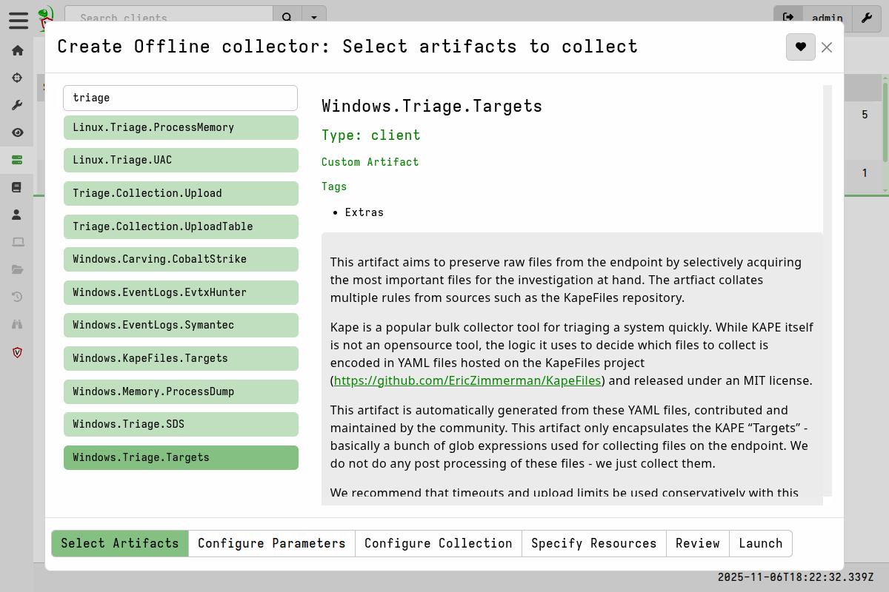
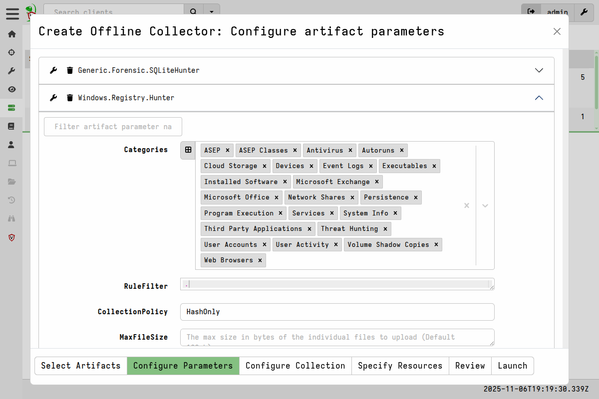
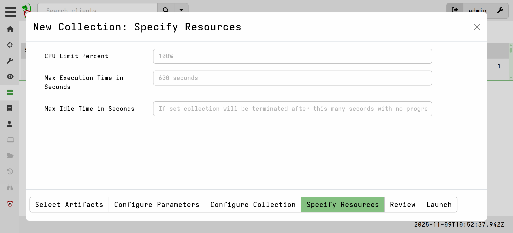
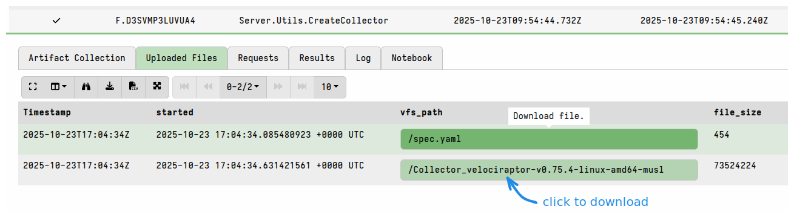
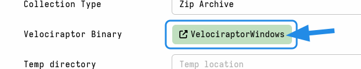
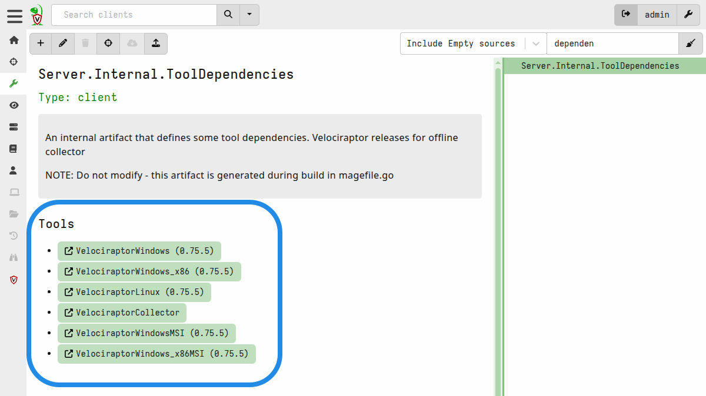

Offline collectors can be created in the GUI or using the CLI.

The GUI is the recommended way to create them as it provides an intuitive
collector builder wizard that makes the process quick and easy. For advanced use
cases, such as automating the creation of collectors in a separate build
environment, the `collector` CLI command is often preferred, and we refer you to
[the command's documentation]()
for further information on that option.

Here we will discuss the GUI-based method.

## The offline collector builder

The **Offline Collector Builder** is simply a GUI wrapper around the
`Server.Utils.CreateCollector` server artifact, so much of it will seem familiar
as many of the options are the same as you'd see when collecting any other
server artifact.

You can start the offline collector builder using either:
- the <i class="fas fa-paper-plane"></i>
  button in the toolbar on the **Server Artifacts** screen
- the link on the Welcome screen (from version 0.75).

1. The **Select Artifacts** page is exactly the same as the one you would see if
   you were configuring a normal collection for a single client or for a hunt.

2. On the **Configure Parameters** page you can edit the parameters for any of
   the artifacts selected in the previous step. Here you can also remove
   artifacts from your selection if needed.

3. The **Configure Collector** page is where you select the options that determine
   how the offline collector will be built, and key aspects of it's runtime
   behaviour.

### Collector Options

- **Target Operating System**

  This specifies the target platform and
  architecture of the Velociraptor binary that the
  [collector config]()
  will be packed into. The choices cover the most commonly used Velociraptor
  binaries. Note that the list also includes the
  [Generic collector]()
  option which is platform-independent.

  The option you choose will change the **Velociraptor Binary** tool button on
  the collector options form. Normally you don't need to do anything with this
  field, but it helps to understand what it means: The target binary that will
  be used is defined as a Velociraptor [tool]()
  and the server will attempt to download it from GitHub. If your server has no
  internet access then this obviously won't work, so in that case you'll need to
  [manually upload the binary]().

- **Encryption**

  As explained [here](),
  the zip archive used to store the collection results can be secured with
  encryption. Additional fields for the encryption key (certificate) or password
  will be displayed depending on which option you select.

- **Collection Type**

  By default, Velociraptor's offline collector will create a ZIP file containing
  all the collected files and artifacts. However, this zip file is normally
  large and we may not want to rely on the person collecting the data to handle
  sending us the archive file. Instead, Velociraptor's offline collector can
  upload the collected archive to a remote location automatically when the
  collection is done.

  This option determines the destination of the collection container. Additional
  fields will be displayed relevant to the option that you select.

  - `Zip Archive`: This is the default option. The collection zip will be stored
    in the same directory that the collector is run from.

  - `Google Cloud Bucket`: The zip file will be uploaded to a Google Cloud
    Storage bucket.

  - `AWS Bucket`: The zip file will be uploaded to an AWS S3 bucket.

  - `Azure SAS URL`: The zip file will be uploaded to Azure blob storage using a
    SAS (Shared Access Signature) URL.

  - `SMB Share`: The zip will be uploaded to a SMB share, authenticating with a
    username and password.

  - `SFTP Upload`: This allows the collector to upload the file to an SFTP
    server authenticating using a private key.

- **Temp directory**

  A directory on the endpoint to write tempfiles in. Depending on your target
  endpoints, you might want this to be a secondary hard drive or other location.
  This directory is also where any tools will be extracted to and run from on
  the endpoint, so a fixed path might be needed for purposes such as
  anti-malware exclusions.

- **Compression Level**

  The level of compression to apply to the collection container zip. 0 means no
  compression (and fastest), while 9 means maximum compression (and slowest).
  The default is 5. Keep in mind that this always implies a trade-off: greater
  compression means it takes longer to produce the zip, but then it ultimately
  uses less disk space and is a smaller upload.

- **Concurrency**

  The number of concurrency queries that the collector will run. By default the
  collector will run 2 queries simultaneously. The appropriate setting depends
  on factors such as:
  - how tolerant of resource usage the endpoint is under the circumstances.
  - the urgency of the situation (in emergencies it might be acceptable to use
    all available resources).
  - how many artifacts your collector will run. More artifacts will obviously
    take longer, but resource constraints (e.g. disk read speed) on the endpoint
    might make it pointless to try run more artifacts simultaneously.
  - the type of resources that each artifact uses. For example one artifact may
    be CPU-intensive while another may be disk-intensive, so running them
    together will make good use of the available resources.

  We recommend that you perform testing of your intended collections on
  representative systems before deciding to adjust this setting.

- **Output format**

  Whether to _also_ include CSV-formatted results in the collection container.
  By default we only include JSON-formatted results and these are the ones that
  are used when
  [importing the collection archive on the server]().

  However, if you intend to
  [work with the results without importing the collection container]() - possibly using
  other tools - then you might find the CSV format more convenient.

- **Pause For Prompt**

  If the offline collector is launched on a Windows endpoint from Explorer (i.e.
  using the mouse to run it) then it opens in a terminal and displays verbose
  output. This allows a person running it to watch for errors or issues, as well
  as generally seeing what it's doing. Upon completion the terminal windows
  will close. This option causes the collector to present a "press Enter to
  continue" prompt at the end of the collection, thus keeping the terminal open
  and allowing the user to check for any errors or issues.

- **Output Directory**

  The location to write the collection container zip to. Since these can be
  quite large you might not want the file writing to the same current working
  directory (where the collector was run from). You might want to specify a
  secondary hard drive or a mapped drive to write over the network.

- **Filename Format**

  The filename to use for the collection zip, optionally including template
  variables. Environment variables will be expanded as well as the following:
  %Hostname%, %FQDN% and %TIMESTAMP%.

- **Collector Name**

  The filename to use for the collector itself. This does not support
  environment variables. The default name for collectors is `Collector_` + the
  inventory tool name of the selected binary, e.g.
  `Collector_velociraptor-v0.75.4-linux-amd64-musl`.

- **Delete Collection at Exit**

  For choices of **Collection Type** (see above) that instruct the collector to
  upload the collection zip, the file is first written locally before it is
  uploaded. If you select this option then the collector will delete the file
  after the upload completes successfully. It will also delete the corresponding
  log file that gets created alongside the collection zip.

  Some users prefer to also keep the local copy as a backup, so selecting this
  option depends on your situational needs.

  Obviously choosing this option makes no sense if you chose the "Zip Archive"
  collection type because that selection doesn't perform an upload. So the
  "delete collection at exit" option would delete the local copy, leaving you
  with nothing.

4. The **Specify Resources** page is where you specify
   [resource limits]()
   that apply to all queries in the collection. With offline collectors,
   although we allow setting collection-wide resource limits, resource usage is
   generally not considered as critical as it is with the client-server
   collections. Typically offline collections can tolerate much larger resource
   impacts because they is often supervised (usually by a human watching the
   collection proceeding interactively) and done under emergency conditions.
   Also with offline collections you often don't get a chance to repeat the
   collection if the first attempt failed due to an unnecessary or
   ill-considered limit.

   By default offline collectors have no collection timeout. This is because the
   associated collections are typically much larger than would be used in
   client-server deployments where iterative collections are possible, and
   because a collection timeout would cause a lot of pain, frustration and anger
   in situations where it might not be possible to re-run the offline
   collection.

   Resource limits defined in the artifacts themselves are ignored, unlike in
   client-server collections.

5. On the **Review** page you can review the collection request that has been
   generated corresponding to your selections, and which will be passed to the
   `Server.Utils.CreateCollector` artifact to build the collector.

6. When you hit **Launch**, the offline collector builder creates a server
   collection using the `Server.Utils.CreateCollector` artifact.

Once that collection is completed, it will contain the offline collector binary
in it's **Uploaded Files** tab. From version 0.75.5 a spec file will also be
available in the Uploaded Files tab - this file contains the specifications used
to create the collector and can be used to
[reproduce the collector on the command line]().

### Including third party binaries (tools)

Sometimes we want to collect the output from other third-party executables.
Velociraptor can package them into with offline collector and the artifacts that
use them can include their output in the collection results. In Velociraptor we
refer to such external files as
[tools](),
which can be executables or any other type of file that you want to use on the
endpoint during the collection.

Offline collectors fully support external tools, in the same way that
Velociraptor clients do. However since the offline collector can't
expect to receive the tools from the server during runtime, when
creating the offline collector Velociraptor will automatically bundle
any tools that are specified in the selected artifacts into the
offline collector.

When building an offline collector Velociraptor will automatically
download any required files for inclusion in the collector. This
download uses the `url` value specified in the tool's definition. Tool
files are cached in the server's datastore so the next time the
command is run it will reuse them without downloading.

Tools are bundled the same way into the
[Generic Collector]()
if you decide to use that option.

### Overriding the default Velociraptor binaries

The Velociraptor binaries that will be used for creating offline collectors are
themselves defined as [tools]() in the
`Server.Internal.ToolDependencies` artifact. This is a built-in artifact that is
updated with each Velociraptor release.

Using the tool definitions in this artifact, Velociraptor will download the
latest binary for the selected platform/architecture from GitHub, if it is not
already present in your server's tools inventory. This ensures that when you
create a new offline collector it will be created using the release version for
the selected platform corresponding to your server's version.

You can override a specific binary by clicking on the tool button to access the
the tool management screen, and then manually upload a different binary.

We call this an "admin override". This is rarely done but might be necessary in
some circumstances, for example:

- you need to create a collector for an unusual architecture that isn't provided
  by default - perhaps one that you've compiled yourself.

- you need to create a collector using an older binary version.

- you need to create a collector using a bugfixed pre-release version.

- your server does not have internet access to download the required binary.

Although in all the abovementioned cases you could alternatively create a
[Generic Collector]()
which is binary-agnostic and can be used with any standard Velociraptor
binary.

#### Reverting admin overrides for collector binaries

If you have performed an admin override you can revert to the version defined in
the tool definition by clicking the **Re-Download File** button on the tool's
management screen.

There are a number of ways to access the tool management screen for any
particular tool: Any artifact that uses a tool will display a button that opens
the tool management screen for that tool. The tool button is visible when you
prepare to collect the artifact, or view it in the Artifacts screen, or in any
screen showing an artifact preview for the artifact (for example in a collection
or hunt's **Overview** tab).

Since the binaries that the collector builder uses are all defined in the
`Server.Internal.ToolDependencies` artifact, it is probably easiest to use the
Artifact Viewer page:

### Downloading the binaries in air-gapped environments

For the scenario where your server doesn't have internet access (to GitHub), it
is possible to pre-populate the server's tools inventory with all the tools
currently defined in the tools inventory (at least all the ones that have
download URLs defined). This includes all the Velociraptor binaries that the
offline collector builder might use. Once the binaries are in the server's tools
inventory, Velociraptor won't try to download them when you run the the
collector builder.

To facilitate this process we provide a built-in server artifact that partially
automates the process:
[`Server.Utils.UploadTools`]()

This artifact is designed to be used as follows:

1. The first time you collect it, it will create a downloader script which
   you can find in the collection's **Uploaded Files** tab. The script uses
   `curl` to download the binaries into the current folder. Copy that script to
   a system that has internet access and that has curl.

   

2. On the previously mentioned internet-connected system, you create a folder
   and then run the script produced in the first step from that folder. This
   downloads all the binaries to the current directory. Note that this can be
   done on any machine that has internet access and curl.

3. Then copy the folder containing the binaries back to your Velociraptor server,
   and there you run the same artifact a second time, but this time pointing it
   to the folder using the artifact's `BasePath` parameter. This step loads all
   the binaries into the tools inventory.

You can then run the collector builder and it won't try to download the
binaries since they are now in the server's tools inventory.

### Remote Upload Destinations

When collecting evidence with the offline collector we often need to upload
large quantities of data. While cloud based uploads are convenient they are
usually slower than uploading to a local LAN and might result in network
bottlenecks as many systems in the local network are saturating internet
uplinks.

In these cases it is more practical to set up a local "dropbox" upload server
which will collect collections from systems within local on-premises network
segments instead.

There are several options for that:

1. A [Windows file share]()
   can be created on a Windows system.
2. An [SFTP server]()
   can be installed on a local Linux system.
3. A [local S3 server]()
   can be installed using [MinIO](https://github.com/minio/minio)

A common thread between these options is to ensure that credentials are only
allowed to upload new files and not download these files again. Since the
offline collector must include credentials within the configuration file, we
need to ensure these credentials can not provide additional access to what is
required.
