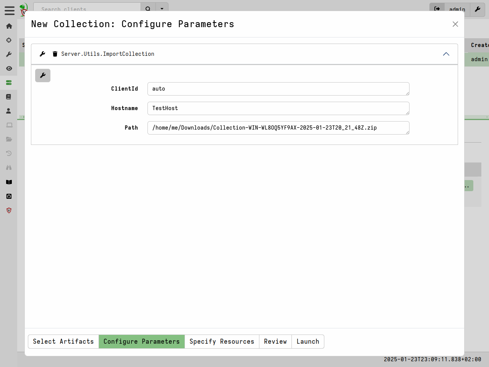

## Importing collections into the GUI

We can use the offline collector to fetch multiple artifacts from the
endpoint. The results consist of bulk data as well as JSON file
containing the result of any artifacts collected.

Here is an example of the internal structure of a typical collection archive:

```text
.
├── client_info.json
├── collection_context.json
├── log.json
├── requests.json
├── results
│   ├── Windows.Triage.Targets%2FAll Matches Metadata.json
│   ├── Windows.Triage.Targets%2FSearchGlobs.json
│   └── Windows.Triage.Targets%2FUploads.json
├── uploads
│   └── auto
│       └── C%3A
│           └── Users
│               ├── Default
│               └── User
├── uploads.json
└── uploads.json.index
```


You can re-import these collection into the GUI so you can use the
same notebook port processing techniques on the data. It also allows
you to keep the results from several offline collections within the
same host record in the Velociraptor GUI.


Importing an offline collection can be done via the
`Server.Utils.ImportCollection` artifact. This artifact will inspect
the zip file from a path specified on the server and import it as a
new collection (with new collection id) into either a specified client
or a new randomly generated client.



{}

Offline collections are typically very large, this is why we do not
have a GUI facility to upload the collection zip file into the
server. You will need to use an appropriate transfer mechanism (such
as SFTP or SCP) to upload to the server itself.

{}


### Importing into Velociraptor

* Velociraptor can automatically decrypted offline containers when
  importing.
* Use the Server.Utils.ImportCollection artifact to import collections
* The server uses its private key to unlock the container automatically.
* This preserves PII and confidential information in transit!

* You can import an offline collection into the GUI using the
  `import_collection()` [VQL function](https://docs.velociraptor.app/vql_reference/server/import_collection/).
* Requires the collection ZIP to already be present on the server.
* Decrypts X509 encrypted collections automatically.

### Accessing collection archives without importing


If you want to give other people the ability to decrypt the collection
you can share that `server.config.yaml` file with them and allow them
to unpack using:

```sh
velociraptor --config server.config.yaml unzip collection.zip --dump_dir /output/dir
```


#### fuse container command

#### Dead disk analysis of a collection archive

May be from an offline collector or exported from the server.

https://docs.velociraptor.app/artifact_references/pages/windows.collectors.remapping/

it allows you to run a real client against the offline collection and
interactively collect other artifacts without needing to import it first

