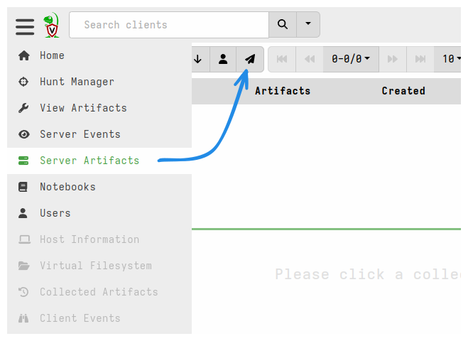
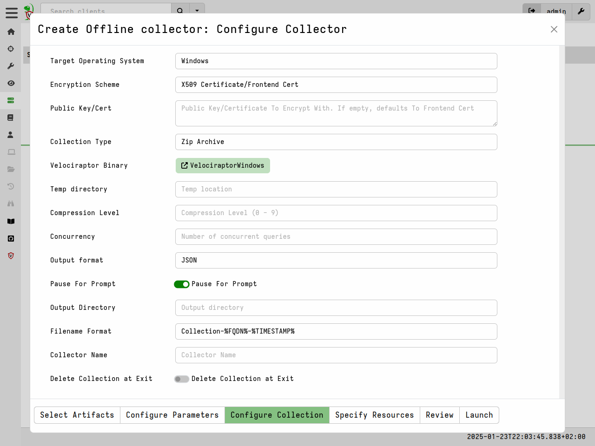

## Creating an offline collector

Velociraptor allow us to build such a collector with the GUI using an
intuitive process.

Select the offline collector builder from the `Server Artifacts`
page. The artifacts selection page and the parameters page are exactly
the same as previously shown.

Next select the collector configuration page.

Here we get to choose what kind of collector we would like:

* Target Operating System: This specifies the specific version of the
  Velociraptor binary that will be packed.

* Encryption: It is possible to specify a scheme to encrypt the zip
  file that will be created. Read more about this below.

* Collection Type: This controls where the collection is stored.

    * Zip Archive: The collection will be stored in a zip file in the
      same directory the collector is launched from.

    * Google Cloud Bucket: The zip file will be uploaded to a cloud
      bucket. When selecting this you can provide GCP credentials to control
      the upload bucket.

    * AWS Bucket: The zip file will be uploaded to a cloud
      bucket. When selecting this you can provide AWS credentials and
      details to control the upload bucket.

    * SFTP: This allows the collector to upload the file to an SFTP
      server using a private key.

The **Offline Collector Builder** is simply a GUI wrapper around the
`Server.Utils.CreateCollector` server artifact. Once it is collected,
the artifact will automatically upload the pre-configured collector it
created into the collection and the file will be available for
download from the "Uploads" tab. Simply click on the link to get the
collector.

Once the collector is run without command line arguments, the
collection will automatically start. No need for the user to enter
command line parameters, although they do need to be running in an
elevated administrator shell.

The collector creates a zip file containing the collected files as
well as an optional report.

### Encrypting the offline collection

The offline collector can capture a lot of privacy and security
sensitive information. Typically we want to produce an encrypted Zip
file so that it can not be extracted by anyone other than authorized
users.

The offline collector supports a number of encryption schemes, but
they all produce an encrypted zip file. While the ZIP encryption
format uses `AES` to encrypt the contents of files with a password, file
names and metadata are not encrypted. This can lead to a lot of
information leakage by simply listing the archive (which does not
require a password).

Velociraptor solves this problem by compressing the files inside
another ZIP file named `data.zip` and then encrypting the content of
that file. Therefore when listing an encrypted file we see only a
metadata file and `data.zip`

Velociraptor supports a number of ways to derive the password with
which to protect the collection:

1. The `Password` method specifies a password in the embedded
   configuration file. This password is passed directly to the ZIP
   library to encrypt the file.

   While simple to use this scheme is not recommended as the password
   is stored in clear text inside the offline collector and can be
   easily extracted (by running `Collector.exe config show`)

2. The `X509` method is the recommended method to use in all
   cases. This scheme embeds the Velociraptor server's public
   certificate in the offline collector. During collection, a random
   password is generated which is then encrypted using the embedded
   Velociraptor certificate and stored in the container inside a
   metadata file.

   After the password is used to encrypt the container, it is
   discarded. The only way to recover the password is to decrypt it
   using the server's private key. This way if the collector binary or
   the collection are compromised - it is impossible to recover the
   password without the server's configuration file (that contains the
   private key).

   If the `X509` method is used, the collected ZIP files will be
   decrypted automatically and transparently when they are imported
   into the same server that produced the offline collector.

## Including third party binaries (tools)

* Sometimes we want to collect the output from other third party
  executables.
* Velociraptor can package dependent binaries together with the
  offline collector.
* Velociraptor can append a zip file to the end of the binary and
  adjust PE headers to ensure that it can be properly signed.

### Include third party binaries

Sometimes we want to collect the output from other third party
executables. It would be nice to be able to package them together with
Velociraptor and include their output in the collection file.

Velociraptor fully supports incorporating external tools. When
creating the offline collection, Velociraptor will automatically pack
any third party binaries it needs to collect the artifacts specified.

### Overriding the default binaries

The Velociraptor binaries that will be used for creating offline collectors are
defined as [tools]() in the
`Server.Internal.ToolDependencies` artifact, and the selected
pltform/architecture will be downloaded from GitHub if it is not already present
in your server's tools inventory. `Server.Internal.ToolDependencies` is a
built-in artifact which is updated with each Velociraptor release. This ensures that
when you create a new offline collector it will be created using the
corresponding release version for the selected platform.

You can override a specific binary by manually uploading a different binary in
the tool management screen. We call this an "admin override". This is rarely
done but might be necessary in some circumstances, for example:
- you need to create a collector for an unusual architecture that isn't provided
  by default - perhaps one that you've compiled yourself,
- you need to create a collector using an older binary version,
- you need to create a collector using an bugfixed pre-release version.

Although in all the abovementioned cases you could alternatively create a
Generic Collector and use it with any Velociraptor binary.

If you have performed an admin override can revert to the version defined in the
tool definition by clicking the **Re-Download File** button on the tool's
management screen.

### Building an offline collector on the command line

The easiest way of building an offline collector is using the GUI as described
above. However, for cases where automation is required, it is also possible to
build an offline collector using the command line only.

This process uses the CLI `collect` command and is described in the
[documentation for that command]().

As the output shows, Velociraptor will automatically download any
required binaries for inclusion in the collector. External binaries
will be cached in the datastore so the next time the command is run it
will just use those efficiently.

