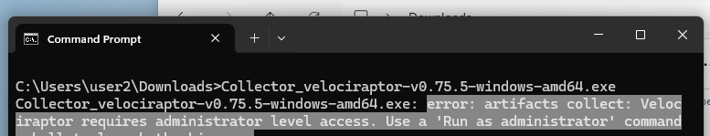
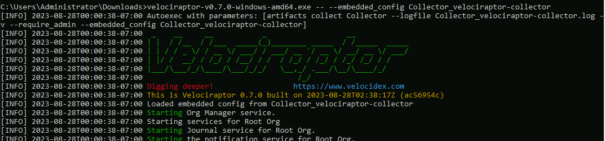

Offline collectors can be deployed by automated means, for example via Windows
Group Policy - similar to the
[agentless deployment]()
method - or by other deployment tools (such as PsExec or WinRM), or even other
EDR solutions. It's also quite common to have local personnel run the collector
manually on the endpoints, especially during incidents where network access is
restricted.

When the collector is run without command line arguments, the collection will
automatically start. If any [command line arguments]()
are provided then it behaves as any ordinary Velociraptor binary would, with the
collector behaviour being bypassed.

Collectors built using the GUI-based collector builder will require admin-level
privileges on all platforms (this check gets added by the inclusion of the
`--require_admin` flag in the collector config), so they are usually launched
from an elevated command shell.

On Windows they can also be launched by right-clicking and choosing "Run as
administrator", although the collector is a console application so it will still
run in the default terminal. In certain circumstances it is possible to use the
`runas` command on Windows, or `sudo` in very recent versions of Windows, to
launch the collector from an unprivileged command shell.

On macOS and Linux you can launch the collector in an elevated terminal, but
it's more often done in a non-elevated terminal using the `sudo` command. On
macOS or Linux you should also remember to mark the collector file as executable
using the `chmod` command.

If you use another management solution to deploy your offline collectors then it
also needs to ensure that they are launched with admin-level privileges.

The collector creates a zip (collection container) file containing the
collection results, and optionally also files that you may have requested to be
copied from the filesystem. It also creates a log file alongside the collection
container, using the same file basename, which contains a copy of the collector
activity as displayed in the terminal.


## Collector behaviour when admin is required

As mentioned above, this requirement is the default for offline collectors. When
the collector is launched on the endpoint, it first checks if the user running
it has admin-level privileges.

- **Insufficient privilege scenarios**

  If the user doesn't have admin privilege and tries to launch a collector that
  requires it, the following outcomes should be expected:

  - **Windows**

    - When opened using Explorer via mouse actions it will briefly opens in a
      terminal and then close. This is likely to occur too quickly for the user
      to be able to read the error message.

    - When run in a terminal (Command Prompt or PowerShell), it will display an
      error message telling the user to "Run as administrator".

      


  - **Linux and macOS**

    - Most Linux file managers will prevent execution via mouse clicks, but if
      it does allow it then a terminal windows is likely to open and close too
      quickly for the user to be able read the error message.

      If the user runs it in a terminal (e.g. bash or zsh), they will be able to
      see the error message advising them to run it with `sudo`.

      

- **Sufficient privilege scenarios**

  If the user does have admin privilege and launches a collector that requires
  it, then :

  - **Windows**

    - The collector is a console application, so in the Windows desktop
      environments it will open in a new terminal window if run by
      right-clicking. Even if the **Pause For Prompt** option _was not selected_
      in the collector builder, the collector will detect that it was launched
      outside of a terminal and will therefore present a prompt upon completion
      of the collection. This is intended to give the local person a chance to
      confirm that the collection did actually complete.

    - If launched in an elevated terminal, then it will run within the same
      terminal. In that case the terminal will remain open when the collection
      completes, although the application itself will exit. If run this way then
      the **Pause For Prompt** option isn't really necessary since the collector
      completion status will still be visible.

  - **Linux and macOS**

    If launched in an elevated terminal or run with the `sudo` command, then the
    application will run within the same terminal. In that case the terminal
    will remain open when the collection completes, although the application
    itself will exit. If run this way then the **Pause For Prompt** option isn't
    really necessary since the collector completion status will still be
    visible.

  When the collector runs it will look something like this:

  

  

## Running the Generic Collector

The Generic Collector is run by specifying the `--embedded_config` flag.
Normally the Velociraptor binary always expects
[a command](),
but in this case we want to use the flag on the command line without specifying
any command.

To make Velociraptor accept the `--embedded_config` flag without a command, we
use the
["post args" pseudo-flag]():
`--`. This tells Velociraptor to act as if no arguments were specified and to
pass the subsequent flag(s) to the autoexec function, which is contained in the
generic collector file.

The Generic collector uses any unmodified standard Velociraptor binary, so in
the following example the same `Collector_velociraptor-collector` could be used
on all platforms. However, the artifacts that you selected to pack in the
generic collector may be targeted to a specific platform, and therefore might
not be equally applicable to all. You could build a generic collector that
includes artifacts for all your target platforms with the artifacts themselves
being conditionally run based on
[preconditions]().

#### Example


{}
```shell
./velociraptor-darwin-amd64 -- --embedded_config Collector_velociraptor-collector
```
{}
{}
```shell
./velociraptor-linux-amd64 -- --embedded_config Collector_velociraptor-collector
```
{}
{}
```shell
velociraptor-windows-amd64.exe -- --embedded_config Collector_velociraptor-collector
```
{}





Because the generic collector is a data file (not an executable), on Linux or
macOS it does not need to be marked as executable. However the associated
Velociraptor binary _does_ need to be executable, as would be required if using
it any other way.

## Providing console feedback to the local user

If you decide to have local personnel manually run the offline collector then
the feedback that they receive via the default console output might be
sufficient for them to observe the progress or note errors. By default offline
collectors have console output set to verbose via the `-v` command line flag.
This shows all log messages emitted by the artifacts being collected, which is
usually sufficient.

However if you are designing custom artifacts for use with your offline
collectors then you should keep in mind what you want your users to see (or not
see).

Your artifacts can emit meaningful human-friendly messages to the console using
the [log]() function. Also keep in mind
that the `log()` function deduplicates message by default, limiting the messages
to 1 per minute per log function message template. In some cases you may want to
disable this duplication for a specific log function instance.

In the other hand if you want the local personnel to see _less_ output - for
whatever reason - then you can
[rebuild the collector on the command line]()
using the spec file that the GUI generated and set the `OptVerbose` option to
`false`. The GUI-based collector builder currently does not offer this option
and it enables verbose output by default.

## Running from a network share or remote management solution

In the case of a single-file embedded collector, it's easy to run it remotely.
For the generic collector it's potentially somewhat more complicated because two
files are required (the Velociraptor executable plus the generic collector
file) but usually it's still possible.

As mentioned in the introduction above, we can use another EDR solution that
allows remote execution if available. Alternatively, we can use Window's own
remote management mechanisms (such as Group Policy, PsExec or WinRM) to deploy
our collector binary across the network.

#### Example: using wmic

1. We authenticate to a network share with `net use`.
2. We copy our collector binary over the network to the `C$` share on the
remote system.
3. We use `wmic` to execute the binary on the remote host.


