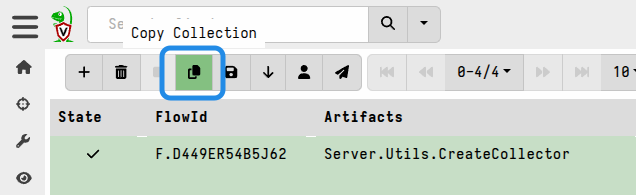

Because offline collector binaries are usually stored separately from the
server, they often get overlooked when the time comes to do server and client
upgrades. This can lead to the collector binaries inadvertently becoming
seriously out of date, and which might produce offline collections that are
inconsistent with the equivalent collections produced by online clients. In the
worst case scenario it can result in offline collections that are incompatible
with the server's
[import_collection]()
function.

We recommend that you keep your offline collectors in-sync with your server
version so that you benefit from all the latest features, improvements and
bugfixes. You can do this by rebuilding your collectors after each server
upgrade.

The artifacts to be collected are embedded in the offline collector binary, so
these can become out-of-sync with the corresponding artifacts on your server,
especially after upgrades. When you upgrade your server some built-in artifacts
may be replaced with updated/improved versions. You might also be using custom
artifacts in your offline collectors which will need to be updated if the
corresponding custom artifacts are updated on the server. In both cases you'll
need to rebuild your offline collectors to keep the embedded artifacts in sync
with those on the server.

Rebuilding offline collectors can be done either in the GUI or using the CLI.
The latter option is usually preferred by users who have automated build
pipelines for client installer packages and offline collectors. For new users we
recommend the GUI option.

#### Using the GUI

The easiest way to rebuild an offline collector is by re-running the same
`Server.Utils.CreateCollector` collection that created the previous one.

The GUI provides a "Copy Collection" button which will re-launch the collection
wizard with the same settings that were previously used. This also gives you an
opportunity to tweak settings or add/remove artifacts from the collector config.

The server will detect if there's a newer binary available (corresponding to the
server's version), download it from GitHub, and build the offline collector
using the updated binary.

#### Using the Command Line

From version 0.75.5 the `Server.Utils.CreateCollector` artifact will create a
corresponding spec file and store it in the collection's Uploads section, in
addition to the repacked collector binary. This spec file can be used with the
[collector CLI command]() to rebuild the same
collector.

This allows you to create an initial collector using the GUI and then rebuild
the same collector configuration using the CLI. You can use this approach when
planning to build standardized collectors in a separate environment. This also
allows you to easily rebuild your collectors to the same spec whenever newer
Velociraptor versions are released.

As with the GUI workflow, the CLI `collector` command will detect if there's a
newer binary available (corresponding to the binary version used to run the
command), download it from GitHub, and build the offline collector using the
updated binary.
