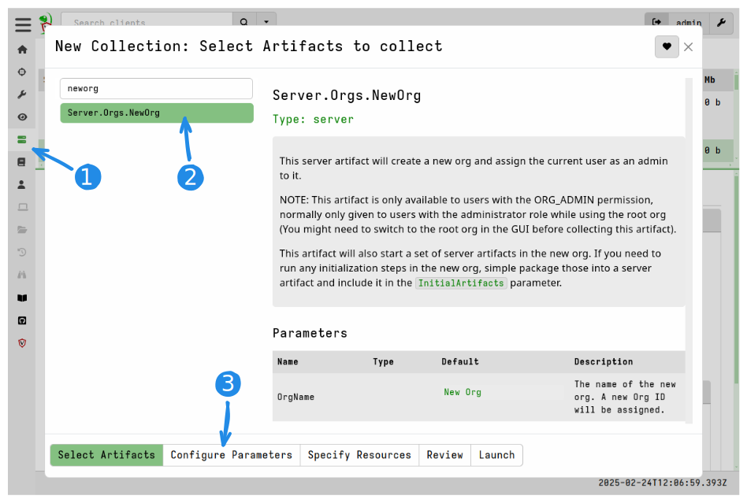

Velociraptor supports multiple orgs in a full multi-tenancy
configuration. Orgs are lightweight and can be added and removed
easily with minimal impact on resource requirements.

This is useful in a number of scenarios:

1. You are a service provider with many customers of varying size
   networks. Multi-Tenancy configuration allows you to onboard a
   smaller customer (with e.g. less than 1000 endpoints) onto the same
   infrastructure without needing to deploy additional resources.

2. You have multiple organizational units within your own company with
   different access control requirements. For example, some units
   require much more controlled access and different set of
   Velociraptor users.

In Velociraptor, multi-tenancy is implemented by dividing the clients into
separate **Organizations** or **Orgs**.

Each org is logically completely separate from other orgs:

* Each org contains a different set of clients. A Client is configured
  to access an org by way of a shared secret in its configuration file
  ([`Client.nonce`]({})).
  It is not possible for a client to connect to a different org
  without knowing this shared secret.
* Storage for each Org is separated within the data-store directory in
  an org specific sub-directory. This means you can backup, restore or
  delete orgs very easily since the data is separate.
* Users have access control lists (ACLs) within the respective
  Org. This means that the same user can have different roles and
  permissions in different orgs. Orgs can have their own administrator
  user who can perform administrative actions on the org without
  affecting other orgs.
* Custom artifacts can be maintained in different Orgs. Users within
  an org can independently create and update custom artifacts without
  affecting other orgs.
* VQL running in notebooks or server artifacts will automatically and
  transparently use the correct org without affecting or being able to
  access other orgs.
* Orgs can be created and destroyed easily at runtime (via VQL).

### The Root org

While Velociraptor allows creating multiple orgs it is not mandatory!
By default when Velociraptor is first installed, the `root` org is
created and all clients connect to it.

If you choose not to create additional Organizations then you can just
continue using the `root` org as normal for all your clients.

Additional orgs are created as Child orgs of the root org. In a
multi-tenancy deployment the root org has additional privileges that
other orgs do not have:

1. A user with the `Org Administrator` permission within the `Root`
   Org is allowed to manage orgs (e.g. create new Orgs or delete
   Orgs). The `Org Administrator` permission is meaningless within a
   non-root org.

2. Custom artifacts from the root org are automatically visible in all
   child orgs. This supports the use case of multi-tenancy as the root
   org can manage a custom set of artifacts for their tenants.

###  Switching to different orgs

You can switch to any other orgs your user account has access to using the
user preferences tile in the GUI.

Normally in order to see an org in the drop down selector, your
Velociraptor user account needs at least `Reader` level access to that
org.

If your user has the role `Org Administrator` on the `root` org, then you can
see all orgs in listings for the purpose of administering them (for example
adding users), but in order to switch to an org your user _also_ has to have at
least the `Reader` role in that org..

### Creating a new Org

{}

Since the `Org Administrator` permission is only meaningful for the
root org you should ensure that you are in the root org in the GUI before
creating or deleting orgs. Attempting to create or delete orgs from a non-root
org will always fail.

{}

You can use the `Server.Orgs.NewOrg` server artifact to create a new org

As a convenience this artifact also allows you to select other server artifacts
that will be run in the new org after it is created. Typically you would want to
create a MSI installer for Windows clients, so this is selected by default.
However you may also create the MSI at a later time (for example after a version
upgrade) using the procedure [described below]()

As you can see, the `Server.Orgs.NewOrg` artifact is just running VQL to create
the new org. You could alternatively run the same VQL in a global notebook or in
a "bootstrap" artifact when setting up new servers.

#### Assigning users to the new org

Once the new org is created you can assign users to the Org using the
[Adding a New User]({}) procedure.

### Preparing client deployment for the new Org

Clients are configured to connect to one org only. While the
cryptographic keys (e.g. The internal CA Certificate) of clients from
all Orgs are the same, the [`Client.nonce`]({}) is different for each
Org. The server uses this nonce to associate the client with the correct
Org. The nonce is included in the client's configuration file and acts
as a shared secret between all the Org clients and the server.

#### Creating client installer packages

To create an installation package that connects to the new Org, you
need to [build an MSI]({})
within the target Org:

1. First switch to the relevant Org with the GUI selector
2. Launch the server artifact `Server.Utils.CreateMSI` within the context of the target Org.

The produced MSI will connect to the target Org.

For non-Windows platforms you will currently need to build the
installation packages manually with the Org specific client config
file, as explained in
[Deploying Clients]().
You can download the correct org-specific configuration file
from the main dashboard as show below.

### Auditing User Actions

As described in the [Auditing User actions]({}) section,
Velociraptor collects auditable events into a central location for
review by the administrators.

When running within an Org context, each Org collects its own audit
log (although you can still forward all logs to a remote syslog
server). This allows an administrator within the Org to only view
relevant auditable events to that Org. It is also possible to install
server monitoring artifacts to automate actions based on auditable
events within the org.
