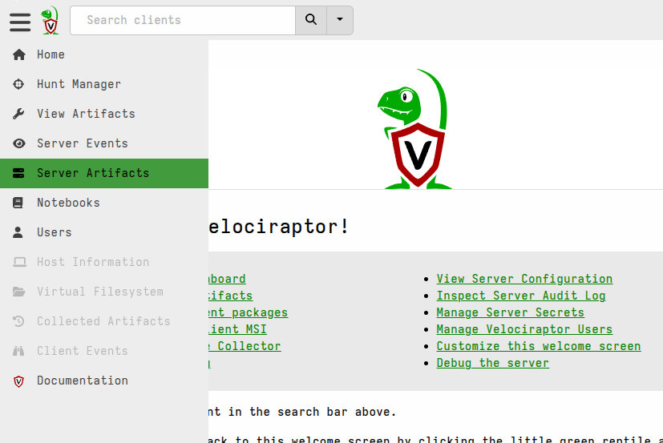

The goal of this guide is to help you get a Velociraptor server deployed with
one or more clients, as quickly and simply as possible.

The Velociraptor server will be configured to use self-signed SSL certificates
and Basic authentication, which is a relatively simple configuration scheme
suitable for short-term (e.g. testing/evaluation) non-production use, ideally on a
private network.

For production deployments, Single Sign-on (SSO) authentication
is strongly recommended. However it requires a slightly more complicated
certificate scheme and public DNS configuration. To explore these other options
please see the [Deployment]() section.


{}

Please note that in this simple configuration the Velociraptor server should
not be exposed to the public internet, particularly because Basic
authentication mode is vulnerable to brute-force attacks.
[SSO authentication]()
is recommended for production deployments, but SSO is rarely configured with
self-signed certificates (since it goes against the idea of a trusted
authentication flow), and we intend to use self-signed certificates in this
guide for expediency.

If you have chosen to install the server component on a cloud VM then you should
leave the GUI port bound to the loopback address and use SSH tunneling to
connect to the local loopback address.

Self-signed SSL with Basic authentication is most often used when Velociraptor
is deployed on private networks for temporary situations such as incident
response. For long-term deployments, the other modes of operation that
Velociraptor offers should be preferred.

{}

{}

If you're really in a hurry you can start a self-contained
[Instant Velociraptor]()
on your local machine which will allow you to experiment and get a feel for how
Velociraptor works, without having to deal with any of the network complexities.
One command is all that's needed to get started!

{}

## What you'll need before you start

- A computer running Linux (any modern Debian or RPM-based distro should be
  fine) on which you can install the **Velociraptor server** component.

  - Ubuntu is commonly used and we use it for testing, so it is generally
    recommended unless you have a strong preference for something else. If you
    choose to use another Linux distro then please note that it needs to be one
    that uses systemd, although most do these days.

  - The sizing of your server depends on the number of endpoints in your
    environment. A small server with 8GB memory should be sufficient for
    at least 1000 clients, so for a limited deployment that should be more than
    sufficient. You will also need enough disk space to hold the data that you
    collect from your endpoints, and that of course depends entirely on what you
    intend to collect, how frequently you collect it, how many endpoints, etc.

- One or more computers running Windows on which you can install the
  **Velociraptor client** component.

  - This can actually be any supported client operating system, but in this
    guide we describe the process for a Windows client since it is still by far
    the most common target operating system. See
    [Deploying Clients]()
    for instructions for deploying clients on other platforms.

  - The Windows version should be at least Windows 10. Older versions may
    require a special build of the Velociraptor binary, as noted
    [here](),
    since earlier versions are not supported by the latest version of Go, nor
    by Microsoft.

  - If you're just testing, you can install the client on the same machine as
    the server if you really want to. It's not commonly done but the server and
    client will not conflict with each other if run on the same machine.

## Simplifying assumptions

To keep things simple in this deployment scenario we are going to assume that:

1. The server and client(s) are on the same local network, with no proxies,
   firewalls or NAT devices between them.

2. No DNS records have been configured for the server. While it is usually
   preferable for the clients to be able to resolve and connect to the server by
   DNS name, in Self-Signed SSL mode this is not a requirement. Here we will use
   IP addresses in our configuration, but that means you need to ensure that
   your server's IP address will not change for the duration of your deployment.
   Alternatively you should set up an DNS A record for your server and use that
   name instead of an IP address in the steps below.

   <!-- In this article we will use
   `<your_server_ip>` as shorthand for the IP address of the server, but you
   should substitute your server's actual IP in the commands or config settings
   shown, or instead use the server's DNS name if you have added it to your DNS. -->

3. The server will be able to connect to websites on the internet, specifically
   GitHub, in order to download additional files. While this is not an absolute
   requirement, it is necessary to complete the steps in this guide.

4. The Velociraptor Clients will be able to connect to the server on the default
   TCP port `8000`.

5. Your workstation will be able to connect using a web browser to the
   Velociraptor Admin GUI running on the server on the default TCP port `8889`.


If you have a more complex environment that cannot satisfy the above
requirements then you should refer to the
[Deployment]() section where more advanced
deployment scenarios and associated options are discussed.

## Deployment Roadmap

Before we dive in, here's a brief overview of the procedure which we will follow.

In the first 3 steps we will _prepare_ to install the Velociraptor server
component:

* [Step 1: Download the Velociraptor binaries](#step-1-download-the-velociraptor-binaries)
* [Step 2: Create the server configuration file](#step-2-create-the-server-configuration-file)
* [Step 3: Create the server installation package](#step-3-create-the-server-installation-package)

Then we install the server component, log in to the user interface, and create a
client installer package for Windows:

* [Step 4: Install the server component](#step-4-install-the-server-component)
* [Step 5: Log in to the Admin GUI](#step-5-log-in-to-the-admin-gui)
* [Step 6: Create an installation package for Windows clients](#step-6-create-an-installation-package-for-windows-clients)

Lastly, we will install the client and confirm that it is communicating with the
server:

* [Step 7: Install the client on endpoints](#step-7-install-the-client-on-endpoints)

The first 3 steps can actually be performed on any platform since we are only
preparing for the installation and not actually installing anything yet, however
doing so on the server is the quickest way and simultaneously verifies that
internet access from the server is OK.


## Step 1: Download the Velociraptor binaries

Before we start configuring or running anything you'll need to download the
latest binary. Binaries for the latest version are listed on our
[Downloads]() page, with the binaries themselves being
hosted on Github.

At this point you only need to download one binary (the one that matches your
server's platform and architecture) because after installation we will use the
server to download the Windows binary that we will use for the client.

{}

<!-- **Velociraptor only has one binary per operating system + architecture combination.** -->

Velociraptor does not have separate client binaries and server binaries. The
binary can function in either role, and perform various other utility functions.
The command line parameters supplied to the binary tell it whether to behave as
a server or as a client.

This means that it's technically possible to run the server or the client on any
platform that we have a binary for. However
_please note that the server is only fully supported on Linux_,
mainly due to performance considerations inherent in other platforms such as
Windows. For non-production deployments (e.g. development or testing) it might
be convenient for you to run the server on another platform and that's fine if
you feel adventurous and confident in your troubleshooting skills. Just keep in
mind that for production deployments we strongly recommend that the server
should run on Linux and that issues encountered when running the server on other
platforms will not be supported. For this reason we only describe deploying the
server on Linux in this guide.

{}

For these pre-installation steps you may want to create a new working directory:

```sh
mkdir ~/velociraptor_setup && cd ~/velociraptor_setup
```

This directory and the files inside it will not be needed _after_ the server is
installed, but you might want to keep a copy of these files as an off-server
backup for disaster recovery purposes.

Copy the download link for the latest version, appropriate to the
platform and architecture of your server, and then use it in the `wget` command
shown below. This will download the binary and save it with the name
`velociraptor`:

```sh
wget -O velociraptor https://github.com/Velocidex/velociraptor/releases/download/v0.74/velociraptor-v0.74.1-linux-amd64
```

Then make the downloaded file executable so that you can run it in subsequent
steps:

```sh
chmod +x velociraptor
```

If you run the binary without any command line parameters, or with `-h`, or with
`--help-long`, it will display help for all the command line options.

```sh
./velociraptor --help-long | more
```

You can also see the help for a specific command by adding `-h` after the
command.

In the next step we are going to use the `config generate` command.

## Step 2: Create the server configuration file

Central to every Velociraptor deployment is a
[YAML](https://www.tutorialspoint.com/yaml/yaml_basics.htm)
[configuration file]().
This file contains all the configuration parameters that define how your server
and clients operate, plus cryptographic material that is used to secure
several aspects of the deployment, such a client-server communications.

To generate a new configuration file we use the `config generate` command. The
`-i` flag tells it to run in interactive mode, which means it will launch a
question/answer dialogue-style "wizard" that will gather the most important
details needed to produce your config.


{}
```shell
./velociraptor config generate -i
```
{}
{}
```shell
velociraptor.exe config generate -i
```
{}
{}
```shell
./velociraptor config generate -i
```
{}



In the configuration wizard you should choose the options described below. For
all other questions you should accept the default values.

- **Deployment Type**: `Self Signed SSL`
- **What is the public DNS name of the Master Frontend?**: Here you should
  enter the IP server address (or DNS name if you created one) that clients will
  use to connect to the server.

On the 4th screen of the config wizard you will be asked to add Admin users.

```text
 Adding Admin User Number 0
 Enter an empty username or Ctrl-C to stop

┃ Username
┃ > admin

┃ Password
┃ > <your_password>
```

This user account will be used for initial access to the admin user interface.

You don't need to add more than one admin user as additional users (admin or
non-admin) can be added after installation. It is common to only have 1 admin
user and many non-admin users, with the latter being used for day-to-day DFIR
work. So after adding one user you can enter a blank username and password which
will allow you to continue.

The final step of the config wizard will offer to write the config file to your
working directory.

- **Name of file to write**: `server.config.yaml`

You can accept the default file name and the wizard will then exit.

As you saw, the configuration wizard guides you through the key decisions and
provides sensible defaults for most options. Ultimately it produces a YAML
configuration file that contains settings that both the Velociraptor server and
clients will use. The configuration wizard is the recommended way to generate a
new configuration, although it is common to manually tweak some settings in this
configuration file, as we will do next.

By default the configuration binds the GUI and Frontend services to only the
loopback interface, `127.0.0.1`. We will need to change this in the
configuration file to make these service accessible to other network hosts.

Open the configuration file in a text editor and change:

```yaml
Frontend:
  bind_address: 127.0.0.1
```

to:

```yaml
Frontend:
  bind_address: 0.0.0.0
```

If you need to access the GUI from a different network host then also change:

```yaml
GUI:
  bind_address: 127.0.0.1
```

to:

```yaml
GUI:
  bind_address: 0.0.0.0
```

In Self-signed SSL mode, which only supports Basic authentication, you should
avoid exposing the GUI to untrusted networks (i.e. the public internet). If your
server needs to be accessible from the internet then you should leave the
`GUI.bind_address` set to the loopback interface and use
[SSH Local Port Forwarding](https://iximiuz.com/en/posts/ssh-tunnels/)
which can be secured by stronger authentication mechanisms.

Because the configuration file is a key component to your deployment and
contains security-sensitive material you should always keep it secure and
ideally also keep an backup of it in a secure location. The server configuration
does not change unless you edit it, so remember to update your backup copy
whenever you make any changes.

The server installation package that we will create in the next step also
contains a copy of the server config, so you should handle it with the same
security considerations as the config file itself.

## Step 3: Create the server installation package

The server component will be installed and run as a service on your Linux
machine. In addition to installing the Velociraptor binary and configuration file, the
installation also creates a service account (named `velociraptor`) and
service configuration so that it can run as a service. The installation package
takes care of these setup tasks, and we generate it using a single command.

As mentioned previously, the Velociraptor binary provides several utility
functions on the command line. One of these is the ability to generate Linux
installation packages, specifically `deb` packages for Debian-based systems and
`rpm` packages for RPM-based systems.

To create the server installation package, run the appropriate command below in
your working directory.

**Debian-based server:**

```sh
./velociraptor debian server --config ./server.config.yaml
```

or

**RPM-based server:**

```sh
./velociraptor rpm server --config ./server.config.yaml
```

The output file will be automatically named to include the version and
architecture, but you can choose any file name you want and specify it with the
`--output <your_file_name>` flag.

If you did not perform the previous steps on your server then you will need to
copy the server installation file to your server.

## Step 4: Install the server component

Install the server package using the command below according to your server's
packaging system.

**Debian-based server installation:**

```
$ sudo dpkg -i velociraptor_server_0.74.1_amd64.deb
Selecting previously unselected package velociraptor-server.
(Reading database ... 527396 files and directories currently installed.)
Preparing to unpack velociraptor_server_0.74.1_amd64.deb ...
Unpacking velociraptor-server (0.74.1) ...
Setting up velociraptor-server (0.74.1) ...
Created symlink /etc/systemd/system/multi-user.target.wants/velociraptor_server.service → /etc/systemd/system/velociraptor_server.service.
```

or

**RPM-based server installation:**

```
$ sudo rpm -Uvh velociraptor-server-0.74.1.x86_64.rpm
Verifying...                          ################################# [100%]
Preparing...                          ################################# [100%]
Updating / installing...
   1:velociraptor-server-0:0.74.1-A   ################################# [100%]
Created symlink '/etc/systemd/system/multi-user.target.wants/velociraptor_server.service' → '/etc/systemd/system/velociraptor_server.service'.
```

Now that the service is installed we can check its status in a few ways.

**Check the service status:**

```
$ systemctl status velociraptor_server.service
● velociraptor_server.service - Velociraptor server
     Loaded: loaded (/etc/systemd/system/velociraptor_server.service; enabled; vendor preset: enabled)
     Active: active (running) since Tue 2025-04-08 12:25:34 SAST; 3min 5s ago
   Main PID: 3514 (velociraptor.bi)
      Tasks: 19 (limit: 4537)
     Memory: 67.2M
        CPU: 4.249s
     CGroup: /system.slice/velociraptor_server.service
             ├─3514 /usr/local/bin/velociraptor.bin --config /etc/velociraptor/server.config.yaml frontend
             └─3522 /usr/local/bin/velociraptor.bin --config /etc/velociraptor/server.config.yaml frontend

Apr 08 12:25:34 linux64-client systemd[1]: Started Velociraptor server.
```

**Check that the GUI is listening:**

```sh
$ nc -vz 127.0.0.1 8889
Connection to 127.0.0.1 8889 port [tcp/*] succeeded!
```

**Check that the Frontend is listening:**

```sh
$ nc -vz 127.0.0.1 8000
Connection to 127.0.0.1 8000 port [tcp/*] succeeded!
```

## Step 5: Log in to the Admin GUI

The Admin GUI should now be accessible with a web browser by connecting to
`https://127.0.0.1:8889`, or using your server's IP address if you changed the
`GUI.bind_address` setting in Step 2.

Log in using the admin account that you created in the config wizard. You will
arrive at the Welcome screen.


You can learn more about the Admin GUI [here](). Our
next goal is to create an installation package for our Windows endpoints.

## Step 6: Create an installation package for Windows clients

Velociraptor clients are available for many operating systems and architectures,
and the subject of packaging and installing clients is covered in more detail in
the section [Deploying Clients]().

The most important thing to know is that all Velociraptor clients need a client
configuration, which is specific to the deployment. This configuration is a
subset of the full YAML-based configuration. Because the server has access to
the full configuration it is able to provide the client configuration to us when
needed
[in the form of a YAML file]().
The server can also use it internally, for example when generating a client
installation package (for Windows clients), as we will show in this guide.


The most commonly deployed client by far is 64-bit Windows. The standard
installer package format for Windows in enterprise environments is still the MSI
format.

We publish a prebuilt MSI package on our GitHub Release page, however since the
Velociraptor client requires *your* unique configuration file which is linked to
*your* server, we don't package a working configuration file in the official
release MSI. The official MSI contains a placeholder configuration file. You
will need to modify the official release MSI to include your client
configuration file, and this is easily done through a process we call
"repacking". We have a streamlined process for generating a custom MSI package
which can be done entirely in the Admin GUI. This is the quickest and easiest
way to generate the MSI package, and so it's the one we will use here.

1. In the Velociraptor web GUI select **Server Artifacts** from the sidebar on
   the left side of the page.




2. Add a new collection: search for `Server.Utils.CreateMSI`, select it, and
   then click "Launch".


3. It will take a moment to download the latest release MSI files (64-bit and
   optionally 32-bit) from GitHub and then repack them with your client config
   file.

4. The repacked MSI files will then be available in the **Uploaded Files** tab
   of the artifact collection.


Download the MSI files. You will then need to copy them to a network share, USB
stick or other medium that allows you to access them from your Windows
endpoints. In this simplified scenario we will only be installing the client
manually. For full-scale deployments the MSI is typically rolled out through
enterprise application management tools.

## Step 7: Install the client on endpoints

On your Windows endpoints, installation is done by running the MSI that you
created in the previous step.

The MSI installs the client as a Windows service, so it requires elevated
privileges and you may be prompted with the familiar UAC prompt to allow the
installation to continue.

After installation you will have the client running as the "Velociraptor
Service" which you can see in the Services app.


Returning to your Velociraptor server, you can find the newly enrolled client by
clicking the <i class="fas fa-search"></i> button in the "Search clients" bar at
the top of the page.


## What's next?

After installing your first client, here are the next steps you may want to
consider:

- [Learn about managing clients]()
- [Create non-Windows client installers]()
- [Explore additional security configuration options]()
- [Consider creating Orgs]() for managing
  distinct sets of clients.
- [Plan for a more durable and secure installation]()
