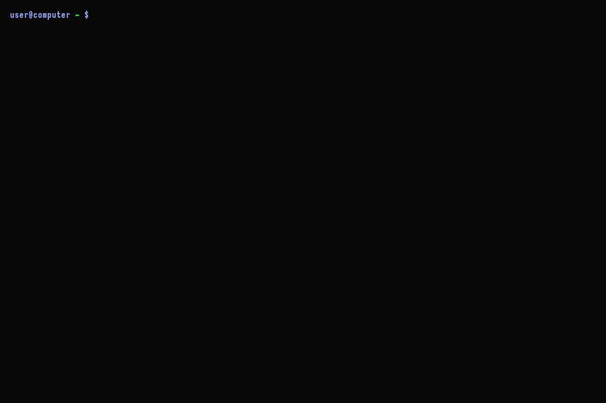

Velociraptor deployments are secured using a self-signed Certificate Authority (CA) that is generated during the initial configuration generation step. The client’s configuration contains the signed CA, which is used to verify all certificates needed during communications.

In `self-signed SSL` mode, Velociraptor issues its own server
certificate using its internal CA. This means the Admin GUI and front end
also use a self-signed server certificate.

## When to use this method
This type of deployment is most appropriate for on-premises scenarios
where internet access is not available or egress is blocked.

## Self-Signed Certificates
Self-signed SSL certificates trigger SSL warnings in all web
browsers. When accessing the Admin GUI you will receive a
certificate warning about the possibility of a MITM attack.

As a precaution, Velociraptor only exports the GUI port
on the loopback interface. You may change the `GUI.bind_address`
setting to "0.0.0.0" to receive external connections on this
port, but this is not recommended. Instead, you should use SSH
tunneling to connect to the local loopback interface.

Velociraptor doesn't support other self-signed SSL certificates, and we don't recommend attempting to create and upload your own internal self-signed certificate to Velociraptor.

{}

By default, Velociraptor will not connect through an SSL intercepting
proxy. While not recommended, it is possible to add allow list rules
that enable Velociraptor to connect through an SSL intercepting
proxy. If you do so, you will see a certificate warning about the
possibility of a MITM attack when accessing the Admin GUI.

{}

## Generate the configuration file
You can generate a configuration file using either a configuration wizard that
guides you through the process, or through the automate the merge process that
we describe below.

### Option A: Use the configuration wizard

For a guided approach run `config generate` with the `-i` (interactive) flag
which will invoke the configuration wizard.


{}
```shell
./velociraptor config generate -i
```
{}
{}
```shell
velociraptor.exe config generate -i
```
{}
{}
```shell
./velociraptor config generate -i
```
{}




The configuration wizard includes a set of questions to guide you through the first step of the deployment process.

* **What OS will the server be deployed on?** This choice will affect the
  defaults for various options. Velociraptor is typically
  deployed on a Linux machine (but the configuration can be generated on
  Windows).
* **Path to the datastore directory:** Velociraptor uses flat files for
  all storage. This path is where Velociraptor will write the
  files. You should mount any network filesystems or storage devices
  on this path.
* **The public DNS name of the Frontend:** The clients will connect to the
  server using this DNS name so it should be publically accessible. If
  you are using self-signed SSL you may specify an IP address here,
  but this not recommended because it is less flexible. If the
  server's IP address changes it will be impossible to contact the
  clients.
* **The Frontend port to listen on:** The Frontend receives client
  connections. You should allow inbound access to this port from
  anywhere.
* **The port for the Admin GUI to listen on:** The Admin GUI receives browser
  connections. As discussed above, in self-signed mode the Admin GUI will
  only bind to the local host.
* **Initial GUI users:** The initial set of administrator accounts can be stored
  in the configuration file. When Velociraptor starts, it automatically adds
  these accounts as administrators. When using self-signed SSL mode, the only
  authentication method available is `Basic Authentication`. Velociraptor stores
  the username and hashed passwords in the datastore.
* **Extended certificate validity:** You may choose to override the default
  1-year certificate expiry if you intend to deploy a long-term server instance.

### Option B: Automate the config file generation

Running the `config generate` command without the interactive flag will generate
a basic sensible configuration using the self-signed SSL option, which you can
then manually customize to your needs. Alternatively you can use this command
with the JSON merge flag (`--merge`). This allows you to automate the generation
and customization of the configuration in a single step, which you may want to
do in automated build environments.


{}
```shell
./velociraptor config generate --merge \
      '{"autocert_domain": "domain.com", "autocert_cert_cache": "/foo/bar"}' \
      > server.config.yaml
```
{}
{}
```shell
velociraptor.exe config generate ^
      --merge "{"""autocert_domain""": """domain.com""", """autocert_cert_cache""": """/foo/bar"""}" ^
      > server.config.yaml
```
Note that while this can be run on Windows the quote escaping is arduous and
likely to be error-prone. We therefore don't recommend it.
{}
{}
```shell
./velociraptor config generate --merge \
      '{"autocert_domain": "domain.com", "autocert_cert_cache": "/foo/bar"}' \
      > server.config.yaml
```
{}



## Create the server package

You'll need to run a command that instructs Velociraptor to create a server
Debian package using the linux binary specified. The package will contain the
Velociraptor executable, the server configuration file and relevant startup
scripts.

Use the following command:


{}
```shell
./velociraptor --config server.config.yaml debian server --binary velociraptor-linux-amd64
```
{}
{}
```shell
velociraptor.exe --config server.config.yaml debian server --binary velociraptor-linux-amd64
```
{}
{}
```shell
./velociraptor --config server.config.yaml debian server --binary velociraptor-linux-amd64
```
{}



{}

The Debian package contains the server configuration file, which contains all
required key materials. Make sure this file is well protected since a compromise
of the file will leak private key material enabling a MITM attack against
Velociraptor.

{}

## Install a new server

Push the debian package to the server using Secure Copy Protocol (SCP):

```shell
scp velociraptor_server.deb user@123.45.67.89:/tmp/
```

## Install the package

Run the following command to install the server package:

```shell
sudo dpkg -i velociraptor_server.deb
```

The service adds a new Velociraptor user to run under. You can now access the
Velociraptor server using your browser.

The first time you navigate to the SSL URL the server will obtain a certificate
from Let's Encrypt. There will be a small pause as this happens.

You will be redirected to Google for authentication - Velociraptor does not
handle any credentials in this configuration. Google will determine if the user
authenticated properly and display the user’s email address and avatar.
