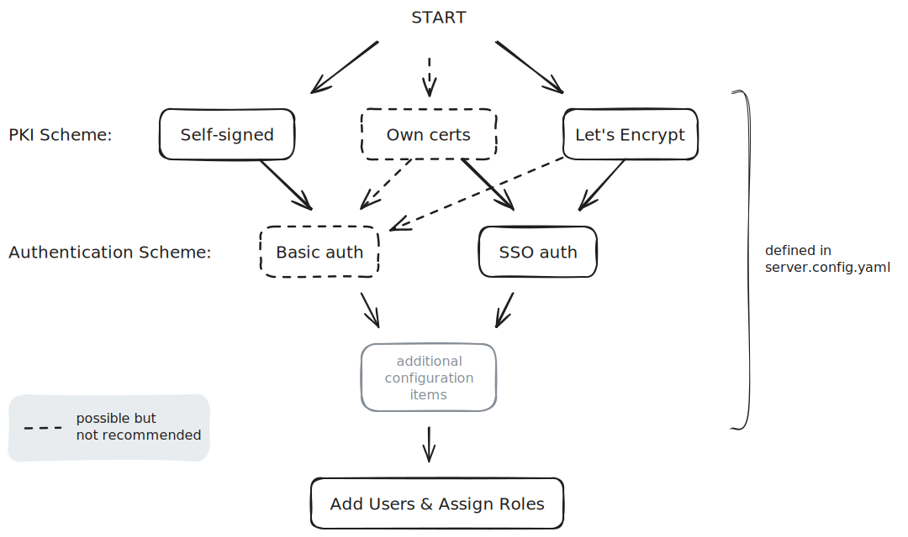
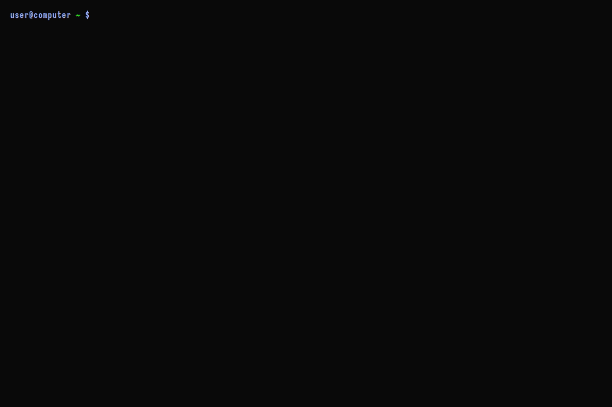

## Server sizing


## Generating the configuration file

You can generate a configuration file using either a configuration wizard that
guides you through the process, or through the automate/merge process that
we describe below.



### Option A: Use the configuration wizard

https://github.com/Velocidex/velociraptor/blob/master/tools/survey/README.md

For a guided approach run `config generate` with the `-i` (interactive) flag
which will invoke the configuration wizard.



{}
```shell
./velociraptor config generate -i
```
{}
{}
```shell
velociraptor.exe config generate -i
```
{}
{}
```shell
./velociraptor config generate -i
```
{}




The configuration wizard includes a set of questions to guide you through the first step of the deployment process.

* **What OS will the server be deployed on?** This choice will affect the
  defaults for various options. Velociraptor is typically
  deployed on a Linux machine (but the configuration can be generated on
  Windows).
* **Path to the datastore directory:** Velociraptor uses flat files for
  all storage. This path is where Velociraptor will write the
  files. You should mount any network filesystems or storage devices
  on this path.
* **The public DNS name of the Frontend:** The clients will connect to the
  server using this DNS name so it should be publically accessible. If
  you are using self-signed SSL you may specify an IP address here,
  but this not recommended because it is less flexible. If the
  server's IP address changes it will be impossible to contact the
  clients.
* **The Frontend port to listen on:** The Frontend receives client
  connections. You should allow inbound access to this port from
  anywhere.
* **The port for the Admin GUI to listen on:** The Admin GUI receives browser
  connections. As discussed above, in self-signed mode the Admin GUI will
  only bind to the local host.
* **Initial GUI users:** The initial set of administrator accounts can be stored
  in the configuration file. When Velociraptor starts, it automatically adds
  these accounts as administrators. When using self-signed SSL mode, the only
  authentication method available is `Basic Authentication`. Velociraptor stores
  the username and hashed passwords in the datastore.
* **Extended certificate validity:** You may choose to override the default
  1-year certificate expiry if you intend to deploy a long-term server instance.

### Option B: Automate the config file generation

Running the `config generate` command without the interactive flag will generate
a basic sensible configuration using the self-signed SSL option, which you can
then manually customize to your needs. Alternatively you can use this command
with the JSON merge flag (`--merge`). This allows you to automate the generation
and customization of the configuration in a single step, which you may want to
do in automated build environments.


{}
```shell
./velociraptor config generate --merge \
      '{"autocert_domain": "domain.com", "autocert_cert_cache": "/foo/bar"}' \
      > server.config.yaml
```
{}
{}
```shell
velociraptor.exe config generate ^
      --merge "{"""autocert_domain""": """domain.com""", """autocert_cert_cache""": """/foo/bar"""}" ^
      > server.config.yaml
```
Note that while this can be run on Windows the quote escaping is arduous and
likely to be error-prone. We therefore don't recommend it.
{}
{}
```shell
./velociraptor config generate --merge \
      '{"autocert_domain": "domain.com", "autocert_cert_cache": "/foo/bar"}' \
      > server.config.yaml
```
{}



## PKI Schemes

### Velociraptor's Internal CA

-

### Using Self-signed SSL


### Using Let's Encrypt SSL

### Using your own certs

/knowledge_base/tips/ssl/

## Intercepting proxies


## SSO Authentication

## Changing the GUI bind address

{}

By default Velociraptor only binds the Admin GUI port to the loopback address
(`127.0.0.1`). If you configure SSO authentication then you may change this to
receive external connections on this port, and take additional measures to
secure the GUI from attacks. However it is not possible to use SSO
authentication in self-signed mode -
_only Basic authentication is supported in this mode_ -
and you should not expose the Admin GUI to the internet with Basic auth enabled!

If you have chosen to install the server component on a cloud VM then you should
leave the GUI port bound to the loopback address and use SSH tunneling to
connect to the local loopback address.

{}


## Limiting network access to the GUI

## Create the server installation package

## Install the server package

## Accessing the GUI

## What next?

Here are the next steps you may want to consider:

- [Velociraptor Security Configuration]()
- Two
- Three
