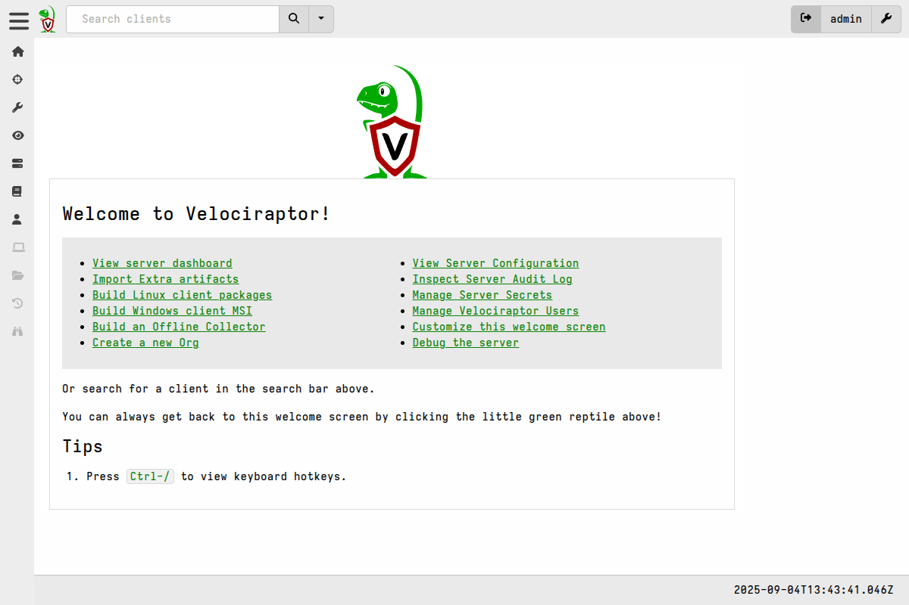

In this example we will walk through the process of deploying the server using
Let's Encrypt certificates, and optionally an SSO authentication provider.

This is a common deployment choice for long-term deployments (both cloud-hosted
and on-premises), or for scenarios where a cloud-based server is required (and
where clients will connect to the server via the internet).

Most enterprise systems require an SSO mechanism to manage user accounts and
passwords, one reason being that manual user account management simply does not
scale. The choice of authentication provider is usually determined by each
organizations existing Identity and Access Management (IAM) policies and
infrastructure.

Velociraptor supports the most popular SSO providers and protocols. These
providers can be a cloud-based IDPs or on-premises IDM solutions.


## Before You Begin

Note the following requirements:
- You must use a DNS name as Let's Encrypt will not issue a certificate for an
  IP address. The DNS name can be managed via Dynamic DNS.
- Ports 80 and 443 must be publicly accessible. Let's Encrypt uses both ports to
  issue certificates.
- You can optionally configure Authentication via one or more SSO providers.

#### Provision a Virtual Machine

Next we provision a Linux VM from any cloud provider. The size of your VM
depends on the number of endpoints in your environment. A standard VM with 8 or
16Gb RAM should be sufficient for around 5-10k clients. Additionally you will
need sufficient disk space to hold the data you collect. We recommend starting
with a modest amount of storage and then periodically back up and purge old
data, or else increase the storage volume size as needed.

Ubuntu is commonly used for production Velociraptor deployments and we use it
for testing, so it is generally recommended unless you have a strong preference
for something else. If you choose to use another Linux distro then please note
that it needs to be one that uses systemd, although most do these days.

{}

The virtual machine must be able to receive connections over *both* ports 80 and
443. Be sure to check inbound filtering Access Control Lists to ensure that
access is allowed. When using SSL, both the client communication and the Admin
GUI are served over the same port to benefit from SSL transport encryption. The
Let's Encrypt protocol requires Let's Encrypt's servers to connect to the VM on
port 80 for the purpose of certificate issuance and renewal, however
Velociraptor will only provide services on the SSL-secured port 443.

If you forgot to open port 80, Let's Encrypt will fail to issue the
certificate and repeated failures might result in them
[blocking the domain name](https://letsencrypt.org/docs/rate-limits/#authorization-failures-per-hostname-per-account)
from getting an SSL certificate for several days. If you find that this has
happened and you can't afford to wait, then you will need to change to a new
DNS name and start again.

Several Velociraptor features do require outbound access from the server to GitHub,
although [it is possible]()
for the server to operate without any internet access.

{}


#### Get a DNS name for your server

An SSL certificate says that the DNS name is owned by the server that presents
it. You will need a public DNS name ("A" record) pointing to your Velociraptor
server’s external IP. This is because:

- Let's Encrypt will only issues a certificate for a public DNS name
- DNS names are integral to SSO and therefore required.


#### Assign an IP address

You can assign your Virtual Machine a static IP address or a dynamic IP address.
If you use a dynamic IP address for your server then you must also configure
Dynamic DNS.

Velociraptor natively supports updating
[Cloudflare](https://www.cloudflare.com/learning/dns/glossary/dynamic-dns/) or
[No-IP](https://www.noip.com/) Dynamic DNS, so these are the easiest options to
use since they require no external DDNS update mechanism. For other DDNS
providers, you can install an external Dynamic DNS client such as
[ddclient](https://ddclient.net/) to update your DNS->IP mapping.

After the dynamic address is created, you need to note the credentials (as
configured with your DDNS provider) for updating the IP address, as you will
need to supply these during Velociraptor's interactive configuration process.


## Prepare the server installation package

Before installing anything we need to prepare by creating the Velociraptor
config, and then package that config into a deb or rpm installer package which
we will then install on the Velociraptor server.

These pre-installation steps can be done on any platform.

### 1. Generate the configuration file

Central to every Velociraptor deployment is a
[YAML](https://www.tutorialspoint.com/yaml/yaml_basics.htm)
[configuration file]().
This file contains all the configuration parameters that define how your server
and clients operate, plus cryptographic material that is used to secure
several aspects of the deployment, such a client-server communications.

To generate a new configuration file we use the `config generate` command. The
`-i` flag tells it to run in interactive mode, which means it will launch a
question/answer dialogue-style "wizard" that will gather the most important
details needed to produce your config.


{}
```shell
./velociraptor config generate -i
```
{}
{}
```shell
velociraptor.exe config generate -i
```
{}
{}
```shell
./velociraptor config generate -i
```
{}


{}

The aim of the wizard is to make it easy to configure Velociraptor in the most
common deployment scenarios. Even though these scenarios will not be a perfect
fit for everyone, most users should be able to start with these deployment modes
and tweak the configuration to their specific needs.

The end result of running the configuration wizard is a YAML configuration file.
So there is no harm in doing "dry runs" and examining or comparing resulting
files to better understand how the choices affect the resulting configuration.

{}

#### Deployment Type

On the first screen of the configuration wizard you will be asked to select the
Deployment Type.

```text
$ ./velociraptor config generate -i
 Welcome to the Velociraptor configuration generator

 This wizard creates a configuration file for a new deployment.

 Let's begin by configuring the server itself.

┃ Deployment Type
┃ This wizard can create the following distinct deployment types.
┃    Self Signed SSL
┃  ● Automatically provision certificates with Lets Encrypt
┃    Authenticate users with SSO
```

* If you don't intend to use SSO, or intend to configure it manually later, then
  choose **Automatically provision certificates with Lets Encrypt**. \
  _This deployment option will enable Basic authentication instead of SSO._
* If you do want to use SSO then choose the option **Authenticate users with
  SSO**. \
  _This deployment option also configures the deployment to use Let's Encrypt certificates._

For either of the above choices the resulting config will specify that
Velociraptor's Frontend (which clients connect to) and GUI listen on port 443,
secured by TLS. The certificates will, in both cases, be automatically issued
via Let's Encrypt.

> Self-signed SSL with Basic authentication is most often used when Velociraptor
> is deployed on private networks for temporary situations such as incident
> response. For long-term deployments, the other modes of operation that
> Velociraptor offers should be preferred. We describe the process of deploying
> in this mode in our [Quickstart Guide]().
> Self-signed mode is incompatible with SSO authentication.

Also on the first page you will be asked:

* **What OS will the server be deployed on?** This choice will affect the
  defaults for various options, mainly path specifications which would be
  different on Windows. Velociraptor is typically deployed on a Linux
  machine, although the configuration can be generated on Windows or macOS.

#### Server configuration

The next few questions on the seconds page of the config wizard relate to the
configuration of the server itself:

* **Path to the datastore directory**: Velociraptor uses flat files for all
  storage. This path is where Velociraptor will write it's files. You should
  mount any network filesystems or storage devices on this path.

* **Path to the logs directory**: The default value is usually acceptable.

* **Internal PKI Certificate Expiration**: This internal certificate is
  generated and stored in the configuration file. This option _does not_ affect
  the Let's Encrypt certificates, which are issued and automatically renewed at
  least every 90 days. You may choose to override the default 1-year certificate
  expiry if you intend to deploy a long-term server instance.

For the next 2 questions you should probably accept the defaults, unless you're
really sure that you want to change these and understand the impacts. Remember
that you can change any option at a later time by manually editing the config
file.

* **Do you want to restrict VQL functionality on the server?**

* **Use registry for client writeback?**

#### Network configuration

On the third page of the config wizard you will be asked for network-related
information for your deployment:

* **The public DNS name of the Frontend?**: The clients will connect to the
  server using this DNS name.

* **DNS Type**: As mentioned previously, if your server has a dynamic IP address
  then you need to have set up DDNS updating for the server's DNS name. We
  support Cloudflare and NOIP DDNS providers internally, and if you choose one
  of these options you will be asked to supply DDNS update credentials. If you
  are using an external update mechanisms such as dd client, then choose "None -
  Configure DNS manually".

* **Would you like to try the new experimental websocket comms?**: We recommend
  this option, especially for large deployments since it provides more efficient
  client-server communications. However, as the question note advises, you
  should test that this traffic is not blocked/restricted in your environment
  before choosing this option.

#### Authentication configuration

If you initially chose **Authenticate users with SSO** then you can skip the
next section and go to [SSO authentication](#configure-sso-authentication).

##### Configure Basic Authentication

If you initially chose **Automatically provision certificates with Lets Encrypt**
then on the 4th screen of the config wizard you will be asked to add Admin users.

The initial set of administrator accounts specified here will be stored in the
configuration file. When Velociraptor starts, it automatically creates these
accounts as administrators in the datastore, so that you can access the Admin
GUI.

You typically don't need to add more than one admin user as additional users
(admin or non-admin) can be added after installation. It is common to only have
1 admin user and many non-admin users, with the latter being used for day-to-day
DFIR work. So after adding one user you can enter a blank username and password
which will allow you to continue.

```text
 Adding Admin User Number 0
 Enter an empty username or Ctrl-C to stop

┃ Username
┃ > admin

┃ Password
┃ > <your_password>
```

Since you chose to use only Basic authentication you can [skip](#config-wizard-finish)
the next step which applies to SSO configuration.

##### Configure SSO Authentication

If you initially chose **Authenticate users with SSO** then the 4th screen of
the config wizard will ask you to choose your SSO provider and the subsequent
screen will ask for details which may vary depending on your choice of provider.

Since this step also requires that you set up SSO at your provider, we refer you
to the following Knowledge Base articles which explain the provider-specific
steps for an OAuth2 provider and an OIDC provider:

* [How to set up authentication using Google OAuth SSO]()
* [How to set up OIDC authentication using Keycloak]()

The config wizard only presents the most commonly-used providers and options,
but we support several others as explained
[here]().
It is even possible to add [multiple authentication providers]().

Once you have completed the SSO configuration you can proceed to the final
step in the configuration wizard...

##### Config Wizard Finish

The final step of the config wizard will offer to write the config file to your
working directory.

- **Name of file to write**: `server.config.yaml`

You can accept the default file name and the wizard will then exit.

### 2. Make any further changes to the config file

At this point you may want to review the generated config file and make any
adjustments that you deem necessary.

For example, by default the configuration wizard binds the GUI to only the
loopback interface, `127.0.0.1`, to minimize the potential attack surface. If
you have configured SSO authentication you may want to expose the GUI port to
the internet. Note that this is highly discouraged if you are using Basic
authentication.

If you need to access the GUI from other network hosts then open the
configuration file in a text editor and change:

```yaml
GUI:
  bind_address: 127.0.0.1
```

to:

```yaml
GUI:
  bind_address: 0.0.0.0
```

(Please note that only the values `127.0.0.1` or `0.0.0.0` are valid for this
setting.)

If you do decide to expose the GUI to public networks then we recommend you also
restrict access to specific IP ranges using the
[GUI.allowed_cidr]()
setting.

### 3. Create the server installation package

The server component will be installed and run as a service on your Linux
machine. In addition to installing the Velociraptor binary and configuration file, the
installation also creates a service account (named `velociraptor`) and
service configuration so that it can run as a service. The installation package
takes care of these setup tasks, and we generate it using a single command.

The Velociraptor binary provides several utility functions on the command line.
One of these is the ability to generate Linux installation packages,
specifically `deb` packages for Debian-based systems and `rpm` packages for
RPM-based systems.

To create the server installation package, run the appropriate command below in
your working directory.

**Debian-based server:**

```sh
./velociraptor debian server --config ./server.config.yaml
```

or

**RPM-based server:**

```sh
./velociraptor rpm server --config ./server.config.yaml
```

The output file will be automatically named to include the version and
architecture, but you can choose any file name you want and specify it with the
`--output <your_file_name>` flag.

If you did not perform the previous steps on your server then you will need to
copy the server installation file to your server. For example, you could push
the debian package to the server using Secure Copy Protocol (SCP):

```shell
scp velociraptor_server.deb user@123.45.67.89:/tmp/
```

{}

The server installation package that we created also contains a copy of the
server config, so you should handle it with the same security considerations as
the config file itself.

A compromise of the file will allow access to private key material enabling a
MITM attacks against Velociraptor.

{}

## Install the server component

Install the server package using the command below according to your server's
packaging system.

**Debian-based server installation:**

```
$ sudo dpkg -i velociraptor_server_0.74.2_amd64.deb
Selecting previously unselected package velociraptor-server.
(Reading database ... 527396 files and directories currently installed.)
Preparing to unpack velociraptor_server_0.74.2_amd64.deb ...
Unpacking velociraptor-server (0.74.2) ...
Setting up velociraptor-server (0.74.2) ...
Created symlink /etc/systemd/system/multi-user.target.wants/velociraptor_server.service → /etc/systemd/system/velociraptor_server.service.
```

or

**RPM-based server installation:**

```
$ sudo rpm -Uvh velociraptor-server-0.74.2.x86_64.rpm
Verifying...                          ################################# [100%]
Preparing...                          ################################# [100%]
Updating / installing...
   1:velociraptor-server-0:0.74.2-A   ################################# [100%]
Created symlink '/etc/systemd/system/multi-user.target.wants/velociraptor_server.service' → '/etc/systemd/system/velociraptor_server.service'.
```

Now that the service is installed we can check its status in a few ways.

**Check the service status:**

```
$ systemctl status velociraptor_server.service
● velociraptor_server.service - Velociraptor server
     Loaded: loaded (/etc/systemd/system/velociraptor_server.service; enabled; vendor preset: enabled)
     Active: active (running) since Tue 2025-04-08 12:25:34 SAST; 3min 5s ago
   Main PID: 3514 (velociraptor.bi)
      Tasks: 19 (limit: 4537)
     Memory: 67.2M
        CPU: 4.249s
     CGroup: /system.slice/velociraptor_server.service
             ├─3514 /usr/local/bin/velociraptor.bin --config /etc/velociraptor/server.config.yaml frontend
             └─3522 /usr/local/bin/velociraptor.bin --config /etc/velociraptor/server.config.yaml frontend

Apr 08 12:25:34 linux64-client systemd[1]: Started Velociraptor server.
```

**Check that the Frontend and GUI are listening:**

```sh
$ nc -vz 127.0.0.1 443
Connection to 127.0.0.1 443 port [tcp/*] succeeded!
```

**Check that the connection is secured by Let's Encrypt SSL:**

```sh
$ openssl s_client -connect 127.0.0.1:443 -showcerts
```


## Log in to the Admin GUI

The Admin GUI should now be accessible with a web browser by connecting to
`https://<your_server_name>`.

Log in using either an admin account that you created in the config wizard (if
not using SSO), or one of the authorized accounts you created during the SSO
setup procedure. For SSO you will first be directed to the SSO provider's login
page and then, once authenticated, you will be redirected back to the
Velociraptor application.

You will then arrive at the Welcome screen.



You can learn more about the Admin GUI [here]().


## What's next?

After installing your first client, here are the next steps you may want to
consider:

- [Learn about managing clients]()
- [Create client installers]()
- [Explore additional security configuration options]()
- [Consider creating Orgs]() for managing
  distinct sets of clients.
