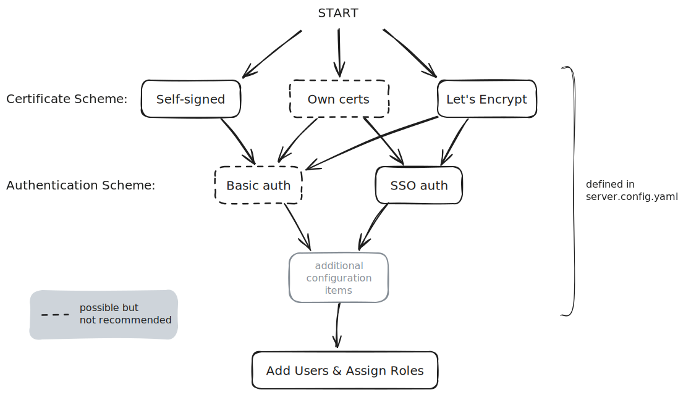

With a wide array of deployment options available, it is sometimes difficult to
decide which are the best choices for your deployment.

Velociraptor aims to be as flexible as possible, but many users come from an
environment full of products where a vendor prescribes how their product should
be deployed and used. Unfortunately some people like to be told "the right way"
to implement a solution. However Velociraptor is designed to support difficult
environments (which you may encounter in IR situations) and allow for
[creative uses]()
so there isn't really one "right" way to use or deploy Velociraptor.

To guide your choices we have an interactive configuration wizard, which is
accessed by running the `velociraptor config generate -i` command. The aim of
the wizard is to make it easy to configure Velociraptor in the most common
deployment scenarios. Even though these scenarios will not be a perfect fit for
everyone, most users should be able to start with these deployment modes and
then tweak the resulting configuration to their specific needs.

The end result of running the configuration wizard is a YAML configuration file.
So there is no harm in doing "dry runs" and examining or comparing resulting
files to better understand how the choices affect the resulting configuration.

The most significant choices to make prior to deployment are:
- [the certificate scheme]()
- [the authentication scheme]()

As shown in the diagram below, the most common choices for the certificate
scheme is either Self-signed SSL or Let's Encrypt SSL, which are the choices
offered by the configuration wizard. Using your own certificates is possible but
considered an "advanced" option, since it requires some knowledge of PKI
concepts, working with certificate files, editing configuration, and also
potentially some occasional management in reissuing certificates.

If you do want to use your own certificates then it is recommended to start with
a configuration that uses Self-Signed or Let's Encrypt, and then
[switch to using your own certificates]()
_after_ you are sure that your deployment works as expected (with a few test
clients).

For enterprise deployments or servers that need to be exposed to the internet,
SSO authentication is highly recommended.

If you decide to use Self-signed certificates then the configuration wizard will
only set up the Basic authentication provider, as these options are frequently
used together. You can still manually configure SSO, but if you choose to use
Basic authentication then you should then seriously consider additional measures
to secure the Admin GUI.

In all cases, we recommend that you review all the security options described in
the section
[Velociraptor Security Configuration](),
and implement these whenever possible.