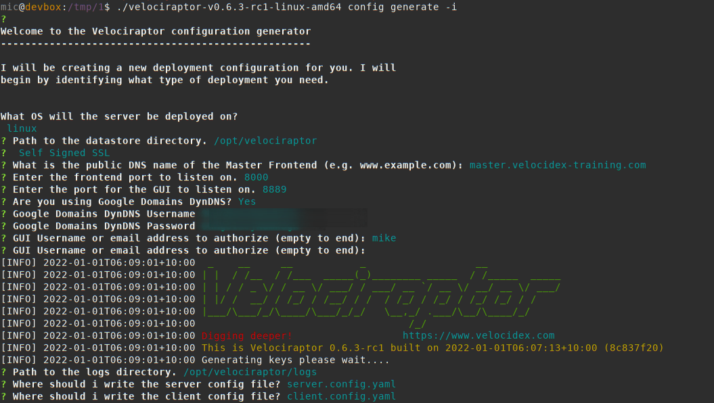
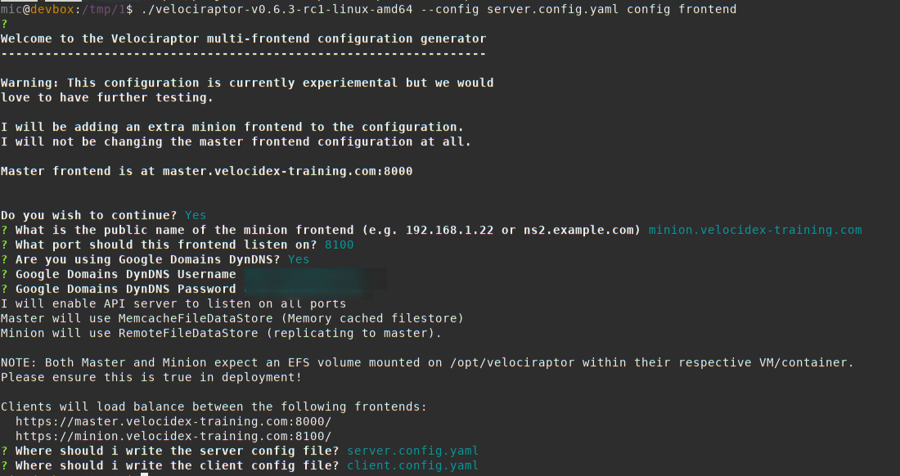

{}

This configuration is currently considered **experimental!** We have
reports of it working well but there may still be bugs and issues. We
highly recommend that if you intend to run in this mode, please
contact us at support@velocidex.com or on [Discord]()
and provide feedback or issues.

Being experimental, this feature also falls outside our [support
policy]() and features may change
at any time.

{}

This page describes the challenges and concepts around scaling
Velociraptor on multiple servers. By understanding the limitations and
challenges of this architecture, as well as the strategies
Velociraptor uses to scale, readers will gain an understanding of the
various configuration parameters that can be used and what they mean.

## Scaling Velociraptor

Velociraptor is an endpoint visibility tool designed to query a large
number of endpoints quickly and efficiently. In previous releases,
Velociraptor was restricted to a single server performing all
functions, such as serving the GUI, the gRPC API as well as
connections to the clients (endpoint agents). While this architecture
is regularly used to serve up to 10k-15k endpoints, at high number of
endpoints, we are starting to hit limitations with the single server
model.

### What are the bottlenecks of scale?

If you have ever used Velociraptor on a small network of endpoints
(say between 2k-5k endpoints), you would be accustomed to a snappy
GUI, with the ability to query any of the currently connected
endpoints instantly. Velociraptor clients typically do not poll, but
are constantly connected to the server— this means that when tasking a
new collection on an endpoint, we expect it to respond instantly.

As the number of endpoints increase this performance degrades. When
forwarding a large number of events from the end points, or performing
hunts that transfer a lot of data, one might experience sluggish
performance.

## Adding more frontend servers

The natural response to scaling is to increase the number of frontend
server (Velociraptor `frontend servers` are those directly connected
with clients). If we can keep the number of clients connected to each
frontend around the 10k limit, and just increase the total number of
servers, we can in theory at least, scale arbitrarily.

### Storage requirements

Velociraptor collects two distinct classes of data. Internally,
Velociraptor separates access to these two different types depending
on the data latency and bandwidth requirements:

1. **Datastore**: In Velociraptor terminology the data store is used
   to store small metadata about various things, such as clients,
   flows, collections etc. These are usually encoded in the form of
   small JSON files.

2. **Filestore**: The Filestore is used to store large, bulk data,
   such as collected files or the result sets from running queries on
   clients.

The two concepts are separated in Velociraptor because they typically
have much different access patterns:

* Datastore items are read and written frequently - for example,
  client metadata is checked regularly by all servers. Flow
  information is also checked frequently to update its statistics
  etc. Typically datastore items are read and written as single JSON
  units. Datastore items have typically very small bandwidth
  requirements since they are just small JSON encoded, but the data
  needs to be synchronized across all frontends.

* Filestore items are typically written by the server as data is
  collected from clients. They are not read very often - typically
  only by the GUI or server side VQL queries. Filestore items are very
  large (think collected memory images, or event logs) so require
  large bandwidth to the storage medium, but latency requirements are
  not very strict (as long as the data eventually makes it the storage
  this is fine!).

In the single server deployments, we typically use an attached storage
device (usually an SSD storage) to the server and use it to store both
types of data. This works pretty well because SSD storage is very fast
and provides both **high bandwidth** and **very low latency**.

### Scaling storage

In order to scale storage between multiple servers, we need to use a
**distributed filesystem**, such as NFS or EFS. Typically we use AWS
EFS service although other cloud providers offer a similar service
(e.g. Google Filestore)

Network filesystems are typically mounted on the instance at a
specific **mount point directory**, and appear just like a normal
attached storage, so they can be directly used by Velociraptor by
simply pointing the `Datastore.Location` configuration parameter at
this mount point.

However, there are some critical key differences between EFS and
attached storage!

### High latency filesystems

Network filesystems typically exhibit high latency, since each IO
operation involves a network round trip. This inevitably results in
around 40-60ms per read/write operation.

This property degrades operation with distributed servers. For
example, consider the Velociraptor frontend receiving a collection
response from the client:

1. Read the client's public key so we can decrypt the messages.
2. Read the flow from disk so we know where to store the data
3. Write the result set to storage
4. Write the updated flow information to storage.

Filesystem latency will add some time to each of these steps,
resulting in a much longer time to serve each client request -
therefore limiting the total number of client requests we can serve in
a given time.

Synchronization across multiple frontends might also be a
problem. Imagine a hunt being run across the deployment. The hunt
statistics record contains information such as total clients
scheduled, total client complete etc. If the record is being
concurrently updated from multiple servers, the record needs to be
locked and filesystem locks are extremely slow in NFS so they must be
avoided at all cost.

## Velociraptor's multi server design

Currently Velociraptor's multi server design is divided into a
**master** server and one or more **minion** servers. The servers
coordinate work by passing messages using a **replication service**
between minion and master.


### The Master node

The master node runs specific services that coordinate clients. Some
of these service are:

1. The GUI service only runs on the master node.
2. The `Hunt Manager` service is responsible for scheduling
   collections on clients, keeping track of hunt statistics and
   creating new hunts.

3. Datastore - the Master is the only node that reads/writes to the
   data store (note - the datastore only stores very small metadata
   files). On the master, the datastore is typically cached in memory
   and synchronized to the EFS volume asynchronously.

4. Replication service - relays messages from all minions to various
   listeners. This is the main mechanism the master uses for
   communication with the minions.

### The Minion node

The minion node is responsible for collecting data from clients:

1. The minion does not read or write directly from the datastore,
   instead it uses a remote procedure call (gRPC) to read from the
   master's datastore. This means that the master is the source of
   truth for metadata and there is no need to implement additional
   cluster wide locking.

2. The minion write bulk data directly to the EFS volume. These write
   occur asynchronously Since bulk data is the majority of file IO,
   minions are offloading a significant proportion of file IO.

3. Minions are responsible for dispatching work to clients, and
   collecting their responses.

## Strategies to address high latency

Here we describe some of the strategies used to increase performance.

### Caching

To work around a lot of the latency issues, Velociraptor implements
multiple caching mechanisms to ensure file IO is not needed. The
caching allows writes to occur in parallel at a later stage without
holding the client's connection open for too long.

* Client key cache - This is required to decrypt messages from
  clients. Velociraptor keeps keys in memory to avoid having to read
  those from storage for each incoming connection. The size of the
  cache is controlled by the `Frontend.resources.expected_clients`
  setting.

* Search index cache: The client search index is used by the GUI to
  search for clients by labels, hostname, IP address etc. From 0.6.3
  the search index is completely memory resident, making search
  queries very fast.

* Datastore memory cache - The Master node, caches datastore files in
  memory. Much of the time, writes to the datastore are completed
  immediately into the memory cache, while the cache is flushed to the
  EFS storage asynchronously. This removes the perception of latency
  from most datastore operations.

## Configuration

This section describes how to configure a multi server deployment. We
typically start off with a normal configuration as generated with
`velociraptor config generate -i`.



In the above example we generated a self signed configuration with a
server at `master.velocidex-training.com`. We will use the dynamic DNS
setting to automatically update the frontend DNS mapping.

Now we derive a multi-server configuration from this basic configuration.

```bash
velociraptor --config server.config.yaml config frontend
```



Let's look at some of the generated configuration. The client
configuration is now changed to include both minion and master:

```yaml
Client:
  server_urls:
    - https://master.velocidex-training.com:8000/
    - https://minion.velocidex-training.com:8100/
```

This will cause clients to randomly select which server to connect to.

The API server is now listening on all interfaces and can be accessed
by the public hostname. This is required for minions to connect to the
master.

```yaml
API:
  hostname: master.velocidex-training.com
  bind_address: 0.0.0.0
  bind_port: 8001
```

There is an additional configuration part for each minion:

```yaml
ExtraFrontends:
- hostname: minion.velocidex-training.com
  bind_address: 0.0.0.0
  bind_port: 8100
  dyn_dns:
      ddns_username: ZWLfJ7InGAB1PcoC
      ddns_password: ufNrxN95HKhRjutM
```

Finally note the datastore configuration

```yaml
Datastore:
  location: /opt/velociraptor
  filestore_directory: /opt/velociraptor
  minion_implementation: RemoteFileDataStore
  master_implementation: MemcacheFileDataStore
```

We can see that the master will be running the
`MemcacheFileDataStore` - a specific implementation of the data store
which stores file in a memory cache while syncing them with the
storage asynchronously.

The minion, on the other hand will connect to the master via the
remote datastore (a gRPC based datastore implementation).

## Creating the server installation package.

The normal deb packaging command will create two packages when given a
multi-frontend configuration:

```yaml
$ ./velociraptor --config server.config.yaml debian server
$ ls -l *.deb
-rw-rw-r-- 1 me me 27429604 Mar 28 16:32 velociraptor_server__master_master.velocidex-training.com-8000_0.74.1_amd64.deb
-rw-rw-r-- 1 me me 27429604 Mar 28 16:32 velociraptor_server__minion_minion.velocidex-training.com-8100_0.74.1_amd64.deb
```

Each of these packages should be deployed on their own virtual
machine instances.  Each VM should be built with the same EFS volume
mounted on `/opt/velociraptor`.
