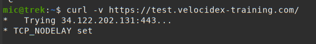
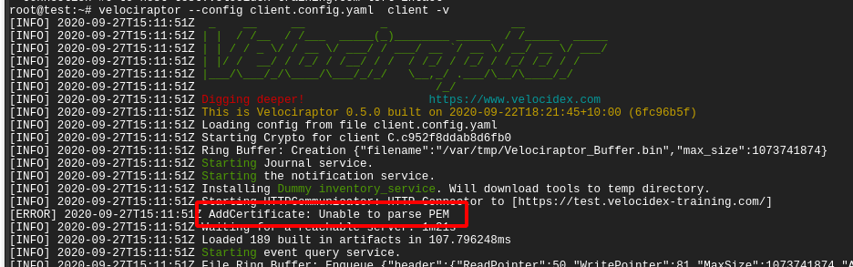

Sometimes things don't work when you first try them. This page will go
through the common issues people find when deploying Velociraptor
clients and the steps needed to debug them.

## Server fails to start

If the server fails to start, you can try to start it by hand to see any logs or issues. Typically the Linux service will report something unhelpful such as:

```
# service velociraptor_server status
● velociraptor_server.service - Velociraptor linux amd64
    Loaded: loaded (/etc/systemd/system/velociraptor_server.service; enabled; vendor preset: enabled)
    Active: activating (auto-restart) (Result: exit-code) since Fri 2021-12-31 15:32:58 AEST; 1min 1s ago
   Process: 3561364 ExecStart=/usr/local/bin/velociraptor --config /etc/velociraptor/server.config.yaml frontend (code=exited, status=1/FAILURE)
  Main PID: 3561364 (code=exited, status=1/FAILURE)
```

You can usually get more information from the system log files,
usually `/var/log/syslog`. Alternative you can try to start the
service by hand and see any issues on the console.

First change to the Velociraptor user and then start the service as that user.

```
# sudo -u velociraptor bash
$ velociraptor frontend -v
Dec 31 15:47:18 devbox velociraptor[3572509]: velociraptor.bin: error: frontend: loading config file: failed to acquire target io.Writer: failed to create a new file /mnt/data/logs/Velociraptor_debug.log.202112270000: failed to open file /mnt/data/logs/Velociraptor_debug.log.202112270000: open /mnt/data/logs/Velociraptor_debug.log.202112270000: permission denied
```

In this case, Velociraptor can not start because it can not write on
its logs directory. Other errors might be disk full or various permission denied problems.

{}

Because Velociraptor normally runs as a low privileged user, it needs
to maintain file ownership as the `velociraptor` user. Sometimes
permissions change by accident (usually this happens by running
velociraptor as root and interacting with the file store - you should
**always** change to the `velociraptor` user before interacting with
the server).

It is worth checking file permissions (using `ls -l`) and recursively
returning file ownership back to the `velociraptor` user (using the
command `chown -R velociraptor:velociraptor /path/to/filestore/`)

{}

## Velociraptor communications

To understand where things might go wrong, we first need to understand
how Velociraptor clients communicate with the server. You can read a lot more details about Velociraptor's encryption scheme and communication protocol in our [Velociraptor Communications Blog post](), but we will go through the most important aspects here.

### Velociraptor’s internal PKI

Every Velociraptor deployments creates an internal PKI which underpins
it. The configuration wizard create an internal CA with an X509
certificate and a private key. This CA is used to

1. Create initial server certificates and any additional certificates
   for key rotation.

1. CA public certificate is embedded in the client’s configuration and
   is used to verify server communications.

1. The CA is used to create API keys for programmatic access. The
   server is then able to verify API clients.

The configuration file contains the CA's X509 certificate in the
**Client.ca_certificate** parameter (it is therefore embedded in the
client configuration). The private key is contained in the
**CA.private_key** parameter.

{}

In a secure installation you should remove the **CA.private_key**
section from the server config and keep it offline. You only need it
to create new API keys using the *velociraptor config api_client*
command, and the server does not need it in normal operations.

{}

### Messages

Clients and servers communicate by sending each other messages (which
are simply protocol buffers), for example, a message may contain VQL
queries or result sets. Messages are collected into a list and sent in
a single POST operation in a **MessageList** protobuf. This protobuf
is encrypted using a session key with a symmetric cipher
(`aes_128_cbc`). The session key is chosen by the sending party and is
written into an encrypted **Cipher** protobuf and sent along with each
message.


This symmetric key is encoded in a **Cipher Properties** protobuf
which is encrypted in turn using the receiving party’s public key and
signed using the sending party’s private key.

{}

You might have noticed that **MessageList** protobufs are encrypted
and signed, but they are usually still delivered within a TLS session -
therefore there are two layers of encryption.

The internal encryption scheme's main purpose is not to encrypt the
messages but to sign them. This prevents messages from one client from
impersonating another client.

{}

### HTTP protocol

Velociraptor uses HTTPS POST messages to deliver message sets to the
server. The server in turn sends messages to the client in the body of
the POST request. The client connects to one of the server URLs
provided in the **Client.server_urls** setting in its config file.

Before the client communicates with the server, the client must verify
it is actually talking with the correct server. This happens at two
levels:

* If the URL is a HTTPS URL then the TLS connection needs to be
  verified

* The client will fetch the url /server.pem to receive the server’s
  internal certificate. This certificate must be verified by the
  embedded CA.

Note that this verification is essential in order to prevent the
client from accidentally talking with captive portals or MITM proxies.

### TLS verification

Velociraptor currently supports 2 modes for deployment via the config
wizard:

* Self signed mode uses internal CAs for the TLS certificates. The
  client knows it is in self signed mode if the
  **Client.use_self_signed_ssl** flag is true.

* Proper certificates minted by Let’s encrypt.

Velociraptor verifies self signed TLS certificates using its built in
CA. This essentially pins the server’s certificate inside the client —
even if a MITM was able to mint another certificate (even if it was
trusted by the global roots!) it would not be valid since it was not
issued by Velociraptor’s internal CA which is the only CA we trust in
this mode! In this way self signed mode is more secure than when using
a public CA.

The **Client.pinned_server_name** specifies the common name of the
server (or DNS name in the Server Alternate Name (SAN) field). The
client verifies that the certificate is correct **AND** that the name
is the same as the pinned name. You typically do not need to change
this setting.

If the client is not in self signed mode
(i.e. **Client.use_self_signed_ssl** is false or not present), it
expects to verify TLS connections using the system’s root certificate
store. In this configuration, Velociraptor may be susceptible to a
MITM SSL inspection proxy, and we must rely on the internal encryption
mechanism as described in the previous section to protect
communications.

{}

Velociraptor's self signed mode **requires** that the certificates be
issued by Velociraptor itself (the CA is pinned). It is **not
supported** for the server to present self signed certificates
generated by another CA!

In practice we find that often customer networks do contain SSL
inspection proxies which are using self signed certificates. This
breaks communications between client and server altogether. We
typically prefer to deploy Let’s Encrypt certificates for reliability
and better interoperability with such SSL interception proxies.

If you encounter an SSL interception proxy that breaks Velociraptor
communications, you may look into ways to whitelist the Velociraptor
server. Many proxies have mechanisms to whitelist certain domains.

{}

## Debugging client communications

Now that we have an understanding on the low level communication
mechanism, let’s try to apply our understanding to debugging common
deployment issues.

If the client does not appear to properly connect to the server, the
first thing is to run it manually (using the `velociraptor --config client.config.yaml client -v`
command):


In the above example, I ran the client manually with the -v switch. I
see the client starting up and immediately trying to connect to its
URL (in this case `https://test.velocidex-training.com/`) However
this fails and the client will wait for a short time before retrying
to connect again.



A common problem here is network filtering making it impossible to
reach the server. You can test this by simply running curl with the
server’s URL.

Once you enable connectivity, you might encounter another problem



The **Unable to parse PEM** message indicates that the client is
trying to fetch the **server.pem** file but it is not able to validate
it. This often happens with captive portal type of proxies which
interfere with the data transferred. It can also happen if your DNS
setting point to a completely different server.

We can verify the **server.pem** manually by using curl (note that
when using self signed mode you might need to provide curl with the -k
flag to ignore the certificate errors):


Note that the **server.pem** is always signed by the velociraptor
internal CA in all deployment modes (even with lets encrypt). You can
view the certificate details by using openssl:

```bash
curl https://test.velocidex-training.com/server.pem | openssl x509 -text
```

If your server certificate has expired, the client will refuse to
connect to it. To reissue the server certificate simply recreate the
server configuration file (after suitably backing up the previous
config file):

```bash
velociraptor --config server.config.yaml config rotate_key > new_server.config.yaml
```

Depending on which user invoked the Velociraptor binary, you may need to alter the permissions of the new server configuration file.

For example:

```bash
chmod 600 new_server.config.yaml
chown velociraptor:velociraptor new_server.config.yaml
```

From here, you will need to move the updated server configuration into the appropriate location. 

{}

The above step was able to use the internal Velociraptor CA to reissue
the server certificate (which is normally issued for 1 year), allowing
us to rotate the certificate.

Currently there is no way to update the CA certificate without
redeploying new clients (the CA certificate is embedded in the client
config file). When generating the config file initially, the CA
certificate is created with a 10 year validity.

{}
