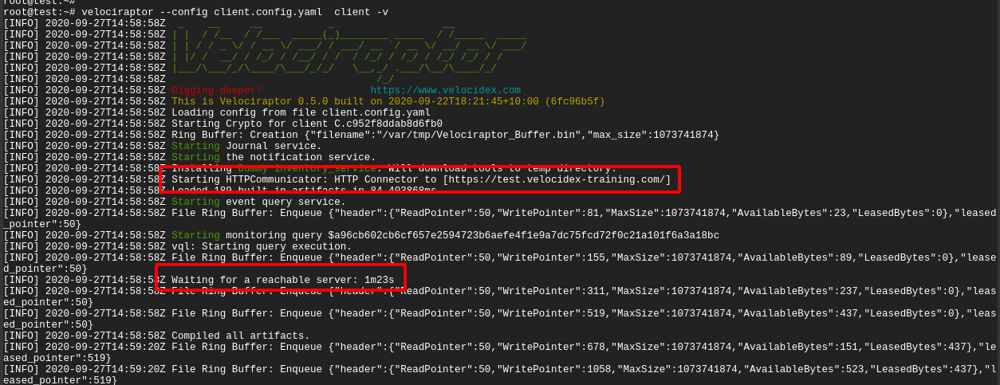
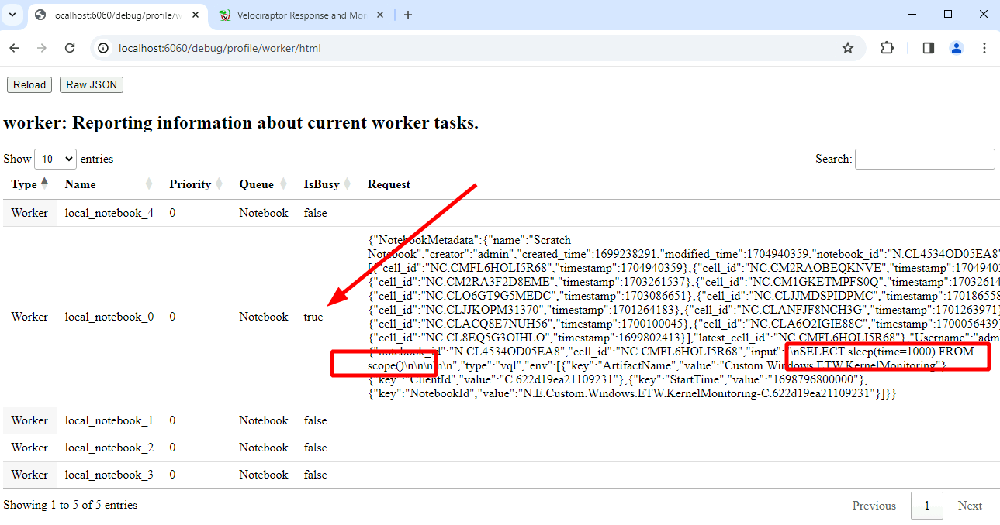

## Troubleshooting deployments

Sometimes things don't work when you first try them. This page will go
through the common issues people find when deploying Velociraptor
clients and the steps needed to debug them.

### Server fails to start

If the server fails to start, you can try to start it by hand to see
any logs or issues. Typically the Linux service will report something
unhelpful such as:

```
# service velociraptor_server status
● velociraptor_server.service - Velociraptor linux amd64
    Loaded: loaded (/etc/systemd/system/velociraptor_server.service; enabled; vendor preset: enabled)
    Active: activating (auto-restart) (Result: exit-code) since Fri 2021-12-31 15:32:58 AEST; 1min 1s ago
   Process: 3561364 ExecStart=/usr/local/bin/velociraptor --config /etc/velociraptor/server.config.yaml frontend (code=exited, status=1/FAILURE)
  Main PID: 3561364 (code=exited, status=1/FAILURE)
```

You can usually get more information from the system log files,
usually `/var/log/syslog`. Alternative you can try to start the
service by hand and see any issues on the console.

First change to the Velociraptor user and then start the service as that user.

```
# sudo -u velociraptor bash
$ velociraptor frontend -v
Dec 31 15:47:18 devbox velociraptor[3572509]: velociraptor.bin: error: frontend: loading config file: failed to acquire target io.Writer: failed to create a new file /mnt/data/logs/Velociraptor_debug.log.202112270000: failed to open file /mnt/data/logs/Velociraptor_debug.log.202112270000: open /mnt/data/logs/Velociraptor_debug.log.202112270000: permission denied
```

In this case, Velociraptor can not start because it can not write on
its logs directory. Other errors might be disk full or various
permission denied problems.

{}

Because Velociraptor normally runs as a low privileged user, it needs
to maintain file ownership as the `velociraptor` user. Sometimes
permissions change by accident (usually this happens by running
velociraptor as root and interacting with the file store - you should
**always** change to the `velociraptor` user before interacting with
the server).

It is worth checking file permissions (using `ls -l`) and recursively
returning file ownership back to the `velociraptor` user (using the
command `chown -R velociraptor:velociraptor /path/to/filestore/`)

{}

### Debugging client communications

If the client does not appear to properly connect to the server, the
first thing is to run it manually (using the `velociraptor --config
client.config.yaml client -v` command):



In the above example, I ran the client manually with the -v switch. I
see the client starting up and immediately trying to connect to its
URL (in this case `https://test.velocidex-training.com/`) However
this fails and the client will wait for a short time before retrying
to connect again.


A common problem here is network filtering making it impossible to
reach the server. You can test this by simply running curl with the
server’s URL.

Once you enable connectivity, you might encounter another problem


The **Unable to parse PEM** message indicates that the client is
trying to fetch the **server.pem** file but it is not able to validate
it. This often happens with captive portal type of proxies which
interfere with the data transferred. It can also happen if your DNS
setting point to a completely different server.

We can verify the **server.pem** manually by using curl (note that
when using self-signed mode you might need to provide curl with the -k
flag to ignore the certificate errors):


Note that the **server.pem** is always signed by the velociraptor
internal CA in all deployment modes (even with lets encrypt). You can
view the certificate details by using openssl:

```bash
curl https://test.velocidex-training.com/server.pem | openssl x509 -text
```

If your server certificate has expired, the client will refuse to
connect to it. To reissue the server certificate simply recreate the
server configuration file (after suitably backing up the previous
config file):

```bash
velociraptor config reissue_certs --validity 365 --config server.config.yaml > new_server.config.yaml
```

Depending on which user invoked the Velociraptor binary, you may need
to alter the permissions of the new server configuration file.

For example:

```bash
chmod 600 new_server.config.yaml
chown velociraptor:velociraptor new_server.config.yaml
```

From here, you will need to move the updated server configuration into
the appropriate location.

{}

The above step was able to use the internal Velociraptor CA to reissue
the server certificate (which is normally issued for 1 year), allowing
us to rotate the certificate.

Currently there is no way to update the CA certificate without
redeploying new clients (the CA certificate is embedded in the client
config file). When generating the config file initially, the CA
certificate is created with a 10 year validity.

{}

## Debugging Velociraptor

Velociraptor is a powerful program with a lot of
functionality. Sometimes it is important to find out what is happening
inside Velociraptor and if it doing what is expected. This is
important for debugging or even just for understanding what is
happening.

To see the inner workings of Velociraptor we can collect `profiles` of
various aspects of the program. These profiles exist regardless of if
Velociraptor is used in as a client or server or even an offline
collector.

You can read more about profiling in [Profiling the Beast]({})

### Starting the debug server

When provided with the `--debug` flag, Velociraptor will start the
debug server on port 6060 (use `--debug_port` to change it). By
default the debug server will only bind to localhost so you will need
to either tunnel the port or use a local browser to connect to it.


The debug server has a number of different profiles and new ones will
be introduced, so below we just cover some of the most useful profiles
you can view.

#### Notebook workers

Notebooks are very useful feature of the server allowing for complex
postprocessing of collected data. Sometimes these queries are very
large and take a long time to run. To limit the amount of resources
the queries can take on the server, Velociraptor only creates a
limited number of notebook workers (by default 5).



#### Currently running queries

This view shows the queries currently running in this process. For
example queries will run as part of the notebook evaluation, currently
installed event queries or in the case of the offline collector,
currently collecting artifacts.


You can also see all recent queries (even the ones that have completed
already). This helps to understand what exactly the client is doing.

#### ETW Subsystem

This profile shows the current state of the ETW subsystem on
Windows. We can see what providers Velociraptor is subscribed to, how
many queries are currently watching that provider, and how many events
were received from the provider.


#### Go profiling information

For even more low level view of the program execution, we can view the
`Built in Go Profiles` which include detailed heap allocation,
goroutine information and can capture a CPU profile for closer
inspection.

This type of information is critical for developers to understand what
the code is doing, and you should forward it in any bug reports or
discussions to help the Velociraptor developer team.

### Debugging the offline collector

The offline collector is a one shot collector which simply runs,
collects several preconfigured artifacts into a zip file and
terminates.

Sometimes the collector may take a long time or use too much
memory. In this case you might want to gain visibility into what its
doing.

You can start the offline collector by adding the `--debug` flags to
its execution in a similar way to above.

```
Collector_velociraptor-v0.7.1-windows-amd64.exe -- --debug --debug_port 6061
```


Note that the additional `--` is required to indicate that the
additional parameters are not considered part of the command line (the
offline collector requires running with no parameters).

The above will start the debug server on port 6061. You can then
download goroutine, heap allocation and other profiles from the debug
server and forward these to the Velociraptor team to resolve any issues.


### Debugging the server

It is also possible to collect the profile from the server without the
use of the `--debug` flag using the `Server.Monitor.Profile`
artifact. This is the server equivalent of the
`Generic.Client.Profile` artifact.

### Collecting metrics

When Velociraptor is run in production it is often necessary to build
dashboards to monitor the server's characteristics, such as memory
user, requests per second etc.

Velociraptor exports a lot of important metrics using the standard
`Prometheus` library. This information may be scraped from the
server's monitoring port (by default
http://127.0.0.1:8003/metrics). You can change the port and bind
address for the metrics server using the [Monitoring.bind_port
]({}) and [Monitoring.bind_address
]({}) setting.

You can either manually see program metrics using curl or configure an
external system like [Grafana](https://grafana.com/) or
[DataDog](https://www.datadoghq.com/) to scrape these metrics.

```
curl http://127.0.0.1:8003/metrics | less
```

We recommend that proper monitoring be implemented in production systems.
