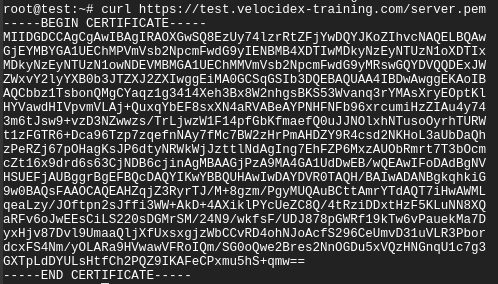

Sometimes things don't work when you first try them. This page will go
through the common issues people find when deploying Velociraptor
clients and the steps needed to debug them.

## Server fails to start

If the server fails to start, you can try to start it by hand to see
any logs or issues. Typically the Linux service will report something
unhelpful such as:

```
# service velociraptor_server status
● velociraptor_server.service - Velociraptor linux amd64
    Loaded: loaded (/etc/systemd/system/velociraptor_server.service; enabled; vendor preset: enabled)
    Active: activating (auto-restart) (Result: exit-code) since Fri 2021-12-31 15:32:58 AEST; 1min 1s ago
   Process: 3561364 ExecStart=/usr/local/bin/velociraptor --config /etc/velociraptor/server.config.yaml frontend (code=exited, status=1/FAILURE)
  Main PID: 3561364 (code=exited, status=1/FAILURE)
```

You can usually get more information from the system log files,
usually `/var/log/syslog`. Alternative you can try to start the
service by hand and see any issues on the console.

First change to the Velociraptor user and then start the service as that user.

```
# sudo -u velociraptor bash
$ velociraptor frontend -v
Dec 31 15:47:18 devbox velociraptor[3572509]: velociraptor.bin: error: frontend: loading config file: failed to acquire target io.Writer: failed to create a new file /mnt/data/logs/Velociraptor_debug.log.202112270000: failed to open file /mnt/data/logs/Velociraptor_debug.log.202112270000: open /mnt/data/logs/Velociraptor_debug.log.202112270000: permission denied
```

In this case, Velociraptor can not start because it can not write on
its logs directory. Other errors might be disk full or various
permission denied problems.

{}

Because Velociraptor normally runs as a low privileged user, it needs
to maintain file ownership as the `velociraptor` user. Sometimes
permissions change by accident (usually this happens by running
velociraptor as root and interacting with the file store - you should
**always** change to the `velociraptor` user before interacting with
the server).

It is worth checking file permissions (using `ls -l`) and recursively
returning file ownership back to the `velociraptor` user (using the
command `chown -R velociraptor:velociraptor /path/to/filestore/`)

{}

## Debugging client communications

Now that we have an understanding on the low level communication
mechanism, let’s try to apply our understanding to debugging common
deployment issues.

If the client does not appear to properly connect to the server, the
first thing is to run it manually (using the `velociraptor --config client.config.yaml client -v`
command):


In the above example, I ran the client manually with the -v switch. I
see the client starting up and immediately trying to connect to its
URL (in this case `https://test.velocidex-training.com/`) However
this fails and the client will wait for a short time before retrying
to connect again.


A common problem here is network filtering making it impossible to
reach the server. You can test this by simply running curl with the
server’s URL.

Once you enable connectivity, you might encounter another problem


The **Unable to parse PEM** message indicates that the client is
trying to fetch the **server.pem** file but it is not able to validate
it. This often happens with captive portal type of proxies which
interfere with the data transferred. It can also happen if your DNS
setting point to a completely different server.

We can verify the **server.pem** manually by using curl (note that
when using self signed mode you might need to provide curl with the -k
flag to ignore the certificate errors):



Note that the **server.pem** is always signed by the velociraptor
internal CA in all deployment modes (even with lets encrypt). You can
view the certificate details by using openssl:

```bash
curl https://test.velocidex-training.com/server.pem | openssl x509 -text
```

If your server certificate has expired, the client will refuse to
connect to it. To reissue the server certificate simply recreate the
server configuration file (after suitably backing up the previous
config file):

```bash
velociraptor --config server.config.yaml config rotate_key > new_server.config.yaml
```

Depending on which user invoked the Velociraptor binary, you may need
to alter the permissions of the new server configuration file.

For example:

```bash
chmod 600 new_server.config.yaml
chown velociraptor:velociraptor new_server.config.yaml
```

From here, you will need to move the updated server configuration into
the appropriate location.

{}

The above step was able to use the internal Velociraptor CA to reissue
the server certificate (which is normally issued for 1 year), allowing
us to rotate the certificate.

Currently there is no way to update the CA certificate without
redeploying new clients (the CA certificate is embedded in the client
config file). When generating the config file initially, the CA
certificate is created with a 10 year validity.

{}
