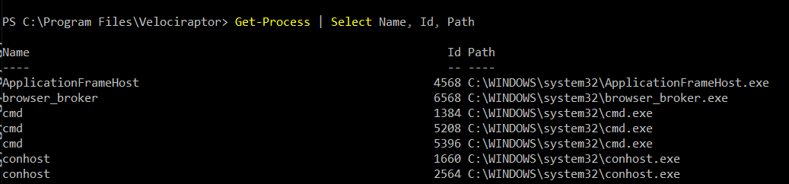

VQL is really a glue language - we rely on VQL plugins and functions
to do all the heavy liftingm.  VQL was never designed to be an all powerful language - users will hit the limits of what is possible in VQL pretty quickly.

To take full advantage of the power of VQL, we need to be able to
easily extend its functionality. This section illustrates how VQL can
be extended by including powershell scripts and external binaries.

For the ultimate level of control and automation, the Velociraptor API
can be used to interface directly to the Velociraptor server utilizing
many supported languages (like Java, C++, C#, Python).

## Extending VQL - Artifacts

The most obvious way for extending VQL is simply writing additional
artifacts. We have seen this done extensively in previous pages: Once
an artifact is added to Velociraptor, other artifacts can easily reuse
it by simply calling it.

Artifacts serve to encapsulate VQL queries and allow us to build more
complex content, but ultimately we are still limited with the basic
capabilities of the VQL engine. Adding more artifacts can not extend
the basic functionality provided by the built in VQL plugins and
functions.

### Extending artifacts - PowerShell

Powershell is a powerful systems automation language mainly used on
Windows systems where is comes built in and almost always available.

Many complex software products contain powershell modules around
automation and system administration. It does not make sense for
Velociraptor to directly support complex software packages such as
Office365, Azure which already come with extensive powershell support.

But it is critical to be able to recover forensically relevant data
from these package. Therefore it makes sense to wrap powershell
scripts in VQL artifacts.

In the following we see how to wrap a simple powershell snippet in
VQL. The process for wrapping other powershell snippets is very
similar.

For this example we will use the following very simple snippet of
PowerShell which simply lists the names, process id and binary path of
all running processes.

```powershell
Get-Process | Select Name, Id, Path
```




In order to run powershell code from Velociraptor we will use the
`execve()` plugin to shell out to powershell. The `execve()` plugin
takes a list of args and builds a correctly escaped command line.

{}

The `execve()` plugin takes a **list** of command line arguments
(i.e. `argv`). Velociraptor will combine this list into a valid
command line by itself taking care to escape specific args (On
Windows). Do not attempt to construct this list from a single command
line string, since this will likely produce an opportunity for
[Command Line
Injection](https://owasp.org/www-community/attacks/Command_Injection)
if the commandline incorporates a user provided string.

Velociraptor minimizes the potential for this by requiring each
argument to be explicitely provided.

{}


In
many cases we dont need to encode the command line

Alternative - encode scripts
8
If you get encoding errors then you can still encode the script.

Alternative - tempfile scripts
9
Tempfiles will be automatically cleaned up at the end of the query

Dealing with output
Using the execve() plugin we can see the output in Stdout
It would be better to be able to deal with structured output though.
We can use powershell's  ConvertTo-Json to convert output to JSON and Velociraptor's parse_json() to obtain structured output.

This allows VQL or operate on the result set as if it was natively generated by a VQL plugin!
10

11

12
Parsing JSON output
PowerShell outputs a single JSON object which is an array all the rows.
We need to parse it in one operation - so we need to buffer all the Stdout into memory (set length=1000000).

13

14
Reusing powershell artifacts
Since our powershell script is now encapsulated, we can use it inside other artifacts and plain VQL.
Users of this artifact dont care what the PowerShell Script is or what it does - we have encapsulation!

Remediation
15

Velociraptor Remediation
Remediation means to restore the network from a compromised state - Usually remove persistence.

Create a scheduled task to run something daily

SCHTASKS /CREATE /SC DAILY /TN "EvilTask" /TR "dir c:" /ST 20:01


16

Exercise
17
Find your "evil" scheduled task and remediate using the

Windows.Remediation.ScheduledTasks artifact

Using external
tools
18
© 2020 Velocidex Enterprises

Why use external tools?
Velociraptor has a lot of built in functionality, but we can not cover all use cases!
Velociraptor can automatically use external tools:
Velociraptor will ensure the tool is delivered to the endpoint
The tool can be called from within VQL
VQL can parse the output of the tool - thereby presenting the output in a structured way
VQL can then further process the data
19

Velociraptor Tools
Tools are cached locally on the endpoint and are only re-downloaded when hashes change.
Admin can control
Where the tool is served from - Serve Locally or from Upstream
Admin can override the tool with their own
Artifact writers can specify
The usual download location for the tool.
The name of the tool
Velociraptor is essentially an orchestration agent
20

Autoruns
Autoruns is a Sysinternals tool
Searches for many different types of persistence mechanisms
We could reimplement all its logic
OR
We could just use the tool

21

22

Let's add a persistence
sc.exe create owned binpath="%COMSPEC% /c powershell.exe -nop -w hidden -command New-Item -ItemType File C:\art-marker.txt"
https://github.com/redcanaryco/atomic-red-team/blob/master/atomics/T1569.002/T1569.002.yaml


23
FROM within powershell:
sc.exe create owned binpath="%COMSPEC% /c powershell.exe -nop -w hidden -command New-Item -ItemType File C:\art-marker.txt"

24

25

26

27
Artifact encapsulation
Use autoruns to specifically hunt for services that use %COMSPEC%
Artifact writers just reuse other artifacts without needing to worry about tools.
name: Custom.Windows.Autoruns.Comspec
description: |
   Detect comspec in autoruns

sources:
  - precondition:
      SELECT OS From info() where OS = 'windows'

    query: |
      SELECT * FROM Artifact.Windows.Sysinternals.Autoruns()
      WHERE Category =~ "Services" AND `Launch String` =~ "COMSPEC"


28

29
Exercise - Use Sysinternal DU
Write an artifact to implement Sysinternal's du64.exe to calculate storage used by directories recursively.

30
Third party binaries summary
Generic.Utils.FetchBinary on the client side delivers files to the client on demand.
Automatically maintains a local cache of binaries.
Declaring a new Tool is easy
Admins can override tool behaviour
Same artifact can be used online and offline

Automating the Velociraptor Server
31

Server artifacts
Server automation is performed by exporting server controlling functions as VQL plugins and functions
This allows the server to be controlled and automated using VQL queries
Server artifacts encapsulate VQL queries to performs certain actions
Server monitoring artifacts watch for events on the server and respond.
32

33

Client version distribution
30 Day active client count grouped by version
1 Day active client count
34

Server concepts
Client: A Velociraptor instance running on an endpoint. This is denoted by client_id and indexed in the client index.
Flow: A single artifact collection instance. Can contain multiple artifacts with many sources each uploading multiple files.
Hunt: A collection of flows from different clients. Hunt results consist of the results from all the hunt's flows
35

Exercise - label clients
Label all windows machines with a certain local username.

Launch a hunt to gather all usernames from all endpoints
Write VQL to label all the clients with user "mike"

This can be used to label hosts based on any property of grouping that makes sense.
Now we can focus our hunts on only these machines.
36

Exercise - label clients with event query
The previous method requires frequent hunts to update the labels - what if a new machine is provisioned?

Label all windows machines with a certain local username using an event query.
37

Server management with VQL
We just ran a hunt which downloaded 300Gb of data (oops!) now our server is full!

We need to delete the results from this hunt because we don't need them.
38

Develop “Server.Admin.DeleteHunt”
39
Step 1: Find all the flows launched within the hunt
Step 2: Figure out all the files that make up the flow: enumerate_flow()
Step 3: Remove these files: file_store_delete()

40
Start cancelling flows
If your hunts are too heavy and overload the server simply start cancelling flows with VQL.

The Velociraptor API
41

Why an API?
Velociraptor needs to plug into a much wider ecosystem

Velociraptor can itself control other systems
Can already be done by the execve() and http_client() VQL plugins.

Velociraptor can be controlled by external tools
Allows external tools to enrich and automate Velociraptor
This is what the API is for!

42

API Server
GUI
Client program (Python)
X509 Cert
X509 Cert
TLS with mutual certificate verification.
43
TLS authentication occurs through pinned certificates - both client and server are mutually authenticated and must have certificates issued by Velociraptor's trusted CA.
Execute arbitrary VQL

The Velociraptor API
The API is extremely powerful so it must be protected!
The point of an API is to allow a client program (written in any language) to interact with Velociraptor.
The server mints a certificate for the client program to use. This allows it to authenticate and establish a TLS connection with the API server.
By default the API server only listens on 127.0.0.1 - you need to reconfigure it to open it up.

Create a client API certificate
velociraptor --config server.config.yaml  --config server.config.yaml config api_client --name Mike --role administrator api.config.yaml
45

Grant access to API key
Currently two levels of access:
velociraptor --config /etc/velociraptor/server.config.yaml config api_client --name Mike --role reader,api api_client.yaml
velociraptor --config /etc/velociraptor/server.config.yaml acl grant Mike --role administrator,api

Access to push events to an artifact queue:
velociraptor --config /etc/velociraptor/server.config.yaml acl grant Mike '{"publish_queues": ["EventArtifact1", "EventArtifact2"]}'
46

Export access to your API
Normally Velociraptor is listening on the loopback interface only
If you want to use the API from external machines, enable binding to all interfaces
47

Using Jupyter to analyze hunts
48

Jupyter
Jupyter is an interactive notebook app

Runs python internally but we can use it to call the server via APIs
49

Install the python bindings
For python we always recommend a virtual environment and Python 3 then:

pip install pyvelociraptor jupyter pandas
50

51
Download the api_client.yaml file to your workstation and edit the api_connection_string to your external domain name

Run a simple query
Set the api file in the environment variable


Use the sample app in the PyVelociraptor bindings to test your connection to the server

pyvelociraptor "SELECT * FROM info()"


52

53

54

Running VQL on the server
Write a simple script by copying the sample app and editing it

    creds = grpc.ssl_channel_credentials(
        root_certificates=config["ca_certificate"].encode("utf8"),
        private_key=config["client_private_key"].encode("utf8"),
        certificate_chain=config["client_cert"].encode("utf8"))

    options = (('grpc.ssl_target_name_override', "VelociraptorServer",),)
    with grpc.secure_channel(config["api_connection_string"], creds, options) as channel:
        stub = api_pb2_grpc.APIStub(channel)
        request = api_pb2.VQLCollectorArgs(
            max_wait=1,
            Query=[api_pb2.VQLRequest(
                VQL=" SELECT * from clients() ",
            )])

        for response in stub.Query(request):
package = json.loads(response.Response)
            print (package)


55

Schedule an artifact collection
You can use the API to schedule an artifact collection


LET collection <= collect_client(client_id='C.cdbd59efbda14627', artifacts='Generic.Client.Info', args=dict())
56

Wait for the client to finish
When a collection is done, the server will deliver an event to the System.Flow.Completion event artifact

You can watch this to be notified of flows completing

SELECT * FROM watch_monitoring(artifact='System.Flow.Completion') WHERE FlowId = collection.flow_id LIMIT 1
57

Reading the results
You can use the source() plugin to read the results from the collection.

SELECT * FROM source(client_id=collection.ClientId, flow_id=collection.flow_id, artifact='Generic.Client.Info/BasicInformation')
58

Exercise: Put it all together
Write VQL to call via the API to collect an artifact from an endpoint and read all the results in one query.
59

Event Queries and Server Monitoring
60

Server Monitoring
We have previously seen that event queries can monitor for new events in real time

We can use this to monitor the server via the API using the watch_monitoring() VQL plugin.


61
The Velociraptor API is asynchronous. When running event queries the gRPC call will block and stream results in real time.

Exercise - Watch for flow completions
We can watch for any flow completion events via the API
This allows our API program to respond whenever someone collects a certain artifact (e.g. post process it and relay the results to another system). We can also automatically collect another artifact after examining the collected data.
SELECT * FROM
    watch_monitoring(artifact=’System.Flow.Completion’)
62

Server side VQL Event artifacts
63

Server Event Artifacts
We saw that API clients can run VQL Event queries.
The Velociraptor server also offers a permanent Event Artifact service - this will run all event artifacts server side.

We can use this to refine and post process events only using artifacts. We can also react on client events in the server.

64

Exercise: Powershell encoded cmdline
Powershell may accept a script on the command line which is base64 encoded. This makes it harder to see what the script does, therefore many attackers launch powershell with this option
We would like to keep a log on the server with the decoded powershell scripts.
Our strategy will be:
Watch the client’s process execution logs as an event stream on the server.
Detect execution of powershell with encoded parameters
Decode the parameter and report the decoded script.
Store all results as another artifact.
65

Server side artifacts
Client Event Artifacts

Windows.Event.ProcessCreation


Server


Windows.Event.ProcessCreation Log files
Server VQL watches the log file for specific events of interest
Windows.Event.ProcessCreation
66
Server.Powershell.EncodedCommand


Install a server side event monitor
67

Install a client side event monitor
68

Generate an encoded powershell command using

powershell -encodedCommand ZABpAHIAIAAiAGMAOgBcAHAAcgBvAGcAcgBhAG0AIABmAGkAbABlAHMAIgAgAA==

Wait 2 minutes for events to be delivered.


69

70

Conclusions
Velociraptor is essentially a collector of data
Velociraptor has a number of ways to integrate and be controlled by other systems
VQL provide execve() allowing Velociraptor to invoke other programs, and parse their output seamlessly.
On the server VQL exposes server management functions allowing automating the server with artifacts.

71

Conclusions
The Velociraptor server exposes VQL via a streaming API - allowing external programs to
Listen for events on the server
Command the server to collect and respond
Enrich and filter data on the server for better triaging and response.

72
