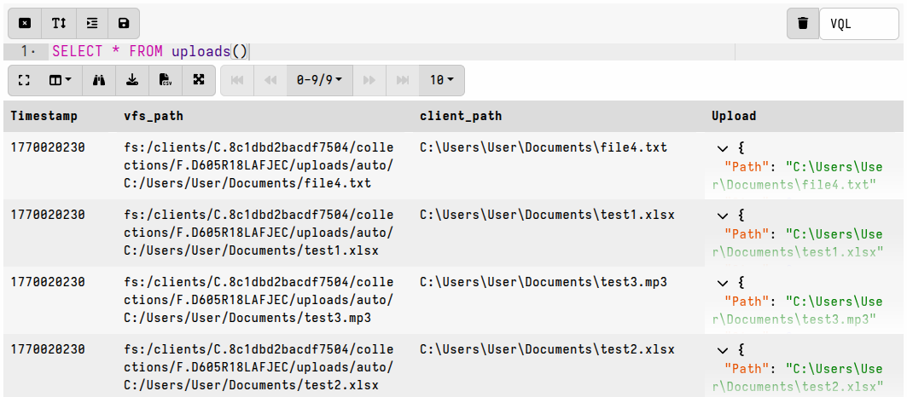

Traditional DFIR tools focus on file acquisition and often rely on file _copies_
as their primary data source. These tools typically perform subsequent analysis
on a centralized server or network-isolated system.

Unlike those tools, Velociraptor is designed to perform analysis directly on the
endpoint. This decentralized approach scales far more easily than centralized
processing, with live systems also providing a far richer source of forensic
data.

However, Velociraptor is fully capable of performing file acquisition and has
many features that allow you to do this quickly and efficiently. This section
covers Velociraptor's features that support file acquisition, and explains how
to work with these files after you acquire them.

{}

We refer to the process of running an artifact as "a collection", regardless of
whether the process copies files from the target system. While VQL queries _can_
copy files, this is only one of many available actions.

Velociraptor queries are written in VQL (Velociraptor Query Language) and
packaged inside a YAML data structure which we call an
[artifact](). You then **collect** these artifacts
on one or more target endpoints.

VQL artifacts can combine data from multiple sources to create a more complete
picture of an event than traditional "offline" file analysis can provide. For
example, on a live endpoint, Velociraptor can:
- Combine file and API data: VQL queries can extract information from static
  files, system APIs, and volatile (memory) sources simultaneously. An example
  of this is parsing Windows event logs. While traditional tools might just look
  at the `.evtx` file, VQL can simultaneously query the Registry API to find
  specific DLLs that translate raw event codes into human-readable messages.
- Access live context, such as active system state data that is unavailable when
  examining an isolated file or a disk image.

While other DFIR tools often use "collection" to imply file acquisition,
Velociraptor collections usually return only parsed data.

In Velociraptor we perform **file acquisition** (to use the more accurate term)
primarily for the purpose of preserving evidence. Centralized file processing
can be done, but it is significantly more complicated and less efficient than
just querying the data sources directly on the endpoint.

You might also notice that we sometimes use the term "flow" as an alternative to
the term "collection". This is for historical reasons, but it might also be
helpful to think in terms of this neutral term since it isn't colloquially
associated with the process of copying files.

{}

## Why collect files?

File acquisition, is typically performed for two distinct reasons:
1. To preserve forensic evidence.
2. To allow for additional analysis on a separate system (not the original
   computer) using external tools.

Traditional forensic tools and workflows often blur the distinction between
these two goals, especially when such systems centralize the parsing and
extraction of data. This conflation is compounded by traditional methodologies
that emphasize evidence preservation and working exclusively on file copies
(often captured in the form of disk images), as investigations of yesteryear
often had litigation as their primary goal.

While these considerations certainly still apply to some investigations, the
majority of modern IR investigations do not have litigation as an end goal.
Modern investigations frequently require scaling to an extent that makes bulk
file collection and centralized processing highly impractical and painfully
slow. The centralized file processing approach is at odds with the goal of rapid
incident response. For that reason, Velociraptor is not designed around the
centralized processing paradigm, although you can still use Velociraptor to work
with [file copies]()
and [disk images]() in a centralized
manner if necessary. And that might be necessary under certain circumstances,
but you should take advantage of Velociraptor's scalable, decentralized design
whenever possible.

That is, the recommended approach with Velociraptor is:
- Query data sources on the live endpoint when possible.
- Avoid copying files unless you have a specific reason to do so, such as for
  evidence preservation or for analysis by external tools.
- If you must preserve file-based evidence, then copy the files in addition to
  querying the files and non-file data sources on the live endpoint.

For example, if you are looking for specific events in the Windows event log,
run queries against the live system to find those events, and then copy the
`.evtx` file _only if_ the events are found.

If you wish to perform wholesale preservation of file-based evidence, say for
legal reasons, then disk images are still considered the gold standard for that
purpose. You might still consider creating disk images _in addition to_
investigating the endpoint with Velociraptor. Velociraptor does also provide
artifacts that facilitate
[bulk file collection]()
if you need to do selective file preservation.

With all that considered, let's look at how files are actually collected...

## File Uploads

In Velociraptor, a "file upload" is the transfer of a file from an endpoint to
the server, which then stores the file in its filestore. The VQL `upload()`
function is the workhorse behind this capability and is used in many of the
[built-in artifacts]().

Velociraptor enables efficient file transfer and storage through several
built-in mechanisms:

- **File Upload Deduplication**: If different artifacts request the same file
  within the same collection, it is only transferred and stored once.
- **Sparse File Handling**: For large but mostly empty files (like the Windows
  USN journal), Velociraptor only transfers regions containing actual data. Such
  files are called "sparse files". Velociraptor creates a corresponding `.idx`
  file mapping out the sections that contain data, and it then uses this to
  reconstruct the original layout on the server, if required. This can
  significantly reduce the size of the collection for certain files that tend to
  be very large. When exporting files from the GUI, you can choose whether to
  pad out sparse files or keep them in their compact form.
- **Compressed Storage**: Since version 0.75, the server stores data in a
  compressed form by default. This can greatly improve storage efficiency (by up
  to 80–90% compared to previous versions) since many of the files we work with
  are highly compressible.

Beyond uploading files to the server, specialized plugins like `upload_s3()`,
`upload_gcs()`, `upload_azure()`, and `upload_sftp()` allow endpoints to send
data
[directly to external cloud storage providers or remote servers]().

{}

New users might find the "upload" and "download" terminology a bit confusing.

- In the context of Velociraptor we generally use the term **upload** to refer
  to a file transfer _from the client_ to the server (or other destination).
- In general we use the term **download** to refer to the act of transferring
  files _from the server_ to your local workstation, usually via the
  Velociraptor GUI.

Note that in the Velociraptor GUI, particularly in the VFS browser, uploading
from the client is sometimes described using the term "download" because the VFS
browser presents actions from the server's perspective (the server is
"downloading" from the client). Technically, the client always initiates the
upload to the server: _By design, the Velociraptor server never accesses the
client directly!_

To summarize the terminology conventions used in our documentation:
- **Collect:** Artifact execution and data transfer, which _might_ include file
  uploads.
- **Upload:** Client → Server or another remote storage destination (File
  transfer)
- **Download/Export:** Server → User Workstation (File transfer)

{}


## The VQL upload function

The VQL [upload()]() function is the
primary mechanism for transferring files from an endpoint to the server
filestore. It can be triggered based on specific query criteria, and all
resulting files are associated with the collection that invoked the function.

When this function is used, the uploaded files are stored on the server and
associated with the collection that invoked the `upload()` function.

Alternatively, if you want to upload to destinations other than the server,
Velociraptor has a range of other upload-related functions that are
[described below]().

###### A Basic Example

To target specific files, use `upload()` in conjunction with the `glob()`
plugin. The following query identifies and uploads all executable files from
every user's Downloads folder on a Windows endpoint:

```vql
SELECT OSPath, upload(file=OSPath) AS Upload
FROM glob(globs="C:/Users/*/Downloads/*.exe")
```

Of course if you know the exact path of a file that you want to upload to the
server then you don't need to use the `glob()` plugin, but this plugin is
usually used when [searching the filesystem]().
The `upload()` function requires an OSPath in its `file` argument, so any
plugin that produces an OSPath will work, or you could manually specify a path
to target a particular file.

### Accessing file uploads on the server

In the collection's **Uploaded Files** tab, each file upload is automatically
displayed with both a download link and a link to view the file using the
built-in file inspector (the "preview" option).


In other VQL results tables, you can configure which
[column types]()
are used to facilitate GUI access to the uploaded files.

For example, if we use the `upload()` function in an artifact and assign it to
the columns named `FilePreview` and `FileDownload`:

```vql
SELECT OSPath,
        upload(file=OSPath) AS FileDownload,
        upload(file=OSPath) AS FilePreview
FROM glob(globs="C:/Users/*/Downloads/*.exe")
```

then we can also define how we want them displayed in the results table in the
GUI using the [column_types]()
section in the artifact:

```yaml
column_types:
  - name: FilePreview
    type: preview_upload
  - name: FileDownload
    type: download
```

The column types, if specified in the artifact definition, will be applied to
the named columns when the results are viewed in a notebook. However, you can
also manually edit the column types in the GUI when viewing any results table:


When you edit column types in a notebook, the GUI creates a dict containing the
specification and assigns it to the `ColumnTypes` VQL variable, for example the
YAML `column_types` specification shown above can alternatively be included in
your VQL as:

```vql
LET ColumnTypes <= dict(`FilePreview`='preview_upload', `FileDownload`='download')
```

The VQL specification approach is more commonly used in Velociraptor notebooks,
although these are based on [notebook templates]() which are also just
artifacts, and therefore also support the YAML-based `column_types`
specification.


### Enumerating uploads using VQL

The uploads associated with a collection can be enumerated in Velociraptor
notebooks using the VQL
[uploads()]() plugin.

This plugin returns information about all the uploads in a collection, including
2 fields that can be used to access the file in the server's filestore:
- `vfs_path`: a PathSpec object
- `Upload`: an UploadResponse object

These fields can be used in subsequent VQL actions to access or manipulate the
file copy that is stored in the server's filestore. For example, the `vfs_path`
can be used with the
[`file_store_delete()`]()
function, if necessary.

#### For an individual collection

It's easy to enumerate the file uploads associated with any collection in a
notebook.

###### Example

```vql
LET ColumnTypes <= dict(`Upload`='download')

SELECT *
FROM uploads(client_id=ClientId, flow_id=FlowId)
```



Note that in a collection notebook the `ClientId` and `FlowId` values don't need
to be explicitly specified, since they are already present in the notebook's VQL
scope.

#### For a hunt

File uploads associated with a hunt can be similarly enumerated in a notebook by
iterating over the flows linked to the hunt.

###### Example

```vql
LET ColumnTypes <= dict(`Upload`='download')
LET HuntId <= "H.ABCXYZ"

SELECT *
FROM foreach(
  row={
    SELECT ClientId,
           FlowId
    FROM hunt_flows(hunt_id=HuntId)
  },
  query={
    SELECT *
    FROM uploads(client_id=ClientId, flow_id=FlowId)
  })
```

In a hunt notebook the `HuntId` does not need to be explicitly set as it is
already present in the notebook's VQL scope.

Also note that if the artifacts being hunted include file uploads with the
appropriate `column_types` set, then the notebook will display links to the
uploaded files when you run a simple
`SELECT * FROM source(artifact="ArtifactName")`
query, which is the default query for a new hunt notebook.


## Upload-related Features

Velociraptor has several features that work together with the `upload()`
function to extend what it can access, make it safer to use, and to improve
upload efficiency in certain scenarios.

### Filesystem Accessors

[Accessors]() act as filesystem drivers,
allowing the `upload()` function to read from diverse sources such as:
- the standard OS API (`file` accessor),
- raw cluster level (`ntfs`, `fat`, `ext4` accessors),
- Windows registry (`registry` accessor),
- memory (`winpmem` accessor),
- compressed archives (`zip`, `gzip`, `bzip2` accessors)

and many other specialized formats.

This means that you can upload files directly from sources that would normally
be restricted or require an intermediate processing step. For example:
- locked "in use" files can be accessed using the `ntfs` accessor, bypassing OS
  file locks.
- if a file is inside a supported container-type file format (let's say a `.pst`
  archive or a `.zip` file or the Window registry) you can upload the file
  directly from the archive without needing to first extract the archive. There
  is no need to extract archives or make temporary copies of files before
  uploading them.

As an interesting application of accessors, and demonstrating the usefulness of
their modular nature, the `ssh` accessor can be used to
[upload files from a remote host via SSH](),
that is: without needing a Velociraptor client on the remote host.

Any data that has been generated by another function or plugin can be uploaded
as a file if you use the `upload()` function with the `data` accessor.

### Password-protected file downloads

For additional safety when locally handling files, and to reduce the chance of
your local antivirus accidentally quarantining potential malware that you intend
to analyze, you can set a downloads password (such as the industry-standard
"infected") in your [user preferences]().
This ensures that any files exported from the GUI are placed in a
password-protected zip and thereby made safe for transit to your analysis
environment.

When a download password is set, all prepared downloads (i.e. bulk exports) and
single-file downloads from the GUI will be zipped and password-protected. To
unset this behavior, clear the download password in your user preferences.

## Mitigating Network and Server Impacts

The collection of potentially many files simultaneously from many clients can
result in a significant resource impact on the server, as well as possibly
impacting normal network operations.

In addition, the collected files are stored on the server's filesystem within
the Velociraptor datastore, so you need to ensure that your server has
sufficient disk space to suit your collection goals.

_You should always consider the potential impacts when planning collections that
involve bulk file uploads, or uploads of very large files._ Fortunately,
Velociraptor has several mechanisms that help mitigate the potential impacts
associated with file collections at scale.

### Resumable Uploads

The Resumable Uploads feature allows large files to be transferred to the server
in the background (asynchronously), and continue transferring where they left
off after a network or client interruption. Whether the client crashes, the
system reboots, the network goes down, or the collection simply times out, the
transfer progress that has already been made is preserved on the server.

{}

Resumable Uploads is considered an advanced and still slightly experimental
feature and is therefore "opt-in" via a boolean VQL variable. It's not enabled
by default.

In addition, enabling this feature comes with some caveats and changes to upload
behavior that might be confusing to the user (see the
[upload function documentation]()
for more details).

As with any advanced feature, Resumable Uploads have seen continuous refinement.
While it was a major highlight of the 0.72 release, some stability issues were
noted in subsequent versions, leading to the feature being disabled in certain
releases to ensure that server performance wasn't impacted during high-load
scenarios. You should use the latest stable release for the most reliable
experience, especially if you intend to use this feature.

{}

Resumable uploads are enabled by setting the VQL variable `UPLOAD_IS_RESUMABLE`
in a query. Note that this means that the feature is enabled _per query_ - it is
not a feature that can (currently) be enabled or disabled globally for all
collections. It can also be enabled _per artifact_ by setting the variable as an
artifact parameter, which the `Generic.Collectors.File`, `FileFinder` artifacts,
and `Triage` artifacts have by default.

When this feature is enabled for a query, Velociraptor uses _upload transactions_:

1. Instead of the VQL query waiting for the entire file to reach the server, the
   `upload()` function returns an Upload ID immediately.
2. The VQL query then continues its execution while the actual data transfer
   happens asynchronously in the background.
3. If the client is interrupted, the transaction state is stored, allowing the
   server to ask the client to resume the specific data stream upon
   reconnection.

While resumable uploads can be incredibly useful in challenging network
environments, they aren't really necessary for most file collections which
typically consist of relatively few files that are mostly moderate in size.

Resumable uploads are most useful for large file transfers, such as:

- Full memory images (WinPmem/AVML).
- Bulk file collections like `Windows.Triage.Targets` (depending on what you
  choose to collect).
- Large logs or database files that exceed several gigabytes.

Resumable transfers may also be helpful in unstable network environments, such
as when attempting file collections over an unstable internet link.

#### Checking the status of resumable uploads

On the server, you can check which file uploads are outstanding for a specific
collection using the [upload_transactions()]()
plugin.

For example, in the following screenshot you can see that the client is
disconnected, and that several files are pending upload. In particular, the
first file will be resumed from its `start offset` while the files listed below
it will be sent from offset 0.


`upload_transactions()` can be run from any notebook on the server, but for
convenience we are running it here in the collection notebook so that it
automatically has access to `ClientId` and `FlowId` from the notebook's VQL
environment.

Note that uploads will be resumed from the offset recorded by the server. If the
file changes during a client interruption then the upload will be resumed from
that offset on the changed file. For this reason it is not advisable to use
resumable uploads for files that are expected to change frequently.


### Network Rate Limits

Velociraptor allows you to define a `global_upload_rate` and a
`per_client_upload_rate` within the `Frontend.resources` configuration section,
both measured in bytes per second.

- `global_upload_rate`: This setting caps the total bandwidth that the server
   allows for all incoming client uploads.
- `per_client_upload_rate`: Restricts the bandwidth utilised by each individual
   client. This is a global value that applies to every client connected to that
   frontend.

These settings, if configured appropriately, can ensure that the client-server
data transfers do not saturate network links during large-scale collections.

### Collection Resource Limits

It is often hard to determine in advance how much data will be collected or how
long it will take. It might happen that a certain endpoint has many more files
than you anticipated, or that a certain file may be unusually large on some
endpoint.

[Resource limits]() are a feature
intended to protect against such unforeseen circumstances.

Velociraptor allows limits to be set, after which the collection is cancelled.
In particular, the `max_upload_bytes` and `timeout` resource limits provide an
additional safeguard against unexpected/accidental uploads of extremely large
files.

To guard against accidental server from disk exhaustion there is a default
limit of 1GB per collection. This limit, and the default 10-minute timeout, can
be increased in the GUI for larger acquisitions. Alternatively they can be
[defined in the artifact]()
if the artifact is expected to usually result in large data transfers (such as
and artifact which uploads memory dumps).

Keep in mind that if the specified limits are exceeded then the collection will
be considered "failed", although it can easily be re-collected with new
increased limits being applied if you decide that the large transfer is
acceptable.

To do that:
- navigate to the client's collections list screen
- copy the failed collection
- increase the resource limits before launching it.


If a collection is running longer than you expected, you can interactively
cancel it (or hunt, consisting of many collections) by clicking the "Stop"
button. When stopping a hunt, all participating clients will be told to cancel
their individual collections.


### Datastore File Compression

In older versions compression was only applied during network transport. Since
version 0.75, the server stores uploaded files in a compressed form by default
to improve storage utilization. The compression is performed by the client, and
therefore has minimal performance cost to the server. On the server the
decompression is handled transparently, such as when exporting files from the
GUI or accessing them via VQL.

This feature significantly mitigates the risk of bulk file uploads unexpectedly
depleting the disk space on the server.

### Datastore Disk Usage Protection

Since version 0.7.0, the server includes a disk usage checker that
automatically disables writes when free space hits a minimum threshold (50 MB by
default). Under these conditions, the server returns a 503 error to clients,
causing them to buffer data locally rather than risk file corruption or data
loss on the server. This mechanism protects critical metadata, such as hunt
objects and organization settings, which were vulnerable to corruption in
older releases.

The GUI will also display an alert if the minimum threshold is encountered.


### Remote Upload Destinations

It's also possible to have the client upload files to destinations other than
the Velociraptor server. This is most often used with
[offline collections]()
to upload a collection container zip to a remote destination, but the same
upload functions can be used in any VQL queries to upload individual files.

An alternative way to avoid the potential impacts of bulk/large file uploads on
the server is to use a
[remote upload destination](),
rather than having the files sent to the Velociraptor server.

Of course the downside to that approach is that your collected files will then
be separate from your non-file collection data. But in some cases that may be
the preferred option, for example:
- where the files need to be fed into further automated processing pipelines
- where the remote destination serves as a long-term storage vault for evidence
  preservation, independent of Velociraptor.

To avoid impacting a network's internet link you could also consider setting up
a MinIO/SMB/WebDAV/SFTP server on the local network and then using the
corresponding VQL function to send the collected files to that destination.
However, since version 0.75 the files sent to the server's datastore are
compressed by default, as mentioned above, while files sent to other
destinations will not benefit from this automatic compression.

Velociraptor currently supports the following remote upload destinations:

- **Google Cloud Storage**: using the `upload_gcs` function.

  See [How to set up a GCS Bucket for file uploads]().

- **AWS S3** or **MinIO**: using the `upload_s3` function.

  MinIO is a self-hosted S3-compatible server.

  See [How to set up a MinIO (S3-compatible) dropbox server for file uploads]().

- **Azure Blob Storage**: using the `upload_azure` function.

  See [How to set up Azure Blob Storage for file uploads]().

- **SMB Share**: using the `upload_smb` function.

  See [How to set up a SMB share for file uploads]().

- **SFTP server**: using the `upload_sftp` function.

  See [How to set up a SFTP server for file uploads]().

- **WebDAV server**: using the `upload_webdav` function.

  See the [upload_webdav]()
  function documentation.

- **Generic HTTP server**: using the `http_client` function.

  The generic `http_client` VQL function can also be used to transfer files to a
  generic web service destination, a common use case being to submit files to
  malware analysis sandboxes.
  See the function's
  [documentation]()
  for examples.

{}

Note that unlike the `upload()` function, these plugins do not support resumable
uploads, or any features that rely on server-side functionality. Uploads to the
remote destinations are not tracked by the server, although the function's
results will be included in the data and logs that are returned, as with any
other collection.

Each remote destination type offers its own particular options and you should
refer to the function-specific documentation in the
[VQL reference](), and the vendor documentation for
the supported cloud storage providers.

{}


## More topics...

{}
