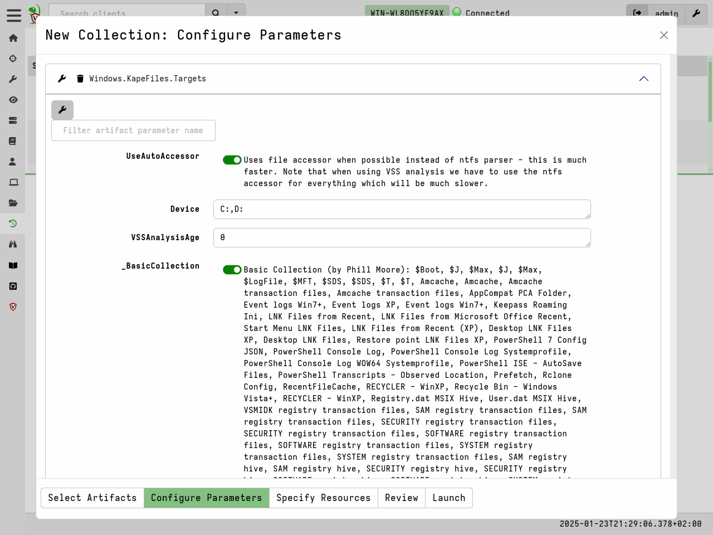
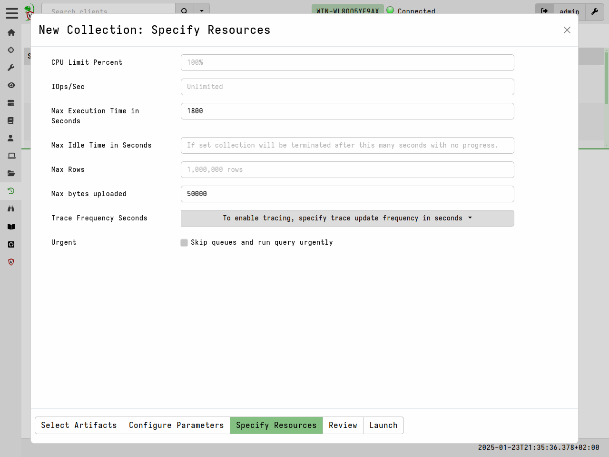

In this section we look at some features that Velociraptor offers which support
bulk file collection.

* Capture the machine state at a point in time.
* Collect files for further analysis by other forensic tools.
* More "Traditional" DFIR - preservation of evidence.

### Collecting files

Being able to efficiently and quickly collect and preserve evidence is
important for being able to capture machine state at a point in
time. It is also useful to be able to use these collected files with
other forensic tools that might be able to handle the file formats
involved.

One of the most commonly used artifact is the
`Windows.KapeFiles.Targets` artifact. This artifact is automatically
built from the open source
[KapeFiles](https://github.com/EricZimmerman/KapeFiles) repository.

While originally developed to support the non-opensource Kape tool,
this repository contains many types of files which might be relevant
to collect in a triage scenario. Each Kape "Target" is essentially a
glob expression with a name.

In Velociraptor `Windows.KapeFiles.Targets` is the most popular
artifact for mass file collection.  It does no analysis but simply
collects a bunch of files based on the targets specified.

Start by selecting the artifact from the "New Collection" wizard

Next we need to select the "Targets" in the "Configure Parameters"
step. Many targets are simply collections of other targets. For
example the `_BasicCollection` target automatically includes a number
of other useful targets.

The `Windows.KapeFiles.Targets` artifact can transfer a large quantity
of data from the endpoints, and take a long time to run. We therefore
often need to update the resource control of the collection.

Once the collection is launched, we can monitor progress in the "Artifact Collection" tab.

{}

Velociraptor is very careful about the performance and resource impact
on endpoints. When collecting many files if it is often hard to
determine in advance how much data will be collected or how long it
will take. For safety, Velociraptor allows limits to be set after
which the collection is cancelled. You can also interactively cancel
the collection by clicking the "Stop" button.

Be aware that a lot of data can be collected which might fill up the
VM disk.

> Math is a harsh mistress:
> Collecting 100Mb  from 10,000 endpoints = 1Tb
>
> Note that typically $MFT is around 300-400Mb so collecting the $MFT
> from many endpoints is going to be huge!

{}

