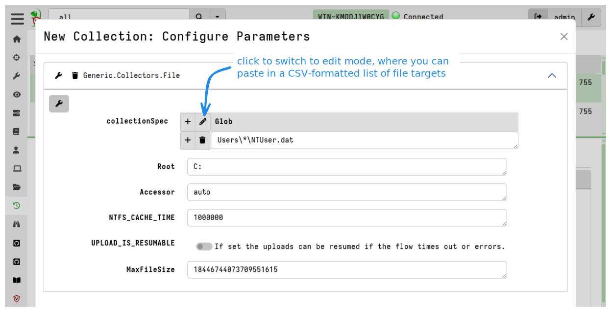

Being able to quickly and efficiently collect and preserve file-based evidence
_at scale_ is an important aspect of most DFIR investigations. You may also want
to analyze these collected files with other forensic tools that provide
specialized analysis capabilities for certain file formats.

In the previous section we looked at the basic mechanisms that Velociraptor
provides in support of file acquisition. The VQL `upload()` function allows us
to copy files from endpoints to the server, which is the default method of file
acquisition, but several other functions are available for copying files to
[remote network destinations]()
other than the Velociraptor server.

In this section we explain how file acquisition is scaled up via
[artifacts](),
making it easy to target the collection of many files in a single operation.

{}

When collecting many files it is often hard to determine in advance how much
data will be collected or how long it will take.

Consider the storage requirements:
- Collecting 100 MB  from 10,000 endpoints = 1 TB!
- A typical `$MFT` is around 300 to 400 MB, so collecting the `$MFT` from many
  endpoints will require a huge amount of server disk space!

Velociraptor is, in general, very careful to avoid causing performance and
resource impacts on endpoints. However, many clients collecting many files can
have significant impacts on your server, or even the network.

See the section
[Mitigating Network and Server Impacts]()
for advice on ways to mitigate potential impacts to your server and network,
especially when performing bulk file collections.

{}

{}

Velociraptor automatically deduplicates files before uploading them. If
different artifacts request the same file within the same collection on an
endpoint, the file is only transferred and stored once. This deduplication is
based on unique file path (including accessor) on the endpoint.

Files collected in separate collections are not deduplicated.

{}

## Bulk file collection using generic collection artifacts

Velociraptor ships with several general-purpose filesystem search artifacts that
include a file upload option.

The following are examples of FileFinder artifacts that all have this option:
- `Windows.Search.FileFinder`
- `MacOS.Search.FileFinder`
- `Linux.Search.FileFinder`
- `Windows.Search.SMBFileFinder`
- `Windows.Search.WSLFileFinder`

In these artifacts you specify one or more glob patterns or exact paths for the
files that you want to match, and then enable the `Upload_File` artifact
parameter to tell it to also upload the file to the server.

The `Generic.Collectors.File` artifact is a utility artifact dedicated to the
task of uploading files. Usually it's not used on its own, and is instead
called from other artifacts
(see [wrapper artifacts]()).
The `Windows.Triage.Targets` artifact described below is an example of a more
sophisticated artifact that wraps this much simpler utility artifact.

## Bulk file collection using Velociraptor Triage Artifacts

You might prefer to curate your own lists of file paths that you routinely make
copies of for preservation purposes. In that case, the `Generic.Collectors.File`
artifact will be perfectly suitable for acquiring these files.

However, there are public projects within the DFIR community that curate lists
of file paths (also called "forensic artifacts" or "targets") that responders
and analysts consider to be likely sources of evidence. One such initiative is
the very popular
[KapeFiles project](https://github.com/EricZimmerman/KapeFiles).
This project collects and curates an extensive list of community-contributed
file collection targets, broken down into categories. Each Kape "Target" is
essentially a glob expression with a name.

To make the collection targets from the KapeFiles project available within
Velociraptor, we have a separate project - the
[Velociraptor Triage Artifacts project](https://triage.velocidex.com/) -
that transforms the latest KapeFiles targets into a Velociraptor artifact. In
addition to the targets from the KapeFiles project, we augment the targets with
several volatile non-file data sources that are particularly useful to have from
a live endpoint.

The Velociraptor Triage Artifacts project also maintains a similar artifact for
Linux, based on the open source
[Unix-like Artifacts Collector (UAC)](https://github.com/tclahr/uac) project,
which has the same goals as KapeFiles but for Linux systems.

The Velociraptor Triage Artifacts project currently produces two artifacts:
- `Windows.Triage.Targets`
- `Linux.Triage.UAC`

You can read more about these artifacts on the
[project's website](https://triage.velocidex.com/).

Since these artifacts are not built into Velociraptor, and are frequently
updated, you need to add them to your Velociraptor's artifacts repository. You
can do this by manually downloading and importing the artifacts, but we
recommend that you use the built-in `Server.Import.Extras` server artifact
to simplify
[adding and updating the externally maintained triage artifacts]().

{}

In the DFIR world, the term "triage" refers to the process of collecting
information from an endpoint in order to assess and rank its relevance to an
incident, particularly in high-pressure situations where time is critical.
Usually this is an initial phase of the investigation, and is done for the
purpose of identifying affected systems and scoping an incident. In other words,
in Velociraptor terms "triage" is really just
[hunting]() done with specific constraints and
objectives in mind. Velociraptor can assess an endpoint without copying any
files.

However, due to their prior experience with other DFIR tools many forensic
practitioners tend to equate the term "triage" with bulk file acquisition
itself, rather than the assessment and ranking process. The term is often used
loosely to contrast the generally expeditious file acquisition approach with the
traditional, much slower process of disk image acquisition.

Users who are new to Velociraptor, especially those who have prior experience
with solutions that centralize file processing, often want to repeat the
familiar process that centralized solutions advocate, but using Velociraptor.
That is, they use Velociraptor clients and/or Offline Collectors to copy files
with the intention of analyzing/querying them later. This is not how
Velociraptor is intended to work, as we
[explained in the introduction]().
Even though it is technically possible and supported, it is an inefficient and
cumbersome approach that isn't aligned with Velociraptor's philosophy and design goals.

###### The Velociraptor Way

With Velociraptor, bulk file collection is usually done in parallel with
investigating the endpoint itself. We don't collect files and then investigate -
we investigate and _conditionally_ collect files (usually as a preservation
action).

So despite the use of "triage" in the name of these artifacts, you should keep
in mind that they are really file preservation artifacts. You can perform triage
on endpoints using Velociraptor artifacts such as `Windows.Hayabusa.Rules` and
only copy files if they turn out to contain evidence that you want to preserve.

{}

### Using the Windows.KapeFiles.Targets artifact

In Velociraptor, the  `Windows.KapeFiles.Targets` artifact is the most popular
artifact for bulk file collection.  It does no analysis, but simply performs
bulk collection of files based on the targets specified.

1. Select the artifact from the **New Collection** wizard.

   

2. Select the desired targets in the **Configure Parameters** tab. Many targets
   are just groupings of other targets. For example the `_BasicCollection`
   target consists of a number of other commonly used targets.

   

3. The `Windows.KapeFiles.Targets` artifact can transfer a large amount of data
   from the endpoints, and take a long time to run. We therefore often need to
   update the resource limits for the collection.

   

4. Once the collection is launched, we can monitor progress in the **Artifact
   Collection** tab.

   

## Bulk file collection using Offline Collectors

Sometimes your are unable to deploy Velociraptor on a new network in the
conventional client/server mode. Often you may also have to rely on external
assistance (such as a local administrator) to actually perform the collection
on your behalf, and usually these assistants are often not DFIR experts.

Without a Velociraptor client on the endpoint you are still able to perform bulk
file collections using
[Offline Collectors]().

An offline collector is a custom preconfigured Velociraptor binary that will
automatically collect any artifacts that you've specified. Offline Collectors
are a solution that performs the required collection with no need for DFIR
expertise and with minimal intervention - to the point where the on-site
personnel do not even need to type any command line arguments.

The `Windows.Triage.Targets` artifact described above is popularly used with
Offline Collectors, but any combination of artifacts can be used and we strongly
recommend that you do not use Offline Collectors to _only_ perform file
acquisition. Offline Collectors are capable of collecting any artifacts that you
would normally collect from an online client.

