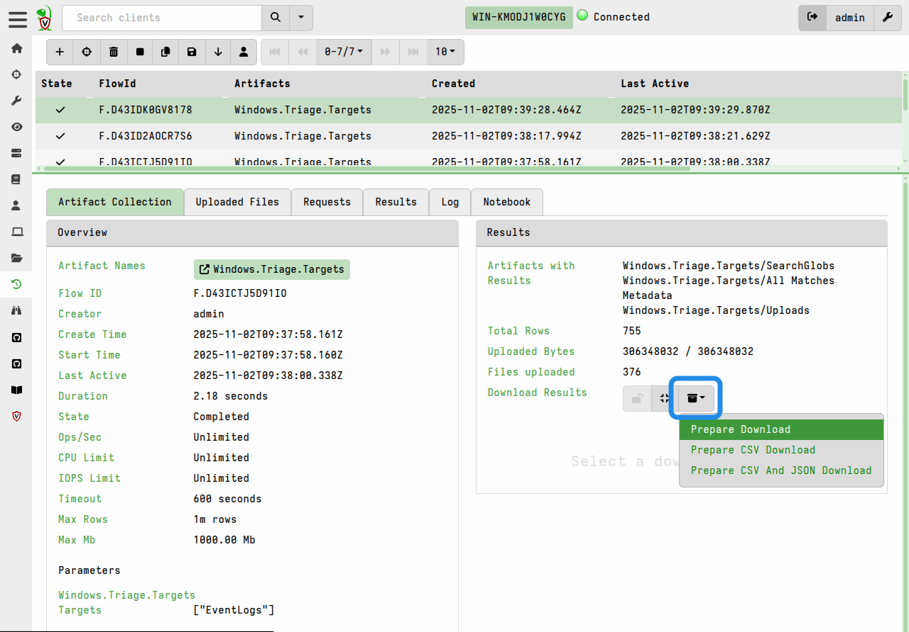
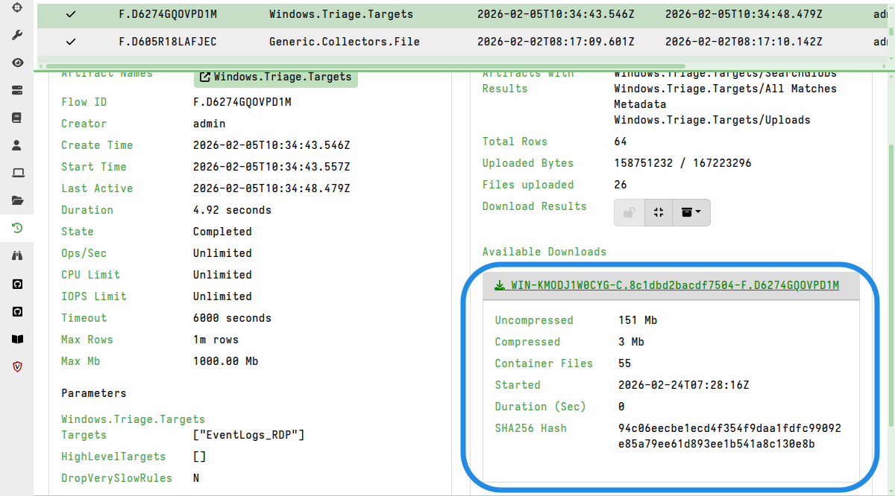
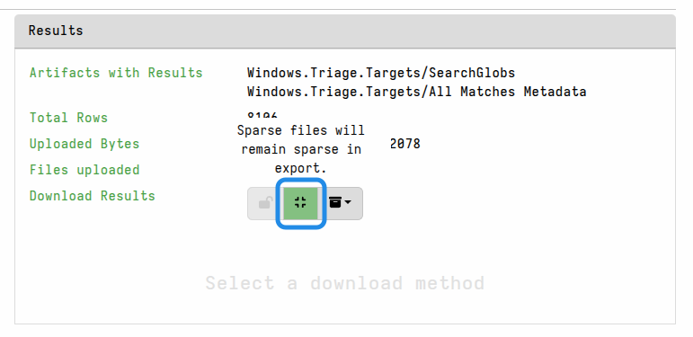

As described in the
[accessing file uploads on the server]()
section, file uploads can be individually downloaded from the GUI.

However, [bulk file collections]() that
upload many files will sometimes need to be exported in bulk for purposes such
as external analysis or evidence preservation.

This section explains how to export uploaded files in bulk from a collection or
a hunt.

## The export process

The process of exporting files in bulk involves two steps.

1. Prepare the download by clicking the **Prepare Download** button.

   This copies all files in the collection or hunt into a single
   [collection container](),
   which is a specially structured zip file that can be imported on other
   Velociraptor servers. The zip also includes all the JSON collection data -
   not just the file uploads. You can optionally choose to include the
   collection data in CSV format, in addition to the default JSON-formatted
   data.

   

2. The "Prepare Download" action creates the zip (which may take some time
   depending on the total size of all the files) and then displays a link for
   the download.

   

   It's possible to prepare multiple downloads, each with different options. In
   that case they will all be listed in the **Available Downloads** section.

For hunts, the process is similar to that described above. The only difference
is that the exported collection container will contain all the file uploads and
JSON collection data from all collections linked to the hunt.

### Keeping sparse files sparse

If you are exporting the files for a reason such as external analysis, and your
analysis tools can deal with sparse files, then you may choose to keep the files
in their sparse form. In that case you can toggle the option "Sparse files will
remain sparse in export" before preparing the download.

By default, sparse files will be padded out when preparing the download package.
This can cause certain files to grow significantly, although the zip compression
should mostly offset this size increase.



### Password-protecting exports

For additional safety during file-handling, and to prevent your local antivirus
from accidentally quarantining potential malware, you can set a password in your
[user preferences]().
This ensures that any files exported from the GUI are automatically packaged in
a password-protected zip and thereby made safe for transit to your analysis
environment.

When a download password is set, all prepared downloads (i.e. bulk exports) and
also any single-file downloads from the GUI will be have password protection
applied to the zip. This GUI indicates this with a "lock" icon button in the
**Download Results** toolbar.


Password-protected exports have the `_locked` suffix added to the download file
name.

To unset the password protection behavior, clear the download password in your
user preferences. However, for a particular download you can toggle the "lock"
icon button to not apply password protection.

{}

It takes time for the server to zip the results, and optionally pad out sparse
files. If you are preparing exports for collections or hunts that are
unusually large, then the default timeout (10 minutes) for this process may be
insufficient.

In that case, you may need to set a greater timeout value, which you can do via
the
[defaults.export_max_timeout_sec]()
setting in the server config.

There is also a default limit of 10 concurrent export preparation processes. If
your server hardware is capable of more then you might need to increase this
limit, which is done via the
[defaults.export_concurrency]()
setting in the server config.

As with any server config change, this will require a restart of the server
before the changes are in effect.

{}

## Preparing exports via VQL

You may not like always having to click the "Prepare Download" button for each
collection or hunt. As with most things in the Velociraptor GUI, we provide VQL
functions that perform the equivalent actions. In fact, most of the time your
actions in the GUI are actually performed by VQL under the hood.

In VQL, we have two functions that kick off the creation of collection archives:
- [create_flow_download]()
- [create_hunt_download]()

These functions can be used manually in notebooks, or you could create a
[server monitoring]()
artifact that automates the zip creation whenever collections that contain a
selected artifact complete.

For example:

```yaml
name: Custom.CreateFlowDownload
type: SERVER_EVENT
sources:
  - query: |
      SELECT create_flow_download(client_id=ClientId, flow_id=FlowId, expand_sparse=true)
      FROM watch_monitoring(artifact="System.Flow.Completion")
      WHERE Flow.artifacts_with_results =~ "Windows.Triage.Targets"
```

Depending on the total size of the export it may take a while to prepare, but
it will eventually appear under the collection's Available Downloads without
any manual GUI interaction.

## Generating individual file download links

In some circumstances, you might not want to export all the files from a
collection or a hunt for practical reasons. You might prefer to have a list of
download links for all the individual files. This list can be given to an
analyst who might decide to only download a subset of the files. The download of
these files can then be done using a downloader script or other HTTP download
tool.

You can create a list of download links for the file uploads associated with a
collection in a Velociraptor notebook. Typically you would do this in the
collection notebook, although it can be done in a hunt notebook of global
notebook.

This method uses the `uploads()` plugin to enumerate all the file uploads in the
collection, and then the `link_to()` function to generate a valid download link
for each file. The link is constructed using the DNS name specified by
`GUI.public_url` in the
[server config]().

The following example will generate a list of download links in a collection
notebook. You can add other columns to the query as needed.

```vql
SELECT link_to(raw=true,
               upload=dict(Components=Upload.Components,
                           StoredName=Upload.Components[-1])) AS FSLink
FROM uploads(client_id=ClientId, flow_id=FlowId)
```

The notebook results can then be exported in CSV format and given to other
analysts (who perhaps aren't familiar with Velociraptor).


It will contain links to the individual files, and these can then be fetched if
necessary using external HTTP clients (although user authentication will still
be required to download the files).

For hunts, you can use the same technique after first enumerating all the flows
associated with a hunt, and then enumerating the downloads in each flow, as
demonstrated in [this example]().

If you automate the downloads, say via a script, then you will need to ensure
that your script saves the file downloads separately for each client and
possibly also each flow. You can add additional path components to the query and
then have your external download tool use them to construct appropriate paths
for the downloads.

