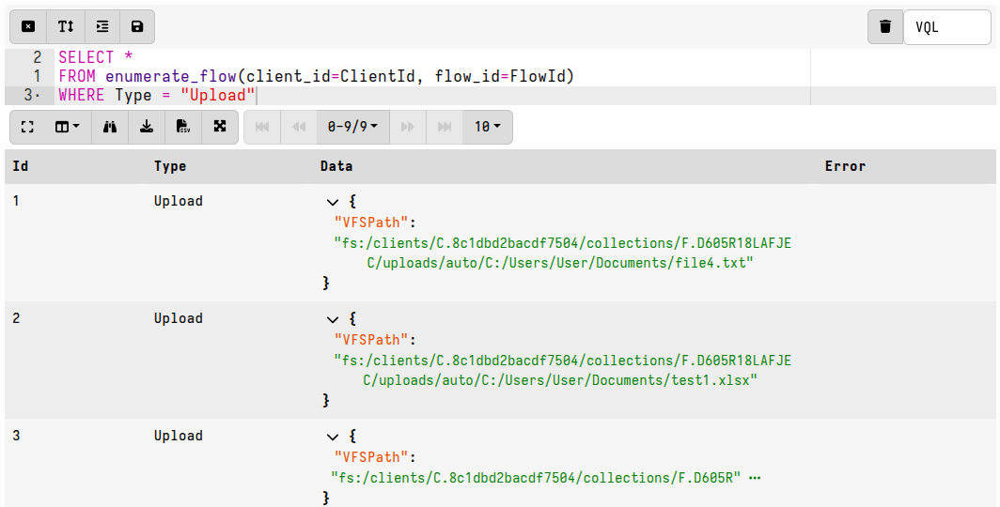
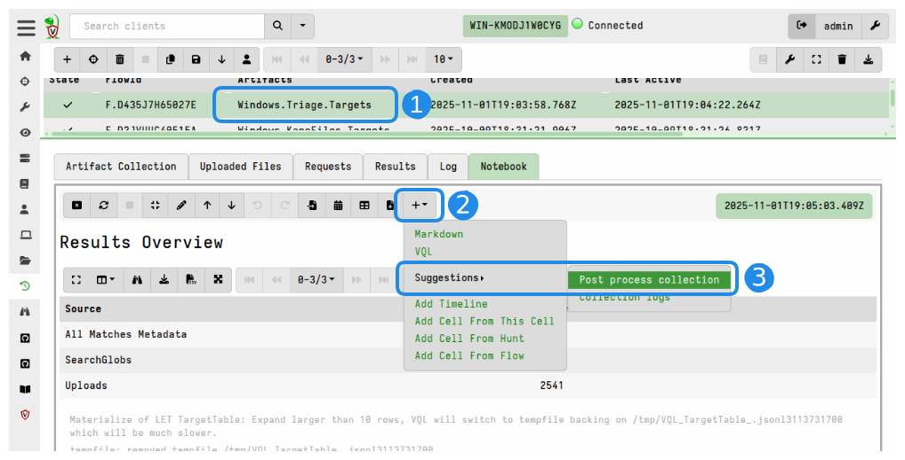
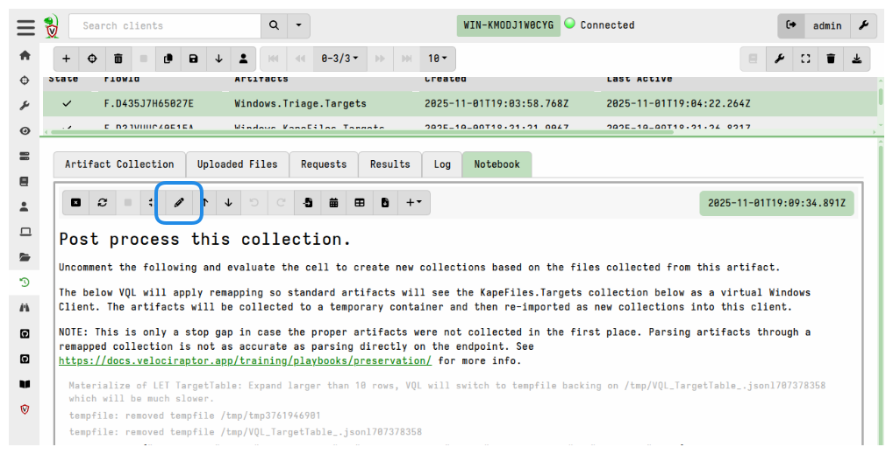
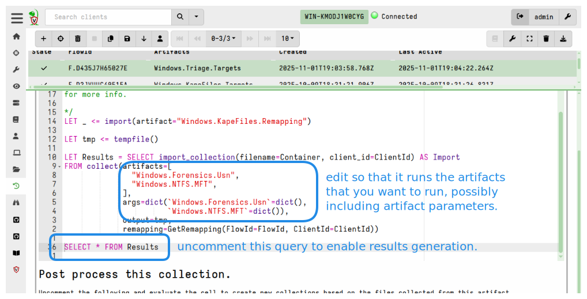
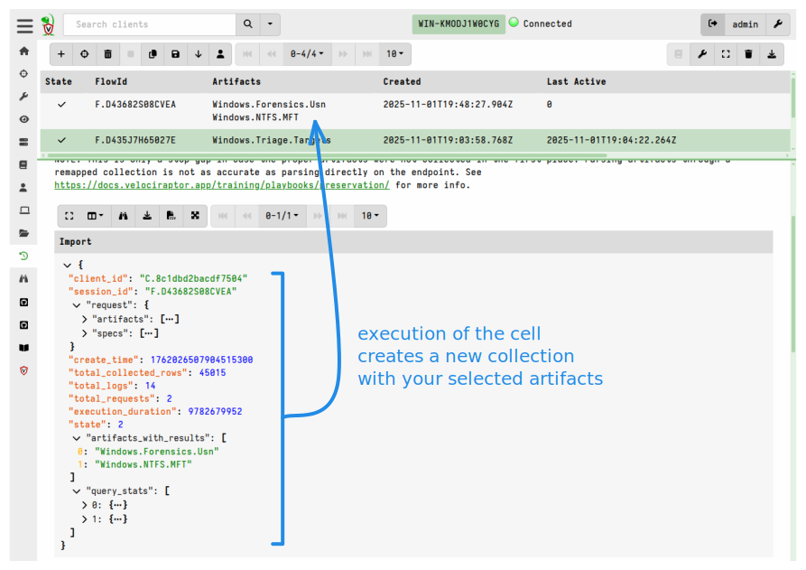
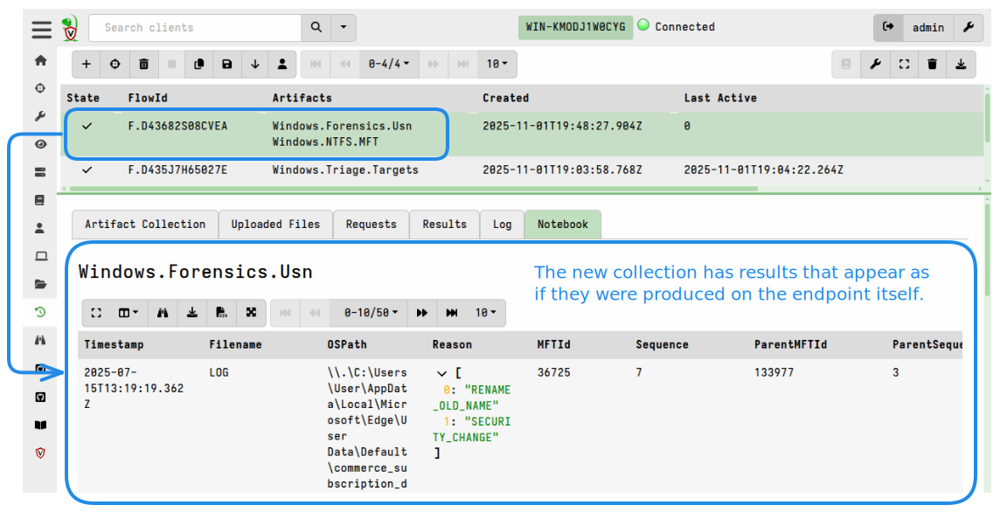

As we mentioned in previous sections, file collections are usually done for two
distinct reasons:

1. To preserve forensic evidence.
2. To allow for additional analysis on a separate system, i.e. not the original
   computer, possibly using external tools.

If you want to perform further analysis on the files collected (for example if
you forgot to run artifacts to extract the right data from those files), then it
is possible to perform post-processing on the collection's files. However this
is not recommended under normal circumstances - it's always far easier to work
with data directly on the endpoint rather than trying to extract the data from
file copies on the server.


Accessing uploaded files in notebooks

Enumerating files with the uploads plugin


If your bulk file collections used the `Windows.Triage.Targets` or
`Windows.KapeFiles.Targets` artifacts then these have a notebook cell suggestion
included for post-processing files.


This uses the `Windows.KapeFiles.Remapping` artifact to generate and apply an
appropriate remapping configuration. The artifact as well as the cell itself
contain instructions for use.

For other artifacts which collected files you can use the same post-processing
approach in a notebook using the `Windows.KapeFiles.Remapping` artifact.

For example:

```vql
LET _ <=
   SELECT * FROM Artifact.Windows.KapeFiles.Remapping(ClientId=ClientId, FlowId=FlowId)

SELECT * FROM Artifact.Windows.System.TaskScheduler()
```


### Enumerating files with the enumerate_flow plugin

The `enumerate_flow()` plugin is an alternative to the `uploads()` plugin. It
returns all files (not just uploads) associated with a collection.

It is useful in situations where you want to perform post-processing on result
files other than just uploads - for example, collection logs or JSON results.
Each file associated with a flow has a `Type` identifier.

If we filter by `Type = "Upload"` then the results are equivalent to those
produced by the `uploads()` plugin and provide us with the `vfs_path` that we
can use to access these files.

```vql
SELECT *
FROM enumerate_flow(client_id=ClientId, flow_id=FlowId)
WHERE Type = "Upload"
```



Note that the `enumerate_flow()` plugin requires that the `client_id` and
`flow_id` args are explicitly specified, even though the actual values will be
read from the VQL scope if working in a collection notebook. Also note that,
unlike `uploads()`, it does not support enumerating files across a hunt, however
you can iterate over the output of the `hunt_flows()` plugin and then use
`enumerate_flow()` to list the associated files.

### Accessing files with the filestore accessor

Once we have the the filestore path, we can then access the file itself using
any VQL function or plugin by providing it with the filestore path and telling
it to use the `fs` (filestore) accessor.

In this example, we parse a specific CSV file using the `parse_csv()` plugin.

```vql
SELECT *
FROM foreach(row={
    SELECT *
    FROM uploads()
    WHERE client_path =~ 'autoruns\.csv$'
  },
             query={
    SELECT *
    FROM parse_csv(filename=vfs_path, accessor='fs')
  })
```

### Copying files out of the filestore

From version 0.75, files in the server filestore are compressed. Post-processing
files in the filestore is easy if you're using VQL functions and plugins to
analyze them because this compression is transparent to VQL queries.

However, if you want to perform analysis using external tools, then the files
need to be copied out of the filestore first. The copy action removes the
compression.

```vql
SELECT
       copy(accessor='fs',
            filename=vfs_path,
            dest=path_join(components=['/tmp/', path_join(components=_Components)]),
            create_directories=true)
FROM uploads()
WHERE file_size > 100
```


Alternatively, you can
[disable filestore compression globally]()
which allows external tools to read file in the filestore directly. While this
is not recommended because of the significant storage benefits that the new
compression feature provides, it is equivalent to how pre-v0.75 versions
operated. The decision to do so presents a trade-off, so it depends on your
specific use case - if you rely heavily on external tools this may even be
necessary to avoid the overhead of constantly copying files out of the
filestore.

If you disable filestore compression then you can point external tools directly
at the uploaded files in the filestore. The real system path to the uploaded
files can be obtained using the `file_store()` function.

In this example, we enumerate the file uploads and then run the `ls` command
against each of them:

```vql
SELECT {
    SELECT *
    FROM execve(argv=["/bin/ls", "-l", file_store(path=vfs_path)])
    }
FROM uploads()
```

## Post-processing using remapping

To emulate the paths on the original host.


[Velociraptor Triage Artifacts project](https://triage.velocidex.com/docs/triage_artifacts/)

`Windows.Triage.Targets` and `Windows.KapeFiles.Targets`

We do not do any post processing of these files - we just collect them.

We currently do not have artifacts that produce remapping for non-Windows file
collections, although it is possible to manually craft remappings that function
similarly for Linux or macOS.


{}

Post-processing files from the server's datastore is a stop-gap measure
which can be attempted in situations where the correct artifacts were not
collected but the associated files were uploaded to the server. Parsing
collected files through a remapped collection is not as accurate and reliable as
parsing files directly on the endpoint. Some artifacts depend on co-existing
data sources that would be present on a real endpoint, and which cannot be
emulated on the server. Such artifacts may fail or produce unexpected results.

As explained [here](/docs/deployment/offline_collections/),
if you want to run the artifacts on the endpoint just add them to the collector
in addition to the artifacts that collect files.

See
https://docs.velociraptor.app/training/playbooks/preservation/ for more info.

{}


Uncomment the following and evaluate the cell to create new
collections based on the files collected from this artifact.

The below VQL will apply remapping so standard artifacts will
see the KapeFiles.Targets collection below as a virtual
Windows Client. The artifacts will be collected to a temporary
container and then re-imported as new collections into this
client.


`Windows.KapeFiles.Remapping`

1. Select the collection that contains data from either `Windows.Triage.Targets`
   or `Windows.KapeFiles.Targets`.

2. Create a cell based on the "Post-process collection" cell template. This is
   done by accessing the **Notebook** tab > **Results Overview** notebook cell >
   **Add cell** > **Suggestions** > **Post process collection.**



3. Access the cell toolbar of the newly created cell and click the **Edit**
   button.



4. Edit the VQL by uncommenting the `SELECT * FROM Results` query, as described
   in the cell notes. Also edit the VQL to run your desired artifacts rather
   than the 2 example artifacts that are there by default.








{}

collection timeout

notebook timeout

The [notebook timeout]()
can be extended via the server config, but 10 minutes is reasonable for most
notebook cell operations and the timeout is intended to protect against
poorly-constructed queries. In general if a cell needs longer than 10 minutes to
complete then you should probably consider approaching your task a different
way.

Running post-processing in a server artifact

{}


#### Limitations

- External tools cannot be used on files stored in the server's datastore, since
  the remapping only applies to VQL queries. Tools will be unaware of the
  remapping and will be unable to find the files.
