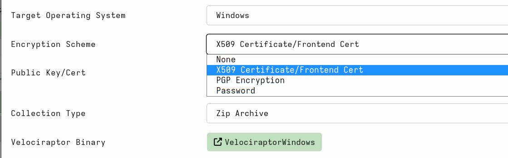
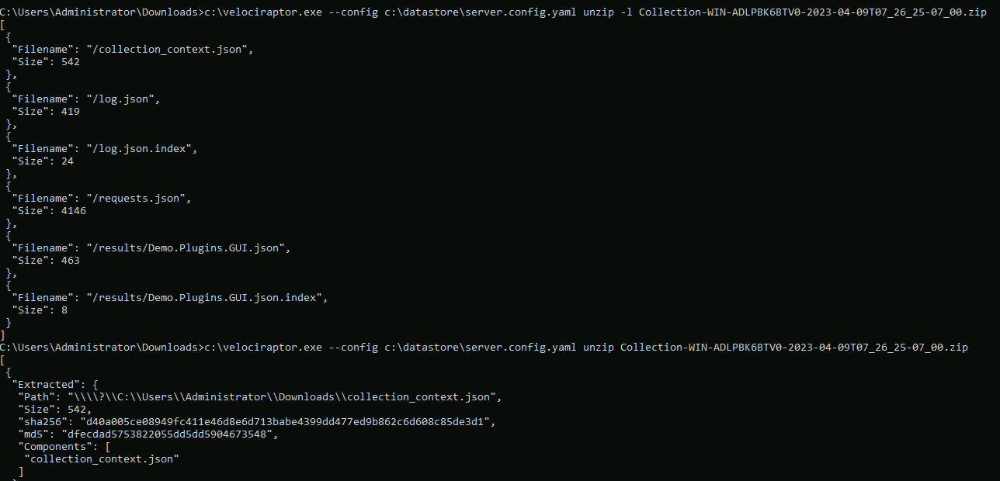

By default, Velociraptor's offline collector will create a ZIP file
containing all the collected files and artifacts. However, this zip
file is normally large and we may not want to rely on the person
collecting the data to handle sending us the archive file. Instead,
Velociraptor's offline collector can upload the collected archive to a
remote location automatically when the collection is done.


In this page we discuss how to use some of these options. The correct
option to choose in any specific scenario depends on many factors,
such as network access, cost and availability.

## Encrypting the collection

Velociraptor's artifact collections typically include a lot of
potentially sensitive information, such as logs, user activity etc. By
default the archive produced is a simple ZIP file, but we recommend
the Zip file be protected with some encryption.



### Password encryption

Velociraptor can use a ZIP password to encrypt the collected
data. Unfortunately the ZIP encryption standard does not cover the
Central Directory making it possible to see file names, sizes and
other metadata, even if the file content itself is encrypted.

To mitigate this risk, Velociraptor will create an embedded ZIP file
inside an encrypted container zip file with a fixed name (called
`data.zip`). This way the file metadata is not exposed without needing
to decrypt the embedded ZIP file.

{}

If using a fixed password to encrypt the collection, the password
needs to be embedded within the collector itself. It is easy to
extract the collector configuration (simply by running `collector.exe
config show`) and therefore the fixed password can be easily
extracted.

We recommend an asymmetric scheme to be used in practice.

{}

### X509 certificate based encryption

To avoid needing to embed the password in the collector binary,
Velociraptor offers an X509 scheme. In this scheme the Velociraptor
server embeds its public certificate in the collector binary.

The offline collector then generates a random password to encrypt the
collection archive with, and in turn encrypts this password with the
embedded public key certificate. This means **only** the server with
the corresponding private key is able to decrypt the zip file.

To use this option, simply select the `X509 Certificate` option for
the collector and leave the `Public Key/Cert` text box blank. The
produced collector will automatically encrypt the container.


The produced collection contains the encrypted data and the metadata
file that can be used to decrypt the file given the correct private
key.


To extract the X509 encrypted container you can use Velociraptor's
`unzip` command to decrypt the container automatically. You will need
to provide Velociraptor with the correct config file for the server
that created the collector in the first place. Velociraptor will use
the server's private key to decrypt the container transparently.

```
velociraptor.exe --config server.config.yaml unzip Collection-WIN-ADLPBK6BTV0-2023-04-09T07_26_25-07_00.zip
```



Alternatively, you can import the encrypted collection to the
Velociraptor server using the `Server.Utils.ImportCollection`
artifact.

{}

Due to the ease of use and enhanced security provided by the X509
encryption scheme we recommend this to be used in most cases.

Make sure that you retain the server configuration file that was used
to create the collector in the first place! It is needed to be able to
decrypt the collections.

{}

## Local Zip Archive

By default Velociraptor's collector will simply create a ZIP file and
leave it in the current directory.

In many scenarios, the collection is performed by a trusted agent
(such as a remote IT professional). In that case it is useful to
automatically upload the collection to a remote system.

The following sections document additional options and the best
practice of securing them.

## Remote Upload Destinations

When collecting evidence with the offline collector we often need to
upload large quantities of data. While cloud based uploads are
convenient they are usually slower than uploading to a local LAN and
might result in network bottlenecks as many systems in the local
network are saturating internet uplinks.

In these cases it is more convenient to set up a local `dropbox`
upload server which will collect collections from systems within local
on-premises segments instead.

There are several options for that:

1. A [Windows file share]()
   can be created on a Windows system.
2. An SFTP server can be [installed on a local Linux system]().
3. A local S3 server can be installed using
   [MinIO](https://github.com/minio/minio) - the subject of this
   article.

A common thread between these options is to ensure that credentials
are only allowed to upload new files and not download these files
again. Since the offline collector must include credentials within the
configuration file, we need to ensure these credentials can not
provide additional access to what is required.


### Google Cloud Storage

[How to set up a GCS Bucket for file uploads]()

### AWS S3 or MinIO

MinIO is a self-hosted S3-compatible server.

[How to set up a MinIO (S3-compatible) dropbox server for file uploads]()

### Azure Blob Storage

[How to set up Azure Blob Storage for file uploads]()


### SMB Share

[How to set up a SMB share for file uploads]()

### SFTP server

[How to set up a SFTP server for file uploads]()


