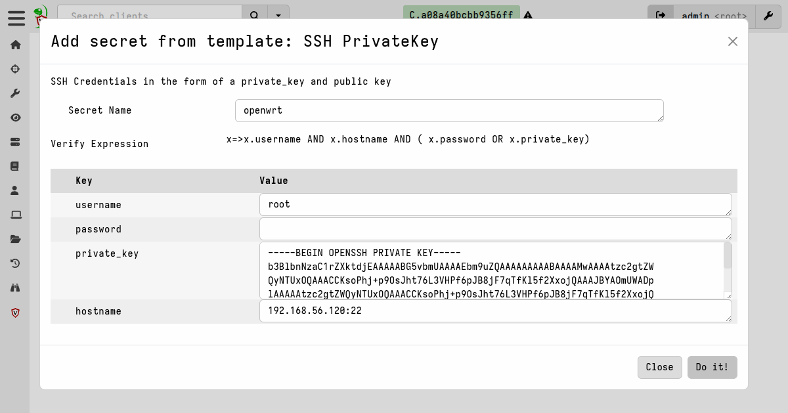
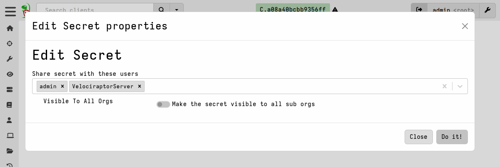
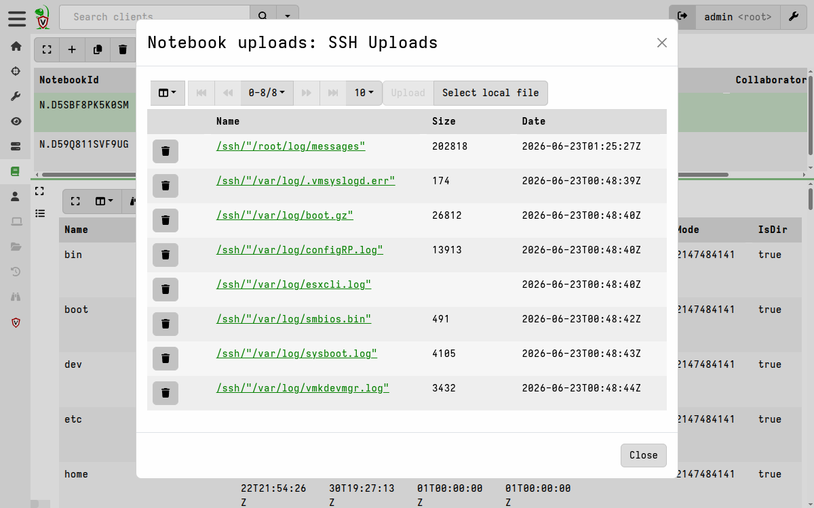
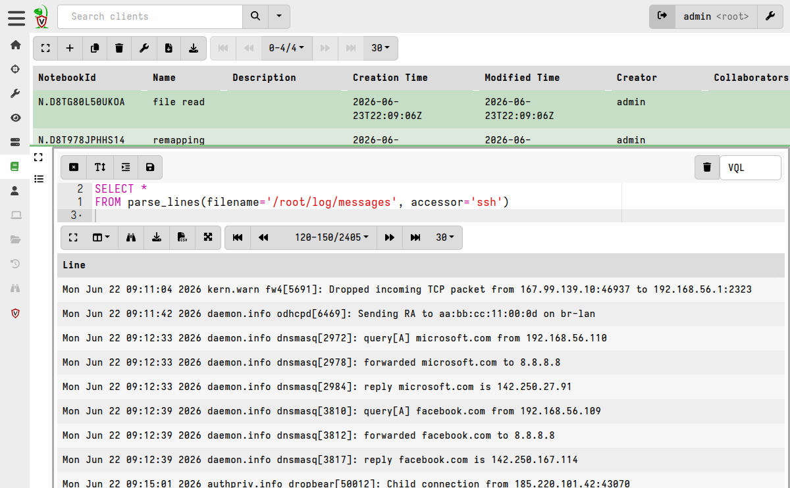
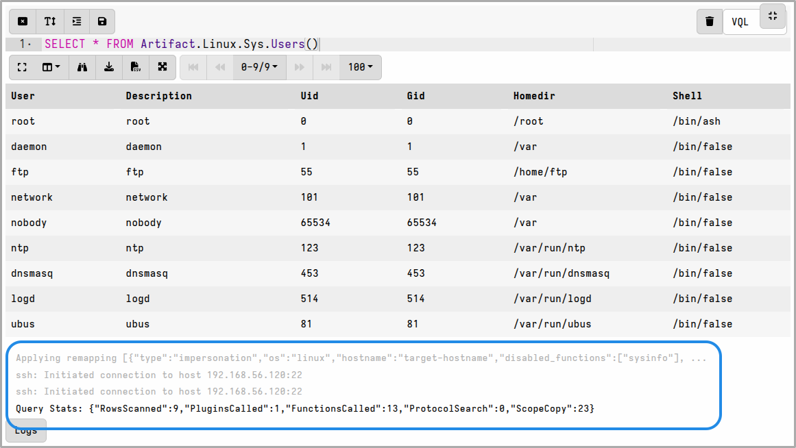
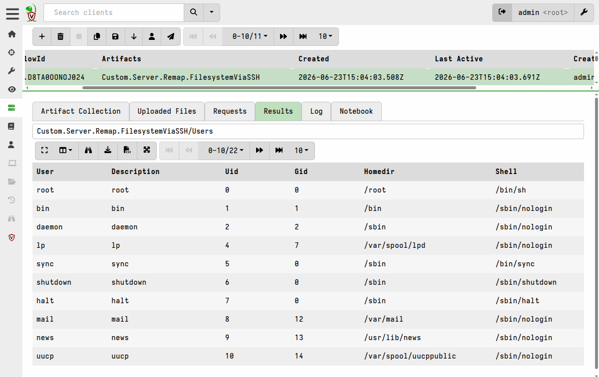
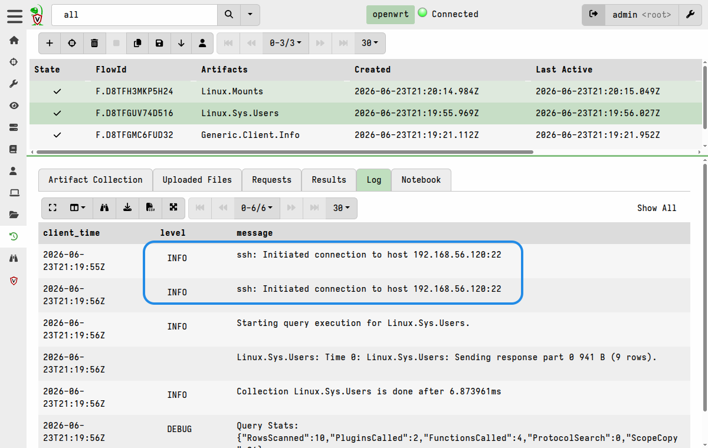

Velociraptor's [SSH accessor](/vql_reference/accessors/ssh/) allows
reading and retrieving files from a remote SSH-enabled system. This is
very useful in situations where deployment of the client on the
remote system isn't justified, or isn't technically possible (for
example, on unsupported architectures such as routers and firewalls
which nevertheless do provide filesystem access via SSH), or perhaps
where new software installations just aren't permitted.

Typically the target endpoints are Unix-like systems, as these often
have SSH access enabled, but it could also be a Windows or macOS
system where installation of a client is just not possible for either
technical, political, or other reasons.

Access via SSH allows you to read files in place on the remote system,
or retrieve them as collection uploads. One possible reason for not
wanting to deploy a client on the remote system is that it may just be
hosting files that you want to read/retrieve, such as logs on a
firewall, and you aren't interested in investigating the device
itself.

This page explains the options for running filesystem-oriented
Velociraptor queries and artifacts on systems without running a client
on them, over SSH, using Velociraptor's SSH accessor.

The SSH accessor requires that the SFTP subsystem is enabled and
running on the remote system. It's possible to have SSH access enabled
on a host _without_ SFTP in which case the SSH accessor will not work,
and in that case Velociraptor will return an access error.


{}

Accessing a remote system using the SSH accessor is essentially
equivalent to using [SSHFS](https://github.com/libfuse/sshfs), which also uses
SFTP and has the similar constraints/limitations.

- **No tool use**: The SSH accessor is used to read or retrieve remote
  files. Unlike a full client, it cannot execute arbitrary tools or
  shell commands on the endpoint. For example, the UAC collector is a
  shell script which is pushed to the endpoint when collecting the
  `Linux.Triage.UAC` artifact on a normal Linux client, however this
  or other tools cannot be used via the SSH accessor.
- **Only file-related plugins**: Plugins that return data from sources
  other than from the filesystem, for example `pslist()`, cannot
  produce data and should therefore be disabled via the remapping
  config. If you accidentally use a plugin that retrieves data from
  non-filesystem sources, then it will produce data from the local
  system rather than the remote system.
- **No access to virtual filesystems**: On Linux this means that
  reading `/proc` or `/sys` won't work since SFTP doesn't expose
  virtual filesystems.

All of Velociraptor's file-related functions and plugins can be used
with the SSH accessor. Also all other
[accessors](/vql_reference/accessors/) can be used via
[accessor remapping](/docs/forensic/filesystem/remapping/),
so existing artifacts that use specific accessors will still work,
provided that an appropriate remapping config is used.

{}

## Different approaches to using the SSH accessor

There are several ways to use the SSH accessor, each with different
trade-offs. The right approach depends on whether you are doing ad-hoc
investigation, automated collection, or something in between.

You have two main options when using SSH to access a remote system's
filesystem, and each of these has two ways in which it could be done:
1. **Using VQL on the server**, either in a
   [server artifact](/docs/artifacts/basic_fields/#-type-) or a
   [notebook](/docs/notebooks/). For simple filesystem access
   operations no remapping is required, but if you want to collect
   artifacts that depend on path remapping then you'll need to add a
   remapping to the VQL scope.
2. **Using a dedicated virtual client** with a
   [remapping config](/docs/forensic/filesystem/remapping/).
   This is a client which impersonates the SSH-accessible system and
   relays VQL queries to the remote filesystem system via SSH. This
   client could be run on the server or another machine - from the
   server's perspective its just another client.

As mentioned above, the choice of which of the above options is most
suitable depends on the specific collection requirements. For each of
them we've provided some guidance below. In general, if you want the
remote endpoint to be appear and be managed as a Velociraptor client
then you'll want to use a dedicated virtual client.


## Example Use Cases

- You have a hypervisor or container host that isn't running a
  supported platform or architecture, and you want to check it's logs
  or configuration.
- You want to retrieve firewall or router logs from a hardware
  appliance, but have no reason to investigate the device itself. You
  just want the logs that might describe actions taken by hosts that
  you are investigating.
- You want to do some once-off checks on a few Linux hosts in a
  mostly-Windows environment which doesn't justify full client
  deployment, or permanent Velociraptor presence on those hosts. Maybe
  those Linux machine are also very old and incapable of running the
  latest Velociraptor binary.

## How the SSH accessor works

The SSH accessor connects to a remote host over SSH and uses the SFTP
subsystem to provide filesystem access. You configure it by setting
the `SSH_CONFIG` VQL variable, which accepts these fields:

| Field | Description |
|-------|-------------|
| `hostname` | Remote host **and port** (e.g. `192.168.1.100:22`) |
| `username` | SSH username |
| `password` | Password authentication |
| `private_key` | Private key content (unencrypted PEM format) |
| `secret` | Name of a server secret to use instead of inline credentials |

Although credentials (`username`, `password`/`private_key`) can be
explictly passed to the accessor, this is strongly discouraged. See
the note below.

The accessor requires the `NETWORK` permission to operate.

{}

Unless you're just doing some testing in a non-production environment,
you should **always use server secrets** to store credentials for SSH,
rather than specifying them in the artifact or notebook.

For notebooks this is especially important because notebook cell
contents are saved to disk when executed, and have a default cell
history that stores the last five versions. Even for server artifacts
this is important as explicit credentials will be saved in
the VQL request where other users can see them (collections are
visible to all users in an org).

Server secrets are designed to address this exact problem: You can
create a new SSH secret, which is stored encrypted - the credentials
in it can't be viewed, even by yourself once created and saved - and
then selectively share it with other users. Users who have access to the
secret can use it but cannot view its contents.

Using a SSH secret also has the benefit of making your VQL more
succinct, as you'll see below.

**Enforcing secrets-only usage:**

Server administrators can set `VqlMustUseSecrets` in the server
configuration to require that all credentials be supplied via secrets.
When this is enabled, inline credentials (like `username` and
`private_key` in `SSH_CONFIG`) are rejected, and only `secret=`
lookups are allowed.

{}

### Creating SSH secrets

Creating an SSH secret is a simple 2-step process:

1. Define the secret.



2. Grant access to the secret. Access should be granted to the
   `VelociraptorServer` user when you need the secret to be used by
   automated (i.e. non-user-initiated) actions, for example when
   running an artifact in response to a server monitoring event.



The secret can then be referenced by its name when setting the
`SSH_CONFIG` VQL variable that the SSH accessor uses.

```vql
LET SSH_CONFIG <= dict(secret="alpine")

SELECT *
FROM glob(globs='/**', accessor='ssh')
```

As you can see, this does not expose the credentials and makes setting
the `SSH_CONFIG` variable much simpler.

If you are just doing query development on a test system, you could
specify the credentials explicitly, which would look something like
this:

```vql
LET SSH_CONFIG <= dict(
    hostname='192.168.1.100:22',
    username='admin',
    private_key=read_file(filename='/etc/velociraptor/ssh_keys/remote.key')
)
```

#### Hostname format and key requirements

- The `hostname` field must include the port (e.g. `10.0.0.1:22`).
- Private keys must be in unencrypted PEM format. Encrypted keys are
  not supported.
- The host key of the remote SSH server is not verified - it is
  trusted by default.


## Clientless collections

You can run queries and artifacts on the server itself that query a
remote host over SSH, without needing a client.

This works well for data exploration and one-off investigations but
you need to write the query from scratch each time. The advantage of
this approach is simplicity. The disadvantage is that the collection
is not associated with a client. It is most suitable for ad-hoc
queries against file data from a remote server, where you only need to
work with the data on the server and don't need it to be integrated
into standard collection workflows, such as forwarding it to an
Elastic server.

### 1. Ad-hoc VQL in a notebook (simplest option)

The most direct way is to run VQL in a **server notebook**. You set
`SSH_CONFIG` at the top of the query and then use `accessor="ssh"`
with plugins like `glob()` and `upload()`:

###### Example: File uploads in a notebook

```vql
LET ColumnTypes <= dict(`FileUpload`='preview_upload')

LET SSH_CONFIG <= dict(secret="esxi")

SELECT OSPath,
       Mtime,
       Size,
       upload(file=OSPath, accessor="ssh") AS FileUpload
FROM glob(globs='/var/log/*', accessor='ssh')
```

The example above uploads files from `/var/log/` on the remote host to
the Velociraptor server, using the SSH accessor for both file
discovery and upload.



The `ColumnTypes` variable causes the notebook to render the
`FileUpload` column as the `preview_upload` type, which then allows
you to use the GUI's File Inspector utility to view the file contents.

###### Example: Reading a file over SSH

With functions and plugins that support accessors, you can use the
`ssh` accessor to do analysis on the files in-place.

If you're doing a lot of queries in a notebook against the same remote
filesystem, you can create a
[notebook template](/docs/notebooks/templates/)
that includes an [export](/docs/artifacts/export_imports/) section.
VQL in the `export` section is executed before each cells runs, so it
is a convenient way to share the SSH connection information between
notebook cells.

```yaml
name: Custom.Notebook.SSH
type: NOTEBOOK

export: |
  LET SSH_CONFIG <= dict(secret="openwrt")

# Define the cells that make up the notebook
sources:
  - notebook:
    - type: vql
      name: File Read
      template: |
        SELECT *
        FROM parse_lines(filename='/root/log/messages', accessor='ssh')
    - type: vql
      name: File Upload
      template: |
        SELECT OSPath,
        Mtime,
        Size,
        upload(file=OSPath, accessor="ssh") AS FileUpload
        FROM glob(globs='/root/log/messages', accessor='ssh')
```

When a new notebook is created from this template, it will prepend the
VQL in the `export` section` to the VQL in each cell before executing
it. In this example the notebook cell will be immediately populated
with lines read from the target log file, via SSH.



### 2. Artifact collections via notebooks

For Linux system, most artifacts are file-based, so you can run them
in a notebook by simply using the
[Artifact](/docs/artifacts/calling_artifacts/) plugin, for example:

```vql
SELECT * FROM Artifact.Linux.Sys.Users()
```

However, the standard artifacts default to the `auto` accessor for
file access, which tries to use the `file` accessor with fallback to
`ntfs` on Windows. The artifacts don't know that they should use the
`ssh` accessor. So we need a remapping config applied to the notebook
scope that intercepts regular file access and substitutes it with SSH
access.

Following the pattern of the previous example, let's create another
notebook template that includes the needed remapping config in it's
`export` section. This will then be applicable to all cells in the
notebook.

The remapping config remaps the remote filesystem tree from `/`, and
disables functions and plugins that will either not work or give
misleading results due to being run on the local system rather than
the remote host.

```yaml
name: Custom.Notebook.OpenWrtViaSSH
description: Maps the filesystem from host openwrt via ssh accessor remapping
type: NOTEBOOK

export: |
  LET remapping <= remap(
      config=dict(
        remappings=(
          dict(
            type="impersonation",
            os="linux",
            hostname="target-hostname",
            disabled_plugins=("execve", "http_client", "pslist", "connections", "netstat", "filesystems", "partitions", "proc_yara"),
            disabled_functions=("sysinfo", )),
          dict(
            type="mount",
            scope='LET SSH_CONFIG <= dict(secret="openwrt")',
            `from`=dict(
              accessor="ssh",
              prefix="/"),
            `on`=dict(
              accessor="auto",
              prefix="/",
              path_type="linux")),
          dict(
            type="mount",
            scope='LET SSH_CONFIG <= dict(secret="openwrt")',
            `from`=dict(
              accessor="ssh",
              prefix="/"),
            `on`=dict(
              accessor="file",
              prefix="/",
              path_type="linux")))))

  LET ColumnTypes <= dict(`FileUpload`='preview_upload')

# Define the cells that make up the notebook
sources:
  - notebook:
    - type: vql
      name: Call an artifact
      template: |
        SELECT * FROM Artifact.Linux.Sys.Users()
```

When a notebook is created from this template, the remapping applies
and queries run against the filesystem of the remote host over SSH.



You can create more cells and each of them will inherit the remapping
config, so it's basically the same as running artifacts live on the
remote host.

### 3. Server artifacts (reusable across multiple SSH hosts)

Since notebook templates are just artifacts, it's easy to adapt the
previous example into a **server artifact**. However, to make it
reusable for other hosts we can parameterize some of the values used
in the remapping config.

Notice that we cannot keep the remapping in the `export` section of
the artifact, as we did in the previous example, because VQL in
`export` cannot use artifact parameters. We can, however, add it to a
source so that it's available to all subsequent sources. The
`format()` function is used to replace values in the remapping config
with parameter values.


```yaml
name: Custom.Server.Remap.FilesystemViaSSH
description: Remaps the filesystem from remote hosts via the ssh accessor and runs some artifacts
type: SERVER

parameters:
  - name: hostname
    default: alpine
  - name: secretname
    default: alpine
  - name: RemappingTemplate
    default: |
      remappings:
      - type: impersonation
        os: linux
        hostname: %q
        disabled_plugins:
          - execve
          - http_client
          - pslist
          - connections
          - netstat
          - filesystems
          - partitions
          - proc_yara
        disabled_functions:
          - sysinfo

      - type: mount
        scope: |
          LET SSH_CONFIG <= dict(secret=%q)
        from:
          accessor: ssh
          prefix: /
        on:
          accessor: auto
          prefix: /
          path_type: linux

      - type: mount
        scope: |
          LET SSH_CONFIG <= dict(secret=%q)
        from:
          accessor: ssh
          prefix: /
        on:
          accessor: file
          prefix: /
          path_type: linux

sources:
  - name: Remap
    query: |
      LET remapping <= remap(config=format(format=RemappingTemplate,
                             args=[hostname, secretname, secretname]), clear=TRUE)
      SELECT * FROM info()
  - name: Users
    query: |
      SELECT * FROM Artifact.Linux.Sys.Users()
  - name: Mounts
    query: |
      SELECT * FROM Artifact.Linux.Mounts()
```



As with the notebook examples, you can use the `upload()` function, or
any artifacts that use the `upload()` function, and the files will be
uploaded to the server and attached to the collection.

### 3. Dedicated virtual client with SSH accessor remapping

If you want the SSH-accessible host to look and behave like a real
client, that is: participate in hunts, be selectable in the GUI, etc.
then the best option is to run a dedicated client for it that uses a
remapping config file and impersonates the SSH-accessible system.

The dedicated client can run anywhere, provided it can reach the SSH
target _and_ the Velociraptor server. You may choose to run such
dedicated "virtual" clients on the server itself, if resources permit
that.

If the client is impersonating systems in a DMZ then you may
choose to have a dedicated machine in the DMZ which runs multiple
virtual clients, and then the only network connectivity requirement
will be a single TCP port from that machine to the Velociraptor
server (rather than needing to allow all hosts in the DMZ access to the
Velociraptor server).

Because the virtual client is impersonating the target host and
operating system, with SSH remapping the filesystem, it does not have
to match the target host's platform or architecture. You can run
virtual clients on a Windows host that impersonates SSH-accessible
Linux hosts, or any other combination you can think of.

Secrets may only be used on the server, but the virtual client needs
to be able to run autonomously, which means the remapping file
has to contain explicit credentials for accessing the SSH target. You
therefore need to secure the virtual client host and the remapping
file which contains the credentials to the same degree that you would
for any other SSH keys.

###### Example: Creating a virtual client for an SSH-accessible OpenWrt router

1. Create a remapping YAML file, `remap_openwrt.yaml`, with a
   remapping config similar to this:

```yaml
remappings:
  - type: impersonation
    os: linux
    hostname: openwrt
    disabled_plugins:
      - execve
      - http_client
      - pslist
      - connections
      - netstat
      - filesystems
      - partitions
      - proc_yara
    disabled_functions:
      - sysinfo

  - type: permissions
    permissions:
      - COLLECT_CLIENT
      - FILESYSTEM_READ
      - FILESYSTEM_WRITE
      - READ_RESULTS
      - MACHINE_STATE
      - NETWORK

  - type: mount
    scope: |
      LET SSH_CONFIG <= dict(hostname='192.168.56.120:22',
              username='root',
              private_key=read_file(filename='/home/me/Sync/zxcv/servers/velociraptor/datastore4/id_ed25519_openwrt'))
    from:
      accessor: ssh
      prefix: /
    "on":
      accessor: auto
      prefix: /
      path_type: linux

  - type: mount
    scope: |
      LET SSH_CONFIG <= dict(hostname='192.168.56.120:22',
              username='root',
              private_key=read_file(filename='/home/me/Sync/zxcv/servers/velociraptor/datastore4/id_ed25519_openwrt'))
    from:
      accessor: ssh
      prefix: /
    "on":
      accessor: file
      prefix: /
      path_type: linux

  - type: shadow
    from:
      accessor: zip
    "on":
      accessor: zip
  - type: shadow
    from:
      accessor: data
    "on":
      accessor: data
```

   The `impersonation` section tells the client to impersonate a Linux
   system named `openwrt`.

   The two `mount` rules replace both the `auto` and `file` accessors
   with the `ssh` accessor, so every file read operation goes through
   SSH. It also specifies that Linux paths are expected, which is
   necessary if the virtual client is running on Windows, for example.

   The `shadow` rules allow pass-thru for other commonly used
   accessors.

   The `disabled_functions` and `disabled_plugins` sections tell the
   client not to use these as they would produce results from the host
   machine rather than the remote SSH system.

2. Start the virtual client:

   ```bash
   $ velociraptor client -v --remap /path/to/remap_openwrt.yaml \
       --config /path/to/client.config.yaml \
       --config.client-writeback-linux=/path/to/openwrt.writeback.yaml \
       --config.client-local-buffer-disk-size=0
   ```

   The `--config.client-writeback-linux` flag is used to persist the
   client's ID using a unique persistent writeback file. This
   overrides the default specified in the client config. If you have
   multiple virtual clients running on the same host then ensure that
   each one has a unique writeback file.

When the virtual client is running, the server sees it as a normal
online client. You can:
- Browse its filesystem in the VFS browser
- Run client artifacts that use `auto` or `file` accessors
- Use the hunt manager to task it with collections like any other
  client
- Upload files from the remote system to the server



You won't be able to run any queries on the client that require
executables (i.e. no `execve()` or shell commands), or that make OS
system calls on the remote system, since the SSH accessor provides
filesystem-only access.

In the above example, the client is being run manually on the command
line. For a persistent client you'd need to set it up as a service and
then modify its service configuration file to add the additional CLI
arguments. Alternatively you could create a custom client config file
for the virtual client that uses a hardcoded unique writeback file and
the remapping can be included in the client config (remappings are
actually just a separate section of config that gets merged when using
the `--remap` flag).


## Resource consumption

Because the SSH accessor streams file data over the network for every
read operation, it can be slower than a local Velociraptor client.
Consider using the
[resumable uploads](/docs/file_collection/#resumable-uploads)
feature for large file transfers over unstable network connections.

