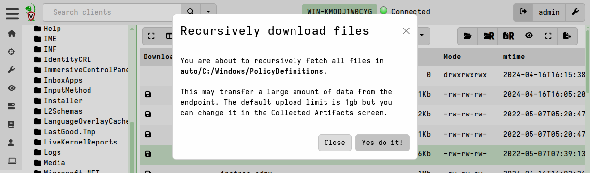
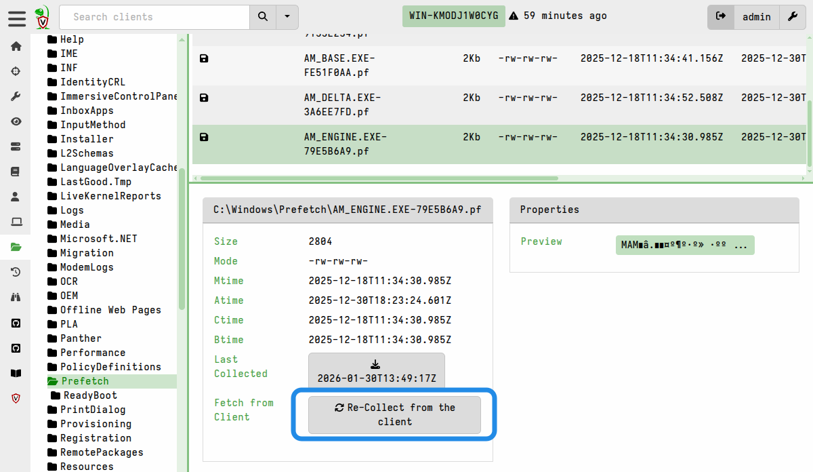
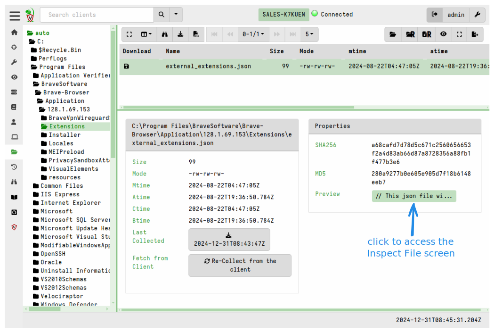
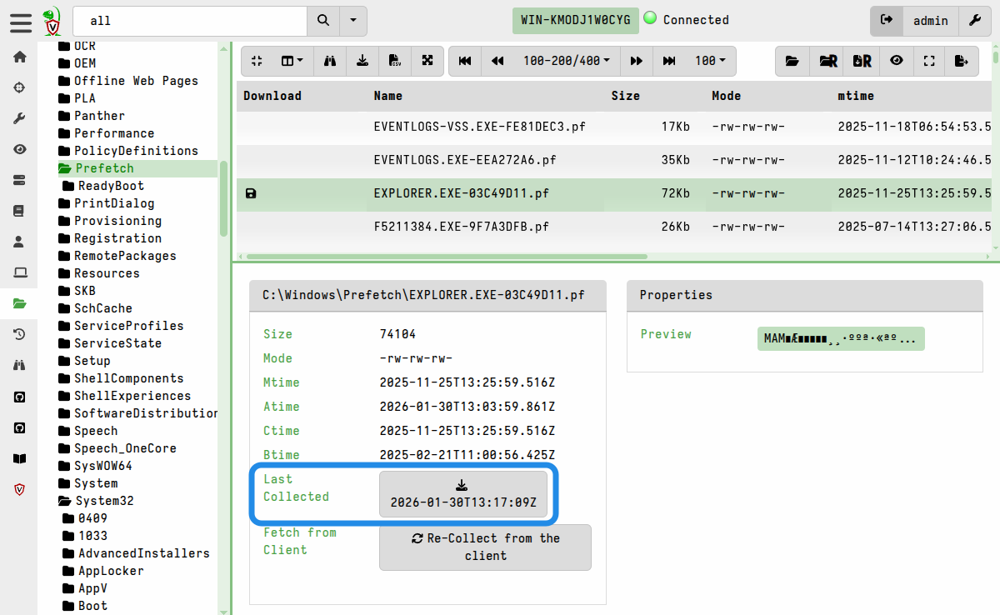
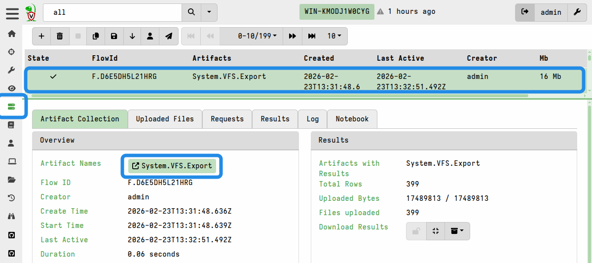
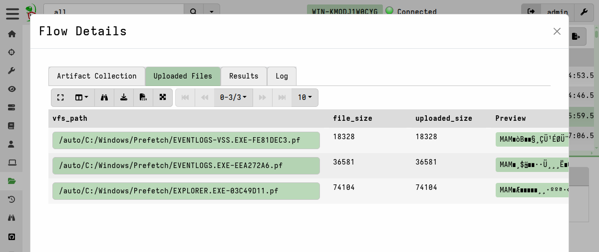

In Velociraptor, the Virtual File System (VFS) browser provides a server-side
cached view of an endpoint's filesystem. Unlike a traditional network mount, the
VFS is actually a server-side cache that presents a snapshot of the files and
directories collected from the client. Because it is a cache, you can browse
previously collected directory structures and files even when the endpoint is
offline.

In the VFS browser there are two main operations:
- Generating directory listings of the client's filesystem.
- Uploading files from the client, individually or in bulk.

The VFS browser also supports Windows registry access, but here we are only
discussing operations on the conventional filesystem. Registry access is
functionally identical to filesystem access and we essentially treat the
registry as just another filesystem (which it
[arguably](https://rwmj.wordpress.com/2010/02/18/why-the-windows-registry-sucks-technically/)
is), with registry values being treated as files. This means that all the
filesystem operations discussed here can also be applied to the Windows
registry.

## Uploading a single file

Before you can upload a file, you need to navigate to its directory in the VFS
tree. To do this, you enumerate the filesystem contents using the **Refresh this
directory** button in the VFS browser. You can repeat this step to incrementally
navigate deeper into the filesystem tree. There is also a button to enumerate
the filesystem recursively, but that will take longer and could be unnecessary
if you are only interested in a specific directory's contents.

To _upload_ a file from an endpoint into the VFS cache, you click the **Collect
from the client** button within the VFS interface.

- Clicking this button initiates a collection on the endpoint using the
  [`System.VFS.DownloadFile`]()
  artifact. This artifact uses the `upload()` VQL function to transfer files
  from the client to the server.

- The client divides large files into chunks and pushes them to the server via
  HTTP POST messages over a persistent communication channel.

- Once successfully received, the server stores the file in its filestore, and a
  floppy disk icon appears next to the filename in the VFS view to indicate a
  local copy is now available for inspection. Files that have been successfully
  cached on the server are marked with a **floppy disk** icon in the GUI.

- Files are stored (compressed by default since v0.75) in the server's
  filestore, but can be exported for external analysis. When exporting files,
  the native compression is removed.

In addition to collecting individual files, you can also upload an entire
directory, including subdirectories, to the server in a single
`System.VFS.DownloadFile` collection, as explained in the next section.

## Recursively collecting directories

You can recursively sync (that is, upload) an entire directory to the VFS cache,
although this may result in transferring large volumes of data. Use this feature
sparingly, and only after carefully considering the potential impact of this
action.

1. To do this, you first enumerate the filesystem contents using the **Refresh
   this directory** button in the VFS browser. You can repeat this step to
   incrementally navigate deeper into the filesystem tree. There is also a
   button to enumerate the filesystem recursively, but that will take longer and
   could be unnecessary if you are only interested in a specific directory's
   contents.

2. Once you have navigated to a point in the directory structure where you want
   to start the recursive collection, click the "Recursively download this
   directory from the client" button.

   

   Initiating this action will display a warning message to confirm the action
   that it will take.

   

## Re-collecting files

It's possible that the directories or files might have changed on the endpoint
since you last enumerated the directories or uploaded the files. When you are
using the VFS browser you are actually working with data that the server already
has, that is you are working with the server's VFS cache. Although it presents a
view of the endpoint's filesystem, it is not a live view.

If the file is likely to have changed since you collected it, for example in the
case of log files, then you can fetch the file again using the
**Re-collect from the client** button.

Similarly, you may need to refresh the directories if you have reason to suspect
that they might have changed since your last collection.

You can also perform another recursive sync to re-collect all files in a
directory, but be aware that this results in duplicate files being stored on the
server. Although the VFS browser always presents you with the latest collected
copy of any file, the filestore also retains all previously collected copies.
This may be useful if your intention is to capture point-in-time copies of
certain files, but if used carelessly it can result in a lot of wasted disk
space on the server.

{}

One of the most powerful features of Velociraptor's file collection is its
ability to automatically bypass operating system file-locking and other
restrictions on Windows endpoints. This is thanks to Velociraptor's modular
[accessor]()
architecture.

By default, Velociraptor uses the `auto` accessor. On Windows, this accessor
first tries to use standard OS APIs to read a file, but if the file is locked by
another process (as a registry hive or the pagefile usually are, for example),
then it automatically falls back to the `ntfs` accessor. This allows the client
to parse the raw NTFS filesystem and extract file data directly from the disk,
thus bypassing the OS file locks.

{}

## Inspecting collected files in the GUI

Once cached, you can inspect collected files directly in the GUI using its
built-in **File Inspector** viewer, which allows you to view the file contents
as hex or plaintext, view file metadata, and perform basic operation such as
search on the file data.

To open the File Inspector, select a file and then click the Preview link
which you'll find under its **Properties** tab.

Because you are inspecting a server-side copy of the file, you can do this
regardless of whether the client is online or not. Similarly for exporting
these files, as we'll explain next, the client's online status is irrelevant.

## Exporting collected files

In the VFS browser, you can download the collected files from the server's
filestore to your local workstation. You might want to do this for external
analysis or other purposes.

You can download files individually or export them in bulk.

#### Password-protecting downloads

For additional safety during file-handling, and to prevent your local antivirus
from accidentally quarantining potential malware, you can set a **downloads
password** in your [user preferences]().
This ensures that any files exported from the VFS or anywhere else in the GUI
are encrypted and thereby made safe for transit to your analysis environment.

When a download password is set, all prepared downloads (i.e. bulk exports) and
single-file downloads will be zipped and password-protected. To unset this
behavior, clear the download password in your user preferences.

### Downloading files individually

A single file can be downloaded using the button that's located alongside `Last
Collected`, or by right-clicking on any table row that has a floppy disk icon.

The timestamp displayed on the download button serves as a reminder that you
will be downloading the file _as it was at the time it was collected_. If you
have reason to think that the file might have changed then you may decide to
[re-collect it]() so that you have an up to
date copy in the VFS cache.

### Exporting files in bulk

The process of exporting files in bulk always involves two steps, and optionally
a third step if you want to download all the files at once.

1. Prepare the download by clicking the **Prepare Download** button.

   

   This copies all files in the target folder (by default, the currently
   selected directory in the VFS tree, and its subdirectories) into a single
   flow using the `System.VFS.Export` server artifact. You can specify your own
   glob pattern if you want the export to only include certain files, or if you
   don't want to include subdirectories (in which case the glob pattern should
   be `/*`). Only files which are cached in the server's filestore will be
   included - it does not initiate any new file uploads from the client.

2. The "Prepare Download" action creates a new server collection which copies
   the targeted files. It then displays a link to the flow. Click on it to view
   the flow.

   

   Since the export creation process is implemented as a server collection, you
   can also find it by navigating to the collection listings on the **Server
   Artifacts** screen. This is useful if you decide to navigate away to do
   something else in the GUI and come back to the prepared download later.

   

   There are two ways to download the files from this newly-created collection:

   - Files can be individually downloaded from the flow's **Uploaded Files** tab.

     

   - or they can all be packaged into a single downloadable zip container using
     the **Download Results** button on the flow's **Artifact Collection** tab.
     This option is explained in more detail in
     [Exporting Files]()

     

## Advanced Options

### Setting resource limits

Since the VFS file upload actions are implemented as artifact collections under
the hood, they are subject to the default collection limits - the most relevant
to VFS uploads being a 1 GB size limit and a 10 minute timeout.

If a VFS collection times out or fails due to reaching the default limits, you
can re-run the collection with increased limits: navigate to the client's
collections list and copy the failed collection, but increase the resource
limits before launching it.

Resource limits are explained in more detail
[here]() and
[here]().

### Enabling resumable uploads for VFS collections

By default, this resumable uploads are not enabled for the
`System.VFS.DownloadFile` artifact which is the underlying file collection
artifact used in the VFS browser interface.

If a VFS file transfer fails, you can retry it with the resumable upload
option enabled. To do this:
1. go to the client's collections list
2. copy the failed collection
3. enable the `UPLOAD_IS_RESUMABLE` parameter on the Configure Parameters screen
4. (re)launch the collection.

As discussed [here](),
resumable uploads are only suited to certain situations which is why the feature
is not enabled by default.
