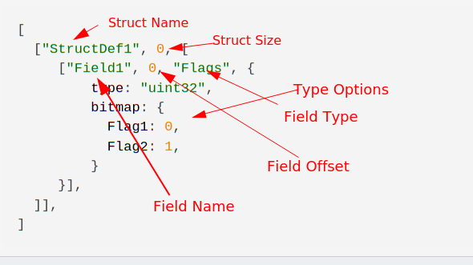

Parsing binary is a very important capability for forensic analysis and
DFIR - we encounter binary data in many contexts, such as file
formats, network traffic and more.

Velociraptor uses VQL to provide the flexibility for users to be able
to craft a VQL query in order to retrieve valuable machine state
data. Sometimes we need to parse binary data to answer these
questions.

While binary parsers written in Golang are typically the best options
for speed and memory efficiency, the need to compile a parser into an
executable and push it to the endpoint makes it difficult to implement
adhoc parsers. Ideally we would like to have a parser fully
implemented in VQL, so it can be added to an artifact and pushed to
the endpoint without needing to recompile and rebuild anything.

## Why parse binary data?

The term `serialization` refers to the process of converting data into
a suitable form for storage or transmission. During runtime, a program
represents data with an abstract type - for example integer, float,
string etc.

When the program needs to transfer the data, either to storage or over
the network, data needs to be `serialized`, i.e. converted into binary
form. When reading the data, the reverse process occurs and binary
data is interpreted (or `unserialized`) to recover the original
abstract types.

Ultimately there is a correspondence between the binary data and the
abstract object stored in it. The most important thing to understand
about serialization is that there is no single way to interpret
binary data into meaningful information - each type has its own
interpretation and serialization method. The same binary data may be
interpreted in different ways and produce valid types!

Consider a `uint64` type. When serialized, the value is packed into 8
binary bytes in little endian order. Those same 8 bytes may be
interpreted as a string, 2 `uint32` integers or any number of
different types - there is nothing inherently special about the 8
bytes of binary data that indicate what they mean.

Ultimately, parsing binary data is about extracting semantic meaning
from the binary data - this encodes interpretation and understanding
of what the serialized data means. Not all fields need to be
understood to be able to extract useful meaning from the data -
partial parsing is still very valuable.

### What is a binary parser?

At a high level a binary parser is a tool we use to extract meaning
from binary data. The parser encodes semantic information about what
each byte in the binary sequence means. It really emulates the
software that usually reads the data by constructing something similar
to the original (often closed source code) meaning. Sometimes not all
the information is known or can be interpreted - so parsers can be
incomplete.

Parsers typically fall into two general types: `Procedural` and
`Declerative`.

A procedural parser is written as a sequence of actions (i.e. code)
that pulls information from the binary data and reports some semantic
information about that data. On the other hand, a declarative parser
seeks to explain the meaning behind each field and decode it based on
the type of the field.

An example might illustrate the difference between the two
approaches. Suppose a program encodes a sequence of flags in an 8 bit
integer - one flag per bit. A procedural parser might be coded as:

```
value = parse_uint8(data, offset=0)
if value & 0x1:
   print "Flag 1"
if value & 0x2:
   print "Flag 2"
if value & 0x4:
   print "Flag 3"

etc...
```

The parser consists of a sequence of steps that report the flag values
by calculating which bit is set.

On the other hand, a declarative parser aims to convey the meaning
behind the data. Since storing flags in a bitmap is such a common
serialization primitive, a declarative parser will just declare:

```yaml
name: "FlagField"
offset:0
type:"uint8"
choices:
   Flag 1: bit 0
   Flag 2: bit 1
   Flag 3: bit 2
...
```

{}

Although the original program may or may not be written in C, we often
refer to concepts as implemented in the C language simply because it
was implemented first. Many of the common serialization primitive are
also declarative in C - for example flags can be declared as
[bitfields](https://en.cppreference.com/w/cpp/language/bit_field):

```c
struct FlagField {
  uint8 Flag1: 1;
  uint8 Flag2: 1;
  uint8 Flag3: 1;
}
```
{}

The Velociraptor binary parser is **declarative** - it consists of
high level declarations of how the data is to be laid out in the
binary blob, rather than code to extract the data. This is an
important distinction - quite often when reading other parsers written
in the procedural style you will need to understand what the field
actually represents before you can implement the parser in
Velociraptor!

## Parsing structs

In the C language a collection of related fields is called a `struct`
(While other languages may refer to this using a different name we
will refer to it using `struct`). A struct typically contains specific
named fields with each field having a specific meaning and type.

Structs are usually serialized by serializing each field one after the
other as binary data. Typically each field ends up at a specific
offset from the start of the struct.

The binary parser is driven by a json data structure called a
"Profile". A Profile is simply a data driven description of how
structs are laid out and how to parse them.

In order to use the parser, one simply provides a profile definition,
and a file (or data blob) to parse. The parser is given an offset and a
struct to instantiate. Here is an example of VQL that parses a single
`Header` struct from the start of the file. The struct has 2 members,
the `Signature` is a string of length 10 bytes starting from offset 0,
and the `Length` is a 4 byte little endian integer located at offset
20.

```vql
LET Profile = '''
[
   ["Header", 0, [
      ["Signature", 0, "String", {
         "length": 10
      }],
      ["Length", 20, "uint32"],
   ]],
]
'''

SELECT parse_binary(
   profile=Profile,
   filename='/path/to/file', struct='Header')
FROM scope()
```

## Profile description.

Profile descriptions are supposed to be easy to understand and quick
to write. It is a way of describing how to parse a particular binary
type at a high level.

A profile is a list of struct definitions. Each struct definition
contains the name of the struct, its size and a list of field
definitions.

In turn field definitions are a list of the field's name, its offset
(relative to the start of the struct), and its type followed by any
options for that type.

Typically a profile is given as JSON serialized string.



Here is an example of a profile with two structs:

```json
[
  ["Header", 0, [
    ["Signature", 0, "String", {
       "length": 13
    }],
    ["CountOfEntries", 14, "uint32"],
    ["Entries", 18, "Array", {
        "type": "Entry",
        "count": "x=>x.CountOfEntries"
    }]
  ]],
  ["Entry", "x=>x.ModuleLength + 20", [
    ["Offset", 0, "Value", {"value": "x=>x.StartOf"}],
    ["ModuleLength", 8, "uint32"],
  ]],
]
```

In the above example:

1. There are two struct definitions - for one called `Header` and one
   called `Entry`.

2. The size of the header is not specified (it is 0). The size of a
   struct becomes important when using the struct in an array.

3. The `CountOfEntries` field starts at offset 14 into the struct and it
   is a `uint32`.

4. The `Entries` field starts at offset 18, and contains an array. An
   array is a collection of other items, and so it must be initialized
   with the proper options. In this case the array contains items of
   type "Entry".

5. The count of the array is the number of items in the array. Here it
   is specified as a lambda function.

### Lambda functions

Lambda functions are VQL snippets that calculate the value of various
fields at runtime. The Lambda is passed the struct object currently
being parsed, and so can simply express values dependent on the
struct's fields.

In the above example, the count of the array is given as the value of
the field CountOfEntries. This type of construct is very common in
binary structures (where a count or length is specified by another
field in the struct).

The definition of the Entry struct is given above. The size is also
given by a lambda function, this time, the size of the entries is
derived from the ModuleLength field. Note how in the above definition,
the Entries field is a list of variable sized Entry structs.

Note that a lambda function is just VQL and has access to any VQL
functions or plugins available in the scope. Within an artifact lambda
functions also have access to any artifact parameters.

{}

Since the binary parser is declarative, a lambda function simply
declares that the value of the entity will be calculated based on this
formula - lambda function are only evaluated when needed in a lazy
fashion.

There is no problem in declaring fields that are never used - they
present no additional cost on parsing. In fact it is preferred that a
parser be as complete as possible, even if fields are not currently
used.

{}

## Field types

Struct fields are parsed out using typed parsers. The name of the
parser is used at the 3rd entry to its definition. Some field types
receive a JSON object as key/value options.

The below document all the parsers currently implemented and relevant
options.

### Primitive parsers

These parse primitive types such as int64, uint32. They take no
options.

| Little Endian (Aliases in brackets)  | Big Endian |
|--------------------------------------|------------|
| uint8 (byte, unsigned char)          | uint8b     |
| uint16 (unsigned short)              | uint16b    |
| uint32 (unsigned int, unsigned long) | uint32b    |
| uint64 (unsigned long long)          | uint64b    |
| int8 (char)                          | int8b      |
| int16 (short int)                    | int16b     |
| int32 (int)                          | int32b     |
| int64                                | int64b     |
| float64                              | float64b   |


### Struct

Using the name of a struct definition will cause a StructObject to be
produced. These look a bit like dict objects in that VQL can simply
dereference fields, but fields are parsed lazily (i.e. upon access
only).

A struct object has the following additional attributes:

1. `SizeOf` property is the size of the struct (which may be derived
   from a lambda). For example, `x=>x.SizeOf` returns the size of the
   current struct.

2. `StartOf` and `EndOf` properties are the offset to the start and
   end of the struct.

Struct objects are defined especially in the profile and do not take
any options.

### Array

An array is a repeated collection of other types. Therefore the array
parser must be initialized with options that specify what the
underlying type is, its count etc.

| Option       | Description                                                                                                                      |
|--------------|----------------------------------------------------------------------------------------------------------------------------------|
| type         | The type of the underlying object                                                                                                |
| type_options | A dict of options to pass to the type parser if needed                                                                           |
| count        | How many items to include in the array (can be lambda)                                                                           |
| max_count    | A hard limit on count (default 1000)                                                                                             |
| sentinel     | If specified a value representing the end of the array. Can be a lambda in which case returning TRUE means the end of the array. |

Parsing a field as an array produces an ArrayObject which has the
following properties:

1. `Size`, `Start`, `End` properties represent the size of the
   array in bytes, the start and end offset of the array.
2. `Contents` property accesses the underlying array.

You can iterate over an ArrayObject with the `foreach()` plugin:

```vql
SELECT * FROM foreach(row=Header.Entries, query={
  SELECT _value FROM scope()
})
```

An example of a use of Array can be found in the Linux `wtmp` parser:

```json
["Header", 0, [
  ["records", 0, "Array", {
      "type": "utmp",
      "count": "x=>MaxCount",
      "max_count": "x=>MaxCount"
  }]
]],
```

{}

Normally the size of a struct can be specified as 0, however when
using the struct in an Array, the size must be valid and non
zero. This is because Array uses the size of the target type to
determine how far apart each array member lies in the data.

You can also use a lambda to specify the size of the item - this
allows you to use Array to specify non uniform arrays (where each
member has a different size).

For example the following specifies a header containing a count of
entries stored back to back, while each entry has a size specified in
its first member.

```json
["Header", 0, [
  ["count", 0, "uint32"],
  ["records", 4, "Array", {
      "type": "Entry",
      "count": "x=>x.count",
  }]
]],
["Entry", "x=>x.Length", [
  ["Length", 0, "uint32"],
]],
```

{}

### String

Strings are very common items to parse. The string parser can be
configured using the following options.

| Option     | Description                                                                                                                                                             |
|------------|-------------------------------------------------------------------------------------------------------------------------------------------------------------------------|
| encoding   | Can be UTF16 to parse utf16 arrays                                                                                                                                      |
| term       | A terminator - by default this is the null character but you   can specify the empty string for no terminator or another sequence   of characters.                      |
| term_hex   | A terminator specified as a hex string (e.g. 01020304)                                                                                                                  |
| term_exp   | A terminator specified as a lambda                                                                                                                                      |
| length     | The length of the string - if not specified we   use the terminator to find the end of the string. This can also be   a lambda to derive the length from another field. |
| max_length | Max length of the string to parse                                                                                                                                       |


{}

You can use the String field as a way to search for a pattern in
binary data - simply specify the pattern as a termination sequence and
use the length of the string as an offset.

For example the below parses an `EntryStruct` at the location of the
first pattern of 01020304 from the start of the Header struct:

```json
[
 ["Header", 0, [
   ["__patternBlock", 0, "String", {
     term_hex: "01020304",
   }],
   ["Entry", "x=>len(x.__patternBlock)", "EntryStruct"],
 ]],
]
```
{}


### Value

Sometimes we need to calculate the value of the field based on an
arbitrary other fields. For this we can use the `Value` field
type. This field type takes the following options:

| Option | Description |
|--------|--------------------------------------------------------------------------------------------|
| value  | A fixed value or a lambda expression that will be used to calculate the value of the field |

Note that the offset part of the field definition is meaningless for
value fields so it is ignored.

{}

You can use Value fields for debugging - just use a `log()` or
`format()` statement in the lambda to log other fields in the struct.

```json
['Debug', 0, 'Value', {
   "value": "x=>format(format='Field %v SizeOf %v', args=[x.Field, x.SizeOf])",
}],
```

{}

### Enumeration

An enumeration is a set of values mapped to names with some
meaning. For example, an application might store a value as the
integer 2, representing "Error", and integer 0 representing "Success".

When the parser encounters a 2, we want it to show "Error".

| Option  | Description                                                                                                                 |
|---------|-----------------------------------------------------------------------------------------------------------------------------|
| type    | The type of the underlying object (usually an integer)                                                                      |
| choices | A mapping between the integer value and the string it represents.                                                           |
| map     | A mapping between the string value and int - this is an alternative to choices and essentially is formatted as the reverse. |


Note that due to the limitations of JSON, even though the keys in the
choices dictionary are really ints they need to be encoded as
strings. That is why there is a `map` parameter that has names mapped
to ints because it looks a bit more natural with JSON.


Example:

```json
  ["NetworkProviderType", 16, "Enumeration", {
      "type": "uint32",
      "map": {
          "WNNC_NET_AVID": 0x001A0000,
          "WNNC_NET_DOCUSPACE": 0x001B0000,
          "WNNC_NET_MANGOSOFT": 0x001C0000,
      }
  }]
```

### BitField

A bitfield is a type that packs an integer into bits of an underlying
integer type. For example, a 64 bit integer may be broken into several
BitFields: Field1 of 5 bits , Field2 of 3 bits and Field3 of 8 bits.

This example might look like (notice all BitFields share the same
struct offset)

```json
["Field1", 12, "BitField", {
    type: "uint64",
    start_bit: 0,
    end_bit: 5,
}],
["Field2", 12, "BitField", {
    type: "uint64",
    start_bit: 5,
    end_bit: 8,
}],
["Field3", 12, "BitField", {
    type: "uint64",
    start_bit: 8,
    end_bit: 16,
}]
```

### Flags

A common pattern is storing a series of flags (boolean values) in
specific bits of an integer. The difference between the Flags object
and the Enumeration object is that an enumeration represents a single
string value, while Flag may set multiple values at the same time.

| Option  | Description                                                                                                                 |
|---------|-----------------------------------------------------------------------------------------------------------------------------|
| type    | The type of the underlying object (usually an integer)                                                                      |
|bitmap | A mapping between bit number and the name of the flag |

Example:

```json
["FlagsField", 12, "Flags", {
   type: "uint8",
   bitmap: {
    "0": "Flag1",
    "1": "Flag2",
    "2": "Flag3",
    "3": "Flag4",
   }
}],
```

{}

When looking at procedural parsers (or header files), quite often
flags will be presented as a MASK. For example above you might see
something like:

```
#define FLAG1_MASK 0x01
#define FLAG2_MASK 0x02
#define FLAG3_MASK 0x04
#define FLAG4_MASK 0x08
```

Remember that the bitmap above uses bit number instead, so e.g. a mask
of 0x08 represents bit 3.

{}


### WinFileTime, FatTimestamp and Timestamp

Often fields represent time as a 64 bit integer. Use the WinFileTime
and Timestamp field types to convert these fields to a `time.Time`
object.

This is a convenience type because you can always use VQL lambdas with
Value fields for better timestamp handling.


The following options are accepted (if they are not provided we use a
uint32 as the underlying type with a factor of 1).

| Option  | Description                                                                                                                 |
|---------|-----------------------------------------------------------------------------------------------------------------------------|
| type    | The type of the underlying object (usually an integer)                                                                      |
|factor | A factor that will divide the underlying type before conversion |

### Union

A union is a field which can contain one of multiple types at the same
offset. The interpretation of the field depends on some condition
(often a different field in the same struct).

The following options are required:

| Option   | Description                                                                                                        |
|----------|--------------------------------------------------------------------------------------------------------------------|
| selector | A lambda function that will be evaluated. It is expected to return a string which will be the key into the choices |
| choices  | A mapping between a value returned by the selector and type that will be used to interpret the field.              |

Union types are often used when binary data can contain different
struct types. There will usually be a way to determine which type is
actually stored at that offset.

In the following example, the `Entry` struct consists of the first
byte being an enumeration. If the value is 1, the payload will be of
type Struct1, while if the value of the first byte is 2 the payload is
of type Struct2.

The Payload field will be interpreted based on the PayloadType:

```json
[
  ["Entry", 0, [
    ["PayloadType", 0, "Enumeration", {
       type: "uint8",
       map: {
          "Struct1": 1,
          "Struct2": 2,
       }
    }],
    ["Payload", 2, "Union", {
       selector: "x=>x.PayloadType",
       choices: {
         "Struct1": "Struct1",
         "Struct2": "Struct2",
       }
    }],
  ]],
  ["Struct1", 0, [

  ]],
  ["Struct2", 0, [

  ]],
]
```

### Profile

Sometimes a struct represents a pointer to another offset in a more
complex way. The `Profile` field type allows us to take full control
over how the field is to be instantiated.


| Option  | Description                                                                                                                 |
|---------|-----------------------------------------------------------------------------------------------------------------------------|
| type    | The type of the underlying object (usually an integer)                                                                      |
| type_options | A dict of options to pass to the type parser if needed                                                                           |
| offset | a lambda function to specify the offset |

For example the following definition specifies that when the `Value`
field is accessed it will be created from an `ASFinderInfo` struct
positioned at a calculated offset of `x.Offset + 48` (from the start
of the file).

```json
["Entry", 12, [
  ["ID", 0, "uint32b"],
  ["Offset", 4, "uint32b"],
  ["Length", 8, "uint32b"],
  ["Value", 0, "Profile", {
       type: "ASFinderInfo",
       offset: "x=>x.Offset + 48",
  }]
]],
```
