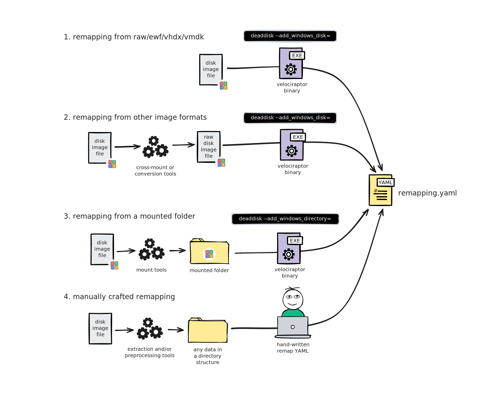
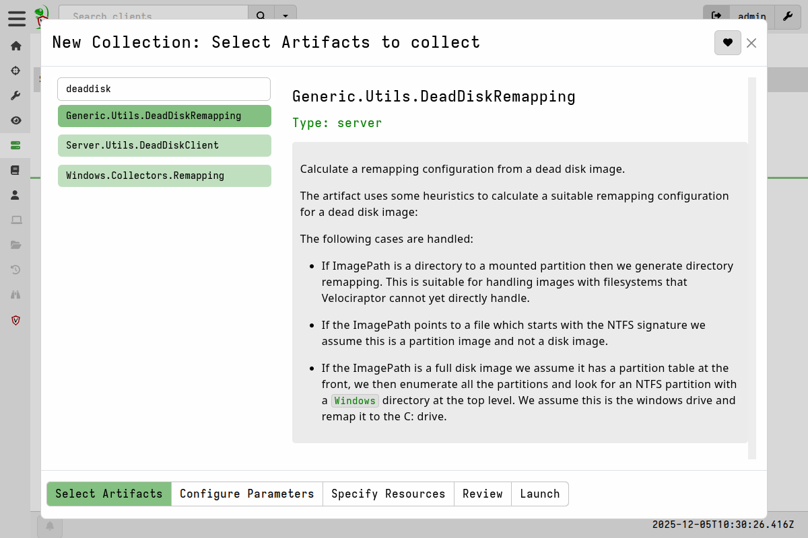
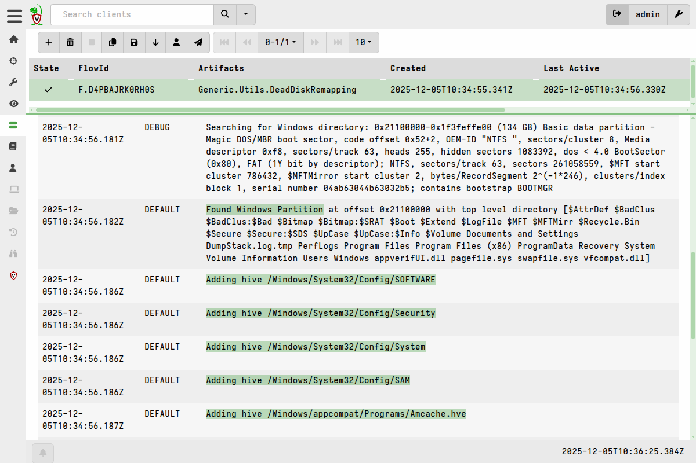
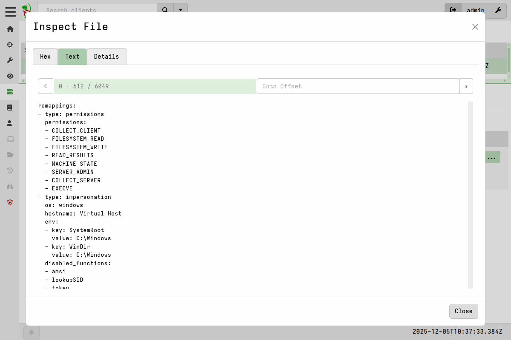
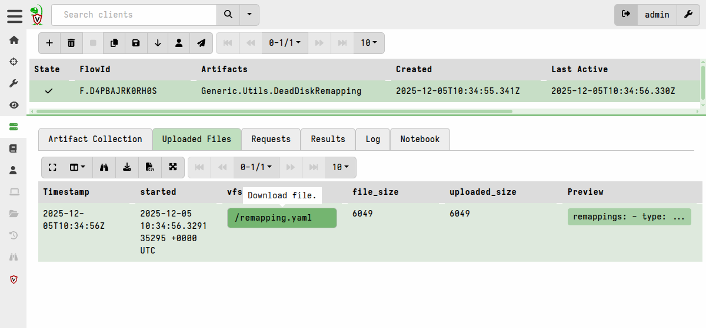
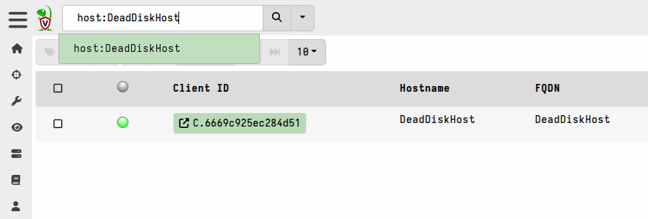
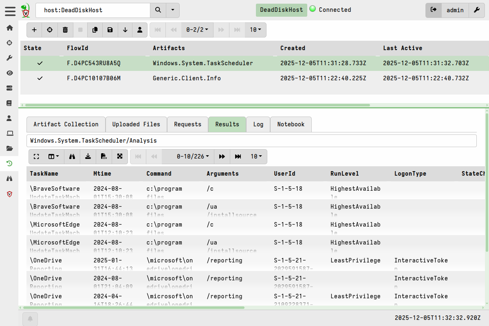

In this section we explain the various way to create remapping configs for a
disk image, how to apply the remapping, and show how the dead disk client can be
used in the GUI.

A dead disk remapping can be created in the GUI or using the CLI's
[deaddisk command](). Under the hood, both
methods use the same built-in artifact to inspect the disk image and create the
remapping. Here we will primarily discuss the GUI-based approach and we refer
you to the CLI documentation if you'd prefer to use a CLI-only approach.

In general, when running the virtual client with a remapping config we start it
via the CLI, although the `Server.Utils.DeadDiskClient` artifact does provide an
example of how the virtual client can be launched using VQL's `execve()` plugin.

## Supported disk image formats

Velociraptor currently supports the following disk image formats via it's
built-in [accessors]():

- raw format: a bit-by-bit copy of a hard drive, also know as "DD" or "flat"
  format. The file extension is often `.img` but there is no standard.

- `VHDX`: virtual hard drive format introduced by Microsoft, usually having the
  `.vhdx` file extension.

- `EWF`: Expert Witness Compression Format, sometimes called "E01 images" and
  having the `.e01`, `.e02` etc. file extensions.

- `VMDK`: virtual hard drive format introduced by VMware, usually having the
  `.vmdk` file extension.

  {}

  Most virtual machine platforms can export to several formats. In particular,
  note that VMware can export to raw format, but it always retains the `.vmdk`
  file extension. In that case you would need to either:
  - remove the file extension so that Velociraptor's `deaddisk` command will
    treat it as a raw image (which it actually is) instead of VMDK format, or
  - specify the format accessor using the `Accessor` parameter when running the
    `Generic.Utils.DeadDiskRemapping` artifact.

  {}


The `Generic.Utils.DeadDiskRemapping` artifact (which is also used by
`Server.Utils.DeadDiskClient` and the `deaddisk` CLI command) recognizes the
first three formats based on *file extension* and Velociraptor is able to read
these formats natively without any additional steps. If the target image file
has any other extension then it will be regarded as raw format.


### Dealing with unsupported image formats

If you have a disk image in some other unsupported format then the recommended
course of action is to "cross-mount" the image to raw format. There are several
tools which can do this, for example [xmount](https://www.pinguin.lu/xmount).

Alternatively you can convert the image to one of the natively-supported
formats. Many tools exist which can do this, and usually this includes the
virtualization platforms themselves. The downside of converting formats is that
it requires a lot of disk space and can take a long time. Therefore
cross-mounting is usually preferable because it "translates" one format to
another on-the-fly without conversion.

In addition to unsupported image formats you may also have to deal with other
filesystems, partition systems, and disk encryption. In such circumstances we
recommend that you consider using
[guestmount](https://libguestfs.org/guestmount.1.html) and the many other
excellent tools for working with disk images maintained under the
[libguestfs project](https://libguestfs.org/). The general goal is to use such
tools to do the inspection and apply the necessary transformations, and then
present the target filesystems in a format that Velociraptor can work with. This
might be in the form of a block device containing an NTFS partition, or more
commonly by mounting the target filesystem on a directory and thereby providing
Velociraptor with transparent access to the underlying image/filesystem.


## Creating a remapping config

There are several general paths you can take to create a remapping config. Most
often we have to deal with images of Windows systems, so there is a slight bias
towards Windows disk images being easier to deal with because they tend to
conform to a more standardized layout pattern. Linux is trickier to work with
due to the much larger variety of filesystems, partition management schemes
(often LVM, which we don't currently support), and complex partitioning.

In the examples below we've illustrated the remapping generation using the
`deaddisk` CLI command, but since it uses the `Generic.Utils.DeadDiskRemapping`
artifact internally, it is equivalent to running that artifact via the GUI.

1. **Remapping from RAW/EWF/VHDX/VMDK image**

   In the simplest case, you have a disk image of a Windows system in one of the
   supported image formats.

   The process is straightforward: You run the command
   `velociraptor deaddisk --add-windows_disk=...` or the
   `Generic.Utils.DeadDiskRemapping` artifact, specifying the relevant input
   file. This will produce the remapping config, which will be stored in the
   collection's Uploaded Files for the artifact, or output to a file is using
   the CLI.

2. **Remapping from other image formats**

   If you have a disk image of a Windows system _and it's not_ in one of the
   supported image formats, then you can cross-mount of convert the image to one
   of the supported formats. Then proceed as in the previous scenario.

3. **Remapping from a mounted folder**

   If you have a disk image of a Windows system in any image formats, but the
   filesystems are protected (for example, by BitLocker) or not natively
   supported by Velociraptor, then you can use external tools such as those
   provided by `libguestfs` to first unlock the partitions and mount them to a
   directory. You can then use the command
   `velociraptor deaddisk --add-windows_directory=...` or the
   `Generic.Utils.DeadDiskRemapping` artifact to inspect the image and create
   the remapping config.

4. **Manually crafted remapping**

   For advanced use cases you might have to manually craft an appropriate
   remapping config, although you can generate one for a simple disk image and
   then use that as a reference/starting point. To help you do this you could
   use Velociraptor (for example, the artifact
   `Windows.Forensics.PartitionTable` may provide useful info, or you can use
   similar VQL queries to inspect the image contents), or external tools (for
   example from the libguestfs project).




### Non-Windows disk images

For other operating systems, Velociraptor does not currently have built-in
artifacts to generate the remapping, although we do have native accessors for
EXT4 and FAT filesystems. So if you are manually crafting a remapping then you
could consider using those accessors.

However the simplest option is usually to rely on an external tool (such as
`guestmount`, as mentioned above) to mount the target filesystem as a directory
so that Velociraptor can access it.

## Generating the remapping config

The following process will work in most simple cases - namely a disk or
partition image of a Windows system, where we assume the partition containing a
folder named `Windows` is the `C:` drive.

1. In the Velociraptor GUI, navigate to `Server Artifacts` in the sidebar menu.

2. Create a new collection by clicking the `New Collection` button.

3. Select the `Generic.Utils.DeadDiskRemapping` artifact:

   

4. In the artifact parameters we configure the path to the image, and provide a
   `Hostname` that the virtual client will identify itself as.

   

5. After launching the artifact, you can inspect the query log to see how the
   artifact automatically inspects each partition to detect the remapping
   configuration.

   

6. If successful, the collection's File Uploads tab will now contain the YAML
   remapping config.

   You can inspect it in the GUI:

   

   And then download the remapping so that you can use it with a virtual client.

   

As mentioned previously, the remapping generation step can also be done using
the CLI's [deaddisk command](), which runs the
same `Generic.Utils.DeadDiskRemapping` artifact.

## Running a virtual client that uses the remapping

{}

You should ensure that the disk image file or mount point has the exact same
path when running the client as it had when you created the remapping config,
since the remapping config contains this path.

So if you move the image file or use a different mount point after generating
the remapping then the remapping will not work!

If you want to run the client on a separate system that is fine, as long as you
replicate the path to the image / mount point on the client system.

{}

Running the virtual client is basically the same as
[running a client interactively]().
The only difference is that we now provide it with the remapping config using
the `--remap` flag.


1. We launch the client with the remapping:

   
   {}
   ```shell
   ./velociraptor --config client.config.yaml client --remap remapping.yaml -v
   ```
   {}
   {}
   ```shell
   velociraptor.exe --config client.config.yaml client --remap remapping.yaml -v
   ```
   {}
   {}
   ```shell
   ./velociraptor --config client.config.yaml client --remap remapping.yaml-v
   ```
   {}
   

   The `client.config.yaml` is the normal client config that you can download
   from your server's Dashboard screen.

2. If you search clients for the hostname you should see that the client is now
   connected to the server:

   

   On the client's Overview screen you will see that the impersonated
   information is applied (in this case the client is actually running on the
   server under Linux).

   

3. You can now collect any artifacts that primarily read from the disk.

   

   The query log from every collection will indicate that the data comes from
   the image file, but in the results it will appear as if the queries ran on
   the original endpoint.

   


## Automating the process in a single server artifact

If your disk image is located on the server, you can generate the remapping
config and launch the virtual client in a one step, using the
`Server.Utils.DeadDiskClient` artifact. This artifact runs the client using the
VQL `execve()` plugin after generating the remapping config.

The following process will work in most simple cases - namely a disk or
partition image of a Windows system, where we assume the partition containing a
folder named `Windows` is the `C:` drive.

1. In the Velociraptor GUI, navigate to `Server Artifacts` in the sidebar menu.

2. Create a new collection by clicking the `New Collection` button.

3. Select the `Server.Utils.DeadDiskClient` artifact and configure the
   path to the image in the artifact parameters.

   

   The `Hostname` parameter controls what the virtual client will identify as. The
   `WritebackFile` parameter will store the writeback of the virtual client so you
   can reuse it next time to keep the same client id.

4. In the `Resources` tab you can update the `Max Execution time`
   which controls how long the virtual client will be alive. By default
   this is 1 hour.

5. After launching the artifact, you can inspect the query log to see how the
   artifact automatically inspects each partition to detect the remapping
   configuration.

   

Although it appears that the collection is not complete, it is actually running
a client with the remapping in a separate process, so it will wait for the
timeout before the client is torn down. During this time you can interact with
the client, collect any artifacts, or have it participate in any hunts.

6. Search for the hostname to find the new client id.

   

7. You can now collect any artifacts that primarily read from the disk.

   

8. The query log from every collection will indicate that the data comes from
   the image file, but in the results it will appear as if the queries ran on
   the original endpoint.

   

9. To end the virtual client session you can either wait for it to time out, or
   navigate back to the `Server.Utils.DeadDiskClient` collection and cancel it.
