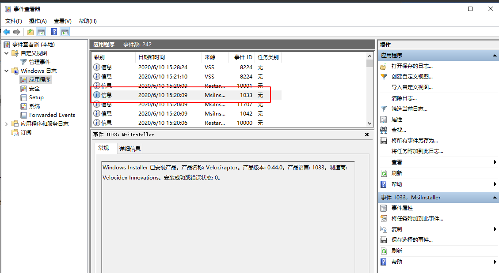
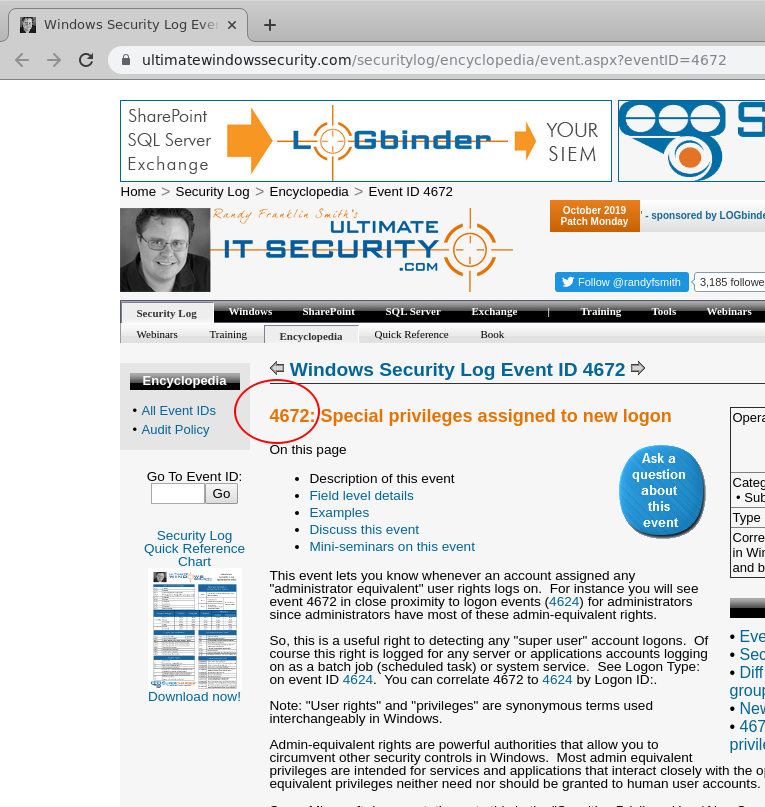
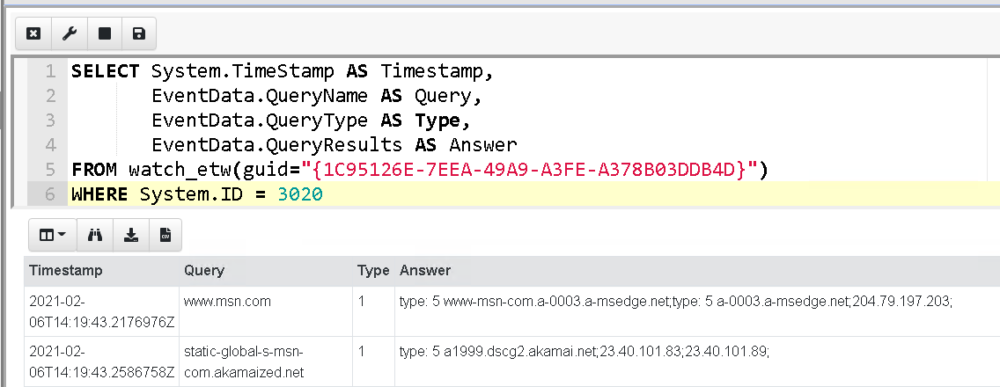

## Windows Event Logs

The Windows event logs are stored in files with extension of `*.evtx`
typically stored within `C:\Windows\System32\WinEVT\Logs\*.evtx`

Unlike traditional unix style log files that consist of unstructured
text, Windows EVTX files are stored in a binary format with several
advantages:

* Rollover - The EVTX file is divided into chunks and new chunks can
  overwrite older chunks. This allows the file size to be limited, and
  when the event log fills up, events simply rotate into the start of
  the file overwriting older events.
* Binary XML format provides some compression. Although not as much
  compression as gzip or bzip, EVTX files use a binary encoding to
  save some space over plain XML.
* Structured records with strong types - This is perhaps the most
  important difference with Unix style logs. Structured logs allow for
  accurate and fast filtering of log files and obviate the need to
  parse unstructured text.

{}

While the EVTX file is actually XML based, Velociraptor converts it
internally into a JSON object to make it easier to filter specific
fields using VQL constructs.

{}

Velociraptor implements a parser for EVTX files in the `parse_evtx()`
plugin. The plugin takes an accessor and a filename to open the EVTX
file, and produces a single row per event.

Each event row contains three main columns:

1. The `System` column is a JSON object representing the event
   metadata that is common to all events, such as timestamp.
2. The `EventData` or `UserData` columns are free form JSON objects
   representing application specific information specific to the event
   type recorded.

Some of the more interesting event fields include

* Provider, Channel, Computer:  these represents the source of the message (more below).
* Event ID: An index into the message table identifying the type of this event
* EventRecordID: The ID of this message within the evtx file.

## Event Messages

The Windows Event Logs architecture does **NOT** store the event
message in the evtx file! Instead, the event log refers to an
externally provided message, and the viewer application looks up the
message in a database in order to display it.

This scheme has a number of advantages:

1. Saves some small amount of space in the evtx files
   themselves. Since the bulk of the event message is not stored in
   the file at all, storage is saved - particularly for repetitive
   events with large message strings.
2. Probably the main reason for this scheme is that it allows for
   event message internationalization - the message string can be
   tailored for the viewer's language regardless of the language set on
   the system that generated the event.

The below example shows a familiar event on a Chinese language system.

The event viewer is able to show a friendly message in the local
language, however closer inspection of the event data itself indicates
the message is not found within the `EventData` field.

### Deriving event messages

How does the Windows event viewer resolve the messages when displaying an event?

Using the `provider`, `channel` and `computer name`, the event viewer
looks up the registry key
`HKEY_LOCAL_MACHINE\SYSTEM\CurrentControlSet\Services\EventLog\<channel>\<provider>`
and reads the value `EventMessageFile`.

The value will point at a path to a DLL. The event viewer will then
open the DLL and search the resource section of this dll for a
`Message Table` resource.

The `Message Table` is simply a table of strings. The event viewer
will then use the Event ID as an index to this message table to
retrieve the message string for the event.

The message string is a formatted string with placeholders such as
`%1`, `%2` etc. The event viewer will then Interpolate the UserData
section into the full string.

### Difficulty with the EVTX format

While the EVTX file format does have some advantages is falls short in
practice on a number of levels. It is important investigator are aware
of the pitfalls

> Grabbing all the EVTX files off the system may result in loss of event messages!

The event description message contains vital context about what the
event actually means.  Without the message it would be difficult to
know what each event message represents.

If we upload the EVTX files themselves from the system, and attempt to
view them offline chances are that the event message would be missing
on our analysis system. If we are lucky, we would be able to find some
information about the message using an internet search for the event
id.

If you just collect the EVTX files from one system to another you will
lose access to message tables, because the messages are in DLL files
scattered across the entire system.

Additionally, if an application is uninstalled, its message DLLs will
be removed and earlier events are not able to be displayed any more.

{}

In order to improve the state of event log messages, we started
maintaining a set of Event Message databases in the
https://github.com/Velocidex/evtx-data repository. This repository
contains sqlite databases of many known message tables collected from
different systems.

You can instruct Velociraptor to use one of those databases using the
`message_db` parameter to `parse_evtx()`.

{}

## Disabling event logs

Event logs can be easily disabled by simply right clicking in event
viewer and selecting `Disable Logs`. The below example shows how I am
disabling the `Microsoft-Windows-Bits-Client/Operational` log.

To read the full analysis of how to detect such a registry modification, read
the [blog post](),
or simply check for modifications using the `Windows.EventLogs.Modifications`
artifact.

## Event Tracing for Windows (ETW)

ETW is the underlying system by which event logs are
[generated and collected](https://docs.microsoft.com/en-us/windows-hardware/test/weg/instrumenting-your-code-with-etw).
The following diagram illustrates an overview of ETW.

ETW is essentially a broker between `Providers` and `Consumers`. A
Provider is registered with the system using a GUID and advertises
itself as being able to provide ETW events. A Consumer is a routine
that registers interest in a provider (e.g. Velociraptor is a
consumer).

You can enumerate all providers on a system using the `logman query
providers` command which lists all the ETW providers' GUIDs.

### Watching for events with VQL

In VQL watch_etw() can be used to watch for ETW events. For example,
consider the event provider `Microsoft-Windows-DNS-Client` with the
GUID `{1C95126E-7EEA-49A9-A3FE-A378B03DDB4D}`

{}

ETW and event logs are just two sides of the same coin. If it possible
to listen to events on the ETW layer before they are forwarded to the
event log service. In this case the events are not susceptible to
being stopped by disabling the log (as shown previously)

{}

## Example - Use ETW to monitor to DNS queries

We can query the DNS client ETW provider for all DNS lookup events.

Client event monitoring queries automatically forward events to the server.

