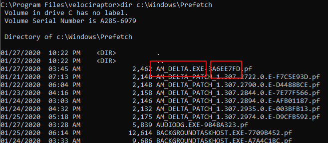
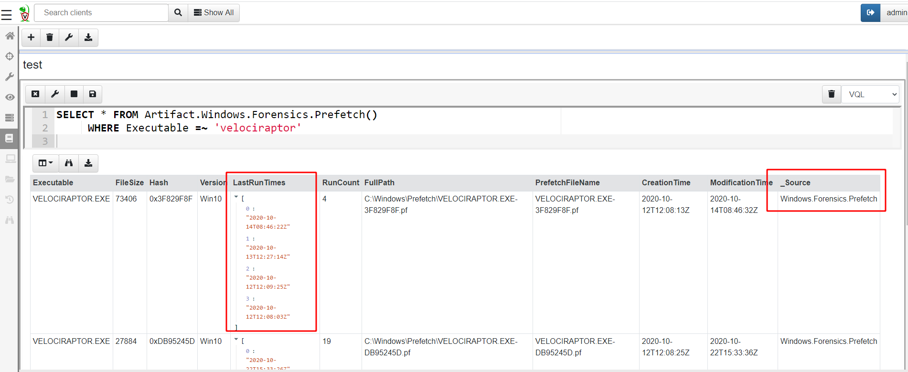
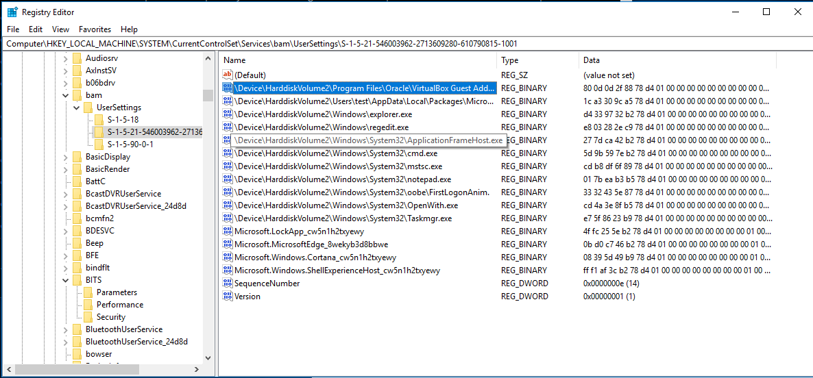
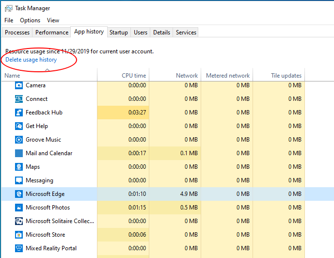
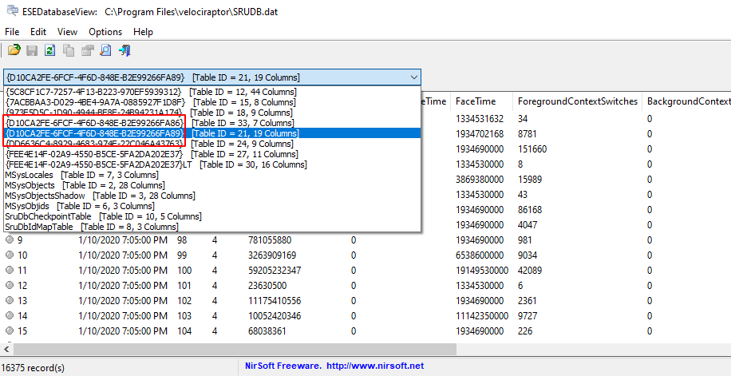

Sometimes we need to find out when (or if) a particular binary was run
on the endpoint. This question can come up in a number of contexts,
such as running malware by a user, lateral movement from a threat
actor etc.

Windows has a rich set of forensic artifacts that we can use to infer
program execution. This page covers some of the more common evidence
of execution artifacts.

## Prefetch files

Prefetch files are used to [keep track of executions](http://web.archive.org/web/20130315214654/http://windows.microsoft.com:80/en-US/windows7/What-is-the-prefetch-folder)

> What is the prefetch folder?
>
> Each time you turn on your computer,
> Windows keeps track of the way your computer starts and which
> programs you commonly open. Windows saves this information as a
> number of small files in the prefetch folder. The next time you turn
> on your computer, Windows refers to these files to help speed the
> start process.

You can see those prefetch files in the `C:\Windows\prefetch` directory

Prefetch files’ name consist of the original binary and the [hash of the application path](https://www.symantec.com/connect/blogs/prefetch-analysis-live-response). Velociraptor has a built in Prefetch file parser, that allows extracting more information from the files themselves.

Prefetch files contain the following data (In recent Windows 10)
* The last 8 times the binary was run
* The number of times the binary was run
* The binary name
* The file size

## Prefetch tips

You can try to establish the original path of the executable by [brute forcing the hash](https://hiddenillusion.github.io/2016/05/10/go-prefetch-yourself/). Typically the full path of the binary is also encoded as one of the linked PE files.

Look for particularly suspicious binaries, eg sc.exe, xcopy.exe,
psexec.exe, bitsadmin.exe and particularly random looking binary
names.  Typically lower execution counts are more interesting

Even though the prefetch file itself only records 8 times of
execution, each time a binary is executed, the system will update the
prefetch file. It may be that other artifacts record this
interaction. In particular, the USN journal might record an
interaction with the prefetch file which is not recorded in the actual
prefetch file itself (because the binary was run more than 8 times or
the prefetch file was removed as an anti-forensic method).

Note too that the prefetch file creation time will record the time
when the program was **first** run, giving an additional timestamp to
consider.

## Prefetch timeline

The `Windows.Forensics.Prefetch` artifact shows all the execution
times for each file as an array. This is less useful as we normally
want to filter it by time of interest.  The
`Windows.Timeline.Prefetch` artifact is more useful for that as it
breaks records into distinct rows that can be easily filtered by
timestamps.

## Background Activity Moderator

BAM is a Windows service that Controls activity of background
applications.  This service exists in Windows 10 only after Fall
Creators update – [version 1709](https://www.andreafortuna.org/dfir/forensic-artifacts-evidences-of-program-execution-on-windows-systems/).

The service maintains binary data in the registry which keeps track on
the execution of different programs by the user. Velociraptor can
parse these timestamps using the `Windows.Forensics.Bam` artifact.

{}

The BAM artifact is stored in the registry under a key unique to the
user SID on the system, therefore it provides valuable attribution as
to who ran the binary (which Prefetch does not provide).

{}

## Shim cache

Windows maintains a backward compatible set of tweaks to binaries
called “Shims”.  As part of this mechanism, there is a application
compatibility database stored in the registry key

`HKLM\SYSTEM\CurrentControlSet\Control\SessionManager\AppCompatibility\AppCompatCache`

You can read more about the Shim cache [here](https://www.fireeye.com/content/dam/fireeye-www/services/freeware/shimcache-whitepaper.pdf) or [here](http://www.alex-ionescu.com/?p=39) or [here](https://www.andreafortuna.org/2017/10/16/amcache-and-shimcache-in-forensic-analysis/).

The Shim cache database tracks the executables’ file name, file size and last modified time of the binary.

Velociraptor can parse the shim cache using the `Windows.Registry.AppCompatCache` artifact.

{}
Note this is the modification time of the binary from the NTFS $STANDARD_INFORMATION stream, which might be replicated by the installer - so it might even be before the system was installed.
{}

## Amcache

The Windows Application Experience Service tracks process creation
data in a registry file located in
`C:\Windows\AppCompat\Programs\Amcache.hve`

This tracks the first execution of a program on the system, including
programs executed from an external storage. You can investigate the
Amcache hive using the `Windows.System.Amcache` artifact.

Unlike the other registry based artifacts above, this registry hive is
not mounted and accessible via the Windows APIs - the service simply
uses the registry file format to store the information. We therefore
need to parse the raw registry hive file using the raw registry
accessor.

{}

Note the key location is a URL - Velociraptor uses URL notation to
access raw registry hives as described [here](). This one uses
the ntfs file accessor to access the raw hive data since it is usually
locked at runtime.

{}

## System Resource Usage Monitor (SRUM)

Windows keeps a running count of application metrics using SRUM in
order to power the "App history" tab in the task manager.

Metrics are stored in an ESE database at the location `%windir%\System32\sru\SRUDB.dat`. You can read more about the SRUM [here](https://www.velocidex.com/blog/medium/2019-12-31_digging-into-the-system-resource-usage-monitor-srum-afbadb1a375/).

You can examine the ESE database manually using Nirsoft [ESEDatabaseViewer](https://www.nirsoft.net/utils/ese_database_view.html).

The database contains multiple tables named after the GUID of the SRUM
extension that is recording data. While not all tables are fully
understood or documented it is sometimes possible to work out what
information is recorded by simple inspection of the database tables.

Velociraptor already knows how to interpret some of the providers:

* `{D10CA2FE-6FCF-4F6D-848E-B2E99266FA89}` is for application resource usage.
* `{DD6636C4-8929-4683-974E-22C046A43763}` is for network connection stats

You can collect the SRUM database using the `Windows.Forensics.SRUM`
artifact. The artifact contains several sources, each attempting to
interpret a different provider table.
