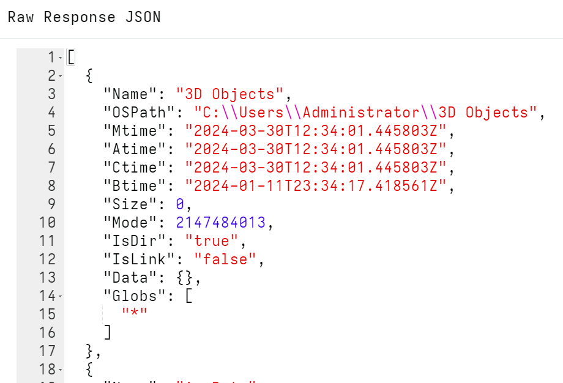

One of the most common operations in DFIR is searching for files
efficiently. When searching for a file, we may search by filename,
file content, size or other properties.

Velociraptor has the [glob]()
plugin to search for files using a glob expression. Glob expressions use
wildcards to search the filesystem for matches, and these are the most common
tool for searching by filename. As you will see below, the `glob()` plugin is
the foundation of many artifacts.

The `glob()` plugin searches the filesystem by glob expression. The
following represent the syntax of the glob expressions:

* A `*` is a wildcard match (e.g. `*.exe` matches all files ending
  with ".exe")
* Alternatives are expressed as comma separated strings enclosed in `{}`.
  For example, `*.{exe,dll,sys}`
* Velociraptor supports recursive wildcards: A `**` denotes recursive
  search, e.g. `C:\Users\**\*.exe`. \
  NOTE: The `**` must appear in its own path component to be considered a
  recursive search: `C:\Users\mike**` will be interpreted the same as
  `C:\Users\mike*`
* A Recursive search `**` can be followed by a number representing the
  depth of recursion search (default 30).

For example, the following quickly searches all users' home
directories for files with ".exe" extension.

```vql
SELECT *
FROM glob(globs='C:\\Users\\**\\*.exe')
```

{}

Strings in VQL can include a backslash escape sequence. Since Windows
paths use backslashes for the path separator you will need to escape
these backslashes with backslashes, which can be confusing.

Paths can alternatively be written with a forward
slash so that they don't need to be escaped:
```vql
SELECT *
FROM glob(globs='C:/Users/**/*.exe')
```

or raw string notation can be used:
```vql
SELECT *
FROM glob(globs='''C:\Users\**\*.exe''')
```

{}

The `glob()` plugin is optimized to visit files on the filesystem as
quickly as possible. Therefore if multiple glob expressions are
provided, the `glob()` plugin will combine them into a single
expression automatically to reduce filesystem access. It is always
better to provide multiple glob expressions than to run the `glob()`
plugin multiple times. For example the following will only make a
single pass over the filesystem while searching for both `exe` and `dll`
files.

```vql
SELECT *
FROM glob(globs=['C:/Users/**/*.exe', 'C:/Users/**/*.dll'])
```

Velociraptor paths are separated by `/` or `\` into path
components. Internally, paths are considered as made up of a list of
components. Sometimes path components (e.g. a file or directory name) can
also contain path separator characters in which case the component is
quoted in the path.

For a more in-depth discussion of paths in Velociraptor see
[Velociraptor Paths]()

### The Glob Root

Glob expressions are meant to be simple to write and to
understand. They are not as powerful as a regular expression, with
only a few types of wildcard characters allowed (e.g. `*` or
`?`). However, what if we wanted to literally match a directory which
also contained a wildcard character?

This problem is encountered quite often: Normally we know an exact
directory path and simply want to search beneath this directory using
glob. Consider a directory like `C:\Users\Administrator\{123-45-65}` -
this is common as directories are often named as GUID - especially in
the registry.

If we used the above in a glob expression, the `glob()` plugin will
assume `{123-45-65}` is an alternative wild card. It will therefore
only match a directory exactly named `123-45-65`. We can therefore use
the `root` parameter to tell `glob()` to only start searching from
this exact directory name:

```vql
SELECT *
FROM glob(globs='**', root='''C:\Users\Administrator\{123-45-65}''')
```

Note that the root path is **not** a glob expression but represents
exactly a single path forming the directory under which we start
searching. Similarly the glob parameters now refer to wildcard matches
under that root directory.

### Glob results

The `glob()` plugin returns rows with several columns. As usual, the
best way to see what a plugin returns is to click the `Raw Response JSON`
button on the results table.



Some of the more important columns available are

1. The `OSPath` is the complete path to the matching file, whereas
   the `Name` is just the filename.
2. The `Mtime`, `Atime`, `Ctime` and `Btime` are timestamps of the file.
3. The `Data` column is a free form dictionary containing key/value
   data about the file. This data depends on the accessor used.
4. `IsDir`, `IsLink` and `Mode` indicate what kind of file
   matched. (`Mode.String` can present the mode in a more human
   readable way).
5. Finally, in `Globs` the plugin reports which glob expression matched this
   particular file. This is handy when you provided a list of glob expressions
   to the plugin and need to know which ones produced the match.


## Filesystem accessors

Glob is a very useful concept to search hierarchical trees because
wild cards are easy to use and powerful. Sometimes we might want to
use a glob expression to look for other things that are not files, but
also have a hierarchical structure. For example, the registry is
organized in a similar way to a filesystem, so maybe we can use a glob
expression to search the registry?

Velociraptor supports direct access to many different data sources
with such hierarchical trees via
[accessors]()
(Accessors are essentially filesystem access drivers).

Some common accessors are:

* **file** - uses OS APIs to access files.
* **ntfs** - uses raw NTFS parsing for low level filesystem access.
* **registry** - uses OS APIs to access the windows registry.

When no accessor is specified, Velociraptor uses an automatic accessor
(called **auto**): On Windows, the **auto** accessor uses the **file**
accessor to attempt to read the file using the OS APIs, but if the
file is locked (or it received permission denied errors), Velociraptor
automatically falls back to the **ntfs** accessor in order to read the
file from raw disk clusters. This allows Velociraptor to transparently
bypass any OS level restrictions on reading files (such as filesystem
permissions or some filter drivers that block access to files based on
other rules - sometimes found in local security software).

### Searching the Windows registry

The [`registry` accessor]()
(or `reg` for short) allows any filesystem functions and plugins to also work on
the registry. For example, here we use the `glob` plugin to list keys:

```vql
SELECT *
FROM glob(
  globs="*",
  root='''HKEY_CURRENT_USER\Software\Microsoft\Windows\CurrentVersion''',
  accessor="registry")
WHERE Name = "Run"
```

We can use the `read_file` function to read values as if they were files:

```vql
SELECT OSPath.Path AS Key,
       Data,
       Data.type AS Type,
       expand(path=read_file(accessor='registry', filename=OSPath)) AS Content
FROM glob(globs='HKU/*/Environment/*', accessor='registry')
```

For convenience we also have the `read_reg_key` plugin which is similar to using
both `glob` and `read_file` together, as in the previous example. The main
difference is that `read_reg_key` returns the key's values as columns which
makes it easier to work with them in VQL. Note that with this registry-specific
plugin we do not need to specify the `registry` accessor, as that is the
default.

```vql
SELECT *
FROM read_reg_key(root='HKEY_USERS', globs='*/Environment')
```

#### Raw registry file parsing

Registry hives are mounted and made available via the Windows registry API. When
accessed through the API, most hives are composite representations built from
data contained in multiple files on disk.

For example, the `HKEY_USERS` registry hive consists of data that is specific to
each user and is only loaded when the user logs on to the computer. Therefore
any artifacts looking in `HKEY_USERS` using the Windows API are limited to the
set of users who are currently logged in!

Each user’s settings are stored in `C:\Users\<name>\ntuser.dat` which is a file
in the standard Windows registry hive file format. To reliably read information
for all users we need to parse the raw hive files for each user from disk.

To cater for this requirement, Velociraptor supports reading hive files directly
through its `raw_reg` accessor. Similar to the `registry` accessor described
above, this accessor allows Velociraptor's filesystem-oriented VQL functions and
plugins to work on registry files rather than relying on the API.

##### Example: Find autorun files from ntuser.dat

We specify to the `glob()` plugin that we want to open the raw registry file at
`C:/Users/User/ntuser.dat` and glob for the pattern `/**/Run/*` within it.

```vql
SELECT *
FROM glob(globs='/**/Run/*',
          root=pathspec(DelegateAccessor="auto",
                        DelegatePath='C:/Users/User/ntuser.dat'),
          accessor="raw_reg")
```

Note that `root` argument provided to `glob` is an OSPath object which points
the accessor to the file on disk. The results will include an OSPath object in
the OSPath column for any matches. This allows these paths objects to be passed
to any other VQL plugin that uses filenames where they can be accessed with the
`raw_reg` accessor.


##### Example: Multiple registry files with remapping

While the previous example is fine for reading a single registry file, for the
`HKEY_USERS` situation mentioned above we'd like to read from multiple
`ntuser.dat` files. In addition, you probably want to run queries that refer to
registry paths as they would appear on a live system when using the registry
API.

This uses Velociraptor's powerful
[accessor remapping]()
feature.

It's a bit more complicated to do this, but generally this is automatically done
when you're using artifacts such as:
- [`Generic.Forensic.SQLiteHunter`](https://sqlitehunter.velocidex.com/docs/)
- [`Windows.KapeFiles.Remapping`]()
- [`Generic.Utils.DeadDiskRemapping`]()

which already have the necessary remapping logic included.

{}

Any artifacts that look into the `HKEY_USERS` registry hive should use the
`Windows.Registry.NTUser` artifact instead of accessing the hive via the Windows
registry API. The API only makes the currently logged in users available in that
hive, so if we rely on the Windows API we will miss any settings for users who
are not currently logged on.

If you're creating your own artifact that need to do this remapping then you can
[import]()
the `export` section from
[`Windows.Registry.NTUser`]()
which contains the necessary VQL remapping logic.

{}


Here, for didactic purposes only, we're going to look at a simple example that
combines the `ntuser.dat` files from multiple users and prefixes their paths
with `HKEY_USERS/<Username>/`.

The VQL prepares a remapping configuration, then applies it (to the
current scope), and the final query is a normal registry search query using
`glob()`.

```vql
LET UserHives <= SELECT
    dict(type="mount",
         `from`=dict(accessor='raw_reg',
                     prefix=pathspec(Path="/",
                                     DelegateAccessor="auto",
                                     DelegatePath=OSPath.String),
                     path_type='registry'),
         `on`=dict(accessor='registry',
                   prefix="HKEY_USERS/" + OSPath[-2],
                   path_type='registry')) AS user_mapping
  FROM glob(globs="C:/Users/*/ntuser.dat")
  WHERE NOT OSPath.Basename =~ "idx$"

LET _ <= remap(config=dict(remappings=UserHives.user_mapping))

SELECT Name,
       OSPath
FROM glob(globs="HKEY_USERS/**/Run/*", accessor="registry")
```

In the final query we can use the `registry` accessor without concerning
ourselves about the fact that we are querying offline registry files. This is
because registry paths that match our remapping specification are transparently
handled by the relevant accessors "under the hood".


Note that the remapping uses the username extracted from the registry file path
to reconstruct the registry paths. This is not exactly how the API presents it
(it uses SIDs which are less human-friendly) but for our purposes that's OK.
