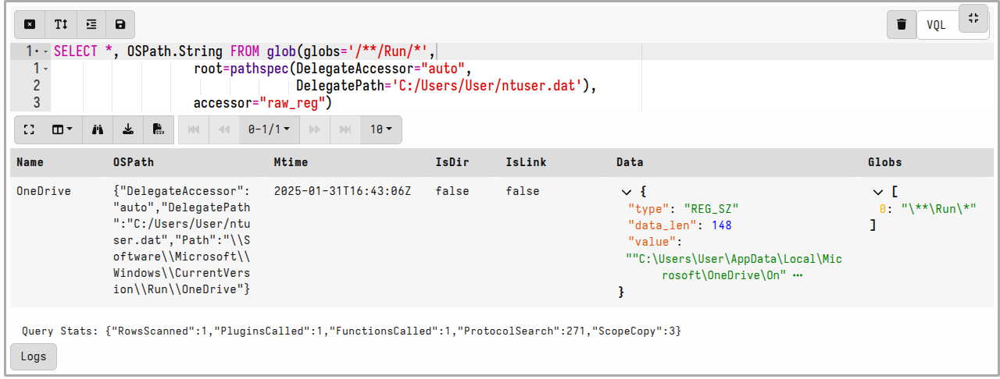
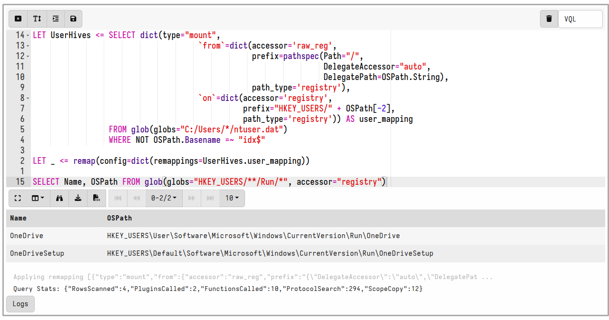

One of the most common operations in DFIR is searching for files
efficiently. When searching for a file, we may search by filename,
file content, size or other properties.

Velociraptor has the `glob()` plugin to search for files using a glob
expression. Glob expressions use wildcards to search the filesystem
for matches, and these are the most common tool for searching by
filename. As we will see below, the `glob()` plugin is the foundation
for many other artifacts.

The `glob()` plugin searches the filesystem by glob expression. The
following represent the syntax of the glob expressions:

* A `*` is a wildcard match (e.g. `*.exe` matches all files ending
  with ".exe")
* Alternatives are expressed as comma separated strings in `{}`. For
  example, `*.{exe,dll,sys}`
* Velociraptor supports recursive wildcards: A `**` denotes recursive
  search, e.g. `C:\Users\**\*.exe`. NOTE: A `**` must appear in its
  own path component to be considered a recursive search:
  `C:\Users\mike**` will be interpreted the same as `C:\Users\mike*`
* A Recursive search `**` can be followed by a number representing the
  depth of recursion search (default 30).

For example, the following quickly searches all users' home
directories for files with ".exe" extension.

```sql
SELECT * FROM glob(globs='C:\\Users\\**\\*.exe')
```

{}

VQL strings can include a backslash escape sequence. Since Windows
paths often use backslashes for path separator you will need to escape
the backslashes. Alternatively paths can be written with a forward
slash `/` or a raw VQL string can be used - for example this is a bit
easier to write:

```sql
SELECT * FROM glob(globs='''C:\Users\**\*.exe''')
```

{}

The `glob()` plugin is optimized to visit files on the filesystem as
quickly as possible. Therefore if multiple glob expressions are
provided, the `glob()` plugin will combine them into a single
expression automatically to reduce filesystem access. It is always
better to provide multiple glob expressions than to run the `glob()`
plugin multiple times. For example the following will only make a
single pass over the filesystem while searching for both exe and dll
files.

```sql
SELECT * FROM glob(globs=['C:/Users/**/*.exe',
                          'C:/Users/**/*.dll'])
```

Velociraptor paths are separated by `/` or `\` into path
components. Internally, paths are considered as made up of a list of
components. Sometimes path component (e.g. a file or directory) can
also contain path separator characters in which case the component is
quoted in the path.

### Glob results

The `glob()` plugin returns rows with several columns. As usual, the
best way to see what a plugin returns is to click the `Raw Response JSON`
button on the results table.


Some of the more important columns available are

1. The `FullPath` is the complete path to the matching file, whereas
   the `Name` is just the filename.
2. The `Mtime`, `Atime`, `Ctime` and `Btime` are timestamps of the file.
3. The `Data` column is a free form dictionary containing key/value
   data about the file. This data depends on the accessor used.
4. `IsDir`, `IsLink` and `Mode` indicate what kind of file
   matched. (`Mode.String` can present the mode in a more human
   readable way).

## Filesystem accessors

Glob is a very useful concept to search hierarchical trees because
wild cards are easy to use and powerful. Sometimes we might want to
use a glob expression to look for other things that are not files, but
also have a hierarchical structure. For example, the registry is
organized in a similar way to a filesystem, so maybe we can use a glob
expression to search the registry?

Velociraptor supports direct access to many different such
hierarchical trees via `accessors` (Accessors are essentially
filesystem access drivers). Some common accessors are

* **file** - uses OS APIs to access files.
* **ntfs** - uses raw NTFS parsing to access low level files
* **reg** or **registry** - uses OS APIs to access the windows registry

When no accessor is specified, Velociraptor uses an automatic
accessor: It uses the **file** accessor to attempt to read file using
the OS APIs, but if the file is locked, Velociraptor automatically
falls back to the **ntfs** accessor in order to read the file from raw
disk clusters.

### The registry accessor

This accessor uses the OS API to access the registry hives. The top
level directory is a list of the common hives (e.g. `HKEY_USERS`). The
accessor creates a registry abstraction to make it appear as a
filesystem:

* Top level consists of the major hives
* Values appear as files, Keys appear as directories
* The Default value in a key is named “@”
* Since reading the registry value is very quick anyway, the registry
  accessor makes the Value's content available inside the Data
  attribute.
* Can escape components with `/` using quotes
`HKEY_LOCAL_MACHINE\Microsoft\Windows\"http://www.microsoft.com/"`

### Raw registry parsing

In the previous section we looked for a key in the `HKEY_CURRENT_USER`
hive.  Any artifacts looking in `HKEY_USERS` using the Windows API are
limited to the set of users currently logged in! We need to parse the
raw hive to reliably recover all users.

Each user’s setting is stored in `C:\\Users\\<name>\\ntuser.dat` which
is a raw registry hive file format. We can parse this file using the
`raw_reg` accessor.

When we need to parse a key or value using the raw registry we need to
provide it with 3 pieces of information:

1. The Registry hive file to parse (**path**)
2. The Accessor to open that file (**scheme**)
3. The Key or Value path within the registry file to open (**fragment**)

Since the accessor can only receive a single string (file path), we
pass these three pieces of information using a URL notation.

{}

Do not attempt to build the URL using string concatenation because
this will fail to escape properly. Always use the `url()` VQL function
to build the URL for use by the raw_reg accessor.

{}



In the above example, we specify to the `glob()` plugin that we want
to open the raw registry file at `C:\\Users\\Mike\\ntuser.dat` and
glob for the pattern `/*` within it.

Note that the FullPath returned by the accessor is also in URL
notation. This is done so that you can feed the FullPath directly to
any plugin that uses filenames without conversion - since the raw
registry accessor can read the urls it is producing.

If you need to extract the key path within the registry hive, you can
use the `url()` function with the `parse` argument to parse the url
again. The `Fragment` field represents the key path.

```text
url(scheme='file', path='C:/Users/test/ntuser.dat', fragment='/**/Run/*')

file:///C:/Users/test/ntuser.dat#/**/Run/*
```

#### Example: Find autorun files from ntuser.dat

Let's combine the above query to search all Run keys in all user's
ntuser.dat files.

```sql
SELECT * FROM foreach(
row={
   SELECT FullPath AS NTUserPath FROM glob(globs="C:/Users/*/ntuser.dat")
}, query={
   SELECT NTUserPath, url(parse=FullPath).Fragment AS Value, Mtime, Data.value
   FROM glob(
       globs=url(scheme="file", path=NTUserPath,
                 fragment="SOFTWARE/Microsoft/Windows/**/Run/*"),
       accessor="raw_reg")
})
```

We glob for ntuser.dat files in all user's home directory, then
foreach one of those, we search the raw registry hive for values under
the Run or RunOnce key.



### The "data" accessor

VQL contains many plugins that work on files. Sometimes we load data
into memory as a string.  It is handy to be able to use all the normal
file plugins with literal string data - this is what the `data`
accessor is for - when the data accessor is used, it creates an
in-memory file with the content of the file being the string that is
passed as the filename.

This allows us to use strings in plugins like `parse_csv()`
