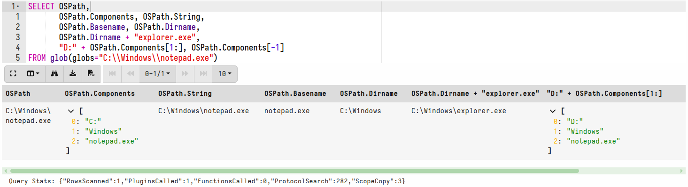

In DFIR we often talk about paths and filesystems. However, these are
usually more complex than they appear.

Path handling is fundamental to forensic analysis, as a large amount
of relevant information is still kept on disk within a
filesystem. Superficially, We are all familiar with how paths work - a
path is typically a string that we can provide to some OS API (for
example the Windows `CreateFile()` or Linux `open()` API) which
facilitates interacting with a file or a directory on the filesystem.

Unfortunately, the structure of this string is often not well defined
or consistent between operating systems! For example, on windows a
path has the following characteristics:

1. The path starts with a "drive letter" of the form `C:` or `D:`
2. Path directories are separated by a backslash `\`
3. There is no leading path separator (i.e. `C:\` does not start with `\`).
4. Directory names may not contain forward slashes, backslashes or wildcards.
5. Filenames are generally case insensitive.

For example `C:\Windows\System32\Notepad.exe`

On Linux things are a bit different:

1. Paths begin with the slash character (the root of the filesystem)
2. Path directories are separated by forward slash
3. Directory names may contain backslashes but these are **not** path
   separators! Filename may contain pretty much any character (except
   null and forward slash).

For example, a Linux path looks like `/usr/bin/ls`. However, since
Linux can have backslashes with filenames, the path
`/C:\Windows/System32` can actually refer to a single directory named
`C:\Windows` which is contained in the root of the filesystem!

It gets even more complicated on Windows, where a `device name` may
appear as the first element of the path. Here it refers to a physical
device, for example `\\.\C:\Windows` means the `Windows` directory
inside the filesystem on the device `\\.C:` - Yes the device can
contain backslashes which are also path separators **except** when
they refer to a device.

A registry path has other rules:

1. It starts with the hive name, e.g. `HKEY_LOCAL_MACHINE` or `HKLM`
2. Components are separated by backslashes
3. While key names are analogous to directories, registry keys are
   allowed to have forward slash characters.
4. While Value name are analogous to files, value name may also have
   backslashes!

For example the following registry path is valid
`HKEY_LOCAL_MACHINE\SOFTWARE\Microsoft\.NETFramework\` `Windows
Presentation
Foundation\Namespaces\http://schemas.microsoft.com/netfx/2009/xaml/presentation`
(with the last registry key being a URL) even though the registry key
contains forward slashes it is just one key component!

With all these confusing rules we need to develop an abstraction that
allows Velociraptor to handle all these cases correctly.

Correct path handling is extremely important for Velociraptor, without
it various subtle bugs are encountered where a path is emitted from
one plugin (e.g. `glob()`) but misinterpreted by other plugins
(e.g. `read_file()`) which fail to open the same file correctly. Since
this interpretation depends on various contextual information (like
which OS we are running on, or which accessor was used) we need a way
to incorporate this information in the path itself.

Therefore in Velociraptor we represent paths as an OSPath object - not
a simple string.

## The OSPath abstraction

In recent Velociraptor releases the `OSPath` abstraction was introduced to
handle paths in a consistent and resilient way:

1. Internally paths are always a list of components. For example, the
   windows path `C:\Windows\System32` is represented internally as the
   list of components `["C:", "Windows", "System32"]`

2. A Filesystem is treated as a tree, and the path is simply the list
   of components connecting each level in the tree.

3. An `OSPath` implements specific serialization and deserialization
   methods: When we need to pass an OSPath object to the OS API we
   need to serialize the abstract OSPath in a way that is appropriate
   to the OS. Otherwise we prefer to retain the OSPath as an abstract
   path as much as possible.

4. Each `OSPath` has a specific flavor - controlling for the way it is
   serialized to and from a string. For example a Windows OSPath will
   serialize the components using the Windows path rules.

For example, an OSPath with the following components `["C:",
"Windows", "System32"]` will serialize to string:

* A Windows `OSPath` will serialize to `C:\Windows\System32`
* A Linux `OSPath` will serialize to `/C:/Windows/System32`
* A Windows NTFS aware OSPath will serialize to
  `\\.\C:\Windows\System32` (i.e. device notation appropriate to the
  NTFS raw accessor).

Velociraptor always represents paths as OSPath objects. You can create
the OSPath object using the `pathspec()` function, or by providing a
string to VQL functions that require an OSPath, the relevant accessor
is used to parse that string into an OSPath object appropriate for
that accessor.

## The glob() plugin

One of the most commonly used plugins in Velociraptor is the `glob()`
plugin. This plugin allows searching of filesystems using a glob
expression (containing wildcards).

Consider the following query running on windows

```vql
SELECT OSPath
FROM glob(globs="*", root="C:\\Windows", accessor="auto")
```

The `glob()` plugin applies the glob expression on the filesystem and
returns a single row for each matching file. Looking at the [reference
for the glob()]() function, we
can see that the `root` parameter is of type OSPath.

Since in the above query, the accessor specified is the `auto`
accessor, VQL will call on that accessor to interpret the string to an
OSPath before passing it to the `glob()` function. On windows, the
`auto` accessor follows the Windows rules above (with `\\` being the
path separator) to produce an OSPath like this:

```
Components: ["C:", "Windows"]
PathType: "Windows"
```

Note that on Linux, the same path will be interpreted as:
```
Components: ["C:\\Windows"]
PathType: "Linux"
```

Since the `\\` is not a path separator on Linux!

The OSPath object has some convenient properties:

* The `Components` field contains the list of path components in the
  path. You can index the component to identify a specific directory
  or filename.  (negative indexes are counted from the end of the
  component array).

* The `Basename` property is a shorthand to the last component
  (equivalent to `OSPath.Components[-1]`)

* The `Dirname` property is an OSPath representing the directory
  containing the OSPath.

* Path manipulation is very easy to do, since OSPath is overloading
  the addition operator to make path manipulation simple and
  intuitive. **There is no need to split or join on path separators in
  most cases!**

While it may appear that the OSPath a simple string when serialized to
JSON, it is in fact an object with many convenient methods.



The above example shows some common manipulation techniques:

1. The component list of the OSPath can be retrieved using
   `OSPath.Components`
2. The Basename (the last path element) can be retrieved using
   `OSPath.Basename` - this is a string.
3. The Directory name of a path is an OSPath with the last component
   removed `OSPath.Dirname`.
4. The addition operator on OSPath allows appending further path
   components: `OSPath + "a/b/c/filename"` is another OSPath with an
   extra component. The additional string will be split using the
   usual path separator.
5. Addition with a slice of strings will automatically append
   components to the path. For example this query will swap the drive
   name from `C:` too `D:` by first building an OSPath for `D:` drive
   then adding all the components (except the first one) from the
   glob's OSPath to it.

```vql
SELECT pathspec(Path="D:", path_type="windows") + OSPath[1:]
FROM glob(globs="C:/Windows/*")
```

## Filesystem accessors and OSPath

Velociraptor accesses filesystems by way of an `accessor`. You can think
of an accessor as a specific driver that VQL can use to open a
path. All VQL plugins or functions that accept files will also accept
an accessor to use to open the file.

Consider the following VQL query:

```vql
SELECT read_file(path="C:/Windows/notepad.exe", accessor="file")
FROM scope()
```

The `read_file()` VQL function reads raw data from the specified
file. The `path` argument is defined of type OSPath. Since we passed a
string here, VQL will need to convert it into an OSPath by calling
onto the "file" accessor and pass the provided path to it as an opaque
string.

The `file` accessor is used to open files using the OS
APIs. Therefore, it will interpret the path string according to the OS
convention it is running on (i.e. on Windows it will create a Windows
flavor of OSPath). However, were we to use another accessor, the
string path will be interpreted differently by the accessor.

{}

The most important takeaway from this is that when an accessor
receives a string path, it will parse it into an OSPath internally
according to its own rules. However, internally OSPath objects are
passed directly into the VQL query.

When a plugin receives an already parsed OSPath object, it may
directly use it (since no parsing is required). Therefore in general,
once an OSPath object is produced in the query, the same OSPath object
should be passed around to other plugins/vql functions.

```vql
SELECT read_file(filename=OSPath, accessor="file", length=5)
FROM glob(globs="C:\\Windows\\notepad.exe")
```

In the above the string `C:\Windows\notepad.exe` is parsed once into
an OSPath object, but then `glob()` passes an OSPath object already so
`read_file()` does not need to parse anything. This increases
efficiency in VQL because we avoid having to parse and serialized
paths all the time!

{}


## Nested accessors and pathspecs

Many VQL accessors require additional information to be able to
work. For example consider the `zip` accessor. This accessor is used
to read zip archive members as if they were simple files. In order to
open an archive member we need several pieces of information:

1. The path to the zip file itself.
2. An accessor to use to open the zip file container.
3. The path to the zip member inside the container to open.

The `zip` accessor therefore requires a more complex OSPath object
containing additional information about the `Delegate` (i.e. the path
and accessor that the zip accessor will delegate the actual reading
to). An OSPath Delegate is another path and accessor used by an
accessor to be able to open the file it depends on.

We call this more complex path specification a `pathspec` as it
specifies more precisely what the accessor should do. In a VQL query
we may build a pathspec from scratch using the `pathspec` function.

```vql
SELECT read_file(
  filename=pathspec(DelegateAccessor="file",
                    DelegatePath="F:/hello.zip",
                    Path="hello.txt"),
  accessor="zip",
  length=5)
FROM scope()
```

In the above example I am calling the `read_file()` VQL function, and
building an OSPath object directly using the `pathspec()` VQL
function.

The `zip` accessor receives the new OSPath object and

1. Will open the zip container itself using the `Delegate`: i.e. the
   "file" accessor, with a path of "F:/hello.zip".
2. After parsing the zip file, the `zip` accessor will open the member
   within it specified by the `Path` field. For zip files, the path is
   interpreted as a forward slash separated unix like path (according
   to the zip specification). In this case the zip accessor will open
   a member called `hello.txt` within that Zip file.
3. Finally the `read_file()` function will read that member file and
   receive the content of the `hello.txt` archive member.

Note that in practice we rarely need to build the OSPath directly like
in the example above, because the OSPath object is passed already from
another plugin (e.g. `glob()`)

## Nesting OSPath objects.

We can combine the previous two queries to search zip files

```vql
SELECT OSPath,
   read_file(filename=OSPath, accessor="zip", length=5)
FROM glob(
  globs="*.txt",
  root=pathspec(DelegateAccessor="auto", DelegatePath="F:/hello.zip", Path="/"),
  accessor="zip")
```

This time we provide the `glob()` plugin the root (where searching
will begin) as a full OSPath object that we construct to represent the
top level of the zip archive (i.e. globing will proceed within the zip
file).

In practice `Path="/"` can be omitted since this is the default
value. Similarly, `DelegateAccessor="auto"` can also be omitted since
this is the default accessor, thus simplifying the above query.

We can transparently now pass the OSPath object that glob will return
directly into any VQL function or plugin that accepts a file
(e.g. `read_file()`)


The OSPath object is now capable of more complex path manipulations:

1. The `OSPath.Dirname` property represents the fully qualified OSPath
   used to represent the container directory - we can simply pass it
   directly to any plugins that deal with directories.

2. Note that more complex `Pathspec` based paths are represented as a
   JSON encoded object. It is ok to pass the stringified version of
   OSPath to plugins because they will automatically parse the
   string into an OSPath object.

{}

When using the `glob()` plugin, remember that Glob expressions are
always flat strings (i.e. a glob is not a pathspec). An OSPath should
be passed to the `root` parameter to indicate where searching should
start from. This allows `glob()` to search inside nested containers
(e.g. zip files) by specifying the `root` parameter inside the zip
file like in the example above.

{}

## Summary

Path representation is surprisingly much more complex that it first
appears. While paths are strings, internally Velociraptor treats them
as a sequence of components with different flavors controlling how
they are serialized and represented. This affords the VQL query a more
powerful way to manipulate paths and build new paths based on them.

For more complex accessors, paths are represented as a JSON serialized
`OSPath` object, describing a delegate path as well. Using the
`OSPath` object methods does the right thing even for more complex
path and makes it a lot easier to manipulate (for example
`OSPath.Dirname` is a valid and correct `OSPath` for the containing
directory, even for more complex pathspec based paths)

Velociraptor's path handling abstraction is clear and simple and has
consistent rules. We will see how this enables Velociraptor's
remapping rules in the next section.
