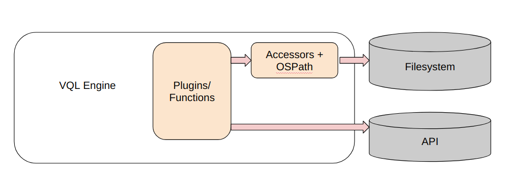
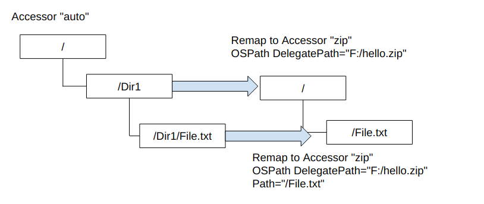

In the previous section we learned how the Velociraptor's path
handling allows for precise and correct path manipulations. The OSPath
abstraction allows VQL plugins and functions to open files in a
consistent way using different accessors. For example we have seen how
files can be read inside a `zip` file easily, while still using the
familiar `glob()` plugin.


For example the following query applies the `yara()` plugin to search
inside a zip file:

```vql
SELECT * FROM foreach(row={
   SELECT OSPath
   FROM glob(
     globs="**",
     root=pathspec(DelegatePath="F:/hello.zip"),
     accessor="zip")
}, query={
   SELECT * FROM yara(rules=YaraRules, accessor="zip", filename=OSPath)
})
```

Where the `glob()` plugin searches for files within the zip file
`hello.zip` and passes the OSPath into the `yara()` plugin.

One downside to this query is that an initial `OSPath` object needed
to be built to access the zip file itself. This means that we can not
generally use existing VQL artifacts or queries and just apply them in
a zip file, because they need to build the initial OSPath objects
themselves.

For example, the following query uses `yara()` to search files on the
filesystem:

```vql
SELECT * FROM foreach(row={
   SELECT OSPath
   FROM glob(globs="**", root="C:/", accessor="auto")
}, query={
   SELECT * FROM yara(rules=YaraRules, accessor="auto", filename=OSPath)
})
```

If we created an artifact with this query in it, then how can we use
the same existing artifact within a zip file instead of on the
filesystem?

Comparing the two queries above we can see they are very similar. The
only thing that is really different between them is the path and the
accessor used, the general VQL query is exactly the same.

## Remapping and VQL

Velociraptor's VQL engine is a powerful and efficient language
interpreter which allows running powerful queries. You can think of
the VQL engine as a sandbox interpreting the VQL queries. However,
there are really only two ways for VQL queries to interact with the
system:

1. Using accessors and OSPath objects allows VQL queries to access
   various filesystem like constructs (e.g. registry, zip files etc).
2. Using specific plugins and VQL functions allows queries to call
   APIs on the host.



The idea behind `remapping rules` is to provide a system for mapping
certain accessors into other accessor names so as to turn the generic
query above from using the `auto` accessor into automatically using the
`zip` accessor. This allows us to `virtualize` the VQL query to run in
a different context - for example a query designed to run on the live
filesystem can simply run on a dead disk image.



Consider the remapping configuration illustrated above. In this
configuration, when a plugin uses the "auto" accessor with a path like
"/Dir1", the "zip" accessor is used instead with an OSPath of
`{DelegatePath="F:/hello.zip"}`. This happens transparently once the
mapping rule is set up!

In the notebook, remapping rules are installed using the `remap()`
plugin and apply to all queries following the remap rule.

Let's configure a small remapping rule example in a notebook:

```vql
LET _ <= remap(config='''
remappings:
- type: mount
  from:
      accessor: zip
      prefix: |
        {
            "DelegateAccessor": "auto",
            "DelegatePath": "F:/hello.zip",
            "Path": "/"
        }
  on:
      accessor: "auto"
      prefix: "/"
      path_type: "windows"
''')

SELECT OSPath FROM glob(globs="*", accessor="auto", root="/")
```

This rule defines a remapping on the `auto` accessor at the root
level. The `auto` accessor will treat paths as windows path type. When
a plugin attempts to open a file using the `auto` accessor, the
remapping engine will instead use the `zip` accessor, and create an
OSPath that is constructed by adding the `auto` path into the `zip`
path. So opening a file called `hello.txt` with the `auto` accessor
will actually produce

```json
accessor: zip
path: {
        "DelegateAccessor": "auto",
        "DelegatePath": "F:/hello.zip",
        "Path": "/hello.txt"
      }
```

### Dead disk analysis

This remapping is useful to virtualize a query and allow it to run in
a different environment than it was initially designed for. This
allows us to reuse artifacts in different contexts. For example, a
live artifact can be reused with a dead disk image.

Click this link to learn more about how to create remapping files for
[dead disk analysis]()
