NTFS is the standard Windows filesystem.  Velociraptor contains
powerful NTFS analysis capabilities. This section describes
Velociraptor's NTFS capabilities and does not aim to be a complete
description of NTFS itself. We will only introduce the basic and most
relevant concepts of NTFS and examine how these can be used in a
number of DFIR contexts.

## The Master File Table

In NTFS, all files are represented in a [Master File Table (MFT)](https://docs.microsoft.com/en-us/windows/win32/fileio/master-file-table). The
MFT is also a file within the filesystem with the special filename of
`$MFT`. While this special file is normally hidden by the API,
Velociraptor's NTFS parser makes it available to view, read or upload.

The `$MFT` file contains a sequence of `MFT Entries`, each of a fixed
size (usually 512 bytes). These entries contain metadata about files,
called `File Attributes`. The different attributes contain different
kinds of information about each file:

* Filename (Long name/Short name)
* Data attribute – contains file data runs.
* I30 attribute (contains directory listing)
* Security attributes such as ACLs

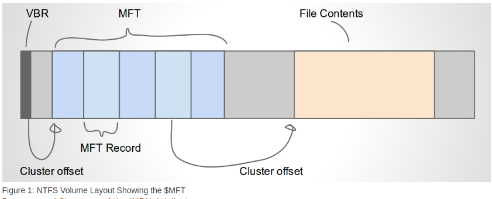

Data attributes may be compressed or sparse and contain a list of
`runs` that comprise the content of the file. The data content is
stored elsewhere on the disk, but the location is stored within the
MFT entry.

In NTFS Each file may contain two different filenames, a long and a
short filename. Filename attributes contain their own timestamps.

{}

Although NTFS long and short filenames are usually closely related
(e.g. the short filename is the first part of the long filename with a
suffix such as `%1`), this is not a requirement.

It is very easy to create a file with a completely different short
filename to its long filename. This can be problematic if you are
looking for references to the long filename from e.g. registry keys.

In the below example, I set the shortname of the `velociraptor.exe`
binary to `runme.exe`. I can then create a service that launches
`runme.exe` instead. Tools that only show the long filename of the
directory will fail to show the file and analysis may conclude that
the service target is missing from the filesystem.

```shell
C:\Users\test>fsutil file setshortname velociraptor.exe runme.exe
C:\Users\test>dir /x *.exe
 Volume in drive C has no label.
 Volume Serial Number is 9459-F443

 Directory of C:\Users\test

08/19/2018  11:37 PM        12,521,472 RUNME.EXE    velociraptor.exe
               2 File(s)     16,140,732 bytes
               0 Dir(s)  11,783,704,576 bytes free
C:\Users\test>runme.exe -h
usage: velociraptor [<flags>] <command> [<args> ...]
```

{}

## The `ntfs` accessor

Velociraptor has a complete NTFS parser able to access files and
directories by parsing the raw NTFS filesystem from the raw device. To
make it easy to utilize this parser with VQL, Velociraptor implements
the `ntfs` accessor (For a description of accessors, see [here]() ).

The `ntfs` accessor makes it possible to see and access the normally
hidden NTFS files such as `$MFT`. It also makes it possible to see
Alternate Data Streams (ADS), which are additional data streams
attached to the same MFT entry.

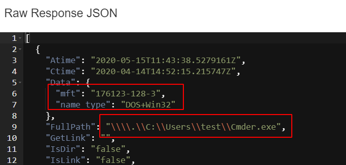

The NTFS accessor makes NTFS specific information available in the
Data field. For regular files it includes the inode string, as well as
the short filename.

When providing a path to the `ntfs` accessor, the first part of the
path is interpreted as the `drive letter` or the `device part`.

For example providing a path starting with `C:` or `D:`, will be
converted internally to Windows device notation, for example `\\.\C:`
or `\\.\D:`. The `ntfs` accessor then uses this to open the raw
logical device so it can be parsed.

This means that all paths returned from the `ntfs` accessor start with
the device name, e.g. `\\.\C:`.

{}

Since Velociraptor operated on the logical device it if not affected
by full disk encryption such as Bitlocker. Velociraptor will be able
to parse the raw NTFS filesystem regardless of the disk encryption
status.

{}

## Volume Shadow Copies

NTFS allows for a special copy on write snapshot feature called
`Volume Shadow Copy` or `VSS`. You can think of a VSS as a light
weight snapshot of the current filesystem without needing to copy any
data (future writes will simply be diverted to the current active
snapshot).

On server class Windows systems, you can create a VSS copy on your own
machine using `vssadmin create shadow`, but on other Windows versions
you will need to do this via WMI:

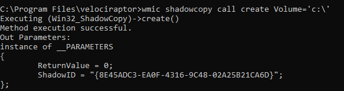

When a VSS copy is created, it is accessible via a special
device. Velociraptor allows the VSS copies to be enumerated by listing
them at the top level of the filesystem.  At the top level, the
accessor provides metadata about each device in the `Data` column,
including its creation time. This is essentially the same output as
`vssadmin list shadows`. In the below screenshot we can see the `Data`
column of the fixed `C:` drive and the VSS device.

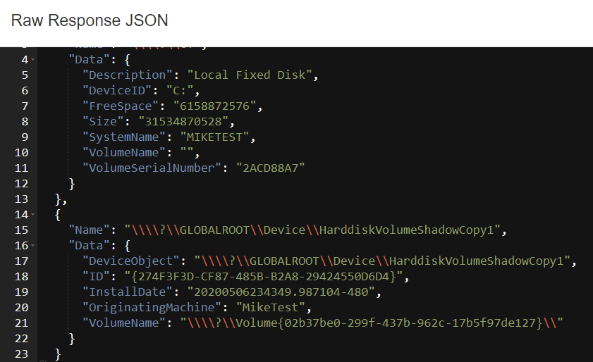

## Operating on VSS

Because the `ntfs` accessor treats all devices at the first top level
directory, it is possible to see the same file in all VSS copies at
the same time. For example, the following finds all VSS copies of the
event logs:

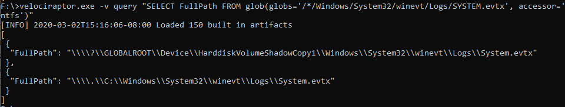

Simply use the VSS device name as a prefix to all paths and the ntfs
accessor will parse it instead.

You can use it to analyze older versions of the drive!

## Parsing the MFT

Since the `ntfs` accessor allows accessing the `$MFT` file as a
regular file, you can download the entire $MFT file from the endpoint
using the ntfs accessor, then process it offline. For example using
the `Windows.Search.FileFinder` artifact with the `ntfs` accessor - or
simply using the VQL:

```sql
SELECT upload(path="C:/$MFT", accessor="ntfs")
FROM scope()
```

However, in practice this is inefficient and does not scale. Typically
we want to parse the MFT in order to answer some questions about the
system, such as which files were modified within a timerange.

Velociraptor provides access to the $MFT parser using the
`parse_mft()` plugin, so the MFT can be parsed directly on the
endpoint using Velociraptor. The plugin emits a high level summary of
each MFT entry, including its timestamps (for the
$STANDARD_INFORMATION and $FILENAME streams) and MFT ID.

This plugin is most useful when you need to pass over all the files in
the disk - it is more efficient than a recursive glob and might
recover deleted files. For example to recover all the files with a
.exe extension from the drive:

```sql
SELECT * FROM parse_mft(filename="C:/$MFT", accessor="ntfs")
WHERE FileName =~ ".exe$"
```

## MFT Entries

An MFT Entry can have multiple attributes and streams. While
`parse_mft()` plugin emits a high level summary for each entry,
sometimes we need more information on each MFT entry. This information
is provided by the `parse_ntfs()` VQL function which accepts and MFT
ID:

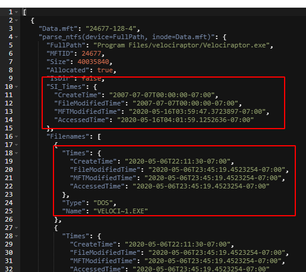

The MFT ID can be take from the output of `glob()` or `parse_mft()`.

{}

In the above you will sometimes see the term `inode` referred to. This
term traditionally comes from the Sleuthkit and is a string consisting
of a triple of mft id, type id and stream id, e.g. `974-16-0`
representing a stream of data

{}

## NTFS timestamps

A single MFT entry can have up to 16 timestamps, based on different
attributes:

* The $STANDARD_INFORMATION attribute contains 4 timestamps (Modified, Accessed, Inode Changed, Born)
* There are often 2 $FILENAME attributes for a short name and a long name, each will have 4 further timestamps.
* The $I30 stream of the parent directory also contains 4 timestamps for the file.

Timestamps are critical to forensic investigations as they help to
establish a timeline of activity on the system.

### Timestomping

Attackers sometimes change the timestamps of files to make them less
obvious. E.g make malware look like it was installed many years
ago. This makes timelines more difficult to establish and might cause
you to miss important filesystem events.

For the next exercise we will stomp over some times. Use the following
powershell to stomp over Velociraptor.exe’s timestamps.

```powershell
$file = 'C:\Program Files\Velociraptor\Velociraptor.exe'
$stomp = Get-Date 2007-07-07
$(Get-Item $file).creationtime = $stomp
$(Get-Item $file).lastaccesstime = $stomp
$(Get-Item $file).lastwritetime = $stomp
Get-ChildItem $file | Select *, Fullname, *Time*
```

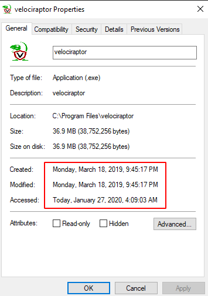
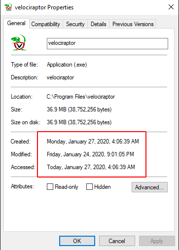


The above script uses the API to change the times of a file but this
only changes the $STANDARD_INFORMATION stream. The real times are
still present on the $FILENAME attributes. A common detection to this
is to find files which have $STANDARD_INFORMATION times earlier then
the $FILENAME times. When the file is created, $FILENAME times are set
to the real times, then if the API is used to send the timestamps
backwards the $STANDARD_INFORMATION timestamps will appear earlier
than the $FILENAME times.

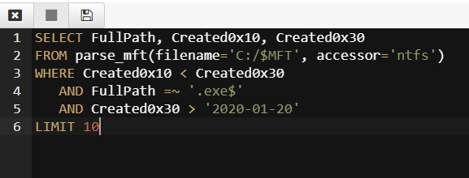


{}

Although it might appear to be a solid detection to timestomping,
generally timestomping detections are not very reliable in
practice. It turns out that a lot of programs set file timestamps
after creating them into the past by design - mostly archiving
utilities like 7zip or cab will reset the file time to the times
stored in the archive.

Conversely it might appear that the $FILENAME times are the most
reliable and should be mostly relied upon in an investigation since
they are not directly modifiable by the Win32 APIs.

Unfortunately this is not the case - the $FILENAME attributes can be
easily modified by simply renaming the file (after timestomping) and
rename it back. Windows will copy the timestamps from the
$STANDARD_INFORMATION attribute to the $FILENAME when renaming the
file.

{}

## Timeline analysis

Timelines in forensic analysis are very important as they place events
in chronological order and may reveal causal relationships.  We can
get a timeline by sorting the table on the modified or birth
timestamps.

```sql
SELECT * FROM parse_mft(filename="C:/$MFT", accessor="ntfs")
WHERE Created0x30 > "2020-01-02"
ORDER BY Created0x30
```

It is more efficient to narrow the time of interest first.

## The $I30 INDX stream

In NTFS a directory is simply an MFT entry with $I30 streams. The
streams contains a B+ tree of the MFT entries in the directory.

Since INDX streams are a B+ tree when a record is deleted, the tree
will be reordered. Sometimes this leaves old entries in the slack
space. INDX stream is allocated in 4096 byte blocks which leaves a lot
of slack space to potentially hold residual data.

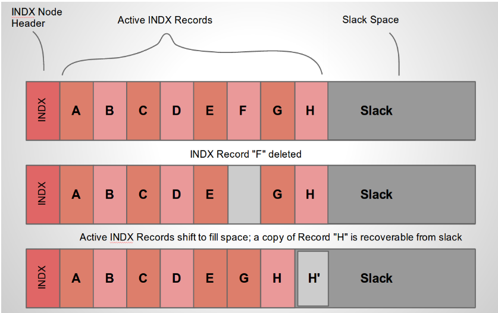

Velociraptor can report on the $I30 streams and carve out headers from
slack using the `parse_ntfs_i30()` function as discussed in [this
article](https://www.fireeye.com/blog/threat-research/2012/10/incident-response-ntfs-indx-buffers-part-4-br-internal.html). An
example query:

```sql
SELECT * FROM foreach(
   row={
     SELECT FullPath, Data.mft AS MFT
     FROM glob(globs=DirectoryGlobs, accessor="ntfs")
     WHERE IsDir
   },
   query={
     SELECT FullPath, Name, NameType, Size, AllocatedSize,
            IsSlack, SlackOffset, Mtime, Atime, Ctime, Btime, MFTId
     FROM parse_ntfs_i30(device=FullPath, inode=MFT)
})
```

## The USN journal

Update Sequence Number Journal or Change journal is maintained by NTFS
to record filesystem changes. Primarily designed to support backup
programs, the USN journal records metadata about filesystem changes.

The journal resides in the path `$Extend\$UsnJrnl:$J` and is normally
a hidden NTFS internal file (so it can only be accessed via the `ntfs`
accessor).

Windows appends USN records to the end of the file. However, the file
is sparse - periodically NTFS will remove the range at the start of
the file to make it sparse and preserve disk space.

Typically the file will report a huge size but will actually only take
about 30-40mb on disk since the first part of the file is sparse.

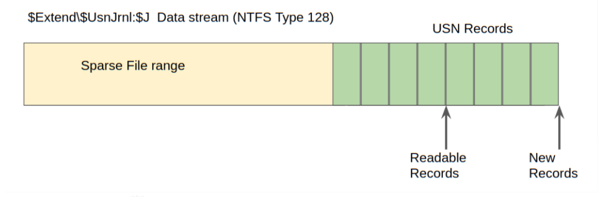

When collecting the journal file, Velociraptor will collect the sparse
file only (Velociraptor is aware of sparse files and preserves their
sparse ranges by adding an additional `.idx` file to the collection
with the ranges containing real data. You can see this in the
`Uploaded Files` tab of the collection - the file size is reported to
be very large, however only about 30mb was actually collected.

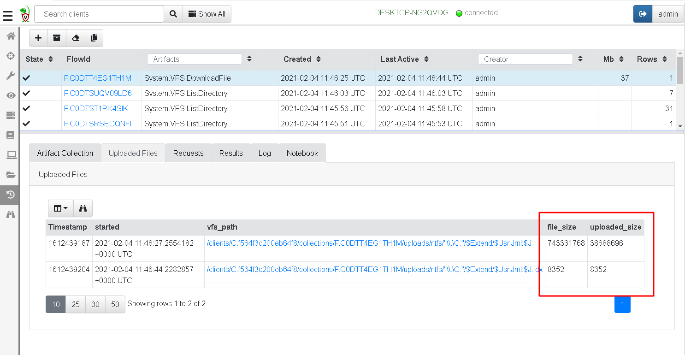


{}

Downloading the file from the `Uploaded Files` tab will pad the sparse
regions and produce a large file with ranges of 0 in it. On the other
hand, exporting the zip file from the `Overview` tab will store the
collected file and the `idx` range file into the zip file so will only
store about 30mb.

{}

### Parsing USN journal

Velociraptor can parse each entry in the USN journal directly on the
endpoint. This allows for queries to target specific files or times of
interest on the endpoint.

Since the beginning of the file is sparse, we start parsing from the
first valid range.

The USN journal may record interactions with files that have been
removed. Many files represent evidence of system interaction (such as
lnk files or prefetch files) and the USN journal can therefore uncover
the "smoking gun" when the system was initially compromised.

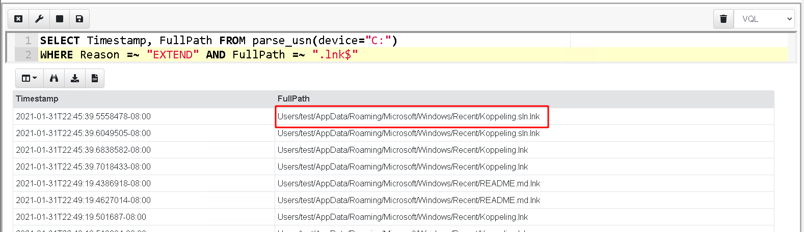

You can collect the USN journal using the `Windows.Forensics.Usn`
artifact.

{}

The USN journal contains so much valuable evidence that it might be worth carving for USN records from the raw disk. Although this is a slow process it can yield very good results if your are lucky - see [this blog post]() for more information.

{}
