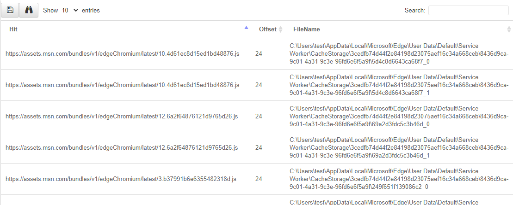

A powerful DFIR technique is searching bulk data for patterns. Some
examples include:

* Searching for CC data in process memory
* Searching for URLs in process memory
* Searching binaries for malware signatures
* Searching registry for patterns

Bulk searching helps to identify evidence without needing to parse file formats

## YARA - The swiss army knife

YARA is a powerful keyword scanner that allows to search unstructured
binary data based on user provided rules. YARA is optimized to scan
for many rules simultaneously, making is an excellent choice for
detecting suspicious binaries using common patterns.

Velociraptor supports YARA scanning of bulk data (via accessors) and
memory using the `yara()` and `proc_yara()` plugins.

An example of a YARA rule is shown below.

```yara
rule X {
   strings:
       $a = “hello” nocase
       $b = “Goodbye” wide
       $c = /[a-z]{5,10}[0-9]/i

   condition:
       $a and ($b or $c)
}
```

The rule consists of a `strings` section and a `condition`
section. Strings represent a set of keywords which might include ASCII
or UTF16 encoded strings, as well as regular expressions. You can refer to the [Yara rules reference page](https://yara.readthedocs.io/en/stable/) to learn about how to construct rules.

{}

The `yara()` VQL plugin can accept an optional `accessor`
parameter. If the accessor is specified, the plugin will read chunks
of data from the accessor and apply the YARA rules on the string in
memory. This allows you to apply YARA rules on any data that is
available via an accessor including raw strings (using the `data`
accessor), registry values (using the `registry` accessor) or NTFS
parsed data (using the `ntfs` accessor) for example.

While this is convenient, it means that rules that examine the entire
file will not work as expected. For example, the YARA `pe` module
looks at the PE header, but when the file is read in chunks, only the
first chunk contains the PE header. Similarly YARA rules that contain
an expression checking a file offset will not work because the rules
are applied to buffers in memory.

When an accessor is not specified, the `yara()` plugin assumes the
filename refers to a filesystem path, and simply allows the YARA
library to scan the file as is. The YARA library uses `mmap()` to map
the entire file into memory and can therefore optimize the scan across
the entire file.

It is therefore much faster to not specify an accessor to the `yara()`
plugin if you just need to scan files on disk.

{}

### Example: drive by download

You suspect a user was compromised by a drive by download (i.e. they
clicked and downloaded malware delivered by mail, ads etc).

You think the user used the Edge browser but for this example, assume
you have no idea of the internal structure of the browser
cache/history etc.  Write an artifact to extract potential URLs from
the Edge browser directory.

```sql
LET YaraRule = '''
rule URL {
  strings: $a = /https?:\\/\\/[a-z0-9\\/+&#:\\?.-]+/i
  condition: any of them
}
'''

SELECT * FROM foreach(
row={
   SELECT FullPath FROM glob(globs='''C:\Users\*\AppData\Local\Microsoft\Edge\**''')
}, query={
   SELECT str(str=Strings.Data) AS Hit,
          String.Offset AS Offset,
          FileName
   FROM yara(files=FullPath, rules=YaraRule)
})
```



## YARA best practice

You can get yara rules from many sources (threat intel, blog posts
etc) or you can write your own. Rules may be very specific, in which
case a hit may represent a valuable signal. If the YARA rule is too
loose, the likelihood of a false positive increases, and further
postprocessing will be required to verify the hits.

Try to collect additional context around the hits to eliminate false
positives. You can use other plugins to help verify other aspects of
each hit before reporting it, thereby eliminating false positives.

Yara scanning is relatively expensive since we need to read data from
disk! consider more targeted glob expressions to limit the number of
disk reads Velociraptor will need to do to evaluate the query. If you
find you do need to scan a lot of data, consider specifying client
side throttling when launching the collection or hunt (using the
Ops/Sec mechanism) - usually YARA scanning is not time critical.


## Uploading files

One of the unique capabilities of Velociraptor is uploading file
content from the endpoint. While the actual mechanism of uploading the
file to the server is abstracted away, triggering a file upload from
VQL is a simple matter of calling the `upload()` function. This makes
it trivial to upload files based on any criteria of the query.

The `upload()` function simply requires an accessor and a filename to
read the file out, and the file is uploaded to the server
automatically. Optionally the function may also take a `name`
parameter which renames the file as sent to the server.

### Example: Collect all executables in users’ home directory

This is a common use of combining a `glob()` plugin with an
`upload()` function:

```sql
SELECT upload(file=FullPath) AS Upload
FROM glob(globs='''C:\Users\*\Downloads\*''')
WHERE NOT IsDir
```
