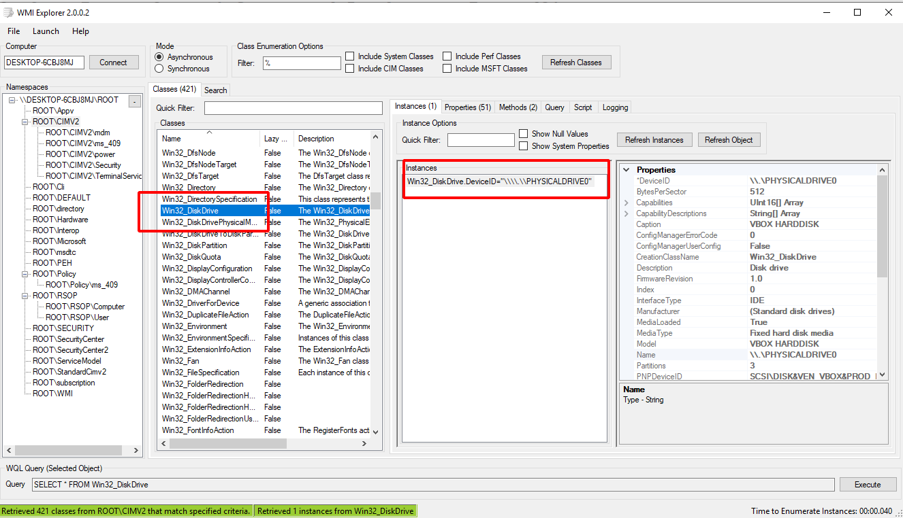
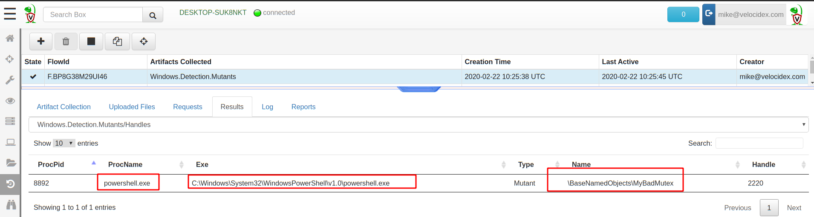
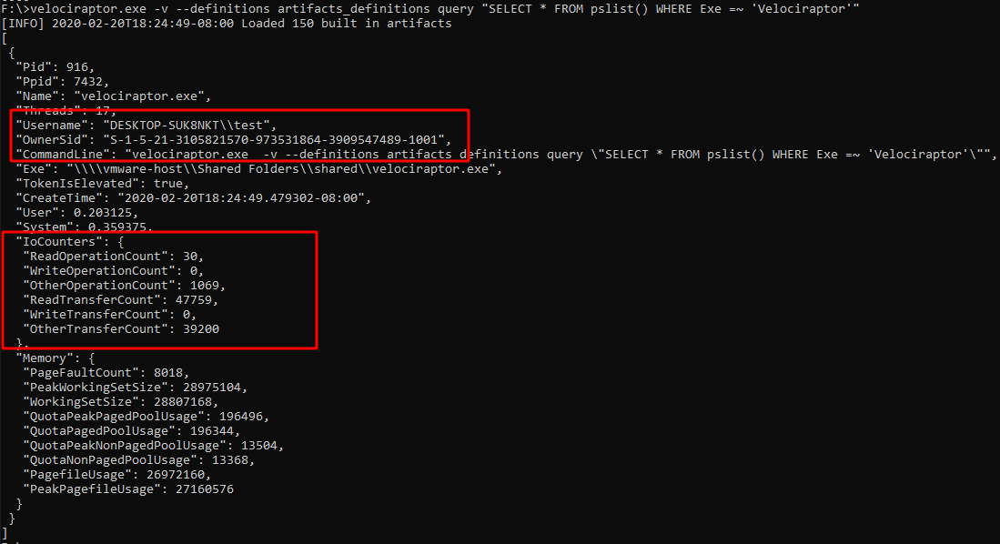
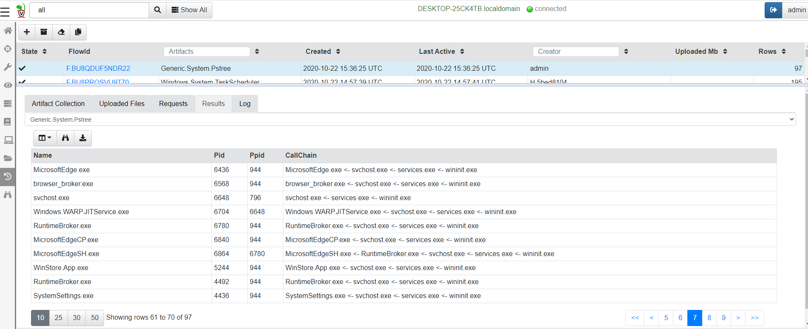

Traditional forensic analysis relies on filesystem artifacts. However,
one of the best advantages of performing live response is the ability
to access the live system's state and uncover volatile indicators that
only exist briefly and might change in future.

{}

Traditionally volatile evidence was acquired using a full memory dump
of the running system, and then using a number of memory analysis
frameworks to extract some of the types of forensic artifacts we
discuss in this page.

While memory analysis is a sometimes useful technique, it is
notoriously unreliable due to issues such as smear, stability and
analysis shortfalls due to changing OS and application code.

An important principle of volatile system analysis is to disturb the
system as little as possible, to avoid increasing the rate at which
the volatile evidence might change. A full memory acquisition defeats
this requirement by causing a very large amount of data to be written
and potentially transferred over the network. Some server class
machines (or even high end workstations) currently contain so much
memory that full acquisition is actually not practical (e.g. upwards
of 64Gb of RAM is not uncommon), and produces significant amounts of
smear.

Velociraptor's approach is to use the relevant APIs to acquire
volatile artifacts as much as possible, so the acquisition can be made
quickly, accurately and with minimal endpoint impact. Velociraptor
tries to maintain the same names for the common plugins used by
popular memory analysis tools like Volatility, but gets the same
information using APIs (e.g. Velociraptor's plugins are named
`pslist`, `vad`, `mutants` etc and parallel Volatility's plugins of
the same name).

{}

## Windows Management Instrumentation (WMI)

One of the earliest mechanisms for introspecting a machine's internal
state is using WMI. WMI provides a simple query language similar to
SQL called WQL (WMI Query Language). In WQL, a "table" is referred to
as a "class" and Windows provides a large number of classes organized
into namespaces.

It is most instructive to explore these using a tool such as [wmie2](https://github.com/vinaypamnani/wmie2).



VQL provides direct access to WMI via the `wmi()` plugin. The plugin
simply takes a `query` parameter which is passed to WMI and the
results are emitted from the plugin one row at a time.

```sql
SELECT * FROM wmi(query="SELECT * FROM Win32_DiskDrive")
```

There are many providers in WMI and it is possible to gather a lot of
information about the system's current configuration and state in this
way. Use a tool such as `wmie2` to figure out interesting providers
and structure VQL queries around these. Note that with VQL you are
also able to combine functions like `upload()`, `hash()` and others to
further enrich the output from WMI providers.

## Mutants

Malware typically need to persist using multiple persistence
mechanisms - in case one mechanism is detected and removed, often
other mechanisms will re-infect the machine. This leaves a common
problem: How to avoid multiple copies of the same malware from
running?

A common solution is using a `Mutant` or a named mutex object. A
Mutant is a named kernel object that can only be "acquired" by one
thread at a time. Multiple copies of the same malware will try to
acquire the mutant, but only the first will succeed, leaving the rest
to exit.

For this reason, a mutant is frequently used as an indicator for a
malware strain because it is easy to see if the mutant name exists on
a system.

### Exercise - Mutants

For example, consider the following powershell snippet:

```powershell
$createdNew = $False
$mutex = New-Object -TypeName System.Threading.Mutex(
      $true, "Global\MyBadMutex", [ref]$createdNew)
if ($createdNew) {
    echo "Acquired Mutex"
    sleep(1000)
} else {
    echo "Someone else has the mutex"
}
```

The first time it is run, the mutant will be "acquired" and the
program will simply go to sleep. Further instances of the script will
be unable to acquire the mutant and will exit immediately.

### Enumerate the mutants

You can enumerate the mutant using the `Windows.Detection.Mutants`
artifact. This artifact can be used to collect all mutants (and
perhaps do some analysis on their names) or to check for some well
known names using a filter (in which case a hit represents a strong
signal that endpoint is compromised).



## Process analysis

A process is a user space task with a specific virtual memory
layout. A process has a name, Process ID (Pid), an initial binary on
disk, an ACL Token, environment variables etc. All of these associated
attributes can be used to explain why the process is launched and what
its intentions are.

Velociraptor provides access to various process attributes using
process specific plugins. Most of these plugins accept a `pid`
argument to examine a specific process.


### pslist

A simple `pslist()` can reveal basic information about the process:

* Who launched the binary? (Username and SID)
* Transfer metrics (network/disk activity)
* Is it elevated?
* Process Creation time
* Executable location on disk
* Commandline for launching the process.



### Process Call chain

A process call chain is useful to see which process launched which
other process. Artifacts such as `Windows.System.Pstree` attempt to
put processes in a parent/child relationship (i.e. Process chain) to
try to visualize the order of process execution.




{}

Currently the process chain reassembly is susceptible to some
shortfalls:

1. Since the chain uses `pslist()` to populate its tree, processes who
   are exited will break the chain (because there will be no parent
   shown for one process in the chain).

2. Windows parent/child relationship can be easily [spoofed by
   malware](https://attack.mitre.org/techniques/T1134/004/) and can be
   mis-reported by the pslist() plugin.

{}

### Example - Find elevated command shell

Write an artifact to find all currently running elevated command shells

```sql
SELECT * FROM pslist()
WHERE TokenIsElevated
```

## Mapped Memory

When a binary runs it links many DLLs into it in order to call
functions from these dlls. A linked DLL is a copy on write memory
mapping of a file on disk into the process memory space. DLLs can be
linked when the program starts or dynamically at runtime.

Seeing which DLL is linked gives a clue of the type of functionality
that a process is likely to use.

The `vad()` plugin shows all the process memory regions and if the
memory is mapped to file, the filename it is mapped from.

For interpreted languages like .net assemblies, powershell or python DLLs are mapped into the process at runtime when the script imports certain functionality. We can use this to get an idea of what the program is doing.

### Exercise - what is that powershell doing?

Without enabling powershell block logging, we can get an idea of what the script is doing by looking at its dependencies.

Consider a powershell script that runs `Invoke-WebRequest -Uri
"https://www.google.com" -UseBasicParsing` to download a page from the
internet. By virtue of this command, the powershell process will link
`winhttp.dll`.

We can write VQL to list all the DLL modules that powershell is running.

```sql
LET processes = SELECT Exe, CommandLine, Pid
FROM pslist()
WHERE Exe =~ 'PowerShell'

SELECT * FROM foreach(row=processes,
query={
   SELECT Exe, CommandLine, Pid, MappingName
   FROM vad(pid=Pid)
   GROUP BY MappingName
})
WHERE MappingName =~ 'winhttp'
```
