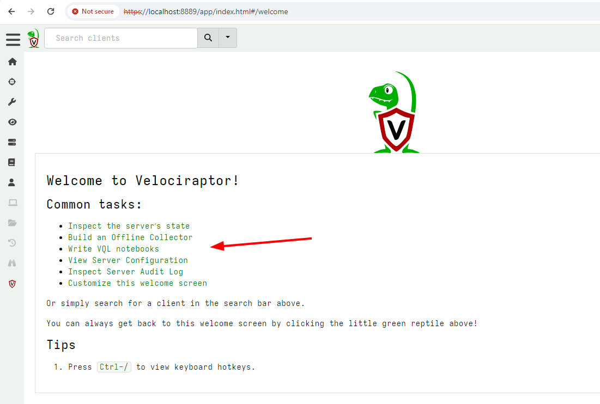
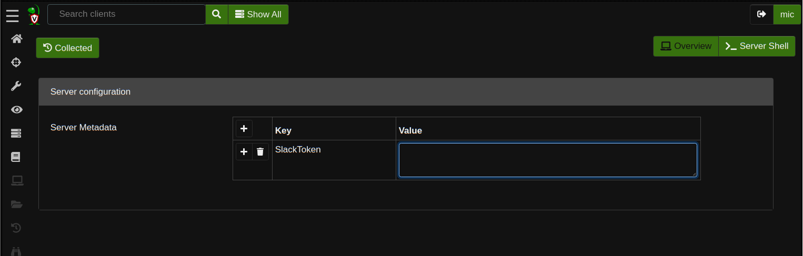
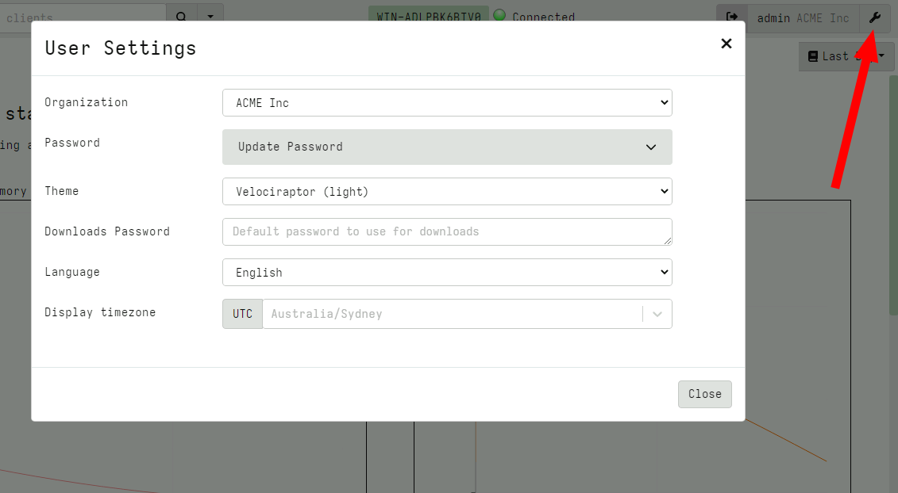
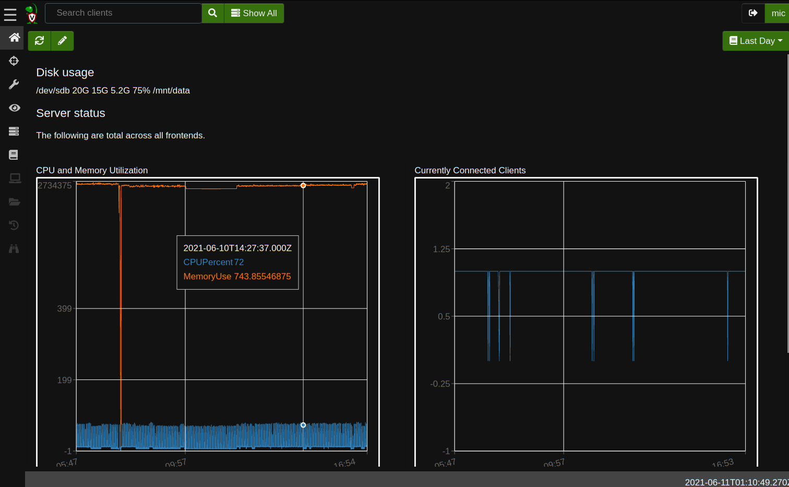
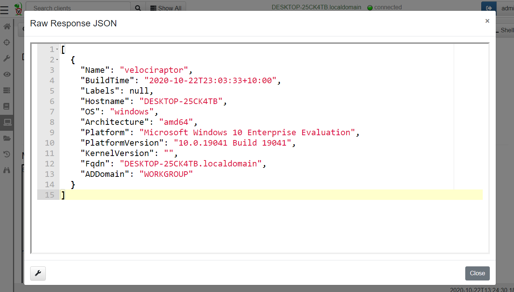

The Admin GUI is a web application that can be used to interact and
manage Velociraptor. The GUI allows users to schedule new collections,
edit existing artifacts or write new ones and launch hunts.

## The Welcome screen

The Velociraptor landing page offers some links to commonly used tasks
within the application.

{}
You can customize the Welcome screen by editing the `Server.Internal.Welcome` artifact.
{}

### Inspecting Server state

Of interest is the link to `Inspecting Server state`. This allows
administrators to set server metadata such as secrets to interact with
other systems. Placing secrets in a centralized location allows
artifacts to use them without exposing them to non-administrator users
on the server.

## User Preferences

The User can customize their interface by clicking on the user tile at
the top right of the screen. There are a number of aspects of the GUI
application that can be adjusted.

* `Org selector`: The Org selector allows a user to switch to a
  different org. See the [Organizations]({}) section for more information on
  multi-tenancy in Velociraptor.

* `Password`: If the deployment uses `Basic` authentication mode, this
  allows the user to change their own password. See [Basic Authentication]({}).

* `Theme`: Velociraptor offers a number of themes including several
  dark mode themes, light mode themes and some fun themes too. Find
  the look that fits you best!

* `Downloads Password`: In a number of places in the interface,
  Velociraptor offers the user the opportunity to download collected
  data. However, in many cases this data might contain malware or
  other unwanted software that typically triggers Antivirus or other
  security software. This setting allows you to define a password to
  encrypt the zip files with to avoid triggering such software.

* `Language`: Velociraptor's interface can be switched to a number of
  languages. If your favorite language is not there, consider
  contributing a translation file!

* `Display Timezone`: The GUI shows many timestamps throughout. Times
  are always shown in RFC-3339 / ISO-8601 which makes then unambiguous
  in all timezones. This setting switches the display to show all
  times in a particular timezone. This helps visual inspection but
  does not change the times in any way (just changes their
  representation). Internally all times are always serialized in UTC.

## The Dashboard

The Dashboard can be accessed from the Home icon on the sidebar. The
dashboard shows the current state of the deployment at a high level.

The dashboard is divided into two parts. On the left, the total memory
and CPU used by all frontends is down over the past day. On the right,
the total number of currently connected clients is shown.

{}

You can customize the Server Dashboard screen by editing the
`Server.Monitor.Health` artifact. The artifact specifies a template
containing markdown and using the Golang Template Language. You can
also run arbitrary VQL in dashboards!

{}

### Table GUI Widgets

A common UI element in the Velociraptor GUI is the table widget. Since
Velociraptor deals with VQL queries and all queries simply return a
list of rows, the GUI presents a lot of results in a table form.

All Velociraptor tables have some common tools available as can be
seen above:

1. The Column Selector - allows users to show/hide columns. This is
   useful when there are many columns and the table takes up a lot of
   horizontal real estate, or when some columns provide too much
   details

2. View Raw JSON - All VQL queries simply return a result set encoded
   as a list of JSON objects. For more complex tables it is sometimes
   easier to see the precise JSON returned, and clicking on this
   button displays the raw json in a dialog box.

3. Export table as CSV or JSON - Clicking on the export table button
   simply exports the **visible** columns as a CSV file. This is a
   great way of filtering out uninteresting columns and producing more
   targeted CSV files for post processing in e.g. Excel.

