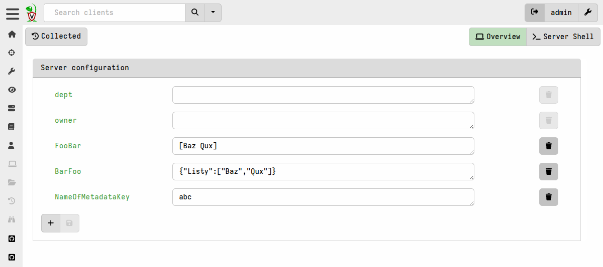
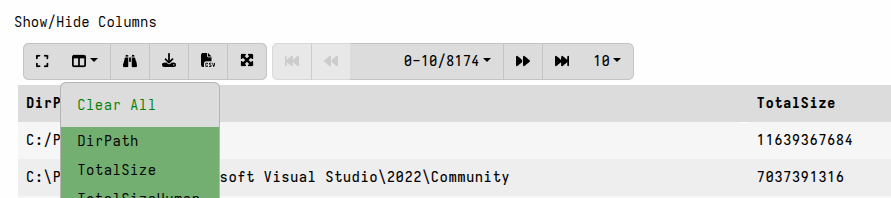

The Admin GUI is a web application that can be used to interact and
manage Velociraptor. The GUI allows users to schedule new collections,
edit existing artifacts or write new ones and launch hunts.

## The Welcome screen

The Velociraptor landing page offers some links to commonly used tasks
within the application.

{}
You can
[customize the Welcome screen]()
by editing the `Server.Internal.Welcome` artifact.
{}

### Server Metadata

The link to **View Server Configuration** takes you to the page where server
administrators can edit/view server metadata. This is a collection of key-value
pairs that can contain items such as URIs that can be shared by multiple
artifacts.

Metadata items can be strings or stringified representations of any other data
type. Artifacts can access server metadata using the
[server_metadata]()
parameter type, and VQL (running on the server, for example in a notebook) can
set or retrieve items from server metadata using the
[server_set_metadata]()
and
[server_metadata]()
functions, respectively.

### Server Secrets

The **Manage Server Secrets** link will take you to the page where you can
define [server secrets](),
which are credentials and other parameters for interacting with external systems
that can be securely provided to certain VQL plugins via artifacts. Placing
secrets in a centralized location allows artifacts to use them without exposing
them to non-administrator users on the server.

## User Preferences

The User can customize their interface by clicking on the user tile at the top
right of the screen. There are a number of aspects of the GUI application that
can be adjusted.

You can read more about the individual options
[here]().

## The Server Dashboard

The Server Dashboard can be accessed using the <i class="fas fa-home"></i> icon
on the sidebar. The dashboard shows the current state of the deployment at a
high level.

The dashboard shows graphs of total memory and CPU used by all frontends. On the
right, the total number of currently connected clients is shown.

By default the view shows data for the past day although you can choose a
different time interval from the range-picker on the top-right, or select and
drag inside the graph to zoom in on a specific time range.

Below the graphs are tables showing other aspects of the server deployment, for
example disk space and users.

{}

All data shown on the dashboard is driven by VQL queries.
The dashboard layout and underlying queries can be
[customized]()
by editing the `Server.Monitor.Health` artifact.

{}

### Table Widgets

A common UI element in the Velociraptor GUI is the table widget. Since
Velociraptor deals with VQL queries and all queries simply return a
list of rows, the GUI presents a lot of results in a table form.

All Velociraptor tables have some common tools available as can be
seen above:

1. **Collapse/Expand All Columns** - Sometimes the content of some cells can take up
   a lot of vertical space. This option toggles between showing the full row
   heights or shrinking the row display to a standard height.
   

2. **The Column Selector** - Allows users to show/hide columns. This is
   useful when there are many columns and the table takes up a lot of
   horizontal real estate, or when some columns provide too much
   data that you don't want to see.
   

3. **View Raw JSON** - All VQL queries simply return a result set encoded
   as a list of JSON objects. For more complex tables it is sometimes
   easier to see the precise JSON returned, and clicking on this
   button displays the raw json in a dialog box.

4. **Download table as CSV or JSON** - Clicking on these buttons exports the
   _visible_ table data to a CSV or JSON file. This is usually used to filter
   out uninteresting columns and produce data files that can be used in other
   applications, e.g. Excel.

5. **Fullscreen** - A new feature in version 0.75 is that an individual table
   can be viewed fullscreen. This opens the table in fullscreen view in a new
   browser tab. This is useful when working with large tables where you need all
   the screen space you can get.

6. **Pagination/Navigation Widget** - The right side of the table widget is
   where you will find all the options to navigate through the table data. You
   can choose how many rows to display per page and navigate forward/back, or
   skip to the first, last, or a specific page number.