## Finding, managing, creating and editing artifacts in the GUI

In the GUI, Artifacts are created, edited and managed on the View Artifacts
screen. Here you can search and view all artifacts known to your server. The GUI
also includes a feature-rich artifact editor, which you can access on this
screen.

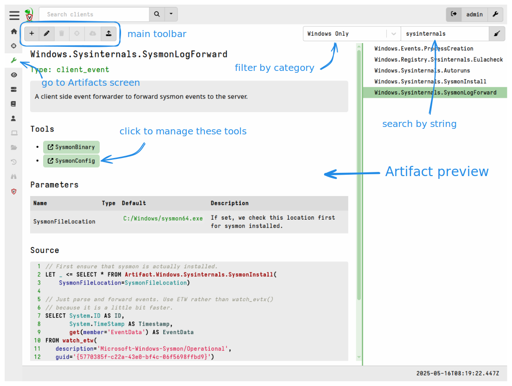

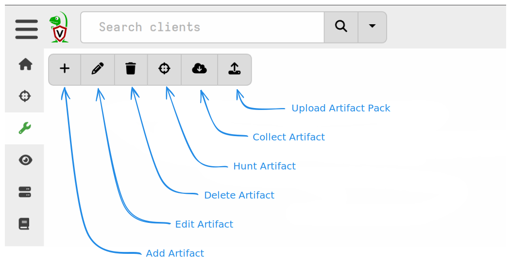

{}

In order to create, modify or delete artifacts your user needs to have the
`ARTIFACT_WRITER` permission.

Users with this permission are generally considered to be "admin equivalent"
since it is easy to escalate to full admin by designing artifacts to accomplish
that goal.

This permission is not needed to _run_ artifacts, so it is common to have some
users who can only run artifacts and some other users who can create and manage
artifacts.

{}

### Searching Artifacts

The search bar on the right side of the Artifacts screen allows you to search by
any text string, regular expression, and certain category expressions (see table
below).

As explained [here]() the `name`,
`aliases`, and `description` fields from all artifacts are indexed and
searchable.

When searching, you can also limit the results using predefined Category
Filters, which are available as a drop-down list next to the search bar.

| Category Filter           | Filter expression      | Notes                                                                           |
|---------------------------|------------------------|---------------------------------------------------------------------------------|
| **Client Artifacts**      | `type:CLIENT`          |                                                                                 |
| **Server Artifacts**      | `type:SERVER`          |                                                                                 |
| **Notebook templates**    | `type:NOTEBOOK`        |                                                                                 |
| **All Artifacts**         | `<none>`               | Only includes artifacts with sources.                                           |
| **Windows Only**          | `precondition:WINDOWS` |                                                                                 |
| **Linux Only**            | `precondition:LINUX`   |                                                                                 |
| **macOS Only**            | `precondition:DARWIN`  |                                                                                 |
| **Client Monitoring**     | `type:CLIENT_EVENT`    |                                                                                 |
| **Server Monitoring**     | `type:SERVER_EVENT`    |                                                                                 |
| **Using Tools**           | `tool:.+`              |                                                                                 |
| **Exchange**              | `^exchange.+`          |                                                                                 |
| **BuiltIn Only**          | `builtin:yes`          |                                                                                 |
| **Custom Only**           | `builtin:no`           |                                                                                 |
| **Basic Only**            | `metadata:basic`       |                                                                                 |
| **Include Empty sources** | `empty:true`           | Same as "All Artifacts" filter but also includes  artifacts without sources.\*\* |

\*\* For more information about artifacts without sources see
[here]().

The above filter expressions can also be used in the search bar directly and
combined with search strings. Searches are _not_ case-sensitive.

For example:

- `process type:client_event` will show all client event artifacts that also
  (i.e. _and_ is implied) have the word "process".
- `tool:sysmonbinary` will show all artifacts that use the tool named
  "SysmonBinary".

#### Searching artifacts by tag

{}

This feature requires version 0.75 or above.

{}

Artifact [Tags]()
can be applied to selected artifacts to make finding and managing those
artifacts easier in the GUI. These tags are stored as metadata in the server's
internal artifact repository, and are therefore not part of the artifacts' YAML.

Tags applied to a specific artifact are displayed in the Artifact preview in the
Artifacts screen.

All tags in the artifact repository are added to the end of the Search dropdown
list on the Artifacts screen.

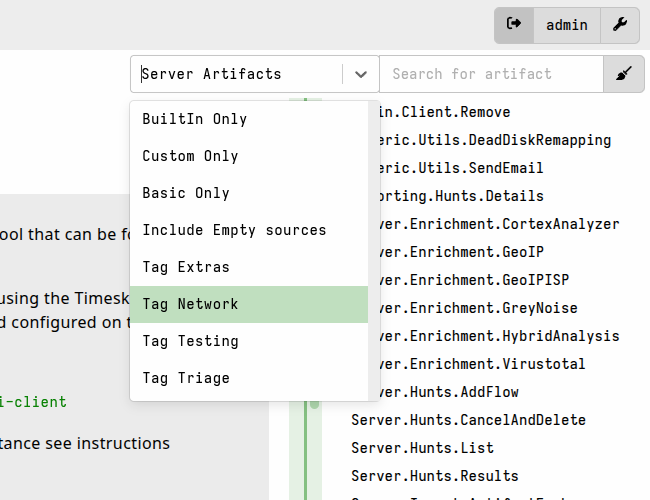

The `tag` term can also be used in filter expressions, for example
`tag:exchange defender` will match all artifacts tagged with "exchange" and
having the term "defender" in their
[searchable fields]().

### Importing Artifact Packs

There are
[many ways to add artifact definitions]()
to Velociraptor. On the Artifacts screen you can import zip archives containing
multiple artifacts.

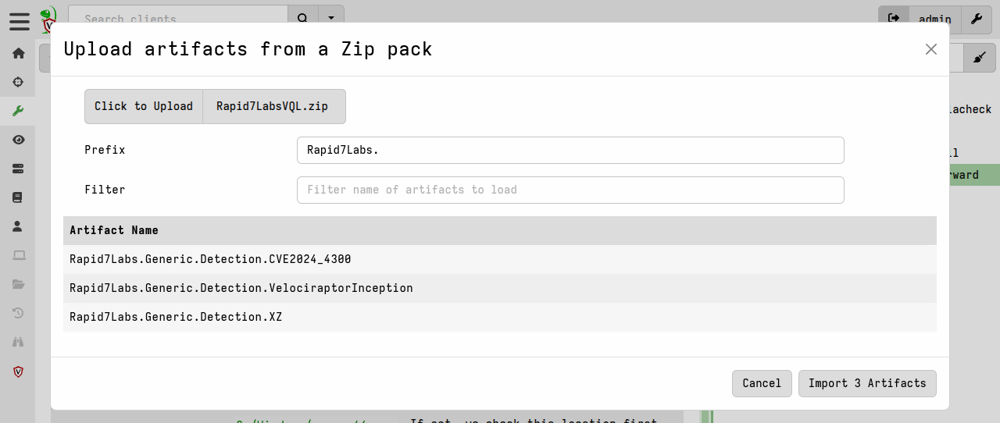

When importing artifact packs you are given the option to add a custom prefix to
the artifact name (if you want a `.` then you need to include it to your
prefix!), and the option to only import artifacts that match a name filter.

The file structure inside the zip doesn't matter. Velociraptor will search for
all files in the zip with a `.yaml` or `.yml` file extension. The imported
artifacts will be saved to the server's datastore using the file and folder
structure described
[here]().

### Importing Artifacts From Velociraptor's Specialized Artifact Projects

Over time Velociraptor has spawned many sub-projects for curating and
managing certain larger, more complex artifacts. As some artifacts became more
complex and powerful, we moved them into separate projects so that they could be
developed and managed independently of the main Velociraptor project. Splitting
these off allows for independent release cycles, thus facilitating more rapid
development and innovation.

Velociraptor includes several `SERVER` artifacts which can import additional
artifacts from these external projects.

| **Project name** | **Project website** | **Import artifact** |
|---|---|---|
| Curated Sigma Rules  (Hayabusa/Hayabusa Live/ChopChopGo) | https://sigma.velocidex.com/ | `Server.Import.CuratedSigma` |
| KapeFiles | https://triage.velocidex.com/ | `Server.Import.UpdatedBuiltin` |
| Rapid7Labs | https://github.com/rapid7/Rapid7-Labs/tree/main/Vql | `Server.Import.Rapid7Labs` |
| RegistryHunter | https://registry-hunter.velocidex.com/ | `Server.Import.RegistryHunter` |
| SQLiteHunter | https://sqlitehunter.velocidex.com/ | `Server.Import.UpdatedBuiltin` |
| Velociraptor Artifact Exchange | https://docs.velociraptor.app/exchange/ | `Server.Import.ArtifactExchange` |
| Artifacts from previous releases | https://github.com/Velocidex/velociraptor/releases | `Server.Import.PreviousReleases` |

{}

In version 0.75 and above, most of the artifacts listed above are consolidated
into a single import artifact named `Server.Import.Extras`, and some
reorganization within the related projects has been done to make these more
manageable.

The following artifacts are no longer included in the binary, and therefore need
to be imported using `Server.Import.Extras`:

- The Windows Sigma-related artifacts (including Hayabusa rules)
- The Linux Sigma-related artifacts
- `Generic.Forensic.SQLiteHunter`
- `Generic.Collectors.SQLECmd`
- `Windows.Registry.Hunter`
- `Windows.KapeFiles.Targets` (now named `Windows.Triage.Targets`)

The following import artifacts were removed as they are superseded by the new
import artifact:

- `Server.Import.UpdatedBuiltin`
- `Server.Import.ArtifactExchange`
- `Server.Import.RegistryHunter`
- `Server.Import.Rapid7Labs`
- `Server.Import.CuratedSigma`

For more information please see the
[version 0.75 release notes]().

{}

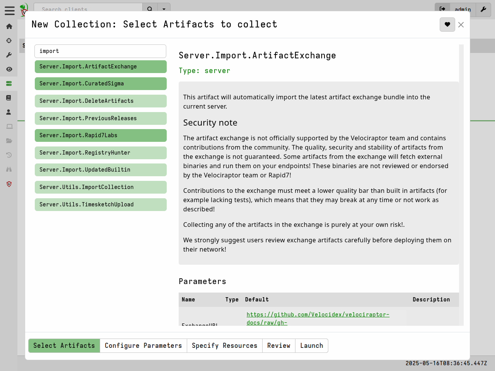

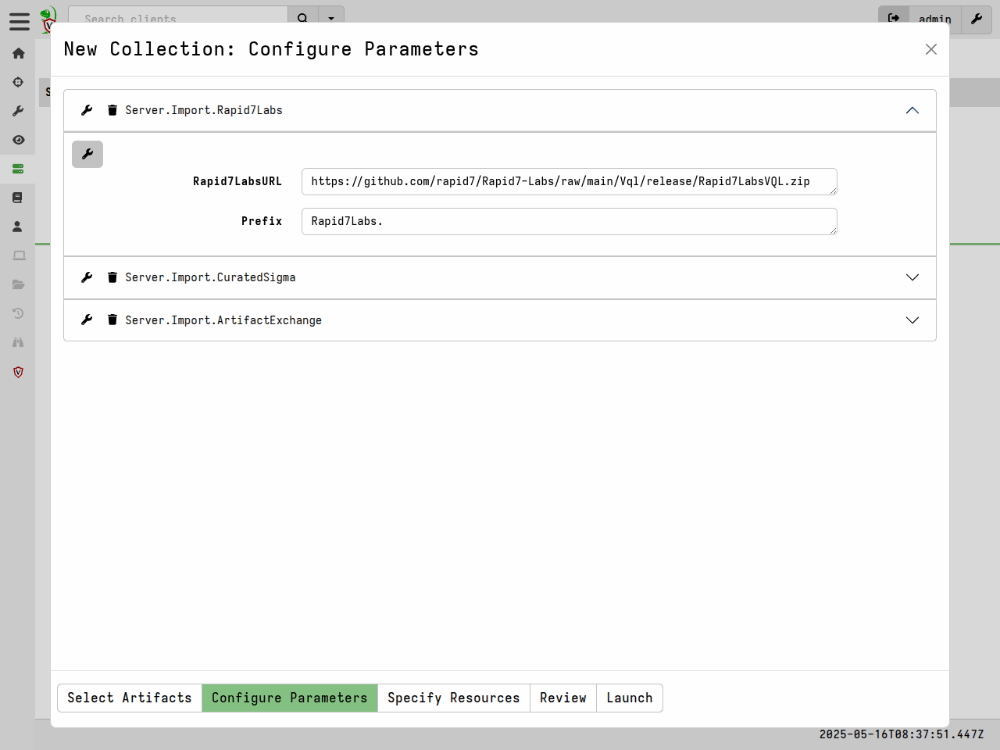

We also have a built-in server artifact which updates selected artifacts to
their latest version, and another which imports all artifacts from a previous
releases.

#### Server.Import.UpdatedBuiltin

{}

This artifact is no longer included in version 0.75 and above, since the updates
can new be done using the new `Server.Import.Extras` server artifact (see note
in the previous section).

{}

The purpose of the `Server.Import.UpdatedBuiltin` artifact is to update either
of the following 2 artifacts which may be updated between releases:

 - `Windows.KapeFiles.Targets`
 - `Generic.Forensic.SQLiteHunter`

By default, this artifact will add the prefix `Updated.` to the imported
artifact.

#### Server.Import.PreviousReleases

The `Server.Import.PreviousReleases` artifact allows importing the artifacts
from older releases. This is to cater for situations where clients cannot be
easily upgraded, yet need functionality only found in the latest artifacts.

{}

While clients should have no problems running older versions of the
standard artifacts, [we cannot guarantee]() that the latest artifact versions will
be compatible with older clients. This depends mainly on whether or
not the latest artifact versions contain VQL that uses new functions
or plugins which the older client may not have. You should always test
your particular scenario.

{}

### Creating and Editing Artifacts

In the Artifacts page you can create a new artifact by clicking the
Add Artifact (<i class="fa-solid fa-plus"></i>) button in the artifacts toolbar.

This brings up the artifact editor, populated with a very basic boilerplate
artifact to help get you started.

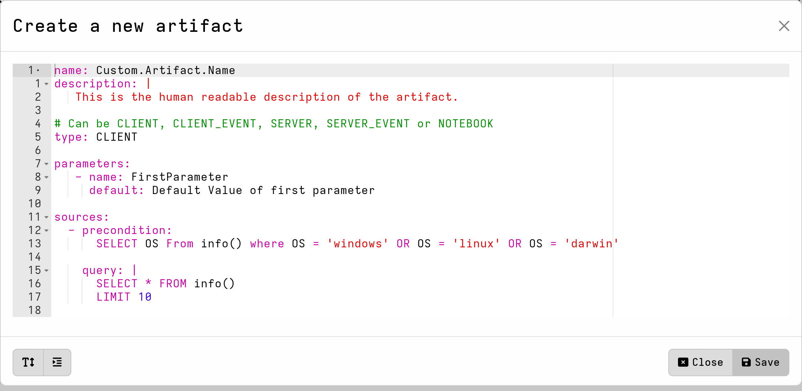

When you select an existing
[built-in artifact]()
in the GUI, and then attempt to edit it, you are actually creating a custom
_copy_ of that artifact.

- If the artifact is a **compiled-in** artifact then editing it will result in a
copy being created with the `Custom.` prefix added to the name.

- If the artifact is a **built-in** artifact then editing it will result in a copy
but you'll need to ensure that you choose a new name for it.

- If the artifact is **custom** (that is, not built-in) then you can just edit it
and save it, which will overwrite the previous version.

If you try to use the same name as an existing built-in artifact (or an existing
alias) then you will receive an error message and the artifact will refuse to be
saved.

You cannot delete built-in artifacts through the GUI either; the delete button
is grayed out when they are selected.

#### Editor Preferences and VQL Reformatting

The editor provides syntax highlighting for YAML and VQL. If you don't like the
default colors, you can choose a different theme in the editor's preferences
pane. These preferences are user-specific, that is, they are saved as
preferences for your Velociraptor user.

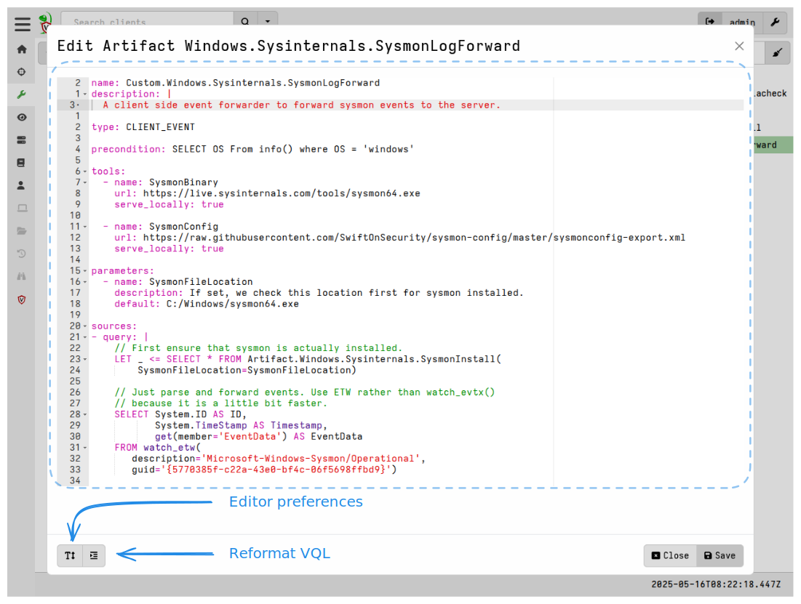

There are many things that you can change in the editor's settings but the most
common items to tweak are the theme and font size.

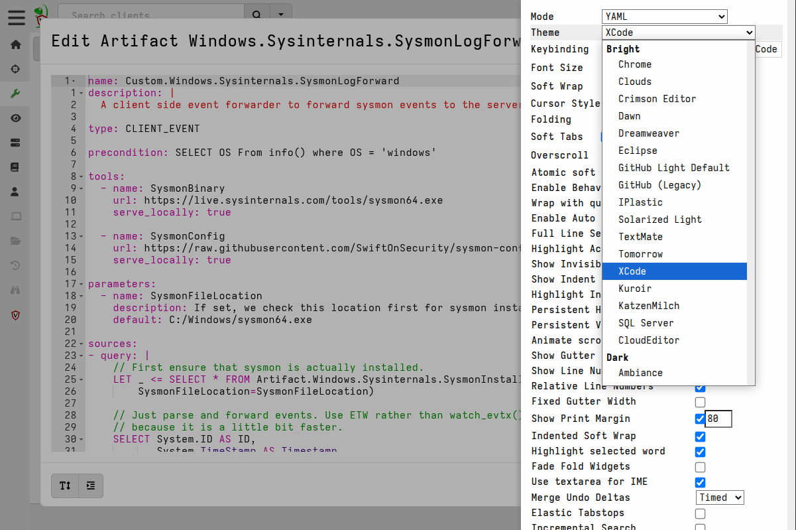

The editor preferences you set here will also be used in other places in the
GUI, for example [notebooks]() which use the same
editor component.

VQL doesn't care about formatting, but for us humans it's nice to have VQL code
that is neat and legible. The **Reformat VQL** button will reformat the code in
all VQL blocks. In general it wraps and aligns the VQL so that it can be easily
read.

Note that this action applies to _all_ VQL blocks in the artifact.
If you reformat the VQL and don't like the result then you can use the
`Crtl`+`z` keyboard shortcut to revert the changes. You can also copy a section
of reformatted VQL that you do like, revert the changes, and then paste that
section over the original.

#### Keyboard Shortcuts

The artifact editor is based on the [Ace code editor](https://ace.c9.io/) and
therefore supports it's extensive list of keyboard shortcuts, shown here:
https://ace.c9.io/demo/keyboard_shortcuts.html

Many of these keyboard shortcuts are the same as in other code editors that you
may already be familiar with.

#### Autosuggest/Autocomplete

The artifact editor offers suggestions and completions, as you type, for VQL
keywords, functions and plugins, as well as their arguments.

The suggestions also include previously defined strings in the artifact such as
parameter names and variable names. This helps you to avoid mistakes when typing
the names of previously defined parameters and variables in your VQL, since you
can simply select them from the suggestions list.

1. When you type `?`, or start typing a word, the editor presents a dropdown
   list of suggestions.

2. Use your `<Up>` and `<Down>` arrow keys to select an item from the
   suggestions list, and `<Enter>` to complete it. You can also use your mouse
   to hover over the suggestions list and select items, but using only your
   keyboard is much faster.

3. For each item in the suggestions list it also includes the type of each item
   being suggested (keyword, function, plugin, local string).

4. For VQL functions and plugins the suggestions list also provides a preview of
   the help documentation for the function/plugins as you step through them (or
   hover over them with your mouse).

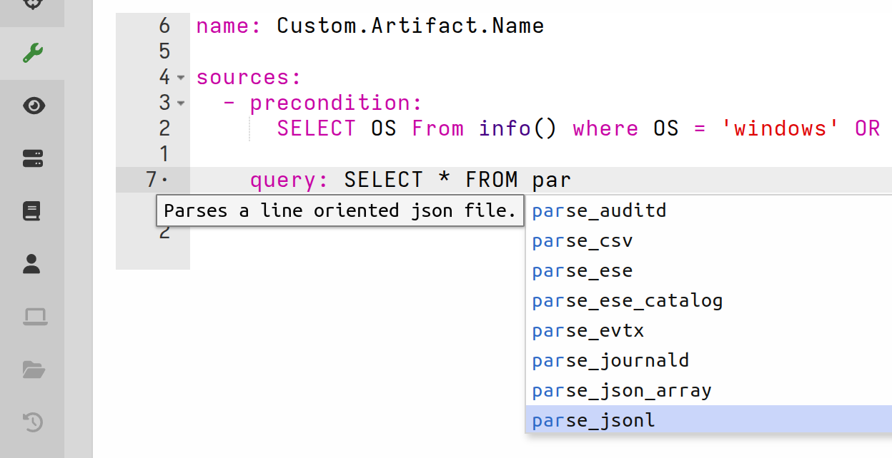

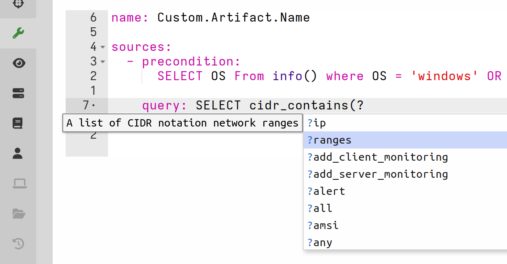

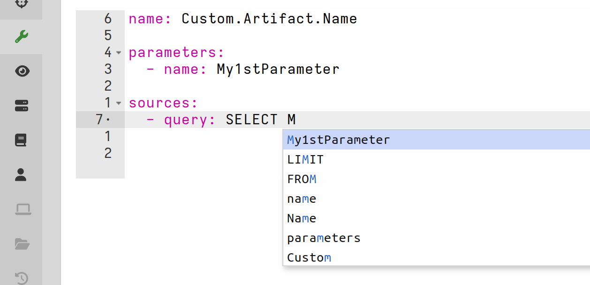

### Deleting Artifacts

All artifacts created or imported during runtime, are created in the server's
datastore and can therefore be deleted.

This can be done:

- from the toolbar in the Artifacts screen, or
- via VQL (in a notebook or artifact) using the `artifact_delete` function, or
- if you wish to perform bulk deletion you can use the built-in utility artifact
  `Server.Import.DeleteArtifacts`.

Artifacts loaded from these external sources are deemed "built-in" and cannot be
deleted during runtime:

- embedded in the config's `autoexec.artifact_definitions` section
- a directory specified by the `Frontend.artifact_definitions_directory` config setting
- additional directories specified by the `defaults.artifact_definitions_directories` config setting
- a directory specified by the `--definitions` CLI flag

If you need to delete such artifacts then you should manually remove the
corresponding YAML documents from their source locations, and then restart the
server.

For a more extensive discussion of built-in artifacts please see
[Built-in vs. Compiled-in vs. Custom Artifacts]().
